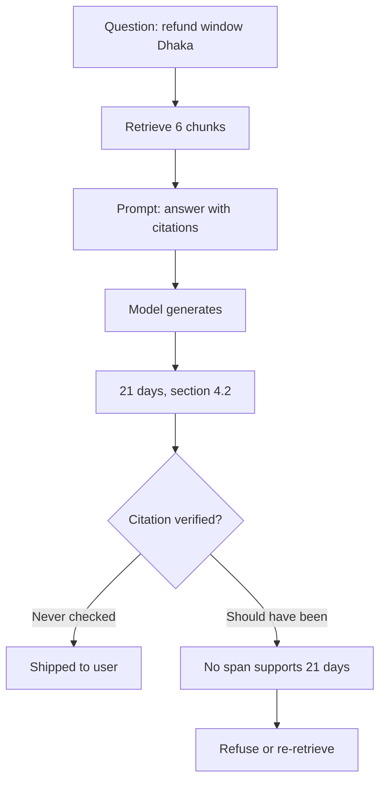
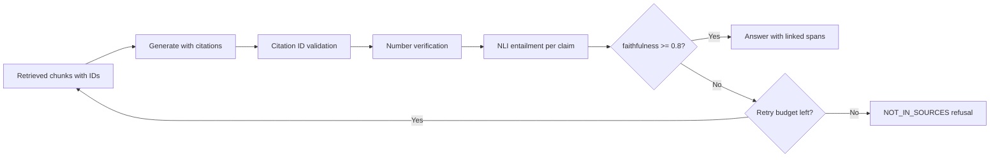

> **Scenario** - A policy assistant answers "what is the refund window for Dhaka deliveries?" with "21 days, per section 4.2" and links a real document. The document says 14 days and has no section 4.2. The citation looked legitimate enough that support agents repeated the wrong number for three weeks.

## Why it matters

- A citation that nobody verifies is worse than no citation: it transfers false confidence to the reader.
- Grounding failures are not rare edge cases. Even with correct retrieval, generation can blend two chunks, carry a number from the wrong row, or extrapolate a rule.
- The cost of a wrong policy answer is external - refunds honoured incorrectly, compliance exposure, support escalations.
- Refusal is a feature. A system that says "I could not find this in the policy documents" is more valuable than one that always answers.
- Bengali answers grounded on English sources are especially prone to number and entity drift during the implicit translation step.

## Symptoms

| Signal | What you observe |
|---|---|
| Phantom sections | Citations to section numbers that do not exist in the source |
| Number drift | Figures in the answer that appear nowhere in retrieved chunks |
| Blended facts | One sentence correctly citing two chunks that describe different products |
| Zero refusals | Refusal rate near 0% even on questions with no supporting document |
| Cross-lingual drift | Bengali answers with entity names or dates altered from the English source |

## How it breaks

Generation is not extraction. The model produces the most probable continuation given the prompt, and a plausible-looking section reference is highly probable text regardless of whether it appears in the evidence. If the pipeline asks for citations but never checks them, the citation is a formatting convention, not a verification step.



## Root causes

1. Citations are requested in the prompt but never validated against the retrieved text.
2. Chunks are passed to the model without stable identifiers the answer can point back to.
3. There is no faithfulness metric in the eval suite, so grounding regressions never block a release.
4. The prompt gives no explicit permission to refuse, so refusal is a low-probability output.
5. Retrieved evidence and generated claims are never decomposed and compared at the sentence level.

## How to solve it

### 1. Give every chunk a stable, model-visible ID

```python
def render_evidence(chunks) -> str:
    return "\n\n".join(
        f"[{c.id}] source={c.doc_title} page={c.page}\n{c.text}" for c in chunks
    )
```

Then require the answer to cite only from that set, and enumerate the valid IDs in the instruction. A citation to an ID outside the set is a hard error you can detect with a set membership check.

### 2. Validate citations mechanically

```python
CITE = re.compile(r"\[(c[0-9a-f]{8})\]")

def validate(answer: str, chunks) -> list[str]:
    allowed = {c.id for c in chunks}
    cited = set(CITE.findall(answer))
    problems = []
    if unknown := cited - allowed:
        problems.append(f"Citations to unknown chunks: {sorted(unknown)}")
    for sentence in split_sentences(answer):
        if is_factual(sentence) and not CITE.search(sentence):
            problems.append(f"Uncited factual claim: {sentence[:80]}")
    return problems
```

### 3. Score entailment between claims and cited spans

Decompose the answer into atomic claims, and for each claim check whether the cited chunk entails it. A small NLI model is enough and runs in tens of milliseconds.

```python
claims = decompose(answer)                        # one factual statement each
scores = []
for claim in claims:
    evidence = chunk_text[claim.cited_id]
    p = nli.predict(premise=evidence, hypothesis=claim.text)   # entailment prob
    scores.append(p)

faithfulness = sum(1 for p in scores if p >= 0.7) / max(len(scores), 1)
```

Faithfulness is the fraction of claims supported by their cited evidence. A production threshold of 0.9 with a hard block below 0.8 is a reasonable starting point; below that, refuse or re-retrieve.

### 4. Verify numbers separately

Numbers are the highest-damage hallucination and the easiest to check: every numeric token in the answer should appear in the cited chunk, allowing for formatting differences.

```python
def numbers(text: str) -> set[str]:
    return {n.replace(",", "") for n in re.findall(r"\d[\d,]*(?:\.\d+)?", text)}

unsupported = numbers(answer) - set().union(*(numbers(chunk_text[c]) for c in cited))
if unsupported:
    return refuse(f"Could not verify: {sorted(unsupported)}")
```

For Bengali output, normalise Bengali digits (`০১২৩৪৫৬৭৮৯`) to ASCII before comparing, or every number will look unsupported.

### 5. Make refusal an explicit, rewarded path

State it in the system prompt and include refusal cases in your eval set: "If the evidence does not contain the answer, reply exactly: `NOT_IN_SOURCES` followed by what you would need." Then measure refusal precision - of the questions where refusal was correct, how many did the system refuse?

### 6. Render citations as clickable, checkable spans

The UI should show the cited sentence highlighted in the source document. This turns verification from a research task into a glance, and it makes hallucinations visible to users who will report them.

## Target design



## Tradeoffs

| Option | Pros | Cons | Choose when |
|---|---|---|---|
| Prompt-only citations | Free, one line of instruction | Citations are decorative and unverified | Internal prototypes |
| ID validation | Catches invented sources, near-zero cost | Does not catch a wrong claim citing a real chunk | Always - it is the cheapest win |
| Number verification | Catches the highest-damage errors | Needs digit normalisation for Bengali | Any answer containing figures |
| NLI entailment | Catches semantic drift | +30–80ms and a model to host | Regulated or high-stakes domains |
| LLM-as-judge | Nuanced, handles paraphrase | Cost per answer, judge has its own biases | Offline evals rather than the hot path |

## Verification checklist

- [ ] Every factual sentence in a sampled set of answers carries at least one valid chunk citation.
- [ ] A test question with no supporting document produces a refusal, not an answer.
- [ ] Numbers in the answer verified against cited chunks with Bengali digits normalised.
- [ ] Faithfulness score computed on the golden set and tracked release over release.
- [ ] Citation links open the source at the right page or anchor.
- [ ] Refusal precision and recall measured, not just refusal rate.

## Anti-patterns

- Asking for citations in the prompt and treating compliance as proof of grounding.
- Using the same model to generate and to judge its own faithfulness in the request path.
- Measuring only "answer looks good" ratings from internal reviewers.
- Suppressing refusals because they hurt a coverage metric.
- Citing whole documents instead of spans, which makes verification impossible in practice.

## Related

- [Eval harness design for LLM features in CI](/systems/ai-rag-agents/eval-harness-design)
- [Hybrid search and reranking that actually lifts recall](/systems/ai-rag-agents/hybrid-search-and-reranking)
- [Context window budgeting under real token limits](/systems/ai-rag-agents/context-window-budgeting)
