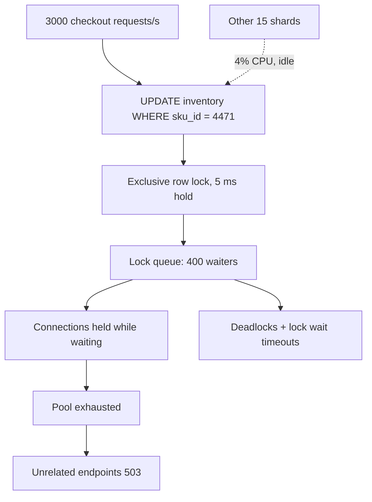
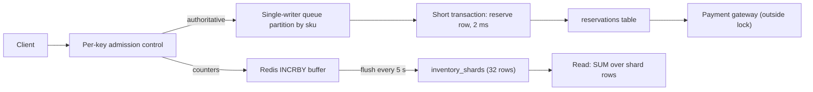

> **Scenario** — Flash sale শুরু হলো। প্রতিটি purchase চালায় `UPDATE inventory SET remaining = remaining - 1 WHERE sku_id = 4471`। Throughput ৩,০০০ থেকে ১৯০ write/সেকেন্ডে নেমে আসে, `SHOW ENGINE INNODB STATUS` এক row lock-এ ৪০০ thread queued দেখায়, আর বাকি ১৫টি shard ৪% CPU-তে বসে থাকে।

## কেন গুরুত্বপূর্ণ

- Hot partition পুরো system-এর throughput আটকে দেয় *একটি* node বা *একটি* row যত পারে ততটুকুতে — যত capacity কিনুন না কেন।
- Aggregate dashboard-এ এই ব্যর্থতা অদৃশ্য: average CPU ঠিক দেখায়, অথচ এক shard জ্বলছে।
- Row-level contention pool exhaustion-এ পরিণত হয়, তারপর hot key-র সাথে সম্পর্কহীন endpoint-ও error দেয়।
- সাধারণত সফলতাই এটা ট্রিগার করে — viral product, whale tenant onboarding, ঠিক সকাল ৯টার marketing email।
- Incident-এর সময় scale out আরও খারাপ: rebalance একই IO-র জন্য প্রতিযোগিতা করে।

## লক্ষণ

| Signal | যা দেখবেন |
| --- | --- |
| Per-shard metric | এক shard ৯৫% CPU, বাকিরা ১০%-এর নিচে |
| MySQL | `Innodb_row_lock_current_waits` শত শত; `SHOW ENGINE INNODB STATUS` একটাই index record দেখায় |
| Postgres | `pg_locks`-এ একই `ctid`-তে অনেক `tuple` waiter; `wait_event = 'transactionid'` |
| Throughput | Concurrency বাড়লে write/সেকেন্ড *কমে* |
| Latency | p50 ঠিক, p99 সেকেন্ডে, সব এক endpoint-এ |
| DynamoDB / Cassandra | Table capacity অব্যবহৃত, অথচ এক partition key-তে `ThrottledRequests` |

## কীভাবে ভাঙে

দুটি কৌশল, প্রায়ই একসাথে।

**Skewed key distribution.** Partition function key সমানভাবে ছড়ায়, কিন্তু *traffic* key-দের মধ্যে সমান নয়। এক `tenant_id`, এক `sku_id` বা এক `celebrity_user_id` অসামঞ্জস্যপূর্ণ ভাগ পায়, তাই সেটি ধরে থাকা node আগে saturate হয়।

**একই row-এ serialised write.** Capacity বাকি থাকলেও একটি row হলো serialisation point। প্রতিটি `UPDATE` নিজের transaction-এর পুরো সময় exclusive row lock ধরে, তাই ওই row-এর সর্বোচ্চ throughput `1 / transaction_hold_time`। ৫ ms hold time মানে ছাদ ২০০ write/সেকেন্ড — আর প্রতিটি অতিরিক্ত concurrent request কেবল lock queue লম্বা করে ও একটি connection পোড়ায়।

Monotonic key স্পষ্ট কোনো "hot" entity ছাড়াই একই আকার তৈরি করে: auto-increment primary key-তে প্রতিটি insert সবচেয়ে ডানের B-tree leaf page-এ যায়, তাই সব insert এক page latch-এ contend করে।



## মূল কারণ

1. Partition key-দের মধ্যে traffic skew (whale tenant, viral item, এক বড় customer)।
2. প্রতিটি request-এ update হওয়া একটিমাত্র counter row — inventory, balance, `views_count`।
3. Monotonically বাড়া key যা শেষ page বা নতুন partition-এ insert জমা করে।
4. Network call জুড়ে hot row-এর lock ধরে রাখা দীর্ঘ transaction (transaction-এর ভেতরে payment gateway)।
5. Time-bucketed partition যেখানে চলতি bucket ১০০% write নেয়।
6. Per-key admission control নেই, তাই এক hot key পুরো connection pool খেয়ে ফেলে।

## কীভাবে সমাধান করবেন

### ১. আগে সস্তায় hot key খুঁজুন

```sql
-- MySQL 8.0: এই মুহূর্তে কে কাকে block করছে
SELECT r.trx_id AS waiting_trx, r.trx_mysql_thread_id AS waiting_thread,
       SUBSTRING(r.trx_query, 1, 80) AS waiting_query,
       b.trx_id AS blocking_trx, b.trx_started, b.trx_rows_locked
FROM performance_schema.data_lock_waits w
JOIN information_schema.innodb_trx r ON r.trx_id = w.requesting_engine_transaction_id
JOIN information_schema.innodb_trx b ON b.trx_id = w.blocking_engine_transaction_id;
```

```sql
-- PostgreSQL: কোন row-এ আটকে আছে সেটা ধরে waiter গোনা
SELECT wait_event_type, wait_event, count(*), min(query_start) AS oldest
FROM pg_stat_activity
WHERE state = 'active' AND wait_event IS NOT NULL
GROUP BY 1, 2 ORDER BY count(*) DESC;
```

### ২. counter shard করুন (write sharding)

একটি row-এর বদলে N row, read-এ sum। এতে serialisation point N-টি স্বাধীন lock হয়ে যায়।

```sql
CREATE TABLE inventory_shards (
  sku_id      bigint  NOT NULL,
  shard_no    smallint NOT NULL,     -- 0..31
  remaining   integer NOT NULL,
  PRIMARY KEY (sku_id, shard_no)
);

-- Write: random shard নিন, stock থাকলেই কমান
UPDATE inventory_shards
SET remaining = remaining - 1
WHERE sku_id = 4471
  AND shard_no = floor(random() * 32)::smallint
  AND remaining > 0;

-- Read: (sku_id, shard_no) primary key তাই total সস্তা
SELECT sum(remaining) AS remaining FROM inventory_shards WHERE sku_id = 4471;
```

Tradeoff হলো নিখুঁততা: এক shard খালি থাকতে পারে যখন অন্যগুলোতে stock আছে, তাই "sold out" বলার আগে writer অন্য shard-এ retry করে। কঠোর সীমার জন্য একটিই reservation row রাখুন কিন্তু transaction ছোট করুন (পরের ধাপ)।

### ৩. lock hold time ছোট করুন

Hot row-এর throughput `1 / hold_time`। প্রতিটি মিলিসেকেন্ড কমালে capacity গুণ হয়।

```php
<?php
// খারাপ: transaction-এর ভেতরে gateway call ~৩০০ ms row lock ধরে রাখে
DB::transaction(function () use ($skuId, $payment) {
    $row = DB::table('inventory')->where('sku_id', $skuId)->lockForUpdate()->first();
    $gateway->charge($payment);                 // network call: ৩০০ ms
    DB::table('inventory')->where('sku_id', $skuId)->decrement('remaining');
});

// ভালো: reserve করুন, lock-এর বাইরে charge, তারপর confirm
$reservationId = DB::transaction(function () use ($skuId) {
    $ok = DB::update(
        'UPDATE inventory SET remaining = remaining - 1
         WHERE sku_id = ? AND remaining > 0', [$skuId]
    );
    if ($ok === 0) throw new OutOfStock();
    return DB::table('reservations')->insertGetId([
        'sku_id' => $skuId, 'state' => 'held', 'expires_at' => now()->addMinutes(10),
    ]);
});                                              // lock ধরা ~২ ms

$gateway->charge($payment);                      // কোনো transaction-এর বাইরে
DB::table('reservations')->where('id', $reservationId)->update(['state' => 'paid']);
```

একটি sweeper job `expires_at` পার হওয়া `held` reservation ছেড়ে দিয়ে stock ফেরত দেয়।

### ৪. monotonic key salt করুন

Append-heavy table-এ partition key-র আগে bucket যোগ করুন যাতে insert page ও partition-এ ছড়ায়।

```sql
-- PRIMARY KEY (created_at, id)-এর বদলে — নাহলে সব insert নতুন page-এ
ALTER TABLE events ADD COLUMN bucket smallint
  GENERATED ALWAYS AS (abs(hashtext(session_id)) % 16) STORED;

CREATE INDEX CONCURRENTLY idx_events_bucket_time ON events (bucket, created_at DESC);
```

Range query এখন ১৬ bucket-এ fan out করবে — write spread-এর জন্য read fan-out-এর সচেতন বিনিময়। Primary key-তে UUIDv4-এর চেয়ে UUIDv7/ULID ভালো: time-ordered কিন্তু single-page contention ছাড়া, আর B-tree locality রাখে।

### ৫. per-key admission control যোগ করুন

এক key pool-এর কতটুকু নিতে পারে সীমা দিন, যাতে hot key পুরো service নয়, নিজেকেই degrade করে।

```ts
// Hot key প্রতি token bucket, DB connection নেওয়ার আগে যাচাই
const limiter = new KeyedLimiter({ capacity: 40, refillPerSec: 400 })

export async function decrementStock(skuId: string) {
  if (!limiter.tryAcquire(`sku:${skuId}`)) {
    throw new TooManyRequests('queue for this item is full')
  }
  return withConnection((c) => c.query(DECREMENT_SQL, [skuId]))
}
```

### ৬. spike asynchronously শুষে নিন

Non-authoritative counter (view count, like)-এ Redis `INCRBY` দিয়ে buffer করে কয়েক সেকেন্ড পরপর aggregated delta flush করুন। Authoritative write-এ এক key-র write single-writer queue partition দিয়ে পাঠান, যাতে database lock না ধরেও serialise হয়।

## Target design



## Tradeoff

| Option | সুবিধা | খরচ | কখন বাছবেন |
| --- | --- | --- | --- |
| Sharded counter row | প্রায় linear write scaling | Read-এ aggregate; per-shard ফুরিয়ে যাওয়া | উচ্চ হারের counter, approximate সীমা চলে |
| ছোট transaction + reservation | নিখুঁত semantics রাখে | Expiry sweeper ও state machine দরকার | Inventory, seat booking, টাকা |
| Salted / bucketed key | Insert page-জুড়ে ছড়ায় | Range read fan out করে | Append-heavy event table |
| Redis buffer + periodic flush | DB-কে hot path থেকে সরায় | Crash-এ in-flight delta হারায় | View, like, non-critical metric |
| Hot tenant-এর dedicated shard | Blast radius আলাদা করে | Operational overhead, manual placement | পরিচিত whale tenant |
| Per-key rate limit | বাকি সবাইকে রক্ষা করে | Hot key-র user error দেখে | যেকোনো shared pool |

## যাচাই checklist

- [ ] Load test ৯০% traffic এক key-তে পাঠায় এবং throughput সমান থাকে, ভেঙে পড়ে না।
- [ ] Per-shard/per-key dashboard আছে; median write rate-এর ৩× হলে skew alert।
- [ ] Hot path-এর transaction hold time (p99 ms-এ) মাপা, ভেতরে কোনো network call নেই।
- [ ] `Innodb_row_lock_time_avg` বা Postgres `wait_event` counter graph ও alert-এ আছে।
- [ ] Reservation sweeper worker মাঝপথে kill করে পরীক্ষা করা — expiry window-এর মধ্যে stock ফেরে।
- [ ] বাছা shard count-এ sharded-counter read path benchmark করা।
- [ ] Admission control pool শেষ না করে `Retry-After` সহ 429 দেয়।

## Anti-pattern

- *Write* hotspot ঠিক করতে replica যোগ করা।
- `max_connections` বাড়িয়ে আরও thread-কে একই row lock-এ queue করতে দেওয়া।
- Hot row-এ `SELECT ... FOR UPDATE` করে তারপর HTTP call।
- Lock wait timeout-এ প্রতিটি worker থেকে backoff ছাড়া তৎক্ষণাৎ retry।
- Insert hotspot এড়াতে `UUIDv4` primary key ব্যবহার করে index locality নষ্ট করা।
- Contention factor ২০ হলেও counter মাত্র ৪ shard-এ ভাগ করা।
- বড় `innodb_lock_wait_timeout` দিয়ে উপসর্গ ঢাকা।

## সম্পর্কিত

- [যে shard key নিয়ে বাঁচা যায়](/systems/data-storage/sharding-key-selection)
- [Concurrent load-এ database deadlock](/systems/data-storage/database-deadlocks-under-load)
- [Connection pool শেষ হয়ে যাওয়া](/systems/data-storage/connection-pool-exhaustion)
- [Production-এ transaction isolation anomaly](/systems/data-storage/transaction-isolation-anomalies)
