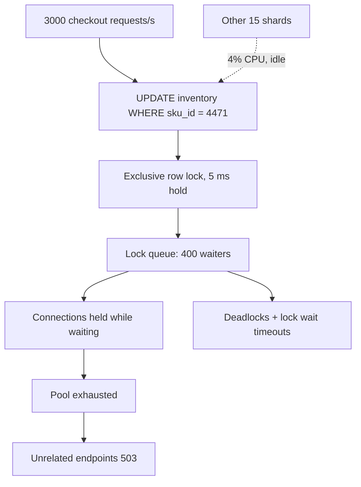
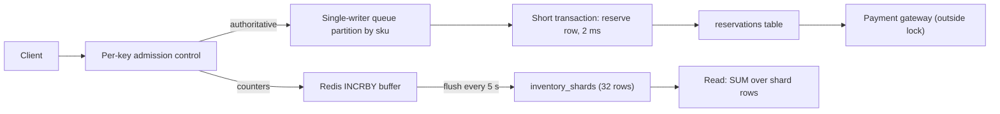

> **Scenario** - A flash sale starts. Every purchase does `UPDATE inventory SET remaining = remaining - 1 WHERE sku_id = 4471`. Throughput collapses from 3 000 to 190 writes per second, `SHOW ENGINE INNODB STATUS` shows 400 threads queued on one row lock, and the other 15 shards sit at 4% CPU.

## Why it matters

- A hot partition caps total system throughput at whatever *one* node or *one* row can do, no matter how much capacity you bought.
- The failure is invisible in aggregate dashboards: average CPU looks fine while one shard is on fire.
- Row-level contention converts into pool exhaustion and then into errors on endpoints that have nothing to do with the hot key.
- It is often triggered by success - a viral product, a whale tenant onboarding, a marketing email at 09:00 sharp.
- Scaling out during the incident makes it worse: rebalancing competes for the same IO.

## Symptoms

| Signal | What you observe |
| --- | --- |
| Per-shard metrics | One shard at 95% CPU, siblings under 10% |
| MySQL | `Innodb_row_lock_current_waits` in the hundreds; `SHOW ENGINE INNODB STATUS` names one index record |
| Postgres | `pg_locks` shows many `tuple` waiters on the same `ctid`; `wait_event = 'transactionid'` |
| Throughput | Writes/second *falls* as concurrency rises |
| Latency | p50 fine, p99 in seconds, all on one endpoint |
| DynamoDB / Cassandra | `ThrottledRequests` on one partition key while table capacity is unused |

## How it breaks

Two mechanisms, often together.

**Skewed key distribution.** The partition function spreads keys evenly, but *traffic* is not evenly distributed across keys. One `tenant_id`, one `sku_id`, or one `celebrity_user_id` receives a disproportionate share, so the node holding it saturates first.

**Serialised writes on one row.** Even with capacity to spare, a single row is a serialisation point. Each `UPDATE` holds an exclusive row lock for the duration of its transaction, so maximum throughput on that row is `1 / transaction_hold_time`. With a 5 ms hold time that ceiling is 200 writes/second - and every extra concurrent request just lengthens the lock queue and burns a connection.

Monotonic keys produce the same shape without any obvious "hot" entity: with an auto-increment primary key, every insert targets the rightmost B-tree leaf page, so all inserts contend on one page latch.



## Root causes

1. Traffic skew across partition keys (whale tenants, viral items, one big customer).
2. A single counter row updated by every request - inventory, balances, `views_count`.
3. Monotonically increasing keys concentrating inserts on the last page or newest partition.
4. Long transactions holding the hot row's lock across network calls (payment gateway inside the transaction).
5. Time-bucketed partitions where the current bucket takes 100% of writes.
6. No per-key admission control, so a hot key can consume the entire connection pool.

## How to solve it

### 1. Find the hot key first, cheaply

```sql
-- MySQL 8.0: who is blocking whom, right now
SELECT r.trx_id AS waiting_trx, r.trx_mysql_thread_id AS waiting_thread,
       SUBSTRING(r.trx_query, 1, 80) AS waiting_query,
       b.trx_id AS blocking_trx, b.trx_started, b.trx_rows_locked
FROM performance_schema.data_lock_waits w
JOIN information_schema.innodb_trx r ON r.trx_id = w.requesting_engine_transaction_id
JOIN information_schema.innodb_trx b ON b.trx_id = w.blocking_engine_transaction_id;
```

```sql
-- PostgreSQL: aggregate waiters by the row they are stuck on
SELECT wait_event_type, wait_event, count(*), min(query_start) AS oldest
FROM pg_stat_activity
WHERE state = 'active' AND wait_event IS NOT NULL
GROUP BY 1, 2 ORDER BY count(*) DESC;
```

### 2. Shard the counter (write sharding)

Replace one row with N rows and sum on read. This turns a serialisation point into N independent locks.

```sql
CREATE TABLE inventory_shards (
  sku_id      bigint  NOT NULL,
  shard_no    smallint NOT NULL,     -- 0..31
  remaining   integer NOT NULL,
  PRIMARY KEY (sku_id, shard_no)
);

-- Write: pick a random shard, only decrement if it still has stock
UPDATE inventory_shards
SET remaining = remaining - 1
WHERE sku_id = 4471
  AND shard_no = floor(random() * 32)::smallint
  AND remaining > 0;

-- Read: total is cheap because (sku_id, shard_no) is the primary key
SELECT sum(remaining) AS remaining FROM inventory_shards WHERE sku_id = 4471;
```

The tradeoff is exactness: a shard can be empty while others have stock, so the writer retries another shard before declaring "sold out". For strict limits, keep a single reservation row but shorten the transaction (next step).

### 3. Shorten the lock hold time

Throughput on a hot row is `1 / hold_time`. Every millisecond you remove multiplies capacity.

```php
<?php
// BAD: gateway call inside the transaction holds the row lock for ~300 ms
DB::transaction(function () use ($skuId, $payment) {
    $row = DB::table('inventory')->where('sku_id', $skuId)->lockForUpdate()->first();
    $gateway->charge($payment);                 // network call: 300 ms
    DB::table('inventory')->where('sku_id', $skuId)->decrement('remaining');
});

// GOOD: reserve, then charge outside the lock, then confirm
$reservationId = DB::transaction(function () use ($skuId) {
    $ok = DB::update(
        'UPDATE inventory SET remaining = remaining - 1
         WHERE sku_id = ? AND remaining > 0', [$skuId]
    );
    if ($ok === 0) throw new OutOfStock();
    return DB::table('reservations')->insertGetId([
        'sku_id' => $skuId, 'state' => 'held', 'expires_at' => now()->addMinutes(10),
    ]);
});                                              // lock held ~2 ms

$gateway->charge($payment);                      // outside any transaction
DB::table('reservations')->where('id', $reservationId)->update(['state' => 'paid']);
```

A sweeper job releases `held` reservations past `expires_at`, returning stock.

### 4. Salt monotonic keys

For append-heavy tables, prefix the partition key with a bucket so inserts spread across pages and partitions.

```sql
-- Instead of PRIMARY KEY (created_at, id) - all inserts on the newest page
ALTER TABLE events ADD COLUMN bucket smallint
  GENERATED ALWAYS AS (abs(hashtext(session_id)) % 16) STORED;

CREATE INDEX CONCURRENTLY idx_events_bucket_time ON events (bucket, created_at DESC);
```

Range queries must now fan out over 16 buckets - a deliberate trade of read fan-out for write spread. Prefer UUIDv7/ULID over UUIDv4 for primary keys: time-ordered but not single-page-contending, and it keeps B-tree locality.

### 5. Add per-key admission control

Cap how much of the pool one key may occupy, so a hot key degrades itself instead of the whole service.

```ts
// Token bucket per hot key, checked before acquiring a DB connection
const limiter = new KeyedLimiter({ capacity: 40, refillPerSec: 400 })

export async function decrementStock(skuId: string) {
  if (!limiter.tryAcquire(`sku:${skuId}`)) {
    throw new TooManyRequests('queue for this item is full')
  }
  return withConnection((c) => c.query(DECREMENT_SQL, [skuId]))
}
```

### 6. Absorb the spike asynchronously

For non-authoritative counters (view counts, likes), buffer in Redis with `INCRBY` and flush aggregated deltas every few seconds. For authoritative writes, funnel one key's writes through a single-writer queue partition so they serialise *without* holding database locks.

## Target design



## Tradeoffs

| Option | Pros | Cons | Choose when |
| --- | --- | --- | --- |
| Sharded counter rows | Near-linear write scaling | Reads must aggregate; per-shard exhaustion | High-rate counters, approximate limits fine |
| Short transactions + reservations | Keeps exact semantics | Needs expiry sweeper and state machine | Inventory, seat booking, money |
| Salted / bucketed keys | Spreads inserts across pages | Range reads fan out | Append-heavy event tables |
| Redis buffer + periodic flush | Removes DB from the hot path | Loses in-flight deltas on crash | Views, likes, non-critical metrics |
| Dedicated shard for the hot tenant | Isolates blast radius | Operational overhead, manual placement | Known whale tenants |
| Per-key rate limit | Protects everyone else | Hot key users see errors | Any shared pool |

## Verification checklist

- [ ] Load test writes 90% of traffic to one key and shows throughput staying flat, not collapsing.
- [ ] Per-shard/per-key dashboards exist; skew alert fires at 3× median write rate.
- [ ] Transaction hold time measured (p99 in ms) for the hot path, with no network calls inside.
- [ ] `Innodb_row_lock_time_avg` or Postgres `wait_event` counters graphed and alerted.
- [ ] Reservation sweeper tested by killing a worker mid-flow - stock returns within the expiry window.
- [ ] Sharded-counter read path benchmarked at the shard count you chose.
- [ ] Admission control returns 429 with `Retry-After` rather than exhausting the pool.

## Anti-patterns

- Adding replicas to fix a *write* hotspot.
- Raising `max_connections` so more threads can queue on the same row lock.
- `SELECT ... FOR UPDATE` on the hot row followed by an HTTP call.
- Retrying immediately on lock wait timeout, with no backoff, from every worker.
- Using `UUIDv4` primary keys to avoid insert hotspots and destroying index locality instead.
- Sharding the counter into 4 shards when the contention factor is 20.
- Fixing the symptom with a longer `innodb_lock_wait_timeout`.

## Related

- [Choosing a shard key you can live with](/systems/data-storage/sharding-key-selection)
- [Database deadlocks under concurrent load](/systems/data-storage/database-deadlocks-under-load)
- [Connection pool exhaustion](/systems/data-storage/connection-pool-exhaustion)
- [Transaction isolation anomalies in production](/systems/data-storage/transaction-isolation-anomalies)
