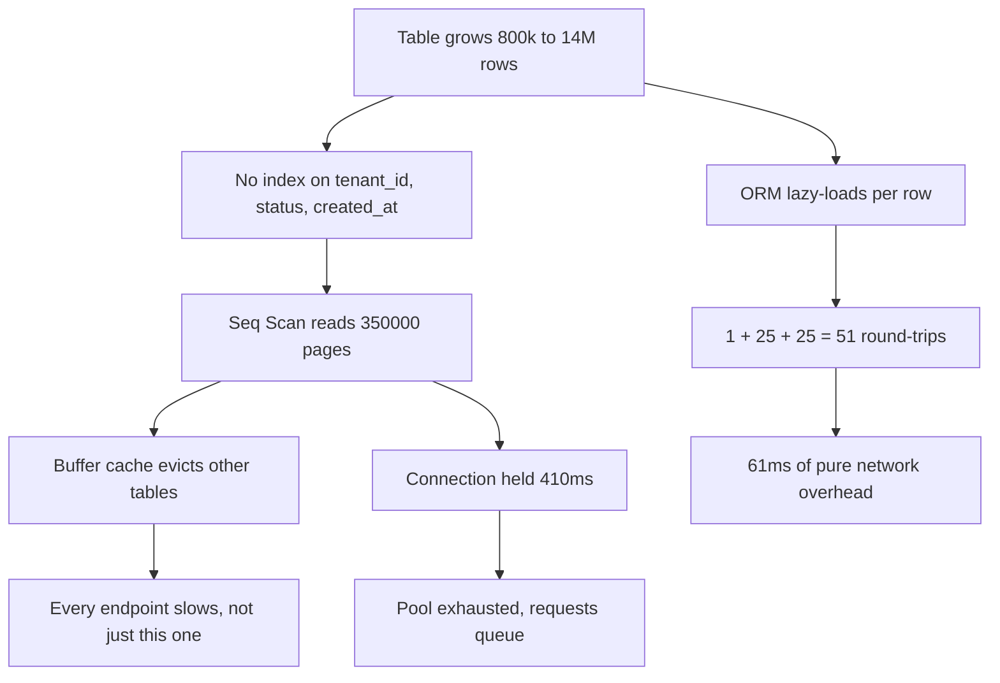
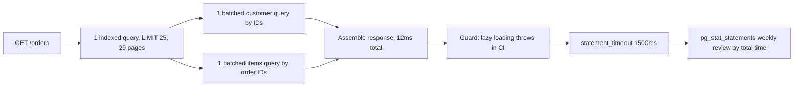

> **Scenario** - Order list endpoint জানুয়ারিতে ছিল 40 ms, সেপ্টেম্বরে 410 ms। কোনো code বদলায়নি। `orders` table 800 k row থেকে 14 M হয়েছে, আর যে query ছোট sequential scan করত তা এখন বড়টা করছে - সাথে request-প্রতি বাড়তি 50টি round-trip যা কেউ গোনেনি।

## Why it matters

- Query খরচ বাড়ে data-র সাথে, deploy-এর সাথে নয়। একটি commit ছাড়াই endpoint ব্যর্থতায় নামতে পারে।
- Database ভাগ করা। একটি index-হীন hot query buffer cache saturate করে প্রতিটি অন্য endpoint ধীর করে।
- N+1 fan-out round-trip latency-কে result-set size দিয়ে গুণ করে, তাই product সফল হওয়ার সাথেই খারাপ হয়।
- একটি ভালোভাবে বাছা index নিয়মিতভাবে endpoint-কে শত মিলিসেকেন্ড থেকে নিচের দিকের দশে নামায় - stack-এ সেরা latency-per-ঘণ্টা-পরিশ্রম।
- ধীর query চলাকালে ধরে রাখা connection অন্য request পায় না, তাই ধীর query throughput limit হয়ে যায়।

## Symptoms

| Signal | What you observe |
|---|---|
| Endpoint latency | deploy ছাড়াই মাসে মাসে বাড়ছে |
| `pg_stat_statements` | বিশাল `total_exec_time`, মাঝারি `mean_exec_time`-এর একটি query |
| Request-প্রতি query সংখ্যা | এক HTTP call-এ 50+ statement |
| `EXPLAIN` plan | বড় table-এ `Seq Scan`, বা হাজারে `Rows Removed by Filter` |
| Buffer cache hit ratio | 98%-এর নিচে নামছে |
| Disk read throughput | OLTP database-এ টানা MB/s |
| Row estimate vs actual | estimate `rows=12`, actual `rows=48000` |

## How it breaks

দুটো স্বাধীন সমস্যা মিলে যায়। দুটোই মাপুন।

**সমস্যা ১ - অনুপস্থিত index.** List query:

```sql
SELECT * FROM orders
 WHERE tenant_id = $1 AND status = 'pending'
 ORDER BY created_at DESC
 LIMIT 25;
```

14 M row আর উপযুক্ত index না থাকলে Postgres প্রতিটি row পড়ে। page-প্রতি 8 KB আর মোটামুটি page-প্রতি 40 row ধরলে তা 14,000,000 / 40 = **350,000 page** = 2.8 GB। Warm cache-এ ~2 GB/s effective হলে ~1.4 s; দৃশ্যমান 410 ms মানে বেশিরভাগ cached ছিল আর parallel worker সাহায্য করেছে। যেভাবেই হোক কাজটা O(table), আর table দ্বিগুণ হলে দ্বিগুণ হয়।

`(tenant_id, status, created_at DESC)`-এ composite index থাকলে planner index ধরে হাঁটে আর 25টি মিল পাওয়ার পরে থামে। খরচ হয় O(log n + 25) - মোটামুটি 4টি index page + 25টি heap fetch, প্রায় **29 page read**, 350,000 নয়। ছোঁয়া page-এ **12,000×** হ্রাস।

**সমস্যা ২ - N+1 fan-out.** 25টি order-এর প্রত্যেকটির জন্য ORM lazily customer load করে:

- order-এর 1টি query + customer-এর 25টি = **26 round-trip**
- প্রতিটি round-trip-এ ~1.2 ms network ও protocol overhead
- 26 × 1.2 = **31 ms** খাঁটি round-trip খরচ, কোনো query চলার আগেই

Line item যোগ করুন (order-প্রতি গড়ে 8, order-প্রতি lazily loaded): আরও 25টি query। মোট 51 round-trip × 1.2 ms = **61 ms** latency যা পুরোটাই round-trip overhead। দুটি batched query দিয়ে সারালে হয় 3 × 1.2 = **3.6 ms**।

মিলিয়ে: 410 ms → index scan সারায় (~15 ms execution থাকে) → batching 57 ms round-trip সরায় → প্রায় **12 ms**। Change ship করার আগেই হিসাব এটা বলেছিল।



## Root causes

1. Hot query-র filter-plus-sort আকারের সাথে মেলা কোনো composite index নেই।
2. Loop-এর ভিতরে ORM lazy loading, code review-এ অদৃশ্য।
3. `SELECT *` চওড়া column (JSONB blob, text) টানে যা কখনো render হয় না।
4. পুরনো statistics, তাই planner 12 row estimate করে 48,000-এর উপরে nested loop বাছে।
5. Order দেওয়া index ছাড়াই database-এ sort, ফলে external merge sort।
6. Request-প্রতি query counter নেই, তাই fan-out বৃদ্ধি কেউ খেয়াল করে না।
7. `statement_timeout` নেই, তাই খারাপ plan মিনিটের পর মিনিট connection ধরে রাখে।

## How to solve it

### 1. Production-আকারের data-য় buffers সহ আসল plan নিন

```sql
-- ANALYZE চালায়; BUFFERS দেখায় page cache থেকে না disk থেকে এল।
EXPLAIN (ANALYZE, BUFFERS, VERBOSE, FORMAT TEXT)
SELECT * FROM orders
 WHERE tenant_id = 42 AND status = 'pending'
 ORDER BY created_at DESC
 LIMIT 25;
```

Output এই ক্রমে পড়ুন:

1. **নিচ থেকে উপরে।** ভিতরের node আগে চলে; খরচের উৎপত্তি ওখানেই।
2. **`actual rows` বনাম `rows`।** 100× ফারাক মানে খারাপ statistics - অন্য কিছুর আগে `ANALYZE orders` চালান।
3. **`Rows Removed by Filter`।** বড় মান মানে index খোঁজ সংকীর্ণ করেনি; filter করেছে।
4. **`Buffers: shared read=N`।** `read` মানে disk, `hit` মানে cache। OLTP query-তে উঁচু `read` = অনুপস্থিত index।
5. **`Sort Method: external merge Disk: 88MB`।** Sort spill করেছে - হয় order দেওয়া index যোগ করুন, নয় ওই session-এ `work_mem` বাড়ান।
6. **উপরের node-এর total time**-ই আপনার query latency। endpoint budget-এর সাথে মেলান।

### 2. আগে filter, তারপর sort মেলানো index দিন

```sql
-- Column order গুরুত্বপূর্ণ: আগে equality predicate, তারপর sort column।
CREATE INDEX CONCURRENTLY idx_orders_tenant_status_created
    ON orders (tenant_id, status, created_at DESC);

-- বিশাল table-এ 'pending' ছোট ও hot slice হলে partial index
CREATE INDEX CONCURRENTLY idx_orders_pending
    ON orders (tenant_id, created_at DESC)
 WHERE status = 'pending';

ANALYZE orders;

-- নিশ্চিত করুন planner এখন এটি ব্যবহার করে ও ~29 page পড়ে, 350000 নয়
EXPLAIN (ANALYZE, BUFFERS)
SELECT * FROM orders WHERE tenant_id = 42 AND status = 'pending'
 ORDER BY created_at DESC LIMIT 25;
```

`CONCURRENTLY` exclusive lock এড়ায়, বিনিময়ে build দীর্ঘ হয় আর fail করলে `INVALID` index থাকতে পারে - পরে `pg_index.indisvalid` দেখুন।

### 3. Fan-out-কে batched query-তে গুটিয়ে ফেলুন

```php
<?php
// BEFORE: 51 round-trip
$orders = Order::where('tenant_id', $tenantId)
    ->where('status', 'pending')
    ->orderByDesc('created_at')
    ->limit(25)
    ->get();

foreach ($orders as $order) {
    $order->customer;   // order-প্রতি query
    $order->items;      // order-প্রতি query
}

// AFTER: 3 round-trip, আর শুধু যে column render হয়
$orders = Order::query()
    ->select(['id', 'tenant_id', 'customer_id', 'status', 'total_cents', 'created_at'])
    ->where('tenant_id', $tenantId)
    ->where('status', 'pending')
    ->orderByDesc('created_at')
    ->limit(25)
    ->with([
        'customer:id,name,email',
        'items:id,order_id,sku,qty,price_cents',
    ])
    ->get();
```

### 4. Fan-out আবার ঢোকা অসম্ভব করুন

```php
<?php
// app/Providers/AppServiceProvider.php
public function boot(): void
{
    // Relation lazily load হলেই dev/CI-তে throw করে।
    Model::preventLazyLoading(! app()->isProduction());

    // Production-এ throw নয়, request-প্রতি query count সহ log।
    DB::listen(function ($query) {
        app('query.counter')->increment();
    });

    app()->terminating(function () {
        $n = app('query.counter')->value();
        if ($n > 10) {
            Log::warning('query fan-out', ['count' => $n, 'route' => request()->path()]);
        }
    });
}
```

### 5. প্রতিটি query bound করুন ও শীর্ষ অপরাধী দেখুন

```sql
-- খারাপ plan-কে অনির্দিষ্টকাল connection ধরে রাখতে দেবেন না।
ALTER ROLE app_user SET statement_timeout = '1500ms';
ALTER ROLE reporting_user SET statement_timeout = '60s';

-- সাপ্তাহিক review query: mean time নয়, total time-ই গুরুত্বপূর্ণ।
SELECT substring(query, 1, 70) AS q,
       calls,
       round(total_exec_time)              AS total_ms,
       round(mean_exec_time, 2)            AS mean_ms,
       round(100 * total_exec_time
             / sum(total_exec_time) OVER (), 1) AS pct
  FROM pg_stat_statements
 ORDER BY total_exec_time DESC
 LIMIT 15;
```

400,000 বার ডাকা 3 ms query দুবার ডাকা 900 ms query-র চেয়ে বেশি খরচ। সবসময় `total_ms` দিয়ে sort করুন।

## Target design



## Tradeoffs

| Option | Pros | Cons | Choose when |
|---|---|---|---|
| Composite index | বিশাল read লাভ, code change নেই | write ধীর করে, disk খায় | filter ও sort আকার স্থির |
| Partial index | ছোট, hot slice-এ খুব দ্রুত | শুধু ওই predicate-এ কাজে দেয় | hot subset row-এর ~10%-এর নিচে |
| Eager loading (`with`) | কয়েক লাইনে N+1 সরায় | চওড়া relation-এ over-fetch | fan-out কয়েকশো row-এর নিচে |
| Denormalised counter column | O(1) read | write জটিলতা, drift ঝুঁকি | aggregate read write-এর চেয়ে অনেক বেশি |
| Materialised view | জটিল aggregate তাৎক্ষণিক | staleness, refresh খরচ | reporting মিনিটের lag সহে |
| Read replica | primary-র ভার কমায় | replication lag user দেখে | read-heavy ও lag-সহনশীল |
| Response cache | hit হলে সবচেয়ে বড় লাভ | invalidation জটিলতা | একই query user জুড়ে পুনরাবৃত্ত |

## Verification checklist

- [ ] Hot query-তে `EXPLAIN (ANALYZE, BUFFERS)` index scan দেখায় আর `shared read` দশের ঘরে।
- [ ] `ANALYZE`-এর পরে `actual rows` estimate-এর 10×-এর মধ্যে।
- [ ] Request-প্রতি query count logged এবং list endpoint-এ 10-এর নিচে।
- [ ] কোনো hot path-এ `SELECT *` নেই।
- [ ] `statement_timeout` role-প্রতি সেট এবং HTTP budget-এর চেয়ে ছোট।
- [ ] `pg_stat_statements`-এর total-time শীর্ষ তালিকা সাপ্তাহিক review হয় ও লেখা থাকে।
- [ ] নতুন index `pg_stat_user_indexes`-এ বাড়তে থাকা `idx_scan` নিয়ে দেখা যায়।
- [ ] CI-তে lazy loading throw করে।

## Anti-patterns

- Query আকার মেলানো একটি composite index-এর বদলে column-প্রতি index যোগ করা।
- Query-কে mean time দিয়ে বিচার করা আর call count উপেক্ষা করা।
- `ANALYZE` ছাড়া `EXPLAIN` চালিয়ে সেটাকে plan verification বলা।
- 5,000 row-এর development database-এ query performance পরীক্ষা করা।
- 30 সেকেন্ডের index migration যা সারাত, তার সামনে cache বসানো।
- একটি query-র disk spill থামাতে globally `work_mem` বাড়ানো।
- Live table-এ `CONCURRENTLY` ছাড়া index বানিয়ে write lock করা।

## Related

- [Profiling: telling CPU-bound from IO-bound](/systems/performance-capacity/profiling-cpu-vs-io-bound)
- [Batching and request coalescing without adding tail latency](/systems/performance-capacity/batching-and-request-coalescing)
- [Thread and connection pool sizing formulas](/systems/performance-capacity/thread-and-connection-pool-sizing)
