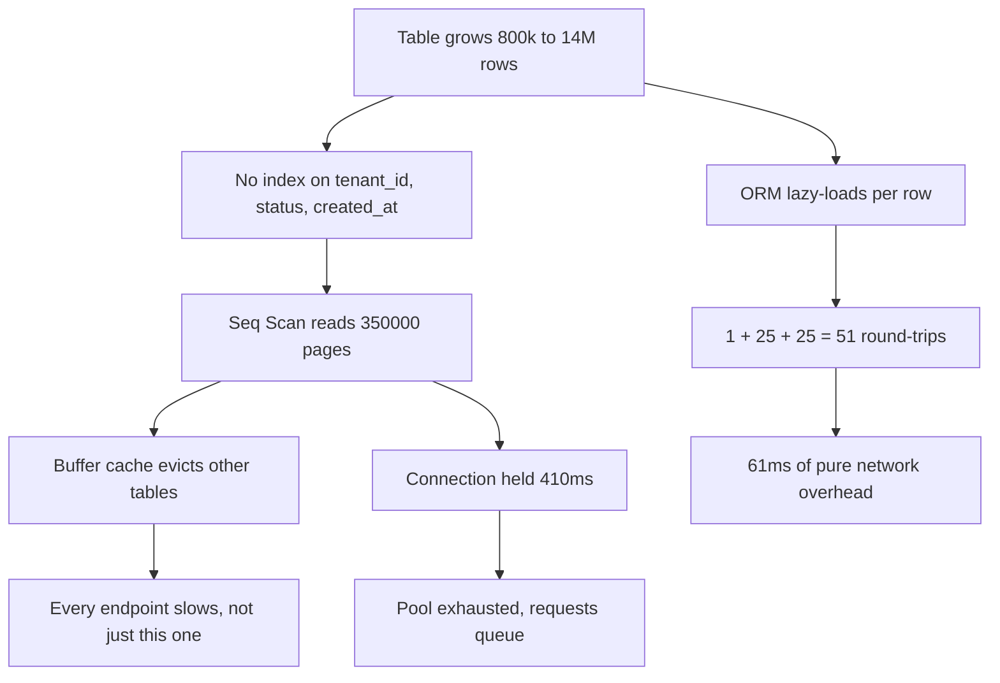
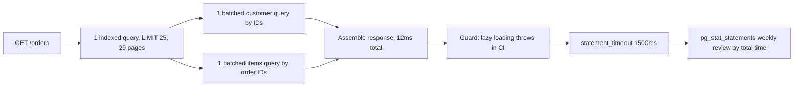

> **Scenario** - The order list endpoint was 40 ms in January and is 410 ms in September. No code changed. The `orders` table went from 800 k rows to 14 M, and a query that was doing a small sequential scan is now doing a large one - plus 50 extra round-trips per request that nobody counted.

## Why it matters

- Query cost grows with data, not with deploys. An endpoint can degrade to failure without a single commit.
- The database is shared. One unindexed hot query saturates the buffer cache and slows every other endpoint.
- N+1 fan-out multiplies round-trip latency by result-set size, so it gets worse exactly as the product succeeds.
- A single well-chosen index routinely takes an endpoint from hundreds of milliseconds to low tens - the best latency-per-hour-of-work in the stack.
- Connections held during slow queries are connections other requests cannot have, so slow queries become throughput limits.

## Symptoms

| Signal | What you observe |
|---|---|
| Endpoint latency | Creeping up month over month with no deploys |
| `pg_stat_statements` | One query with huge `total_exec_time` and modest `mean_exec_time` |
| Query count per request | 50+ statements for one HTTP call |
| `EXPLAIN` plan | `Seq Scan` on a large table, or `Rows Removed by Filter` in the thousands |
| Buffer cache hit ratio | Falling below 98% |
| Disk read throughput | Sustained MB/s on an OLTP database |
| Row estimate vs actual | `rows=12` estimated, `rows=48000` actual |

## How it breaks

Two independent problems compound. Measure both.

**Problem 1 - the missing index.** The list query is:

```sql
SELECT * FROM orders
 WHERE tenant_id = $1 AND status = 'pending'
 ORDER BY created_at DESC
 LIMIT 25;
```

With 14 M rows and no suitable index, Postgres reads every row. At 8 KB per page and roughly 40 rows per page, that is 14,000,000 / 40 = **350,000 pages** = 2.8 GB. On a warm cache at ~2 GB/s effective, that is ~1.4 s; with the visible 410 ms, most of it was cached and parallel workers helped. Either way the work is O(table), and it doubles when the table doubles.

With a composite index on `(tenant_id, status, created_at DESC)`, the planner walks the index and stops after 25 matching entries. Cost becomes O(log n + 25) - roughly 4 index pages plus 25 heap fetches, about **29 page reads** instead of 350,000. That is a **12,000×** reduction in pages touched.

**Problem 2 - N+1 fan-out.** For each of the 25 orders the ORM lazily loads the customer:

- 1 query for the orders + 25 queries for customers = **26 round-trips**
- Each round-trip has ~1.2 ms of network and protocol overhead
- 26 × 1.2 = **31 ms** of pure round-trip cost, before any query executes

Add the line items (average 8 per order, lazily loaded per order): another 25 queries. Total 51 round-trips × 1.2 ms = **61 ms** of latency that is entirely round-trip overhead. Fixing this with two batched queries brings it to 3 × 1.2 = **3.6 ms**.

Combined: 410 ms → index fixes the scan (leaves ~15 ms of execution) → batching removes 57 ms of round-trips → about **12 ms**. The arithmetic predicted it before the change shipped.



## Root causes

1. No composite index matching the filter-plus-sort shape of the hot query.
2. ORM lazy loading inside a loop, invisible in code review.
3. `SELECT *` pulling wide columns (JSONB blobs, text) that are never rendered.
4. Stale statistics, so the planner estimates 12 rows and chooses a nested loop over 48,000.
5. Sorting in the database without an index that provides the order, forcing an external merge sort.
6. No per-request query counter, so fan-out growth is never noticed.
7. Missing `statement_timeout`, so a bad plan holds a connection for minutes.

## How to solve it

### 1. Get the real plan, with buffers, on production-shaped data

```sql
-- ANALYZE runs it; BUFFERS shows whether pages came from cache or disk.
EXPLAIN (ANALYZE, BUFFERS, VERBOSE, FORMAT TEXT)
SELECT * FROM orders
 WHERE tenant_id = 42 AND status = 'pending'
 ORDER BY created_at DESC
 LIMIT 25;
```

Read the output in this order:

1. **Bottom-up.** The innermost node runs first; that is where the cost originates.
2. **`actual rows` vs `rows`.** A 100× gap means bad statistics - run `ANALYZE orders` before anything else.
3. **`Rows Removed by Filter`.** Large values mean the index did not narrow the search; the filter did.
4. **`Buffers: shared read=N`.** `read` is disk, `hit` is cache. High `read` on an OLTP query is a missing index.
5. **`Sort Method: external merge Disk: 88MB`.** The sort spilled - either add an index providing the order or raise `work_mem` for that session.
6. **Total time at the top node** is your query latency. Compare it against the endpoint budget.

### 2. Add the index that matches filter, then sort

```sql
-- Column order matters: equality predicates first, then the sort column.
CREATE INDEX CONCURRENTLY idx_orders_tenant_status_created
    ON orders (tenant_id, status, created_at DESC);

-- Partial index if 'pending' is a small, hot slice of a huge table
CREATE INDEX CONCURRENTLY idx_orders_pending
    ON orders (tenant_id, created_at DESC)
 WHERE status = 'pending';

ANALYZE orders;

-- Confirm the planner now uses it and reads ~29 pages, not 350000
EXPLAIN (ANALYZE, BUFFERS)
SELECT * FROM orders WHERE tenant_id = 42 AND status = 'pending'
 ORDER BY created_at DESC LIMIT 25;
```

`CONCURRENTLY` avoids the exclusive lock, at the cost of a longer build and a possible `INVALID` index if it fails - check `pg_index.indisvalid` afterwards.

### 3. Collapse the fan-out into batched queries

```php
<?php
// BEFORE: 51 round-trips
$orders = Order::where('tenant_id', $tenantId)
    ->where('status', 'pending')
    ->orderByDesc('created_at')
    ->limit(25)
    ->get();

foreach ($orders as $order) {
    $order->customer;   // query per order
    $order->items;      // query per order
}

// AFTER: 3 round-trips, and only the columns actually rendered
$orders = Order::query()
    ->select(['id', 'tenant_id', 'customer_id', 'status', 'total_cents', 'created_at'])
    ->where('tenant_id', $tenantId)
    ->where('status', 'pending')
    ->orderByDesc('created_at')
    ->limit(25)
    ->with([
        'customer:id,name,email',
        'items:id,order_id,sku,qty,price_cents',
    ])
    ->get();
```

### 4. Make fan-out impossible to reintroduce

```php
<?php
// app/Providers/AppServiceProvider.php
public function boot(): void
{
    // Throws in dev/CI the moment a relation is lazily loaded.
    Model::preventLazyLoading(! app()->isProduction());

    // In production, log instead of throwing, with the query count per request.
    DB::listen(function ($query) {
        app('query.counter')->increment();
    });

    app()->terminating(function () {
        $n = app('query.counter')->value();
        if ($n > 10) {
            Log::warning('query fan-out', ['count' => $n, 'route' => request()->path()]);
        }
    });
}
```

### 5. Bound every query and watch the top offenders

```sql
-- Never let a bad plan hold a connection indefinitely.
ALTER ROLE app_user SET statement_timeout = '1500ms';
ALTER ROLE reporting_user SET statement_timeout = '60s';

-- The weekly review query: total time is what matters, not mean time.
SELECT substring(query, 1, 70) AS q,
       calls,
       round(total_exec_time)              AS total_ms,
       round(mean_exec_time, 2)            AS mean_ms,
       round(100 * total_exec_time
             / sum(total_exec_time) OVER (), 1) AS pct
  FROM pg_stat_statements
 ORDER BY total_exec_time DESC
 LIMIT 15;
```

A 3 ms query called 400,000 times costs more than a 900 ms query called twice. Sort by `total_ms`, always.

## Target design



## Tradeoffs

| Option | Pros | Cons | Choose when |
|---|---|---|---|
| Composite index | Huge read win, no code change | Slows writes, uses disk | Filter and sort shape is stable |
| Partial index | Small, very fast for hot slice | Only helps that predicate | Hot subset is under ~10% of rows |
| Eager loading (`with`) | Removes N+1 in a few lines | Can over-fetch on wide relations | Fan-out under a few hundred rows |
| Denormalised counter column | O(1) reads | Write complexity, drift risk | Aggregate read far outnumbers writes |
| Materialised view | Complex aggregates become instant | Staleness, refresh cost | Reporting tolerates minutes of lag |
| Read replica | Offloads the primary | Replication lag visible to users | Read-heavy and lag-tolerant |
| Cache the response | Biggest win when it hits | Invalidation complexity | Same query repeats across users |

## Verification checklist

- [ ] `EXPLAIN (ANALYZE, BUFFERS)` on the hot query shows an index scan and `shared read` in the tens.
- [ ] `actual rows` is within 10× of estimated rows after `ANALYZE`.
- [ ] Query count per request is logged and under 10 for list endpoints.
- [ ] `SELECT *` does not appear in any hot path.
- [ ] `statement_timeout` is set per role and shorter than the HTTP budget.
- [ ] `pg_stat_statements` top-by-total-time is reviewed weekly and the list is written down.
- [ ] The new index appears in `pg_stat_user_indexes` with a rising `idx_scan`.
- [ ] Lazy loading throws in CI.

## Anti-patterns

- Adding an index per column instead of one composite index matching the query shape.
- Judging queries by mean time and ignoring call count.
- `EXPLAIN` without `ANALYZE` and calling it a plan verification.
- Testing query performance on a 5,000-row development database.
- Adding a cache in front of a query that a 30-second index migration would fix.
- Raising `work_mem` globally to stop one query from spilling to disk.
- Building indexes without `CONCURRENTLY` on a live table and locking writes.

## Related

- [Profiling: telling CPU-bound from IO-bound](/systems/performance-capacity/profiling-cpu-vs-io-bound)
- [Batching and request coalescing without adding tail latency](/systems/performance-capacity/batching-and-request-coalescing)
- [Thread and connection pool sizing formulas](/systems/performance-capacity/thread-and-connection-pool-sizing)
