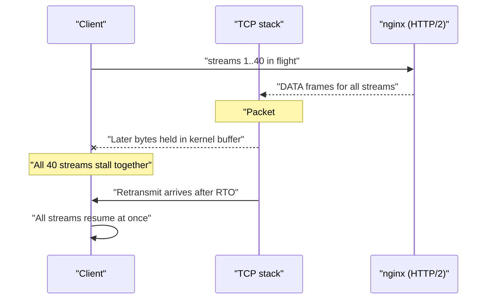
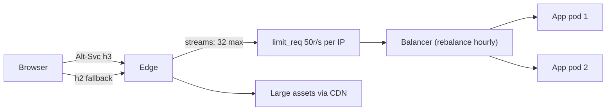

> **Scenario** - edge-এ HTTP/2 চালু করলেন। synthetic test ১৫% ভালো হলো। এরপর hotel Wi-Fi-এর এক customer জানাল পুরো app কয়েক সেকেন্ড ধরে জমে যাচ্ছে, আর আপনার rate limiter - যেটি connection গুনত - কিছুই limit করছে না। ওদিকে এক client এক connection দিয়ে ১২৮টি concurrent stream খুলতে পারছে, যেখানে backend pool-এ worker আছে ৪০টি।

## Why it matters

- HTTP/2 বহু TCP connection-কে একটিতে গুটিয়ে আনে। আপনার stack-এর প্রতিটি per-connection ধারণা - rate limit, concurrency cap, logging, load balancing - নীরবে অর্থ বদলায়।
- head-of-line blocking মিলিয়ে যায় না; HTTP layer থেকে TCP layer-এ সরে যায়, যেখানে একটিমাত্র হারানো packet *সব* multiplexed stream আটকে দেয়।
- flow control window (HTTP/2-তে per-stream default 64KB) বড় response-কে এমনভাবে throttle করে যা দেখতে backend slowness-এর মতো।
- HTTP/3 (QUIC) TCP-স্তরের blocking সরায়, কিন্তু UDP path-এর সমস্যা আনে: middlebox, userspace congestion control-এর CPU খরচ, আর MTU sensitivity।
- connect time-এ load balancing মানে এক connection সারা জীবন এক backend-এ আটকে; HTTP/2-তে সেই জীবন ঘণ্টার পর ঘণ্টা।

## Symptoms

| Signal | What you observe |
| --- | --- |
| Client experience | সবকিছু একসাথে ২০০–২০০০ms জমে, তারপর একসাথে চলে |
| `tcpdump` | stall window-এর সাথে মিলে retransmission ও dup-ACK |
| Rate limiter | per-connection limit আর কাজ করে না; এক connection ১০০+ request বহন করে |
| Backend | অল্প কিছু client IP থেকে concurrency লাফ দেয় |
| বড় download | bandwidth যাই হোক throughput `window_size / RTT`-এ থেমে যায় |
| `curl --http2 -v` | `* Using HTTP2, server supports multiplexing`, তারপর দীর্ঘ নীরবতা |
| HTTP/3 rollout | কিছু network HTTP/2-তে নামে, কিছু timeout পর্যন্ত ঝোলে |

## How it breaks

HTTP/1.1-এ browser origin-প্রতি ছয়টি connection খুলত, প্রতিটি request-এর নিজস্ব TCP stream ছিল। packet হারালে ছয়টির একটি দেরি করত। HTTP/2 সব request এক TCP connection-এ multiplex করে: একটি segment হারালে retransmission না আসা পর্যন্ত kernel পরের কোনো byte userspace-এ দেয় না, তাই in-flight ৪০টি stream একসাথে আটকায়। পরিচ্ছন্ন datacentre link-এ এটি কখনো দেখা যায় না; ২% loss-এর hotel Wi-Fi-তে এটাই প্রধান অভিজ্ঞতা।

দ্বিতীয় প্রভাব concurrency। nginx-এ `http2_max_concurrent_streams` default ১২৮। অর্থাৎ এক client একসাথে ১২৮টি request দেখাতে পারে, যেখানে HTTP/1.1 দিত ৬টি। connection count ধরে size করা সবকিছু - worker pool, `limit_conn`, database pool - এখন ২০ গুণ কম provisioned।



## Root causes

1. multiplexing connection-per-request সম্পর্ক মুছে দেওয়ার পরেও per-connection limit (`limit_conn`, worker pool) অপরিবর্তিত।
2. lossy last-mile link-এ TCP head-of-line blocking।
3. backend ৪০টি concurrent request সামলাতে পারলেও `http2_max_concurrent_streams` ১২৮-এ পড়ে আছে।
4. উঁচু-RTT path-এ বড় response-এর জন্য flow control window খুব ছোট।
5. load balancer connection time-এ backend বাছে; দীর্ঘজীবী HTTP/2 connection distribution জমিয়ে ফেলে।
6. `Alt-Svc` tuning বা path-এ UDP অনুমোদন ছাড়াই HTTP/3 চালু, ফলে ধীর fallback।
7. observability stream/request নয়, connection count-এর উপর দাঁড়ানো।

## How to solve it

### 1. limit-কে connection নয়, request-এ নতুন করে বাঁধুন

```nginx
http2_max_concurrent_streams 32;

limit_req_zone  $binary_remote_addr zone=perip:10m rate=50r/s;
limit_conn_zone $binary_remote_addr zone=conn:10m;

server {
    listen 443 ssl;
    http2 on;

    limit_req  zone=perip burst=100 nodelay;
    limit_conn conn 10;    # now nearly meaningless on its own
}
```

HTTP/2-তে আসল নিয়ন্ত্রণ `limit_req` (requests per second); `limit_conn` দুর্বল গৌণ সংকেত।

### 2. client দিক থেকে multiplexing আচরণ যাচাই করুন

```bash
curl --http2 -sv -o /dev/null https://app.example.com/api/me 2>&1 | grep -E 'HTTP/2|ALPN'
# * ALPN: server accepted h2
# * Using HTTP2, server supports multiplexing
# > GET /api/me HTTP/2
# < HTTP/2 200
```

```bash
curl --http3 -sv -o /dev/null https://app.example.com/ 2>&1 | grep -E 'QUIC|HTTP/3'
# * Connected to app.example.com port 443 using QUIC
# < HTTP/3 200
```

### 3. কিছু নতুন করে ডিজাইন করার আগে head-of-line blocking নিশ্চিত করুন

```bash
sudo tcpdump -i any -n 'host 203.0.113.10 and tcp port 443' -c 200
# 14:22:07.118  IP 203.0.113.10.443 > 10.1.2.3.51844: Flags [.], seq 812345:813805
# 14:22:07.372  IP 10.1.2.3.51844 > 203.0.113.10.443: Flags [.], ack 812345  (dup ack)
# 14:22:07.373  IP 10.1.2.3.51844 > 203.0.113.10.443: Flags [.], ack 812345  (dup ack)
# 14:22:07.590  IP 203.0.113.10.443 > 10.1.2.3.51844: Flags [.], seq 812345  (retransmit)
```

user-এর stall-এর সাথে মিলে যাওয়া dup-ACK গুচ্ছ ও তারপর retransmit - এটাই প্রমাণ। শুধু stream-level timing দিয়ে একে slow backend থেকে আলাদা করা যায় না।

### 4. bandwidth-delay product অনুযায়ী flow control size করুন

এক stream-এর throughput `window / RTT`-এ সীমাবদ্ধ। ২০০ms RTT-তে 64KB window মানে pipe যত মোটাই হোক ≈2.6 Mbps। বড় asset delivery-র জন্য connection window বাড়ান বা কম RTT-র CDN edge থেকে দিন।

### 5. HTTP/3 অফার করুন, client বেছে নিক

```nginx
server {
    listen 443 ssl;
    listen 443 quic reuseport;
    http2 on;
    http3 on;

    add_header Alt-Svc 'h3=":443"; ma=86400' always;
    quic_retry on;
    ssl_early_data off;
}
```

QUIC per-stream loss recovery দেয়, তাই একটি হারানো packet চল্লিশটির বদলে একটি stream আটকায়। একই port-এ HTTP/2 রেখে দিন: যেসব network UDP/443 আটকায় তাদের পরিষ্কারভাবে নামতে হবে।

### 6. দীর্ঘজীবী connection rebalance করুন

edge-এ সর্বোচ্চ connection lifetime দিন (যেমন `keepalive_time 1h`), যাতে deploy বা scale-out-এর পর HTTP/2 connection আবার connect করে rebalance হয়, না-থাকা pod-এ আটকে না থাকে।

## Target design



## Tradeoffs

| Option | Pros | Cons | Choose when |
| --- | --- | --- | --- |
| শুধু HTTP/1.1 | সরল, per-connection limit কাজ করে | ৬ connection সীমা, header overhead | legacy middlebox, internal RPC |
| HTTP/2 | কম connection, header compression | TCP head-of-line blocking, limit নতুন করে লেখা | datacentre ও ভালো last mile |
| HTTP/3 / QUIC | per-stream recovery, দ্রুত migration | কিছু network-এ UDP block, বেশি CPU | mobile, lossy, উঁচু-RTT user |
| বেশি stream limit | browser parallelism ভালো | backend concurrency pool ছাড়িয়ে যায় | concurrency-তে scale করা backend |
| কম stream limit | predictable backend load | client-side queueing | নির্দিষ্ট আকারের worker pool |

## Verification checklist

- [ ] `curl --http2 -v` `ALPN: server accepted h2` ও HTTP/2-তে 200 দেখায়।
- [ ] `curl --http3 -v` সফল, আর test network-এ UDP/443 block করলেও page কাজ করে।
- [ ] rate limit request-per-second-এ প্রকাশ, single-connection flood দিয়ে যাচাই করা।
- [ ] `http2_max_concurrent_streams` backend concurrent capacity-র বেশি নয়।
- [ ] packet-loss test (`tc qdisc add dev eth0 root netem loss 2%`) আগে multi-stream stall দেখায়, HTTP/3-এর পর আর দেখায় না।
- [ ] scale-out-এর এক ঘণ্টার মধ্যে backend connection distribution বদলায়।
- [ ] dashboard connection নয়, stream/request গোনে।

## Anti-patterns

- HTTP/2 চালু করে `limit_conn`-কেই একমাত্র abuse control রাখা।
- ধরে নেওয়া HTTP/2 head-of-line blocking সরায় - এটি শুধু HTTP-স্তরেরটি সরায়।
- একই hostname-এ HTTP/2 fallback ছাড়া HTTP/3 চালু করা।
- HTTP/2-তে যাওয়ার পরেও subdomain-এ asset sharding (HTTP/1.1-এর কৌশল) রাখা, যা বাড়তি connection ও handshake জোর করে।
- multi-stream stall-কে application trace-এ খোঁজা, যেখানে প্রতিটি span ঠিক দেখায়।
- backend pool ৪০-এ রেখে "performance বাড়াতে" stream limit বাড়ানো।

## Related

- [Keepalive and upstream connection reuse](/systems/networking-edge/keepalive-and-connection-reuse)
- [TLS handshake cost and session resumption](/systems/networking-edge/tls-handshake-cost-and-resumption)
- [Choosing a load balancing algorithm](/systems/networking-edge/load-balancing-algorithm-choice)
