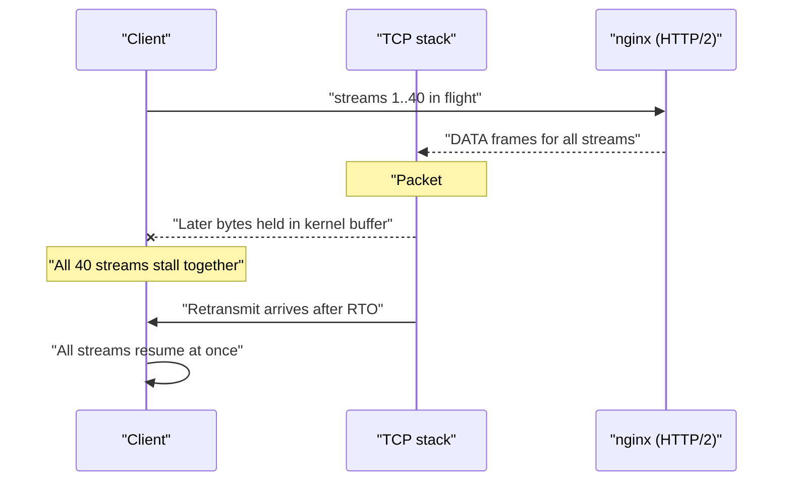
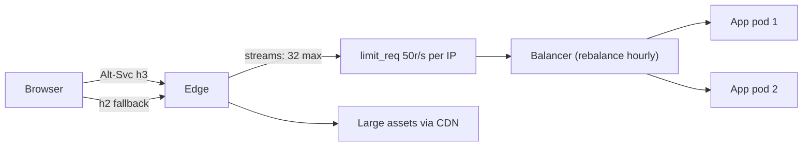

> **Scenario** - You enable HTTP/2 at the edge. Synthetic tests improve by 15%. Then a customer on a hotel Wi-Fi reports that the whole app freezes for seconds at a time, and your rate limiter - which counted connections - stops limiting anything. Meanwhile a single client with one connection can now open 128 concurrent streams against a backend pool of 40 workers.

## Why it matters

- HTTP/2 collapses many TCP connections into one. Every per-connection assumption in your stack - rate limits, concurrency caps, logging, load balancing - silently changes meaning.
- Head-of-line blocking does not disappear; it moves from the HTTP layer to the TCP layer, where a single lost packet stalls *every* multiplexed stream.
- Flow control windows (default 64KB per stream in HTTP/2) throttle large responses in ways that look like backend slowness.
- HTTP/3 over QUIC removes the TCP-level blocking but adds UDP path problems: middleboxes, CPU cost of userspace congestion control, and MTU sensitivity.
- Load balancing at connect time means one connection sticks to one backend for its lifetime - with HTTP/2 that can be hours.

## Symptoms

| Signal | What you observe |
| --- | --- |
| Client experience | Everything stalls together for 200–2000ms, then all resumes at once |
| `tcpdump` | Retransmissions and dup-ACKs correlated with the stall windows |
| Rate limiter | Per-connection limits stop firing; one connection carries 100+ requests |
| Backend | Concurrency spikes from a small number of client IPs |
| Large downloads | Throughput plateaus near `window_size / RTT` regardless of bandwidth |
| `curl --http2 -v` | `* Using HTTP2, server supports multiplexing` then long silences |
| HTTP/3 rollout | Some networks fall back to HTTP/2, some hang until timeout |

## How it breaks

In HTTP/1.1 a browser opened six connections per origin and each request had its own TCP stream. A lost packet delayed one of six things. HTTP/2 multiplexes all requests over one TCP connection: when a segment is lost, the kernel will not deliver any later bytes to userspace until the retransmission arrives, so all 40 in-flight streams stall together. On a clean datacentre link this never shows up; on 2% loss hotel Wi-Fi it is the dominant experience.

The second effect is concurrency. `http2_max_concurrent_streams` defaults to 128 in nginx. A single client can therefore present 128 simultaneous requests where HTTP/1.1 gave you 6. Anything sized around connection counts - worker pools, `limit_conn`, database pool sizes - is now under-provisioned by a factor of 20.



## Root causes

1. Per-connection limits (`limit_conn`, worker pools) unchanged after multiplexing removed the connection-per-request relationship.
2. TCP head-of-line blocking on lossy last-mile links.
3. `http2_max_concurrent_streams` left at 128 with a backend that can serve 40 concurrent requests.
4. Flow control windows too small for large responses over high-RTT paths.
5. Load balancer picks a backend at connection time; long-lived HTTP/2 connections freeze the distribution.
6. HTTP/3 enabled without `Alt-Svc` tuning or UDP allowed through the path, causing slow fallback.
7. Observability built on connection counts rather than stream/request counts.

## How to solve it

### 1. Re-baseline limits in requests, not connections

```nginx
http2_max_concurrent_streams 32;

limit_req_zone  $binary_remote_addr zone=perip:10m rate=50r/s;
limit_conn_zone $binary_remote_addr zone=conn:10m;

server {
    listen 443 ssl;
    http2 on;

    limit_req  zone=perip burst=100 nodelay;
    limit_conn conn 10;    # now nearly meaningless on its own
}
```

With HTTP/2, `limit_req` (requests per second) is the real control; `limit_conn` is a weak secondary signal.

### 2. Verify multiplexing behaviour from the client side

```bash
curl --http2 -sv -o /dev/null https://app.example.com/api/me 2>&1 | grep -E 'HTTP/2|ALPN'
# * ALPN: server accepted h2
# * Using HTTP2, server supports multiplexing
# > GET /api/me HTTP/2
# < HTTP/2 200
```

```bash
curl --http3 -sv -o /dev/null https://app.example.com/ 2>&1 | grep -E 'QUIC|HTTP/3'
# * Connected to app.example.com port 443 using QUIC
# < HTTP/3 200
```

### 3. Confirm head-of-line blocking before redesigning anything

```bash
sudo tcpdump -i any -n 'host 203.0.113.10 and tcp port 443' -c 200
# 14:22:07.118  IP 203.0.113.10.443 > 10.1.2.3.51844: Flags [.], seq 812345:813805
# 14:22:07.372  IP 10.1.2.3.51844 > 203.0.113.10.443: Flags [.], ack 812345  (dup ack)
# 14:22:07.373  IP 10.1.2.3.51844 > 203.0.113.10.443: Flags [.], ack 812345  (dup ack)
# 14:22:07.590  IP 203.0.113.10.443 > 10.1.2.3.51844: Flags [.], seq 812345  (retransmit)
```

A cluster of dup-ACKs followed by a retransmit, aligned with the user's stall, is the proof. Stream-level timing alone cannot distinguish this from a slow backend.

### 4. Size flow control for the bandwidth-delay product

Throughput over a single stream is bounded by `window / RTT`. A 64KB window at 200ms RTT caps you at roughly 2.6 Mbps no matter how fat the pipe is. For large asset delivery, raise the connection window or serve those assets from a CDN edge with a short RTT.

### 5. Offer HTTP/3 and let clients choose

```nginx
server {
    listen 443 ssl;
    listen 443 quic reuseport;
    http2 on;
    http3 on;

    add_header Alt-Svc 'h3=":443"; ma=86400' always;
    quic_retry on;
    ssl_early_data off;
}
```

QUIC gives per-stream loss recovery, so one lost packet stalls one stream instead of forty. Keep HTTP/2 on the same port: networks that block UDP/443 must fall back cleanly.

### 6. Rebalance long-lived connections

Set a maximum connection lifetime at the edge (for example `keepalive_time 1h`) so HTTP/2 connections eventually reconnect and re-balance after a deploy or scale-out, instead of pinning to a pod that no longer exists.

## Target design



## Tradeoffs

| Option | Pros | Cons | Choose when |
| --- | --- | --- | --- |
| HTTP/1.1 only | Simple, per-connection limits work | 6-connection limit, header overhead | Legacy middleboxes, internal RPC |
| HTTP/2 | Fewer connections, header compression | TCP head-of-line blocking, limit rewrites | Datacentre and good-quality last mile |
| HTTP/3 / QUIC | Per-stream recovery, fast migration | UDP blocked on some networks, higher CPU | Mobile, lossy, high-RTT users |
| High stream limit | Better browser parallelism | Backend concurrency blows past pool size | Backends that scale with concurrency |
| Low stream limit | Predictable backend load | Client-side queueing | Fixed-size worker pools |

## Verification checklist

- [ ] `curl --http2 -v` shows `ALPN: server accepted h2` and a 200 over HTTP/2.
- [ ] `curl --http3 -v` succeeds, and blocking UDP/443 in a test network still yields a working page.
- [ ] Rate limits expressed per request per second, verified with a single-connection flood.
- [ ] `http2_max_concurrent_streams` is no larger than backend concurrent capacity.
- [ ] A packet-loss test (`tc qdisc add dev eth0 root netem loss 2%`) reproduces and then no longer reproduces multi-stream stalls after HTTP/3.
- [ ] Backend connection distribution changes within an hour of a scale-out.
- [ ] Dashboards count streams/requests, not connections.

## Anti-patterns

- Enabling HTTP/2 and keeping `limit_conn` as the only abuse control.
- Assuming HTTP/2 removes head-of-line blocking - it removes the HTTP-layer one only.
- Turning on HTTP/3 without an HTTP/2 fallback on the same hostname.
- Sharding assets across subdomains (an HTTP/1.1 trick) after moving to HTTP/2, which forces extra connections and handshakes.
- Diagnosing multi-stream stalls in application traces where every span looks fine.
- Raising stream limits to "improve performance" while the backend pool stays at 40.

## Related

- [Keepalive and upstream connection reuse](/systems/networking-edge/keepalive-and-connection-reuse)
- [TLS handshake cost and session resumption](/systems/networking-edge/tls-handshake-cost-and-resumption)
- [Choosing a load balancing algorithm](/systems/networking-edge/load-balancing-algorithm-choice)
