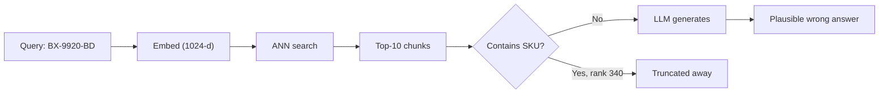
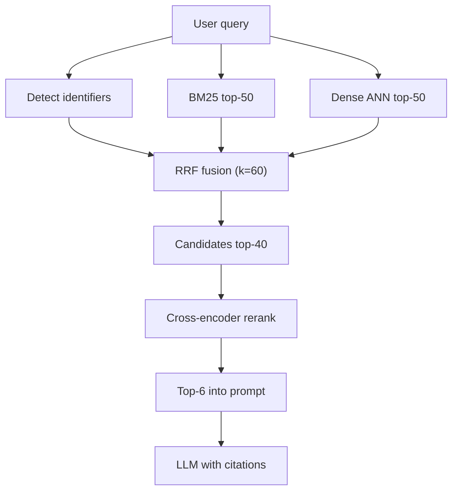

> **Scenario** — একটি support assistant policy প্রশ্নের ভালো উত্তর দেয়, কিন্তু ticket `INC-48213` বা SKU `BX-9920-BD` খুঁজে পায় না। Retrieval পুরোপুরি dense vector search, ১.২M chunk-এর উপরে, আর exact identifier embedding-এ আলাদা কিছু হয়ে ওঠে না।

## Why it matters

- Dense-only retrieval exact token মিস করে: order ID, error code, config key, SKU। এই query-গুলোতেই intent সবচেয়ে বেশি, আর ভুল উত্তরের সহনশীলতা সবচেয়ে কম।
- প্রতিটি retrieval miss generation failure হয়ে দাঁড়ায়। Model-এর grounding নেই, তাই সে হয় refuse করে, নয়তো বানিয়ে বলে — আর বানানো উত্তরে trust নষ্ট হয়।
- Production log-এ recall failure অদৃশ্য। Pipeline দশটি chunk ফেরত দেয়, cosine score ০.৭১ — কিছুই বলে না যে সঠিক chunk ৩৪০ নম্বরে আছে।
- Latency খরচ করার সবচেয়ে সস্তা জায়গা retrieval। ৪ সেকেন্ডের ভুল generation বাঁচাতে ৬০ms rerank যোগ করা প্রায় সবসময়ই লাভজনক।
- Multilingual corpus-এ সমস্যা আরও বাড়ে। English documentation-এর বিপরীতে Bengali query embedding space-এর অন্য অঞ্চলে পড়ে, যদি না model cross-lingually train করা থাকে।

## Symptoms

| Signal | What you observe |
|---|---|
| Exact-ID query | identifier query-তে `recall@10` প্রায় ০.৩০, prose query-তে ০.৮৫ |
| Score distribution | Top-10 cosine score ০.৬৮–০.৭৪ সরু band-এ জমাট, কোনো separation নেই |
| User behaviour | এক session-এ একই query বারবার rephrase করা |
| Eval drift | near-duplicate যোগ করা এক ingest-এর পরে `nDCG@10` পড়ে যায় |
| Bengali query | উত্তর শুধু transliterated proper noun মেলা English chunk cite করে |

## How it breaks

Cosine similarity literal match নয়, distributional overlap-কে পুরস্কৃত করে। `BX-9920-BD` string এমন fragment-এ tokenise হয় যা হাজার হাজার chunk-এ আছে, ফলে তার embedding corpus centroid-এর কাছে বসে। অথচ BM25 একটিমাত্র rare term-এর জোরে সেটাকে প্রথমে রাখত। দল একটি retriever বেছে ship করে, আর সেই retriever-এর blind spot-টাও উত্তরাধিকার সূত্রে পেয়ে যায়।



## Root causes

1. একটিমাত্র retriever-কে পুরো retrieval layer ধরা হয়, candidate generator হিসেবে নয়।
2. Bi-encoder embedding পুরো chunk-কে একটি vector-এ চাপে, ফলে term-level precision হারায়।
3. Top-k বাছা হয় prompt budget দেখে (k=5), recall দেখে নয় — তাই পরে আর recover করা যায় না।
4. আলাদা retriever-এর score সরাসরি average করা হয়, যদিও তাদের scale অসম্পর্কিত।
5. কোনো offline eval identifier query আর natural-language query আলাদা করে না, তাই gap-টা কখনো ধরাই পড়ে না।

## How to solve it

### 1. BM25 আর dense retrieval একসাথে চালান

প্রতিটি থেকে চওড়া candidate set নিন — প্রতি retriever-এ `k=50` ভালো শুরু। খরচের বড় অংশ ANN scan, আর HNSW index-এ k=10 থেকে k=50-এ গেলে সাধারণত ৫ms-এর কমই বাড়ে।

```python
lexical = opensearch.search(index="chunks", body={
    "size": 50,
    "query": {"match": {"text": {"query": q, "operator": "or"}}},
})
dense = vector_db.query(vector=embed(q), top_k=50, include_metadata=True)
```

### 2. Reciprocal Rank Fusion দিয়ে fuse করুন

RRF raw score উপেক্ষা করে শুধু rank ব্যবহার করে, তাই scale-mismatch সমস্যা একেবারেই এড়ানো যায়:

```text
RRF(d) = Σ over retrievers r of  1 / (k + rank_r(d))
```

এখানে `k = 60` প্রচলিত smoothing constant। BM25-এ rank 1 আর dense-এ rank 25 থাকা document পায় `1/61 + 1/85 = 0.0281`; দুটোতেই rank 8 থাকা document পায় `1/68 + 1/68 = 0.0294` এবং জেতে — এই আচরণটাই কাম্য।

```python
def rrf(rankings: list[list[str]], k: int = 60) -> dict[str, float]:
    scores: dict[str, float] = {}
    for ranking in rankings:
        for rank, doc_id in enumerate(ranking, start=1):
            scores[doc_id] = scores.get(doc_id, 0.0) + 1.0 / (k + rank)
    return dict(sorted(scores.items(), key=lambda kv: -kv[1]))

fused = rrf([[h["_id"] for h in lexical], [m.id for m in dense.matches]])
candidates = list(fused)[:40]
```

### 3. Cross-encoder দিয়ে rerank করুন

Cross-encoder query ও chunk একসাথে পড়ে, তাই bi-encoder যা পারে না সেই term-level relevance বিচার করতে পারে। ছোট model-এ ৪০টি candidate rerank করতে GPU-তে মোটামুটি ৪০–৯০ms লাগে, বা একটি batched API call।

```python
pairs = [(q, chunk_text[c]) for c in candidates]
scores = reranker.predict(pairs)                    # e.g. bge-reranker-v2-m3
top = [c for _, c in sorted(zip(scores, candidates), reverse=True)[:6]]
```

Corpus বা query stream-এর কোনো অংশ Bengali হলে multilingual reranker নিন; English-only reranker সঠিক Bengali passage-কেও নিয়মিতভাবে নিচে নামাবে।

### 4. Deterministic identifier route যোগ করুন

Embed করার আগে regex দিয়ে identifier ধরুন এবং filtered exact-match query চালান। এতে probabilistic সমস্যা lookup-এ পরিণত হয়:

```ts
const ID_RE = /\b[A-Z]{2,4}-\d{3,6}(-[A-Z]{2})?\b/g
const ids = query.match(ID_RE) ?? []
if (ids.length) {
  const exact = await db.chunks.findMany({ where: { docRef: { in: ids } }, take: 5 })
  candidates.unshift(...exact.map((c) => c.id))
}
```

### 5. আগে-পরে split করে মাপুন

প্রতিটি eval query-কে `identifier`, `natural` বা `bn` tag দিন এবং bucket অনুযায়ী `recall@50` ও `nDCG@10` রিপোর্ট করুন। একটিমাত্র aggregate সংখ্যা ঠিক সেই regression-টাই লুকায় যেটা আপনি ঠিক করতে চাইছেন।

## Target design



## Tradeoffs

| Option | Pros | Cons | Choose when |
|---|---|---|---|
| শুধু dense | এক index, কম latency, ভালো paraphrase recall | exact identifier ও rare term-এ অন্ধ | corpus prose-নির্ভর, কোনো code নেই |
| শুধু BM25 | exact match, সস্তা, explainable | synonym বা paraphrase ধরে না | query keyword-আকৃতির ও ছোট |
| RRF fusion | scale-free, tuning লাগে না, recall বড় লাফ | দুটি index sync রাখতে হয় | মিশ্র query type, মানে বেশিরভাগ product |
| Fusion + cross-encoder | ছোট k-তে সেরা precision | +৫০–১০০ms এবং GPU/API খরচ | prompt budget আঁটসাঁট, precision জরুরি |
| Learned fusion weight | নিজের traffic-এ tuned | labelled data ও retraining লাগে | স্থিতিশীল, labelled query log আছে |

## Verification checklist

- [ ] identifier, natural-language ও Bengali bucket আলাদা করে `recall@50` মাপা হয়েছে।
- [ ] একই frozen golden set-এ fusion output প্রতিটি একক retriever-এর সাথে তুলনা করা হয়েছে।
- [ ] Reranker latency p95 রেকর্ড করা এবং end-to-end latency budget-এ ধরা হয়েছে।
- [ ] পরিচিত SKU থাকা query rank 1-এ সঠিক chunk ফেরত দেয়।
- [ ] ingest-এর পরে lexical ও vector index-এ একই document count যাচাই করা হয়েছে।
- [ ] Corpus-এ Bengali document থাকলে reranker multilingual কিনা নিশ্চিত করা হয়েছে।

## Anti-patterns

- Cosine similarity আর BM25 score সরাসরি average করা — scale অসম্পর্কিত, আর BM25 unbounded।
- Rerank না করে prompt-এ top-k বাড়ানো; noise-এর জন্য token গুনতে হয় আর attention পাতলা হয়।
- Reranker-কে একমাত্র retriever বানানো — cross-encoder ১.২M chunk scan করতে পারে না।
- Rank position না মেপে generated answer পড়ে retrieval quality বিচার করা।
- Lexical store আর vector store আলাদা schedule-এ reindex করা, ফলে দুটো চুপচাপ diverge করে।

## Related

- [Vector index selection and ANN parameter tuning](/systems/ai-rag-agents/vector-index-selection-and-tuning)
- [Eval harness design for LLM features in CI](/systems/ai-rag-agents/eval-harness-design)
- [RAG chunking strategies and offline evals](/systems/ai-rag-agents/rag-chunking-evals)
