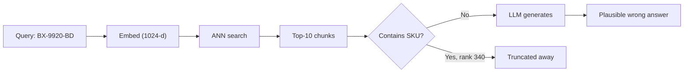
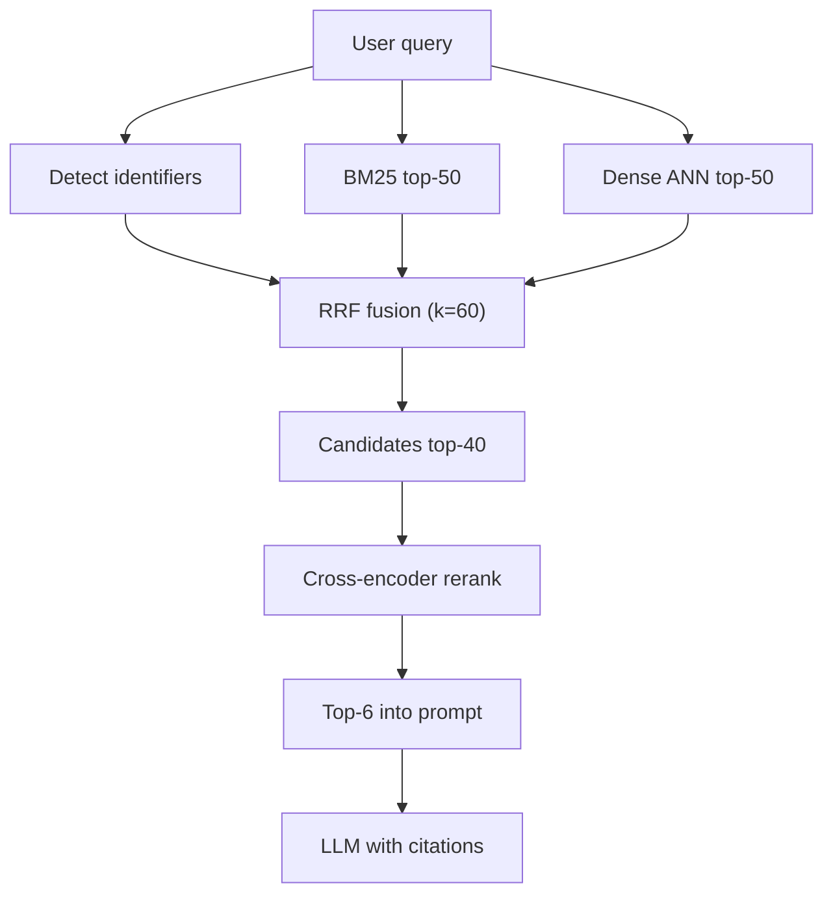

> **Scenario** — A support assistant answers policy questions well but cannot find ticket `INC-48213` or the SKU `BX-9920-BD`. Retrieval is pure dense vector search over 1.2M chunks, and exact identifiers embed into nothing distinctive.

## Why it matters

- Dense-only retrieval misses exact tokens: order IDs, error codes, config keys, product SKUs. Those are the queries with the highest intent and the lowest tolerance for a wrong answer.
- Every retrieval miss becomes a generation failure. The model has no grounding, so it either refuses or invents — and invention costs you trust.
- Recall failures are invisible in production logs. The pipeline returns ten chunks with confident cosine scores of 0.71; nothing signals that the right chunk ranked 340th.
- Retrieval is the cheapest place to spend latency. Adding 60ms of reranking to save a 4-second wrong generation is a trade you almost always want.
- Multilingual corpora make it worse. A Bengali query against English documentation lands in a different region of embedding space unless the model was trained cross-lingually.

## Symptoms

| Signal | What you observe |
|---|---|
| Exact-ID queries | `recall@10` near 0.30 for identifier queries, 0.85 for prose queries |
| Score distribution | Top-10 cosine scores cluster in a narrow 0.68–0.74 band with no separation |
| User behaviour | Repeated rephrasing of the same query within one session |
| Eval drift | `nDCG@10` drops after an unrelated corpus ingest that added near-duplicates |
| Bengali queries | Answers cite English chunks that share transliterated proper nouns only |

## How it breaks

Cosine similarity rewards distributional overlap, not literal match. The string `BX-9920-BD` tokenises into fragments that appear in thousands of chunks, so its embedding sits near the corpus centroid. Meanwhile BM25 would rank it first on a single rare term. Teams pick one retriever, ship it, and inherit exactly that retriever's blind spot.



## Root causes

1. A single retriever is treated as the whole retrieval layer instead of one candidate generator.
2. Bi-encoder embeddings compress a whole chunk into one vector, losing term-level precision.
3. Top-k is chosen for prompt budget (k=5) rather than for recall, so recovery is impossible downstream.
4. Scores from different retrievers are averaged directly even though their scales are unrelated.
5. No offline eval separates identifier queries from natural-language queries, so the gap never surfaces.

## How to solve it

### 1. Run BM25 and dense retrieval in parallel

Fetch a wide candidate set from each — `k=50` per retriever is a common starting point. Cost is dominated by the ANN scan, and going from k=10 to k=50 typically adds under 5ms on an HNSW index.

```python
lexical = opensearch.search(index="chunks", body={
    "size": 50,
    "query": {"match": {"text": {"query": q, "operator": "or"}}},
})
dense = vector_db.query(vector=embed(q), top_k=50, include_metadata=True)
```

### 2. Fuse with Reciprocal Rank Fusion

RRF ignores raw scores and uses ranks only, which sidesteps the scale-mismatch problem entirely:

```text
RRF(d) = Σ over retrievers r of  1 / (k + rank_r(d))
```

with `k = 60` as the standard smoothing constant. A document at rank 1 in BM25 and rank 25 in dense scores `1/61 + 1/85 = 0.0281`; a document at rank 8 in both scores `1/68 + 1/68 = 0.0294` and wins — which is the behaviour you want.

```python
def rrf(rankings: list[list[str]], k: int = 60) -> dict[str, float]:
    scores: dict[str, float] = {}
    for ranking in rankings:
        for rank, doc_id in enumerate(ranking, start=1):
            scores[doc_id] = scores.get(doc_id, 0.0) + 1.0 / (k + rank)
    return dict(sorted(scores.items(), key=lambda kv: -kv[1]))

fused = rrf([[h["_id"] for h in lexical], [m.id for m in dense.matches]])
candidates = list(fused)[:40]
```

### 3. Rerank with a cross-encoder

A cross-encoder reads query and chunk together, so it can judge term-level relevance a bi-encoder cannot. Reranking 40 candidates on a small model costs roughly 40–90ms on GPU, or one batched API call.

```python
pairs = [(q, chunk_text[c]) for c in candidates]
scores = reranker.predict(pairs)                    # e.g. bge-reranker-v2-m3
top = [c for _, c in sorted(zip(scores, candidates), reverse=True)[:6]]
```

Pick a multilingual reranker if any part of your corpus or query stream is Bengali; English-only rerankers will systematically demote correct Bengali passages.

### 4. Add a deterministic identifier route

Regex-detect identifiers before embedding and issue a filtered exact-match query. This turns a probabilistic problem into a lookup:

```ts
const ID_RE = /\b[A-Z]{2,4}-\d{3,6}(-[A-Z]{2})?\b/g
const ids = query.match(ID_RE) ?? []
if (ids.length) {
  const exact = await db.chunks.findMany({ where: { docRef: { in: ids } }, take: 5 })
  candidates.unshift(...exact.map((c) => c.id))
}
```

### 5. Measure the split before and after

Tag every eval query as `identifier`, `natural`, or `bn` and report `recall@50` and `nDCG@10` per bucket. A single aggregate number hides the exact regression you are trying to fix.

## Target design



## Tradeoffs

| Option | Pros | Cons | Choose when |
|---|---|---|---|
| Dense only | One index, low latency, good paraphrase recall | Blind to exact identifiers and rare terms | Corpus is prose-heavy with no codes |
| BM25 only | Exact match, cheap, explainable | No synonym or paraphrase handling | Queries are keyword-shaped and short |
| RRF fusion | Scale-free, no tuning, big recall lift | Two indexes to keep in sync | Mixed query types, which is most products |
| Fusion + cross-encoder | Best precision at small k | +50–100ms and GPU or API cost | Prompt budget is tight and precision matters |
| Learned fusion weights | Tuned to your traffic | Needs labelled data and retraining | You have a stable, labelled query log |

## Verification checklist

- [ ] `recall@50` measured separately for identifier, natural-language, and Bengali query buckets.
- [ ] Fusion output compared against each retriever alone on the same frozen golden set.
- [ ] Reranker latency p95 recorded and included in the end-to-end latency budget.
- [ ] A query containing a known SKU returns the exact chunk at rank 1.
- [ ] Lexical and vector indexes verified to hold the same document count after ingest.
- [ ] Reranker confirmed multilingual if Bengali documents exist in the corpus.

## Anti-patterns

- Averaging cosine similarity and BM25 scores directly — the scales are unrelated, and BM25 is unbounded.
- Raising top-k into the prompt instead of reranking; you pay tokens for noise and dilute attention.
- Using the reranker as the only retriever — cross-encoders cannot scan 1.2M chunks.
- Judging retrieval quality by reading generated answers instead of measuring rank positions.
- Reindexing the lexical store on a different schedule than the vector store, so the two silently diverge.

## Related

- [Vector index selection and ANN parameter tuning](/systems/ai-rag-agents/vector-index-selection-and-tuning)
- [Eval harness design for LLM features in CI](/systems/ai-rag-agents/eval-harness-design)
- [RAG chunking strategies and offline evals](/systems/ai-rag-agents/rag-chunking-evals)
