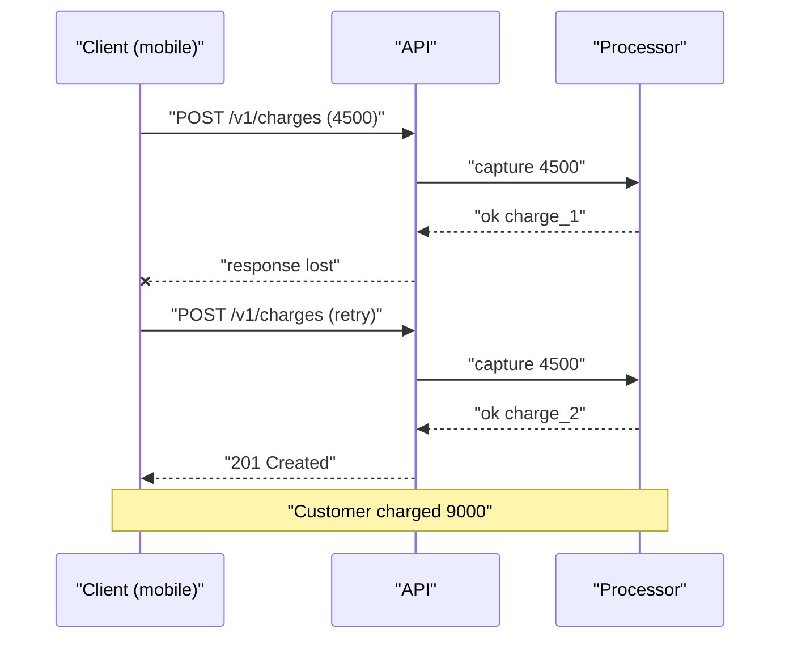
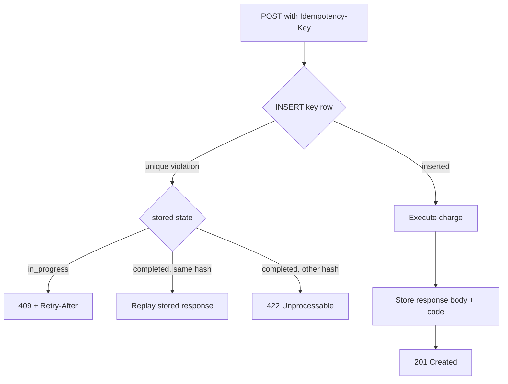

> **Scenario** - দুর্বল 3G-তে একজন গ্রাহক "Pay 4,500 BDT" চাপলেন। আপনার API ৯০০ms-এ card charge করল, কিন্তু response ফোনে পৌঁছাল না। Mobile client 5s timeout-এর পর `POST /v1/charges` retry করল। গ্রাহক দুইবার charge হলেন, আর dashboard-এর আগেই support queue সেটা জানল।

## Why it matters

- Double charge মানে refund + chargeback fee + trust ক্ষতি, যা status page-এর apology দিয়ে মেরামত হয় না।
- Mobile-এ network timeout স্বাভাবিক ঘটনা: খারাপ link-এ ০.৫–২% request-এর response client কখনো পড়তেই পারে না।
- Idempotency ছাড়া কোনো client নিরাপদে `POST` retry করতে পারে না, ফলে প্রতিটি transient blip invisible retry না হয়ে user-visible failure হয়।
- Payment processor-এর সাথে reconciliation manual ও ধীর, আর সেটা করতে হয় রাত ২টায়।
- Stripe, Adyen, SSLCOMMERZ-এর মতো processor idempotency contract আশা করে; না থাকলে integration আটকে যায়।

## Symptoms

| Signal | What you observe |
| --- | --- |
| Duplicate charge | ২–১০s-এর মধ্যে একই amount, একই customer-এর দুটি `charges` row |
| Client timeout | client timeout ceiling-এ p99, অথচ server-এ কোনো 5xx নেই |
| Refund volume | deploy-এর দিনে নয়, mobile network খারাপ থাকা দিনে refund বাড়ে |
| Processor mismatch | আপনার ledger count processor-এর settlement count-এর চেয়ে বেশি |
| Retry race | ৪০ms ব্যবধানে আসা দুই request একই "charge আছে কি?" `SELECT` পাস করে |

## How it breaks

মূল সমস্যা server error নয় - সমস্যা হলো server *সফল* হয় কিন্তু client জানতে পারে না। Client-এর একমাত্র নিরাপদ ধারণা "unknown outcome", তাই সে retry করে। Handler যদি প্রতিটি `POST`-কে নতুন intent ধরে, retry দ্বিতীয় row ও processor-এ দ্বিতীয় capture তৈরি করে।

দ্বিতীয় failure আরও সূক্ষ্ম। দল "recent identical charge আছে কি" guard যোগ করে, কিন্তু ৪০ms ব্যবধানে আসা দুই retry-ই `INSERT`-এর আগে `SELECT` চালিয়ে ফেলে। Unique index ও transaction ছাড়া সেই guard কেবল সাজসজ্জা।



## Root causes

1. সংজ্ঞা অনুযায়ী `POST` idempotent নয়, তবুও client retry করে।
2. Uniqueness database constraint-এর বদলে application code-এ enforce করা হয়।
3. Idempotency record side effect-এর *পরে* লেখা হয়, আগে নয়।
4. Key per-intent নয়, per-attempt তৈরি হয়, তাই প্রতি retry নতুন key নিয়ে আসে।
5. Key caller-scope নয়, global - cross-tenant collision বা probing সম্ভব।
6. Concurrent replay সংজ্ঞায়িত "in progress" response-এর বদলে `500` পায়।
7. Stored response-এর TTL নেই, টেবিল বাড়তে বাড়তে unique index আর memory-তে ধরে না।

## How to solve it

### 1. Contract ঠিক করুন

Client প্রতি user intent-এ **একবার** UUIDv4 বানিয়ে `Idempotency-Key` হিসেবে পাঠায়। সেই intent-এর retry একই key ব্যবহার করে। নিয়ম:

- একই key + একই body → stored response ফেরত।
- একই key + ভিন্ন body → `422 Unprocessable Entity`।
- প্রথম request চলাকালীন একই key → `409 Conflict` সাথে `Retry-After: 1`।
- Key ২৪ ঘণ্টা পরে expire।

### 2. কাজ শুরুর আগেই key লিখুন

```sql
CREATE TABLE idempotency_keys (
    id             BIGSERIAL PRIMARY KEY,
    tenant_id      BIGINT      NOT NULL,
    idem_key       VARCHAR(64) NOT NULL,
    request_hash   CHAR(64)    NOT NULL,
    state          VARCHAR(16) NOT NULL DEFAULT 'in_progress',
    response_code  SMALLINT,
    response_body  JSONB,
    locked_at      TIMESTAMPTZ,
    created_at     TIMESTAMPTZ NOT NULL DEFAULT now(),
    expires_at     TIMESTAMPTZ NOT NULL,
    CONSTRAINT idempotency_keys_unique UNIQUE (tenant_id, idem_key)
);

CREATE INDEX idempotency_keys_expiry ON idempotency_keys (expires_at);
```

Double charge আসলে `UNIQUE (tenant_id, idem_key)` constraint আটকায়, `SELECT` নয়।

### 3. Laravel middleware

```php
<?php

namespace App\Http\Middleware;

use Closure;
use Illuminate\Http\Request;
use Illuminate\Support\Facades\DB;
use Symfony\Component\HttpFoundation\Response;

class IdempotentRequest
{
    public function handle(Request $request, Closure $next): Response
    {
        $key = $request->header('Idempotency-Key');

        if (! $key) {
            return response()->json([
                'error' => 'Idempotency-Key header is required',
            ], 400);
        }

        $tenantId = $request->user()->tenant_id;
        $hash = hash('sha256', $request->getContent());

        try {
            DB::table('idempotency_keys')->insert([
                'tenant_id'    => $tenantId,
                'idem_key'     => $key,
                'request_hash' => $hash,
                'state'        => 'in_progress',
                'locked_at'    => now(),
                'created_at'   => now(),
                'expires_at'   => now()->addDay(),
            ]);
        } catch (\Illuminate\Database\UniqueConstraintViolationException) {
            return $this->replay($tenantId, $key, $hash);
        }

        $response = $next($request);

        DB::table('idempotency_keys')
            ->where('tenant_id', $tenantId)
            ->where('idem_key', $key)
            ->update([
                'state'         => 'completed',
                'response_code' => $response->getStatusCode(),
                'response_body' => $response->getContent(),
            ]);

        return $response;
    }

    private function replay(int $tenantId, string $key, string $hash): Response
    {
        $row = DB::table('idempotency_keys')
            ->where('tenant_id', $tenantId)
            ->where('idem_key', $key)
            ->first();

        if ($row->request_hash !== $hash) {
            return response()->json([
                'error' => 'Idempotency-Key reused with a different payload',
            ], 422);
        }

        if ($row->state === 'in_progress') {
            return response()->json(['error' => 'Request in progress'], 409)
                ->header('Retry-After', '1');
        }

        return response($row->response_body, $row->response_code)
            ->header('Content-Type', 'application/json')
            ->header('Idempotent-Replay', 'true');
    }
}
```

### 4. Client-কে সহযোগী বানান

```ts
type ChargeRequest = { amount: number; currency: string; customerId: string }

export async function createCharge(body: ChargeRequest): Promise<Response> {
  const idempotencyKey = crypto.randomUUID() // once per intent, not per attempt

  for (let attempt = 0; attempt < 4; attempt++) {
    const res = await fetch('/v1/charges', {
      method: 'POST',
      headers: {
        'Content-Type': 'application/json',
        'Idempotency-Key': idempotencyKey,
      },
      body: JSON.stringify(body),
    })

    if (res.status === 409 || res.status === 429 || res.status >= 500) {
      const retryAfter = Number(res.headers.get('Retry-After') ?? 0)
      const backoff = retryAfter * 1000 || 2 ** attempt * 250
      await new Promise((r) => setTimeout(r, backoff + Math.random() * 250))
      continue
    }

    return res
  }

  throw new Error('charge failed after retries')
}
```

### 5. Expired key মুছুন

রাতের job `WHERE expires_at < now()` ১০,০০০ row batch-এ delete করলে unique index ছোট থাকে এবং replay lookup index-only scan-এ চলে।

## Target design



## Tradeoffs

| Option | Pros | Cons | Choose when |
| --- | --- | --- | --- |
| DB unique key + stored response | concurrency-তে সঠিক, restart-এ টেকে | প্রতি request-এ বাড়তি write, reaping লাগে | টাকা, order, irreversible কাজ |
| শুধু Redis `SET NX` lock | দ্রুত, যোগ করা সহজ | eviction-এ lock হারায়, replay body নেই | কম মূল্যের retry-tolerant write |
| Natural key (order number) | বাড়তি টেবিল লাগে না | client-কে business ID বানাতে হয় | সব caller আপনার নিয়ন্ত্রণে |
| শুধু client-side dedup | server-এ শূন্য খরচ | app restart ও multi-device-এ fail | payment-এ কখনো নয় |

## Verification checklist

- [ ] একই `Idempotency-Key` দুইবার পাঠিয়ে `charges`-এ একটি row ও অভিন্ন response body নিশ্চিত করুন।
- [ ] একই key-তে ২০টি concurrent request (`hey -n 20 -c 20`) দিয়ে ঠিক একটি `201`, বাকিগুলো `409`/replay যাচাই করুন।
- [ ] একই key-তে ভিন্ন `amount` পাঠিয়ে `422` assert করুন।
- [ ] Charge চলাকালীন app process kill করে দেখুন stale `in_progress` row recover বা expire হয়, চিরকাল block করে না।
- [ ] Replay lookup `EXPLAIN`-এ `idempotency_keys_unique` ব্যবহার করছে কিনা দেখুন।
- [ ] এক সপ্তাহে reaper টেবিল size সমান রাখছে কিনা যাচাই করুন।

## Anti-patterns

- শুধু request body hash থেকে key বানানো - ৩০ সেকেন্ড ব্যবধানে দুটি বৈধ একই payment চুপচাপ merge হয়ে যায়।
- Processor call-এর *পরে* idempotency row লেখা; মাঝখানে crash হলে dedup record-ই হারায়।
- Replay-তে খালি body সহ `200` ফেরানো, ফলে client charge ID পায় না।
- Trace ID বা request ID-কে key বানানো - প্রতি attempt-এ সেগুলো বদলায়।
- Key টেবিল অসীম বাড়তে দেওয়া, তারপর sale-এর দিনে আবিষ্কার করা যে index আর RAM-এ ধরে না।
- `GET`/`DELETE`-এ idempotency middleware লাগানো, যেগুলো এমনিতেই idempotent - শুধু write খরচ বাড়ে।

## Related

- [Retry with jitter, budgets, and honest error classes](/systems/api-integration/retry-with-jitter-strategy)
- [Bulk endpoints and partial failure semantics](/systems/api-integration/bulk-endpoints-partial-failure)
- [Webhook delivery you can actually trust](/systems/api-integration/webhook-delivery-reliability)
