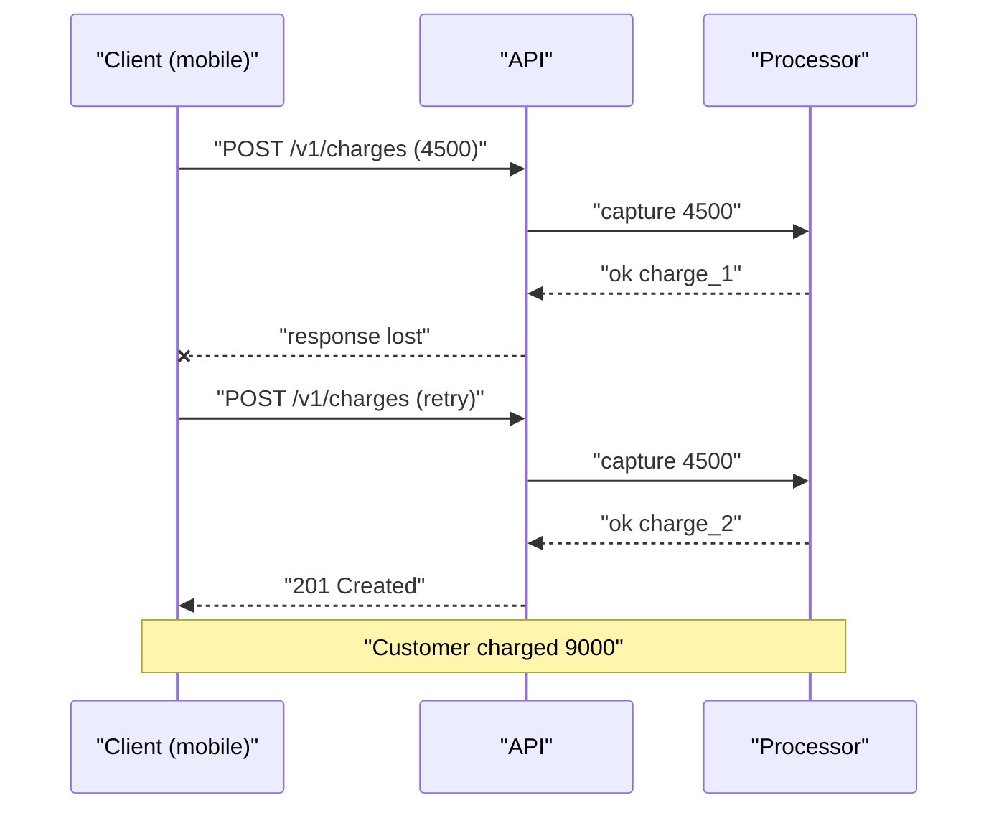
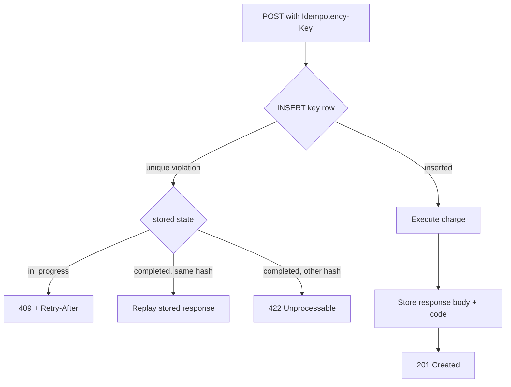

> **Scenario** - A customer taps "Pay 4,500 BDT" on a flaky 3G connection. Your API charges the card in 900ms, but the response never reaches the phone. The mobile client's HTTP layer retries the `POST /v1/charges` after a 5s timeout. The customer is charged twice, and your support queue learns about it before your dashboards do.

## Why it matters

- Double charges are refunds plus chargeback fees plus a trust hit that no status page apology repairs.
- Network timeouts are the *normal* case on mobile: 0.5–2% of requests on poor links never return a response the client can read.
- Without idempotency, no client can safely retry a `POST`, so every transient blip becomes a user-visible failure instead of an invisible retry.
- Reconciliation with a payment processor is manual, slow, and usually done by the person who least wants to be doing it at 2am.
- Auditors and processors (Stripe, Adyen, SSLCOMMERZ) expect an idempotency contract; not having one blocks integrations.

## Symptoms

| Signal | What you observe |
| --- | --- |
| Duplicate charges | Two `charges` rows within 2–10s, same amount, same customer, different IDs |
| Client-side timeouts | p99 request duration at the client timeout ceiling, with no matching server 5xx |
| Refund volume | Refunds spike on days with mobile network degradation, not on deploy days |
| Processor mismatch | Your ledger count exceeds the processor's settlement count |
| Race under retry | Two concurrent requests both pass a "does a charge already exist?" `SELECT` |

## How it breaks

The classic failure is not that the server errors - it is that the server *succeeds* and the client never finds out. The client's only safe assumption is "unknown outcome", so it retries. If your handler treats every `POST` as a fresh intent, the retry creates a second row and a second capture on the processor.

The second failure is subtler. Teams add a "check for a recent identical charge" guard, but two retries arriving 40ms apart both run the `SELECT` before either runs the `INSERT`. Without a unique index and a transaction, the guard is decoration.



## Root causes

1. `POST` is not idempotent by definition, and clients retry it anyway.
2. Uniqueness is enforced in application code instead of a database constraint.
3. The idempotency record is written *after* the side effect rather than before it.
4. Keys are generated per-attempt instead of per-intent, so each retry carries a fresh key.
5. Keys are global rather than scoped to the caller, allowing cross-tenant collisions or probing.
6. Concurrent replays receive `500` instead of a defined "in progress" response.
7. Stored responses have no TTL, so the table grows until the unique index no longer fits in memory.

## How to solve it

### 1. Define the contract

The client generates a UUIDv4 **once per user intent** and sends it as `Idempotency-Key`. Retries of that intent reuse the same key. Rules:

- Same key + same request body → return the original stored response.
- Same key + different body → `422 Unprocessable Entity` (the key is being reused for a new intent).
- Same key while the first request is still running → `409 Conflict` with `Retry-After: 1`.
- Keys expire after 24 hours.

### 2. Store the key before doing the work

```sql
CREATE TABLE idempotency_keys (
    id             BIGSERIAL PRIMARY KEY,
    tenant_id      BIGINT      NOT NULL,
    idem_key       VARCHAR(64) NOT NULL,
    request_hash   CHAR(64)    NOT NULL,
    state          VARCHAR(16) NOT NULL DEFAULT 'in_progress',
    response_code  SMALLINT,
    response_body  JSONB,
    locked_at      TIMESTAMPTZ,
    created_at     TIMESTAMPTZ NOT NULL DEFAULT now(),
    expires_at     TIMESTAMPTZ NOT NULL,
    CONSTRAINT idempotency_keys_unique UNIQUE (tenant_id, idem_key)
);

CREATE INDEX idempotency_keys_expiry ON idempotency_keys (expires_at);
```

The `UNIQUE (tenant_id, idem_key)` constraint - not the `SELECT` - is what actually prevents the double charge.

### 3. Laravel middleware

```php
<?php

namespace App\Http\Middleware;

use Closure;
use Illuminate\Http\Request;
use Illuminate\Support\Facades\DB;
use Symfony\Component\HttpFoundation\Response;

class IdempotentRequest
{
    public function handle(Request $request, Closure $next): Response
    {
        $key = $request->header('Idempotency-Key');

        if (! $key) {
            return response()->json([
                'error' => 'Idempotency-Key header is required',
            ], 400);
        }

        $tenantId = $request->user()->tenant_id;
        $hash = hash('sha256', $request->getContent());

        try {
            DB::table('idempotency_keys')->insert([
                'tenant_id'    => $tenantId,
                'idem_key'     => $key,
                'request_hash' => $hash,
                'state'        => 'in_progress',
                'locked_at'    => now(),
                'created_at'   => now(),
                'expires_at'   => now()->addDay(),
            ]);
        } catch (\Illuminate\Database\UniqueConstraintViolationException) {
            return $this->replay($tenantId, $key, $hash);
        }

        $response = $next($request);

        DB::table('idempotency_keys')
            ->where('tenant_id', $tenantId)
            ->where('idem_key', $key)
            ->update([
                'state'         => 'completed',
                'response_code' => $response->getStatusCode(),
                'response_body' => $response->getContent(),
            ]);

        return $response;
    }

    private function replay(int $tenantId, string $key, string $hash): Response
    {
        $row = DB::table('idempotency_keys')
            ->where('tenant_id', $tenantId)
            ->where('idem_key', $key)
            ->first();

        if ($row->request_hash !== $hash) {
            return response()->json([
                'error' => 'Idempotency-Key reused with a different payload',
            ], 422);
        }

        if ($row->state === 'in_progress') {
            return response()->json(['error' => 'Request in progress'], 409)
                ->header('Retry-After', '1');
        }

        return response($row->response_body, $row->response_code)
            ->header('Content-Type', 'application/json')
            ->header('Idempotent-Replay', 'true');
    }
}
```

### 4. Make the client cooperate

```ts
type ChargeRequest = { amount: number; currency: string; customerId: string }

export async function createCharge(body: ChargeRequest): Promise<Response> {
  const idempotencyKey = crypto.randomUUID() // once per intent, not per attempt

  for (let attempt = 0; attempt < 4; attempt++) {
    const res = await fetch('/v1/charges', {
      method: 'POST',
      headers: {
        'Content-Type': 'application/json',
        'Idempotency-Key': idempotencyKey,
      },
      body: JSON.stringify(body),
    })

    if (res.status === 409 || res.status === 429 || res.status >= 500) {
      const retryAfter = Number(res.headers.get('Retry-After') ?? 0)
      const backoff = retryAfter * 1000 || 2 ** attempt * 250
      await new Promise((r) => setTimeout(r, backoff + Math.random() * 250))
      continue
    }

    return res
  }

  throw new Error('charge failed after retries')
}
```

### 5. Reap expired keys

A nightly job deleting `WHERE expires_at < now()` in 10,000-row batches keeps the unique index small and the replay lookup on an index-only scan.

## Target design



## Tradeoffs

| Option | Pros | Cons | Choose when |
| --- | --- | --- | --- |
| DB unique key + stored response | Correct under concurrency, survives restarts | Extra write per request, table needs reaping | Money, orders, anything irreversible |
| Redis `SET NX` lock only | Fast, trivial to add | Lock loss on eviction, no replay body | Low-value, retry-tolerant writes |
| Natural key (order number) | No extra table | Requires clients to mint business IDs | You control every caller |
| Client-side dedup only | Zero server work | Fails across app restarts and devices | Never for payments |

## Verification checklist

- [ ] Replay the same `Idempotency-Key` twice and confirm one row in `charges` and identical response bodies.
- [ ] Fire 20 concurrent requests with the same key (`hey -n 20 -c 20`) and confirm exactly one `201`, the rest `409` or replay.
- [ ] Send the same key with a changed `amount` and assert `422`.
- [ ] Kill the app process mid-charge and confirm the stale `in_progress` row is either recovered or expires rather than blocking forever.
- [ ] Confirm `EXPLAIN` on the replay lookup uses `idempotency_keys_unique`.
- [ ] Verify the reaper keeps table size flat over a week.

## Anti-patterns

- Deriving the key from the request body hash alone - two legitimate identical payments 30 seconds apart get silently merged.
- Writing the idempotency row *after* the processor call; a crash in between loses the dedup record entirely.
- Returning `200` with an empty body on replay, so the client cannot get the charge ID.
- Using the trace ID or request ID as the key - those change on every attempt.
- Letting the key table grow forever and then discovering the index no longer fits in RAM during a sale.
- Applying idempotency middleware to `GET` and `DELETE`, which are already idempotent, and paying the write cost for nothing.

## Related

- [Retry with jitter, budgets, and honest error classes](/systems/api-integration/retry-with-jitter-strategy)
- [Bulk endpoints and partial failure semantics](/systems/api-integration/bulk-endpoints-partial-failure)
- [Webhook delivery you can actually trust](/systems/api-integration/webhook-delivery-reliability)
