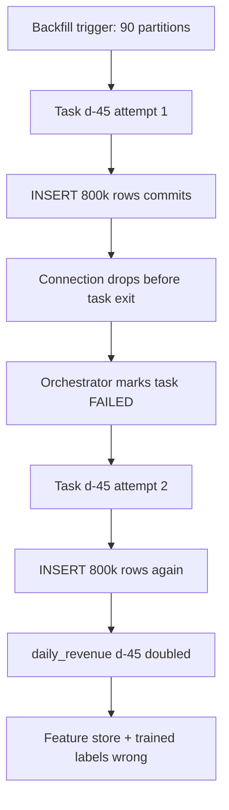

> **Scenario** - একটি currency conversion bug `daily_revenue` table-এর ৯০ দিন নষ্ট করেছে। ৯০টি partition-এর জন্য backfill DAG trigger করা হলো, তিনটি task warehouse timeout-এ fail করল, কেউ clear করে re-run দিল - এখন ১১ দিনের revenue প্রায় দ্বিগুণ, কারণ task replace-এর বদলে append করেছে।

## Why it matters

- Non-idempotent backfill একটি bounded bug-কে unbounded করে: মূল ভুল ৯০ দিনে ছিল, খারাপ মেরামত ৯০ দিন *প্লাস* যা retry হয়েছে তা-ও নষ্ট করে।
- একটিমাত্র double-counted revenue সংখ্যার পরেই executive-রা warehouse-এর উপর আস্থা হারায়। সেই আস্থা ফেরাতে sprint নয়, quarter লাগে।
- Backfill হলো pipeline-এর সবচেয়ে high-concurrency workload। Task repeat-safe না হলে প্রতিটি retry, প্রতিটি manual clear ও প্রতিটি parallel worker correctness risk।
- On-call নিরাপদে কিছুই retry করতে পারে না। Runbook হয়ে যায় "pipeline owner-কে ঘুম থেকে তোলো", ৫ মিনিটের কাজ ৯০ মিনিটের escalation হয়।
- Downstream model, feature store ও trained model - সবাই নষ্ট window খায়। একটি খারাপ backfill এমন model বানায় যার training label ভুল।

## Symptoms

| Signal | What you observe |
| --- | --- |
| Row count drift | পুরনো partition-এর `COUNT(*)` re-run-এর পরে বাড়ে, যদিও কিছুই বদলানোর কথা ছিল না |
| Double-counted metrics | নির্দিষ্ট দিনের sum প্রত্যাশিত মানের ঠিক গুণিতক (2x, 3x) |
| Duplicate keys | `GROUP BY order_id HAVING COUNT(*) > 1` শুধু backfilled range-এ row দেয় |
| প্রতি attempt-এ backfill ধীর | প্রতি retry row যোগ করে, পরের aggregate আরও বেশি data scan করে |
| Divergent reruns | একই partition-এ একই task দুবার চালালে table state ভিন্ন |
| ভয়-চালিত ops | Runbook task clear নিষিদ্ধ করে; শুধু একজন নির্দিষ্ট ব্যক্তি backfill trigger করতে পারে |

## How it breaks

সাধারণ backfill task একটি source window পড়ে `INSERT INTO` দিয়ে লেখে। Happy path-এ সমস্যা নেই কারণ প্রতিটি partition একবারই লেখা হয়। ঝামেলা শুরু হয় retry-তে: প্রথম attempt শেষ statement-এর সময় connection পড়ার আগেই ৮ লাখ row commit করেছে, orchestrator task-কে failed দেখাল, retry একই ৮ লাখ row আবার insert করল।

Parallelism-এ আরও খারাপ। একই target table-এ ১৬টি partition একসাথে চললে, delete predicate partition-এ শক্তভাবে scoped না হলে এক task-এর `DELETE` অন্য task-এর `INSERT`-এর সঙ্গে interleave করে। তখন দুই task একে অন্যের কাজের অংশ মুছে দেয়।



## Root causes

1. Write path-এ `INSERT`, কোনো natural key নেই, primary key নেই, delete-before-insert নেই।
2. Delete predicate-এর partition boundary read query-র boundary থেকে ভিন্ন, তাই retry যা লেখে তার চেয়ে কম মোছে।
3. "transaction rollback করবে" ধরে retry safe ভাবা - কিন্তু job chunk ধরে commit করে।
4. Non-deterministic transformation: task-এ `NOW()`, `RANDOM()` বা unpinned dimension table, তাই re-run ভিন্ন value দেয়।
5. Partition isolation ছাড়া concurrency: কয়েকটি task একই target row লেখে।
6. Completion marker নেই, তাই "partition কখনও চলেনি" আর "চলেছে কিন্তু commit-এর পরে fail" আলাদা করা যায় না।

## How to solve it

### 1. Write-কে partition-scoped atomic replace বানান

Idempotency-র একক হলো partition। যে partition লিখতে যাচ্ছেন ঠিক সেটাই একই transaction-এ delete করুন।

```sql
BEGIN;

DELETE FROM analytics.daily_revenue
 WHERE revenue_date >= DATE '2026-05-12'
   AND revenue_date <  DATE '2026-05-13';

INSERT INTO analytics.daily_revenue (revenue_date, region, amount_cents, row_count)
SELECT
  DATE_TRUNC('day', o.occurred_at)::DATE AS revenue_date,
  o.region,
  SUM(o.amount_cents)                    AS amount_cents,
  COUNT(*)                               AS row_count
FROM analytics.orders o
WHERE o.occurred_at >= TIMESTAMP '2026-05-12 00:00:00+00'
  AND o.occurred_at <  TIMESTAMP '2026-05-13 00:00:00+00'
GROUP BY 1, 2;

COMMIT;
```

দুই statement-এ half-open interval এবং *একই* boundary - লক্ষ্য করুন। `BETWEEN` হলো এক-row overlap-এর ক্লাসিক উৎস।

### 2. অথবা আসল key-তে `MERGE` করুন

```sql
MERGE INTO analytics.orders AS t
USING staging.orders_window AS s
   ON t.order_id = s.order_id
WHEN MATCHED AND s.updated_at > t.updated_at THEN
  UPDATE SET amount_cents = s.amount_cents,
             region       = s.region,
             updated_at   = s.updated_at
WHEN NOT MATCHED THEN
  INSERT (order_id, amount_cents, region, occurred_at, updated_at)
  VALUES (s.order_id, s.amount_cents, s.region, s.occurred_at, s.updated_at);
```

`s.updated_at > t.updated_at` guard পুরনো batch-এর replay-কে regression নয়, no-op বানায়।

### 3. DAG এমনভাবে লিখুন যাতে প্রতি task একটি partition-এর মালিক

```python
from datetime import datetime, timedelta

from airflow.decorators import dag, task
from airflow.providers.postgres.hooks.postgres import PostgresHook

REPLACE_SQL = """
BEGIN;
DELETE FROM analytics.daily_revenue
 WHERE revenue_date >= %(start)s AND revenue_date < %(end)s;
INSERT INTO analytics.daily_revenue (revenue_date, region, amount_cents, row_count)
SELECT DATE_TRUNC('day', occurred_at)::DATE, region, SUM(amount_cents), COUNT(*)
  FROM analytics.orders
 WHERE occurred_at >= %(start)s AND occurred_at < %(end)s
 GROUP BY 1, 2;
COMMIT;
"""


@dag(
    dag_id="daily_revenue_rollup",
    schedule="0 2 * * *",
    start_date=datetime(2026, 1, 1),
    catchup=True,
    max_active_runs=4,
    default_args={"retries": 3, "retry_delay": timedelta(minutes=5)},
)
def daily_revenue_rollup():
    @task
    def replace_partition(data_interval_start=None, data_interval_end=None):
        hook = PostgresHook(postgres_conn_id="warehouse")
        hook.run(
            REPLACE_SQL,
            parameters={"start": data_interval_start, "end": data_interval_end},
        )

    @task
    def assert_no_duplicates(data_interval_start=None, data_interval_end=None):
        hook = PostgresHook(postgres_conn_id="warehouse")
        dupes = hook.get_first(
            """
            SELECT COUNT(*) FROM (
              SELECT revenue_date, region
                FROM analytics.daily_revenue
               WHERE revenue_date >= %(start)s AND revenue_date < %(end)s
               GROUP BY 1, 2 HAVING COUNT(*) > 1
            ) d
            """,
            parameters={"start": data_interval_start, "end": data_interval_end},
        )[0]
        if dupes:
            raise ValueError(f"{dupes} duplicate (date, region) rows after replace")

    replace_partition() >> assert_no_duplicates()


daily_revenue_rollup()
```

প্রতি run-এ একটি partition সহ `catchup=True` থাকলেই `airflow dags backfill` বিপজ্জনক না হয়ে সঠিক হয়। `max_active_runs=4` warehouse concurrency আটকে রাখে যাতে ৯০ দিনের backfill interactive query queue দখল না করে।

### 4. Transform যে dimension পড়ে, সব pin করুন

Transform slowly changing dimension join করলে partition-এর event time-এ valid version-এ join করুন, current row-এ নয়। নাহলে গত quarter-এর partition আজ re-run করলে আজকের mapping ঢুকবে।

```sql
LEFT JOIN dim_country_region r
       ON r.country_code = o.country_code
      AND o.occurred_at >= r.valid_from
      AND o.occurred_at <  r.valid_to
```

### 5. Completion ledger রাখুন

```sql
CREATE TABLE IF NOT EXISTS meta.partition_runs (
  table_name   TEXT        NOT NULL,
  partition_key DATE       NOT NULL,
  attempt      INT         NOT NULL,
  row_count    BIGINT      NOT NULL,
  code_version TEXT        NOT NULL,
  completed_at TIMESTAMPTZ NOT NULL DEFAULT NOW(),
  PRIMARY KEY (table_name, partition_key, attempt)
);
```

Ledger data না দেখেই উত্তর দেয় "কোন partition গুলো fixed code-এ rebuild হয়েছে?", আর প্রতি attempt-এর row-count history দেয় - doubling ধরার দ্রুততম উপায়।

### 6. Backfill throttle ও stage করুন

আগে একটি partition চালান, পুরনো value-র সঙ্গে diff করুন, তারপরই বাকিগুলো ছাড়ুন। যে script ৯০টি partition একসাথে শুরু করে, তার dry run নেই।

## Target design

```mermaid
stateDiagram-v2
  [*] --> Claimed: "task claims partition"
  Claimed --> Replacing: "BEGIN; DELETE partition"
  Replacing --> Inserting: "INSERT from pinned sources"
  Inserting --> Validated: "COMMIT; run row and dupe checks"
  Validated --> Ledgered: "write meta.partition_runs"
  Ledgered --> [*]
  Replacing --> Failed: "error or timeout"
  Inserting --> Failed: "error or timeout"
  Failed --> Claimed: "retry is safe, replace is atomic"
  Validated --> Failed: "checks fail, roll back"
```



## Tradeoffs

| Option | Pros | Cons | Choose when |
| --- | --- | --- | --- |
| এক transaction-এ delete + insert | সরল, নিখুঁত, primary key ছাড়াও চলে | transactional DML দরকার; বড় partition-এ দীর্ঘ lock | warehouse transaction সমর্থন করে এবং partition ঘণ্টা-থেকে-দিন আকারের |
| Partition swap (`EXCHANGE`) | প্রায় শূন্য lock time; metadata-level atomic | engine-specific; partition layout মিলতে হবে | Hive/Iceberg/BigQuery ধাঁচের টেবিলে খুব বড় partition |
| Natural key-তে `MERGE` | late update ও dedupe একসাথে সামলায় | বিশ্বাসযোগ্য key ও `updated_at` লাগে; replace-এর চেয়ে ধীর | source বিদ্যমান row-এর update পাঠায় |
| Append-only + `DISTINCT ON` view | history কখনও mutate হয় না; পূর্ণ audit trail | query cost বাড়ে; consumer-কে view ব্যবহার করতে হয় | auditability query simplicity-র চেয়ে বেশি জরুরি |

## Verification checklist

- [ ] একই partition-এ একটি backfill task দুবার চালান; `COUNT(*)`, `SUM(amount_cents)` ও checksum অপরিবর্তিত।
- [ ] insert-এর মাঝপথে worker `SIGKILL` করুন; re-run করে duplicate নেই তা নিশ্চিত করুন।
- [ ] ৮টি partition parallel চালান; কোনো task-এর row অন্য task মোছেনি তা যাচাই করুন।
- [ ] ২০২৪-এর একটি partition আজ re-run করুন; dimension value historical mapping মেলে, current নয়।
- [ ] `SELECT partition_key, attempt, row_count FROM meta.partition_runs ORDER BY 1, 2`-এ attempt জুড়ে row count স্থির।
- [ ] Transform-এ `NOW()`, `CURRENT_DATE`, `RANDOM()` ও unpinned `LIMIT` grep করুন - প্রতিটি হয় justified, নয় বাদ।
- [ ] ৯০ partition backfill চলার সময় interactive query p95 SLO ছাড়ায় না।

## Anti-patterns

- "নিরাপদ থাকার জন্য" backfill-এর আগে `TRUNCATE` - এটা repair window-এর বাইরের partition-ও মুছে দেয়।
- `INSERT ... ON CONFLICT DO NOTHING`-কে idempotency mechanism ভাবা, যখন conflict target এমন surrogate key যা প্রতি run-এ নতুন হয়।
- পুরো ৯০ দিনের backfill এক transaction-এ মোড়া; ছয় ঘণ্টায় প্রথম failure-এ সব হারায়।
- Duplicate এড়াতে task idempotent না করে `retries: 0` দেওয়া। এখন transient warehouse error-এও মানুষ লাগে।
- Time window-এ `BETWEEN` বিশ্বাস করা; inclusive upper bound পাশের partition-এর boundary row double-count করে।
- Upstream fact table fix নিশ্চিত হওয়ার আগেই downstream aggregate backfill করা।

## Related

- [Pipeline orchestration retries that do not amplify](/systems/data-pipelines-ml/pipeline-orchestration-retries)
- [Late-arriving and out-of-order data](/systems/data-pipelines-ml/late-arriving-out-of-order-data)
- [ETL vs ELT: choosing where transformation lives](/systems/data-pipelines-ml/etl-vs-elt-decisions)
- [Data quality contracts between producers and consumers](/systems/data-pipelines-ml/data-quality-contracts)
