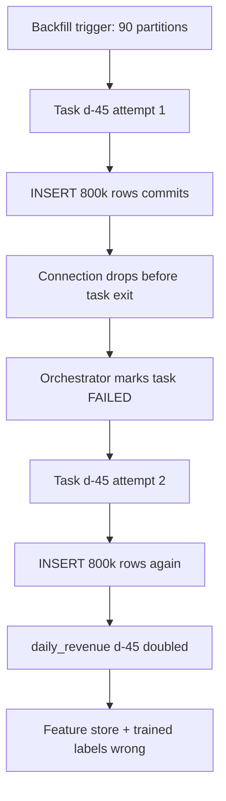

> **Scenario** - A currency conversion bug corrupted 90 days of the `daily_revenue` table. The backfill DAG is triggered for all 90 partitions, three tasks fail on a warehouse timeout, someone clears and re-runs them, and now 11 days show revenue roughly double the truth because the task appended instead of replacing.

## Why it matters

- A non-idempotent backfill converts a bounded bug into an unbounded one: the original error affected 90 days, the botched repair affects 90 days *plus* whatever retried.
- Executives lose trust in the warehouse after exactly one double-counted revenue figure. Rebuilding that trust takes quarters, not sprints.
- Backfills are the highest-concurrency workload a pipeline ever runs. If the task is not safe to repeat, every retry, every manual clear, and every parallel worker is a correctness risk.
- On-call cannot safely retry anything. The runbook becomes "wake the pipeline owner", which turns a 5-minute action into a 90-minute escalation.
- Downstream models, feature stores, and trained models all consume the corrupted window. One bad backfill produces a model whose training labels are wrong.

## Symptoms

| Signal | What you observe |
| --- | --- |
| Row count drift | `COUNT(*)` for an old partition grows after a re-run that should have changed nothing |
| Double-counted metrics | Sum for a specific day is an exact multiple (2x, 3x) of the expected value |
| Duplicate keys | `GROUP BY order_id HAVING COUNT(*) > 1` returns rows only in backfilled ranges |
| Backfill takes longer each attempt | Every retry adds rows, so the next aggregate scans more data |
| Divergent reruns | Running the same task twice on the same partition yields different table states |
| Fear-driven ops | The runbook forbids clearing tasks; only one named person may trigger backfills |

## How it breaks

The typical backfill task reads a source window and writes results with `INSERT INTO`. On the happy path this is fine because each partition is written once. The trouble starts when a task is retried: the first attempt committed 800k rows before the connection dropped during the final statement, the orchestrator marks the task failed, the retry inserts the same 800k rows again.

It gets worse with parallelism. A backfill running 16 partitions concurrently against the same target table can interleave a `DELETE` from one task with an `INSERT` from another if the delete predicate is not tightly scoped to the partition. Two tasks then each delete part of the other's work.



## Root causes

1. Write path uses `INSERT` with no natural key, no primary key, and no delete-before-insert.
2. Partition boundaries in the delete predicate differ from the boundaries the read query uses, so a retry deletes less than it rewrites.
3. Task retries assumed to be safe because "the transaction will roll back" - but the job commits in chunks.
4. Non-deterministic transformation: the task uses `NOW()`, `RANDOM()`, or an unpinned dimension table, so re-running produces different values.
5. Concurrency without partition isolation: several tasks writing the same target rows.
6. No completion marker, so the system cannot distinguish "partition never ran" from "partition ran and failed after committing".

## How to solve it

### 1. Make the write a partition-scoped atomic replace

The unit of idempotency is the partition. Delete exactly the partition you are about to write, in the same transaction as the insert.

```sql
BEGIN;

DELETE FROM analytics.daily_revenue
 WHERE revenue_date >= DATE '2026-05-12'
   AND revenue_date <  DATE '2026-05-13';

INSERT INTO analytics.daily_revenue (revenue_date, region, amount_cents, row_count)
SELECT
  DATE_TRUNC('day', o.occurred_at)::DATE AS revenue_date,
  o.region,
  SUM(o.amount_cents)                    AS amount_cents,
  COUNT(*)                               AS row_count
FROM analytics.orders o
WHERE o.occurred_at >= TIMESTAMP '2026-05-12 00:00:00+00'
  AND o.occurred_at <  TIMESTAMP '2026-05-13 00:00:00+00'
GROUP BY 1, 2;

COMMIT;
```

Note the half-open intervals on both statements and the fact that they use the *same* boundaries. `BETWEEN` is the classic source of one-row overlaps.

### 2. Or use `MERGE` on a real key

```sql
MERGE INTO analytics.orders AS t
USING staging.orders_window AS s
   ON t.order_id = s.order_id
WHEN MATCHED AND s.updated_at > t.updated_at THEN
  UPDATE SET amount_cents = s.amount_cents,
             region       = s.region,
             updated_at   = s.updated_at
WHEN NOT MATCHED THEN
  INSERT (order_id, amount_cents, region, occurred_at, updated_at)
  VALUES (s.order_id, s.amount_cents, s.region, s.occurred_at, s.updated_at);
```

The `s.updated_at > t.updated_at` guard makes replay of an older batch a no-op instead of a regression.

### 3. Write the DAG so each task owns one partition

```python
from datetime import datetime, timedelta

from airflow.decorators import dag, task
from airflow.providers.postgres.hooks.postgres import PostgresHook

REPLACE_SQL = """
BEGIN;
DELETE FROM analytics.daily_revenue
 WHERE revenue_date >= %(start)s AND revenue_date < %(end)s;
INSERT INTO analytics.daily_revenue (revenue_date, region, amount_cents, row_count)
SELECT DATE_TRUNC('day', occurred_at)::DATE, region, SUM(amount_cents), COUNT(*)
  FROM analytics.orders
 WHERE occurred_at >= %(start)s AND occurred_at < %(end)s
 GROUP BY 1, 2;
COMMIT;
"""


@dag(
    dag_id="daily_revenue_rollup",
    schedule="0 2 * * *",
    start_date=datetime(2026, 1, 1),
    catchup=True,
    max_active_runs=4,
    default_args={"retries": 3, "retry_delay": timedelta(minutes=5)},
)
def daily_revenue_rollup():
    @task
    def replace_partition(data_interval_start=None, data_interval_end=None):
        hook = PostgresHook(postgres_conn_id="warehouse")
        hook.run(
            REPLACE_SQL,
            parameters={"start": data_interval_start, "end": data_interval_end},
        )

    @task
    def assert_no_duplicates(data_interval_start=None, data_interval_end=None):
        hook = PostgresHook(postgres_conn_id="warehouse")
        dupes = hook.get_first(
            """
            SELECT COUNT(*) FROM (
              SELECT revenue_date, region
                FROM analytics.daily_revenue
               WHERE revenue_date >= %(start)s AND revenue_date < %(end)s
               GROUP BY 1, 2 HAVING COUNT(*) > 1
            ) d
            """,
            parameters={"start": data_interval_start, "end": data_interval_end},
        )[0]
        if dupes:
            raise ValueError(f"{dupes} duplicate (date, region) rows after replace")

    replace_partition() >> assert_no_duplicates()


daily_revenue_rollup()
```

`catchup=True` with one partition per run is what makes `airflow dags backfill` correct rather than dangerous. `max_active_runs=4` bounds warehouse concurrency so a 90-day backfill does not evict the interactive query queue.

### 4. Pin every dimension the transform reads

If the transform joins a slowly changing dimension, join on the version valid at the partition's event time, not the current row. Otherwise re-running last quarter's partition today produces today's mapping.

```sql
LEFT JOIN dim_country_region r
       ON r.country_code = o.country_code
      AND o.occurred_at >= r.valid_from
      AND o.occurred_at <  r.valid_to
```

### 5. Record a completion ledger

```sql
CREATE TABLE IF NOT EXISTS meta.partition_runs (
  table_name   TEXT        NOT NULL,
  partition_key DATE       NOT NULL,
  attempt      INT         NOT NULL,
  row_count    BIGINT      NOT NULL,
  code_version TEXT        NOT NULL,
  completed_at TIMESTAMPTZ NOT NULL DEFAULT NOW(),
  PRIMARY KEY (table_name, partition_key, attempt)
);
```

The ledger answers "which partitions have been rebuilt with the fixed code?" without inspecting the data, and gives you a row-count history per attempt - the fastest way to spot a doubling.

### 6. Throttle and stage the backfill

Run a single partition first, diff it against the old value, and only then release the rest. A backfill script that starts with 90 partitions in flight has no dry run.

## Target design

```mermaid
stateDiagram-v2
  [*] --> Claimed: "task claims partition"
  Claimed --> Replacing: "BEGIN; DELETE partition"
  Replacing --> Inserting: "INSERT from pinned sources"
  Inserting --> Validated: "COMMIT; run row and dupe checks"
  Validated --> Ledgered: "write meta.partition_runs"
  Ledgered --> [*]
  Replacing --> Failed: "error or timeout"
  Inserting --> Failed: "error or timeout"
  Failed --> Claimed: "retry is safe, replace is atomic"
  Validated --> Failed: "checks fail, roll back"
```



## Tradeoffs

| Option | Pros | Cons | Choose when |
| --- | --- | --- | --- |
| Delete + insert in one transaction | Simple, exact, works without a primary key | Needs transactional DDL/DML; long locks on big partitions | Warehouse supports transactions and partitions are hours-to-a-day sized |
| Partition swap (`ALTER TABLE ... EXCHANGE`) | Near-zero lock time; atomic at metadata level | Engine-specific; requires matching partition layout | Very large partitions on Hive/Iceberg/BigQuery-style tables |
| `MERGE` on natural key | Handles late updates and dedupe together | Needs a trustworthy key and `updated_at`; slower than replace | Source emits updates for existing rows |
| Append-only + `SELECT DISTINCT ON` view | Never mutates history; full audit trail | Query cost grows; consumers must use the view | Auditability outranks query simplicity |

## Verification checklist

- [ ] Run one backfill task twice for the same partition; `COUNT(*)`, `SUM(amount_cents)`, and a checksum are identical.
- [ ] Kill the task mid-insert (`SIGKILL` the worker); re-run and confirm no duplicates.
- [ ] Run 8 partitions in parallel; confirm no task's rows were deleted by another.
- [ ] Re-run a partition from 2024 today; confirm dimension values match the historical mapping, not the current one.
- [ ] `SELECT partition_key, attempt, row_count FROM meta.partition_runs ORDER BY 1, 2` shows stable row counts across attempts.
- [ ] Grep the transform for `NOW()`, `CURRENT_DATE`, `RANDOM()`, and unpinned `LIMIT` - each occurrence is justified or removed.
- [ ] Backfill of 90 partitions completes without pushing interactive query p95 above its SLO.

## Anti-patterns

- `TRUNCATE` before backfill "to be safe" - it deletes partitions outside the repair window too.
- Using `INSERT ... ON CONFLICT DO NOTHING` as the idempotency mechanism when the conflict target is a surrogate key that regenerates on every run.
- Wrapping the whole 90-day backfill in one transaction; the first failure at hour six loses everything.
- Setting `retries: 0` to avoid duplicates instead of making the task idempotent. Now transient warehouse errors need a human.
- Trusting `BETWEEN` for time windows; the inclusive upper bound double-counts boundary rows on adjacent partitions.
- Backfilling downstream aggregates before the upstream fact table is confirmed fixed.

## Related

- [Pipeline orchestration retries that do not amplify](/systems/data-pipelines-ml/pipeline-orchestration-retries)
- [Late-arriving and out-of-order data](/systems/data-pipelines-ml/late-arriving-out-of-order-data)
- [ETL vs ELT: choosing where transformation lives](/systems/data-pipelines-ml/etl-vs-elt-decisions)
- [Data quality contracts between producers and consumers](/systems/data-pipelines-ml/data-quality-contracts)
