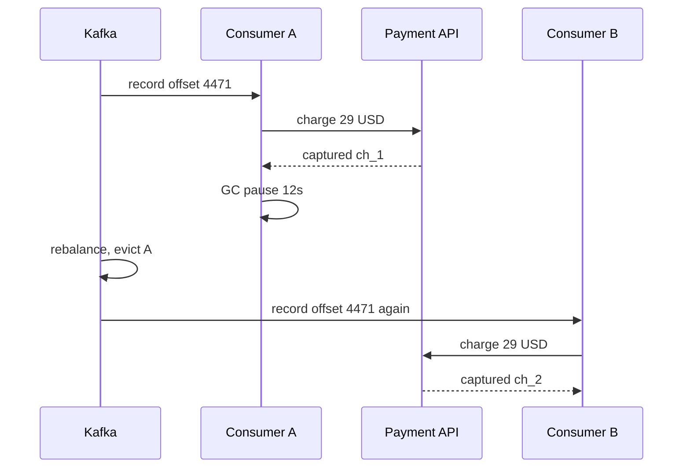
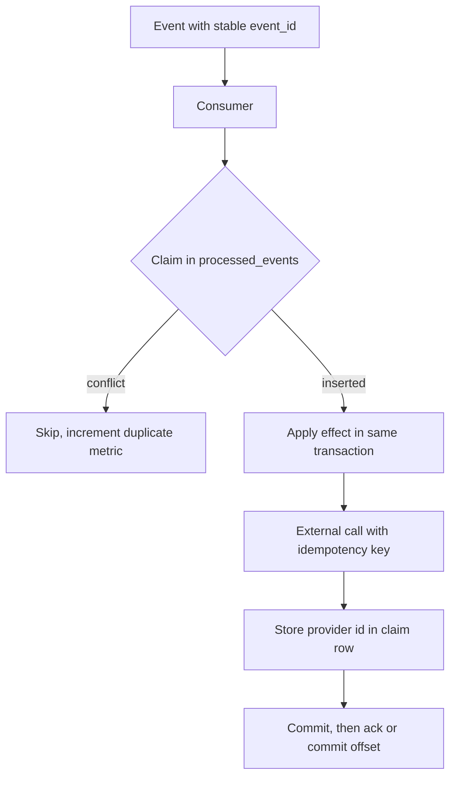

> **Scenario** - একটা Kafka consumer `subscription.renewed` process করে, card charge করে, offset commit করে। ১২ সেকেন্ডের GC pause `max.poll.interval.ms` ছাড়িয়ে যায়, broker member-কে সরিয়ে দেয়, rebalance partition অন্যকে দেয়, নতুন owner শেষ committed offset থেকে replay করে। ৩,৯০০ customer দুবার charge হয়। Broker ঠিক যা প্রতিশ্রুতি দিয়েছিল তাই করেছে; consumer exactly-once ধরে নিয়েছিল।

## Why it matters

- বাস্তবে প্রতিটি মূলধারার broker at-least-once দেয়। Duplicate edge case নয়, ওটাই contract।
- টাকা, inventory বা notification-এ duplicate processing customer-দৃশ্যমান ক্ষতি করে - refund, chargeback ও আস্থার দাম দিতে হয়।
- Duplicate গুচ্ছ আকারে আসে: এক rebalance বা redeploy একসাথে হাজার হাজার message replay করে, তাই blast radius বড় ও আকস্মিক।
- পরে idempotency যোগ করতে গেলে in-flight কাজের dedup state backfill করতে হয়, যা শুরুতেই design করার চেয়ে অনেক কঠিন।
- Dedup ছাড়া topic নিরাপদে replay করা যায় না, ফলে সবচেয়ে ভালো recovery tool-টাই হাতছাড়া হয়।

## Symptoms

| Signal | What you observe |
|---|---|
| Payment provider | আলাদা provider ID, একই amount, একই customer, কয়েক সেকেন্ডের ব্যবধানে একাধিক charge |
| Consumer logs | spike-এর আগে `Attempt to heartbeat failed since group is rebalancing` |
| Row counts | `ledger_entries` `orders`-এর চেয়ে দ্রুত বাড়ছে |
| Email metrics | campaign না বদলেও send volume ২× |
| Offset history | rebalance-এর পর committed offset পিছিয়ে যায় |
| Support tickets | পাঁচ মিনিটের window-এ জড়ো হওয়া "দুবার বিল হয়েছে" |

## How it breaks

At-least-once delivery মানে broker তখনই redeliver করে যখন সে প্রমাণ পায় না consumer কাজ শেষ করেছে। সেই প্রমাণ হলো offset commit (Kafka) বা ack (RabbitMQ), আর সেটা ঘটে কাজের *পরে*। "side effect apply হয়েছে" আর "acknowledgement লেখা হয়েছে"-র মাঝের window-তেই প্রতিটি duplicate জন্মায়। crash, GC pause, rebalance, deploy-এর সময় `SIGTERM`, network timeout - সব ওই window-তে পড়ে।



## Root causes

1. Doc-এ transaction-এর উল্লেখ দেখে broker delivery semantics-কে exactly-once ধরে নেওয়া।
2. স্থায়ী business-level event ID নেই; dedup করা হচ্ছে broker offset-এ, যা replay-এ বদলায়।
3. intent-এর কোনো durable record তৈরির আগেই side effect চালানো।
4. dedup state memory-তে বা এমন cache-এ যার TTL redelivery window-এর চেয়ে ছোট।
5. দীর্ঘ handler `max.poll.interval.ms` ছাড়িয়ে যায়, load-এ rebalance নিশ্চিত করে।
6. dedup check ও side effect আলাদা transaction-এ, ফলে দুই worker-এর মধ্যে race থাকে।

## How to solve it

### 1. Give every event a stable identity at the producer

ID-টা replay টিকতে হবে, তাই সেটা offset, timestamp বা consume-time random value হতে পারে না।

```ts
const eventId = createHash('sha256')
  .update(`${aggregateType}:${aggregateId}:${sequence}`)
  .digest('hex')
```

### 2. Claim the event with a unique constraint

Delivery at-least-once হলেও database exactly-once *effect* নিশ্চিত করে। claim ও কাজ এক transaction-এ করুন।

```sql
CREATE TABLE processed_events (
  event_id     TEXT PRIMARY KEY,
  consumer     TEXT        NOT NULL,
  result       JSONB,
  processed_at TIMESTAMPTZ NOT NULL DEFAULT now()
);
```

```ts
export async function consume(event: DomainEvent): Promise<void> {
  await db.transaction(async (tx) => {
    const claim = await tx.query(
      `INSERT INTO processed_events (event_id, consumer)
       VALUES ($1, $2)
       ON CONFLICT (event_id) DO NOTHING
       RETURNING event_id`,
      [event.id, 'billing-consumer'],
    )
    if (claim.rowCount === 0) {
      metrics.increment('consumer.duplicate_skipped')
      return
    }
    await applyLedgerEntry(tx, event)
  })
}
```

Transaction rollback হলে claim-ও চলে যায়, redelivery ঠিকঠাক কাজ করে। এজন্যই claim-কে effect-এর একই transaction-এ রাখতে হয়, আগে নয়।

### 3. Push idempotency into external calls

Database transaction payment API-কে ঘিরতে পারে না। event ID থেকে বানানো idempotency key পাঠান এবং provider-কে dedup করতে দিন।

```php
$charge = $stripe->paymentIntents->create(
    [
        'amount'   => $event->amountCents,
        'currency' => $event->currency,
        'customer' => $event->customerId,
    ],
    ['idempotency_key' => 'evt_' . $event->id],
);
```

Stripe ২৪ ঘণ্টার মধ্যে একই key-তে মূল PaymentIntent ফেরত দেয়। ফেরত আসা ID-টা event claim করা একই transaction-এ রাখুন, যাতে পরের replay no-op হয়।

### 4. Prefer naturally idempotent operations

কিছু effect-এ dedup table লাগেই না:

- `UPDATE accounts SET status = 'active' WHERE id = ?` - মান বসানো idempotent; increment নয়।
- natural key সহ `INSERT ... ON CONFLICT DO NOTHING`।
- current state দিয়ে পাহারা দেওয়া state machine: `WHERE status = 'pending'`।

`balance = balance + 10`-কে "unique ID সহ ledger entry, তারপর balance পুনর্গণনা" হিসেবে লিখলে সমস্যাটা পাহারা দিতে হয় না, মুছে যায়।

### 5. Size the dedup window deliberately

DLQ replay হলে redelivery কয়েকদিন পরেও হতে পারে। ১ ঘণ্টার Redis TTL dedup store নয়, cache। `processed_events` অন্তত আপনার সর্বোচ্চ replay horizon (সাধারণত topic retention, ৭ দিন) পর্যন্ত রাখুন এবং partitioned delete দিয়ে prune করুন।

### 6. Keep handlers short

`max.poll.records` এমন রাখুন যাতে batch `max.poll.interval.ms`-এর ভালো ভিতরেই শেষ হয়। দীর্ঘ handler rebalance ঘটায়, আর rebalance-ই সেই duplicate বানায় যার বিরুদ্ধে আপনি লড়ছেন।

## Target design



## Tradeoffs

| Option | Pros | Cons | Choose when |
|---|---|---|---|
| Dedup table with unique key | নির্ভুল, auditable, restart টেকে | প্রতি message-এ একটা বাড়তি write | টাকা, inventory, অপরিবর্তনীয় সবকিছু |
| Redis SETNX with TTL | দ্রুত, DB load নেই | eviction/failover-এ হারায়, TTL-সীমিত | উচ্চ volume, কম মূল্যের event |
| Naturally idempotent writes | dedup state লাগেই না | operation নতুন করে লিখতে হয় | set-ধাঁচের state update |
| Provider idempotency keys | আসল boundary-তেই dedup | provider-ভেদে window ও semantics আলাদা | payment, mailer, SMS gateway |
| Kafka transactions | atomic read-process-write | শুধু Kafka-র ভিতরে, external call নয় | stream-to-stream processing |

## Verification checklist

- [ ] topic-এর শেষ ১০,০০০ message staging-এ replay করে দেখুন নতুন কোনো side effect হয় না।
- [ ] external call-এর ঠিক পরেই consumer `SIGKILL` করুন এবং নিশ্চিত করুন restart ওই call পুনরাবৃত্তি করে না।
- [ ] `processed_events.event_id`-তে সত্যিকারের unique index আছে এবং insert `SELECT` তারপর `INSERT` নয়, `ON CONFLICT DO NOTHING` ব্যবহার করে কিনা দেখুন।
- [ ] dedup retention topic retention-এর চেয়ে বেশি কিনা যাচাই করুন।
- [ ] `consumer.duplicate_skipped` track করুন; production-এ এটা শূন্যের বেশি হওয়া উচিত। শূন্য মানে dedup যুক্তই হয়নি।
- [ ] load-এ rebalance ঘটিয়ে payment provider dashboard-এ duplicate charge খুঁজুন।

## Anti-patterns

- dedup check-এ `SELECT` তারপর `INSERT`, যা ভিন্ন partition-এর দুই worker-এর মধ্যে race করে।
- payload-এর hash-এ dedup করা, যখন payload-এ timestamp বা producer-generated UUID আছে।
- dedup key শুধু memory-তে রাখা, ফলে প্রতিটি deploy প্রতিরক্ষা রিসেট করে।
- "duplicate এড়াতে" কাজের আগেই offset commit করা - এতে duplicate নীরব data loss-এ বদলায়।
- producer-এ Kafka-র `enable.idempotence` থাকলে consumer idempotent হয়ে যায় ভাবা; হয় না।
- ৫ মিনিটের dedup TTL রাখা, যখন DLQ replay এক সপ্তাহ পরেও হতে পারে।

## Related

- [The exactly-once delivery illusion](/systems/messaging-async/exactly-once-delivery-illusion)
- [At-least-once delivery meets real side effects](/systems/messaging-async/at-least-once-side-effects)
- [Implementing the transactional outbox](/systems/messaging-async/outbox-pattern-implementation)
