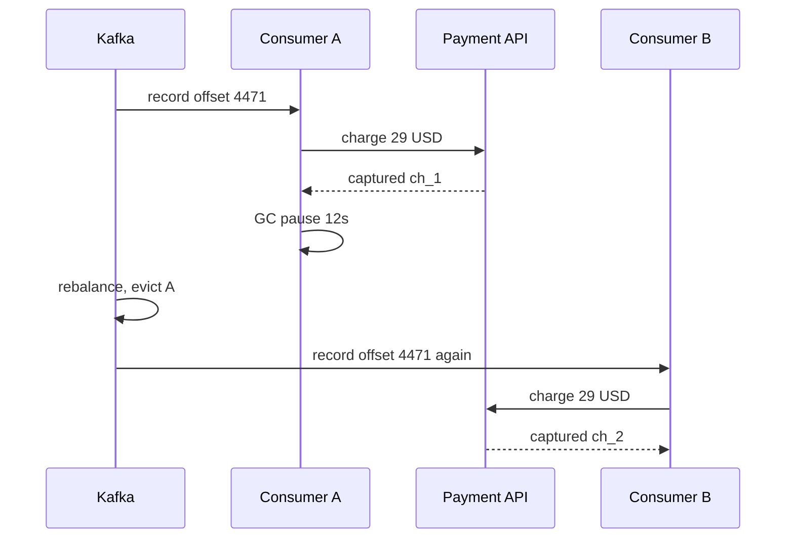
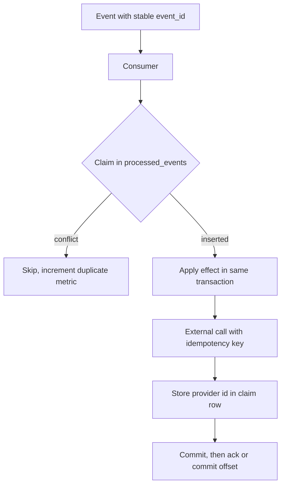

> **Scenario** - A Kafka consumer processes `subscription.renewed`, charges the card, and commits the offset. A 12-second GC pause exceeds `max.poll.interval.ms`, the broker evicts the member, a rebalance assigns the partition elsewhere, and the new owner replays from the last committed offset. 3,900 customers are charged twice. The broker did exactly what it promised; the consumer assumed exactly-once.

## Why it matters

- Every mainstream broker delivers at-least-once in practice. Duplicates are not an edge case, they are the contract.
- Duplicate processing on money, inventory, or notifications produces customer-visible harm that costs refunds, chargebacks, and trust.
- Duplicates cluster: a rebalance or redeploy replays thousands of messages at once, so the blast radius is large and sudden.
- Idempotency written after the fact requires backfilling dedup state for in-flight work, which is far harder than designing it in.
- Without dedup you cannot safely replay a topic, which removes your best recovery tool.

## Symptoms

| Signal | What you observe |
|---|---|
| Payment provider | Multiple charges with distinct provider IDs, same amount, same customer, seconds apart |
| Consumer logs | `Attempt to heartbeat failed since group is rebalancing` before the spike |
| Row counts | `ledger_entries` grows faster than `orders` |
| Email metrics | Send volume spikes 2× with no campaign change |
| Offset history | Committed offset moves backwards after a rebalance |
| Support tickets | "I was billed twice" clustered inside a five-minute window |

## How it breaks

At-least-once delivery means the broker redelivers whenever it cannot prove the consumer finished. That proof is the offset commit (Kafka) or the ack (RabbitMQ), and it happens *after* the work. The window between "side effect applied" and "acknowledgement recorded" is where every duplicate is born. Crashes, GC pauses, rebalances, `SIGTERM` during deploy, and network timeouts all land in that window.



## Root causes

1. Treating broker delivery semantics as exactly-once because the docs mention transactions.
2. No stable business-level event ID; dedup attempted on broker offsets, which change on replay.
3. Side effects performed before any durable record of intent exists.
4. Dedup state stored in memory or in a cache with a TTL shorter than the redelivery window.
5. Long-running handlers exceeding `max.poll.interval.ms`, guaranteeing rebalances under load.
6. Dedup check and side effect in separate transactions, leaving a race between two workers.

## How to solve it

### 1. Give every event a stable identity at the producer

The ID must survive replay, so it cannot be an offset, a timestamp, or a random value generated at consume time.

```ts
const eventId = createHash('sha256')
  .update(`${aggregateType}:${aggregateId}:${sequence}`)
  .digest('hex')
```

### 2. Claim the event with a unique constraint

The database enforces exactly-once *effect* even though delivery is at-least-once. Do the claim and the work in one transaction.

```sql
CREATE TABLE processed_events (
  event_id     TEXT PRIMARY KEY,
  consumer     TEXT        NOT NULL,
  result       JSONB,
  processed_at TIMESTAMPTZ NOT NULL DEFAULT now()
);
```

```ts
export async function consume(event: DomainEvent): Promise<void> {
  await db.transaction(async (tx) => {
    const claim = await tx.query(
      `INSERT INTO processed_events (event_id, consumer)
       VALUES ($1, $2)
       ON CONFLICT (event_id) DO NOTHING
       RETURNING event_id`,
      [event.id, 'billing-consumer'],
    )
    if (claim.rowCount === 0) {
      metrics.increment('consumer.duplicate_skipped')
      return
    }
    await applyLedgerEntry(tx, event)
  })
}
```

If the transaction rolls back, the claim disappears with it and redelivery works correctly. This is why the claim must be in the same transaction as the effect, not before it.

### 3. Push idempotency into external calls

The database transaction cannot cover a payment API. Send an idempotency key derived from the event ID and let the provider dedup.

```php
$charge = $stripe->paymentIntents->create(
    [
        'amount'   => $event->amountCents,
        'currency' => $event->currency,
        'customer' => $event->customerId,
    ],
    ['idempotency_key' => 'evt_' . $event->id],
);
```

Stripe returns the original PaymentIntent for a repeated key within 24 hours. Record the returned ID in the same transaction that claims the event so a later replay is a no-op.

### 4. Prefer naturally idempotent operations

Some effects need no dedup table at all:

- `UPDATE accounts SET status = 'active' WHERE id = ?` - setting a value is idempotent; incrementing is not.
- `INSERT ... ON CONFLICT DO NOTHING` with a natural key.
- State machines guarded by the current state: `WHERE status = 'pending'`.

Rewriting `balance = balance + 10` as "apply ledger entry with unique ID, then recompute balance" removes the problem instead of guarding it.

### 5. Size the dedup window deliberately

Redelivery can happen days later if a DLQ is replayed. A 1-hour Redis TTL is not a dedup store, it is a cache. Keep `processed_events` for at least as long as your maximum replay horizon (commonly the topic retention, 7 days) and prune with a partitioned delete.

### 6. Keep handlers short

Set `max.poll.records` low enough that a batch finishes well inside `max.poll.interval.ms`. Long handlers cause rebalances, and rebalances cause the duplicates you are defending against.

## Target design



## Tradeoffs

| Option | Pros | Cons | Choose when |
|---|---|---|---|
| Dedup table with unique key | Exact, auditable, survives restarts | One extra write per message | Money, inventory, anything irreversible |
| Redis SETNX with TTL | Fast, no DB load | Lost on eviction or failover, TTL-bounded | High-volume, low-value events |
| Naturally idempotent writes | No dedup state at all | Requires rewriting the operation | Set-style state updates |
| Provider idempotency keys | Dedup at the true boundary | Provider-specific windows and semantics | Payments, mailers, SMS gateways |
| Kafka transactions | Atomic read-process-write | Only within Kafka, not for external calls | Stream-to-stream processing |

## Verification checklist

- [ ] Replay the last 10,000 messages of a topic into staging and assert zero new side effects.
- [ ] Kill a consumer with `SIGKILL` immediately after an external call and confirm the restart does not repeat the call.
- [ ] Confirm `processed_events.event_id` has a real unique index, and that inserts use `ON CONFLICT DO NOTHING` rather than a `SELECT` then `INSERT`.
- [ ] Verify the dedup retention exceeds the topic retention.
- [ ] Track `consumer.duplicate_skipped`; it should be nonzero in production. Zero means dedup is not wired up.
- [ ] Force a rebalance under load and check the payment provider dashboard for duplicate charges.

## Anti-patterns

- `SELECT` then `INSERT` for the dedup check, which races between two workers on different partitions.
- Deduping on a hash of the payload when the payload contains a timestamp or a producer-generated UUID.
- Storing dedup keys only in memory, so every deploy resets the defence.
- Committing the offset before doing the work to "avoid duplicates" - this converts duplicates into silent loss.
- Assuming Kafka's `enable.idempotence` on the producer makes the consumer idempotent; it does not.
- Using a 5-minute dedup TTL when DLQ replay can happen a week later.

## Related

- [The exactly-once delivery illusion](/systems/messaging-async/exactly-once-delivery-illusion)
- [At-least-once delivery meets real side effects](/systems/messaging-async/at-least-once-side-effects)
- [Implementing the transactional outbox](/systems/messaging-async/outbox-pattern-implementation)
