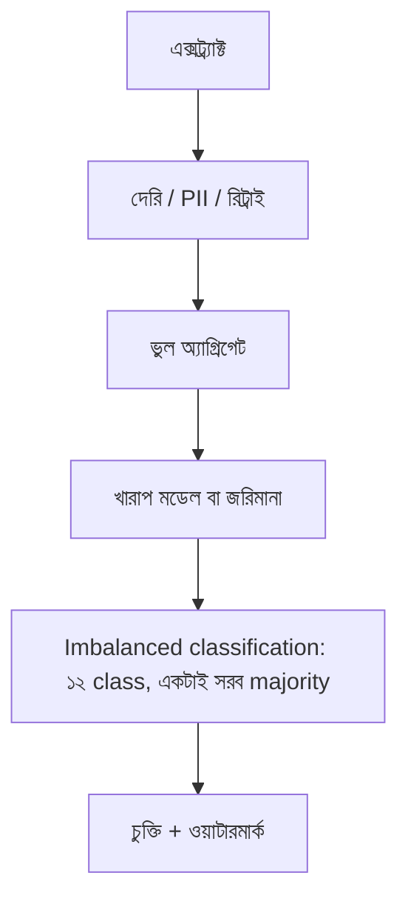

> **পাঠ 177 · উন্নত ধাপ** - ২৭k sample-এর multi-class text set-এ class weight, focal loss, resampling ও threshold tuning - যেখানে accuracy ৩০ point মিথ্যা বলে।

## কেন এটা জরুরি

- ট্রেনিং-সার্ভিং স্কিউ মানে মডেল প্রোডাকশনের নাল কখনও দেখেনি।
- পাইপলাইন লগে PII ডিবাগ লাইনের ছদ্মবেশে কমপ্লায়েন্স ইনসিডেন্ট।
- আইডেমপোটেন্ট নয় এমন অর্কেস্ট্রেটর রিট্রাই গুদামের বিল দ্বিগুণ করে।
- এই পাঠটা ঠিক **Imbalanced classification: ১২ class, একটাই সরব majority** নিয়ে। ট্যাগ: classification, imbalance, focal-loss, f1, pytorch।

## কী দেখে বুঝবেন সমস্যা আছে

| সংকেত | যা দেখা যায় |
| --- | --- |
| স্কিউ | অফলাইন F1 ০.৮১, অনলাইন ০.৫৪ |
| দেরি ডেটা | গতকালের ইভেন্ট আজকের অ্যাগ্রিগেট বন্ধের পর আসে |
| PII ফাঁস | ডিবাগ parquet-এ ইমেইল |
| রিট্রাই বিল | একই পার্টিশন দুবার স্ক্যান |

## কীভাবে ভাঙে



ভাঙে প্রযুক্তির নামে নয়, চুক্তির অভাবে। Vue/Quasar স্ক্রিন আর Laravel রাইট যদি উল্টো উত্তর ধরে, প্রোডাকশন সেই রেসটা খুঁজে বের করে। এই টপিকের চুক্তিটা হলো: ২৭k sample-এর multi-class text set-এ class weight, focal loss, resampling ও threshold tuning - যেখানে accuracy ৩০ point মিথ্যা বলে।

## মূল কারণ

1. ফিচার কোড ট্রেন আর সার্ভে কপি, শেয়ার নয়।
2. জবে ওয়াটারমার্ক / অ্যালাউড লেটনেস নেই।
3. লগে র raw রিকোয়েস্ট বডি।
4. রিট্রাই পলিসি গন্তব্যের ইউনিকনেস মানেনি।

## কীভাবে সমাধান করবেন

### ১. ইনভেরিয়েন্ট এক বাক্যে লিখুন

২৭k sample-এর multi-class text set-এ class weight, focal loss, resampling ও threshold tuning - যেখানে accuracy ৩০ point মিথ্যা বলে। এই বাক্য পিআর, Pinia অ্যাকশন, আর Laravel ক্লাসে রাখুন।

### ২. কোডে কিনারা আটকে দিন

```ts
// Admin: show pipeline run id so support can trace a bad batch
export async function pipelineStatus(runId: string) {
  return api.get(`/api/pipelines/${runId}`)
}
```

```php
ProcessPipelineJob::dispatch($runId)->onQueue('pipelines');
```

### ৩. যে চার্ট সত্যি দেখবেন, সেটাই রাখুন

ফ্রেশনেস, ডুপ্লিকেট পার্টিশন রাইট, আর PII স্ক্যান। **Imbalanced classification: ১২ class, একটাই সরব majority**-এর রিগ্রেশন এই চার্টে না ধরা পড়লে পাঠ শেষ হয়নি।

## কাজের উদাহরণ

রাতের জব লোকাল `created_at` ধরেছে। DST-এ দুই “দিন” ওভারল্যাপ, একদিন উধাও। UTC আর ওয়াটারমার্ক Quasar অপস চার্টের ফাঁক বন্ধ করে।

এই টপিকে নিজের শেষ ইনসিডেন্টের লক্ষণ টেবিলে মিলিয়ে নিন, তারপর ডায়াগ্রাম ধরে এগোন যতক্ষণ না উপরের গার্ড আগুন ধরত।

## শিপ করার আগে

- [ ] **Imbalanced classification: ১২ class, একটাই সরব majority**-এর ইনভেরিয়েন্ট এক বাক্যে লেখা।
- [ ] খালি, ডুপ্লিকেট, টাইমআউট বা পারমিশন পাথের টেস্ট বা রিহার্সাল আছে।
- [ ] এক ডিপ্লয়ের মধ্যে রিগ্রেশন ধরার লগ বা চার্ট আছে।
- [ ] আত্মীয় পাঠ এখনও মিলছে: model-versioning-and-rollback, data-quality-contracts, training-serving-skew।

## যা করবেন না

- অনন্ত রিট্রাই বা এররকে সাকসেস হিসেবে ক্যাশ করা ব্লগ স্নিপেট কপি করবেন না।
- Laravel সারির সত্য Pinia-কে বলে দেবেন না।
- ঘন মনে হলে আগের নম্বরের পাঠ আগে শেষ করুন। পথটা ইচ্ছা করেই শুরু → মাঝারি → উন্নত।
