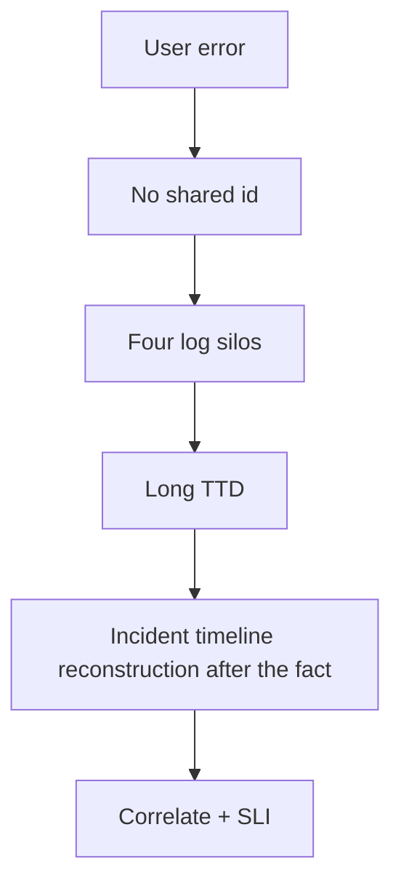

> **Lesson 72 · intermediate** - Post-incident review stalls because deploy markers, alert timestamps, and log clocks disagree by minutes - annotate events, normalise to UTC, and keep raw evidence.

## Why it matters

- If the dashboard cannot answer “is create-ticket broken for tenant X?”, it is art, not operations.
- Correlation ids that die at the Vue boundary make Laravel logs a different universe.
- Averages and red/green uptime hide burn of the error budget.
- This lesson is specifically about **Incident timeline reconstruction after the fact**. Tags: postmortem, timeline, annotations, clock-skew, forensics.

## Symptoms

| Signal | What you observe |
| --- | --- |
| Blind page | Pager fires, nobody has the request id |
| Cardinality | Grafana series explode on user_id labels |
| False calm | Uptime 99.9% while p99 create is 8s |
| Split brain logs | Browser console and FPM logs cannot be joined |

## How it breaks



The named technology is rarely the villain. Two code paths (often a Vue/Quasar screen and a Laravel write) assume opposite contracts. Production finds the race. For this topic that contract is: Post-incident review stalls because deploy markers, alert timestamps, and log clocks disagree by minutes - annotate events, normalise to UTC, and keep raw evidence.

## Root causes

1. No `X-Request-Id` from Quasar boot into Axios into Laravel log context.
2. High-cardinality labels on every metric.
3. SLI defined as “process up” instead of “ticket created < 2s”.
4. Dashboards copied from a template and never asked a question.

## How to solve it

### 1. Write the invariant in one sentence

Post-incident review stalls because deploy markers, alert timestamps, and log clocks disagree by minutes - annotate events, normalise to UTC, and keep raw evidence. Put that sentence in the PR, the Pinia action, and the Laravel class.

### 2. Guard the edge in code

```ts
api.interceptors.request.use((config) => {
  config.headers['X-Request-Id'] = crypto.randomUUID()
  return config
})
```

```php
Log::withContext(['request_id' => $request->header('X-Request-Id')]);
```

### 3. Keep a chart you will actually look at

SLI burn, request-id join success, and alert pages that map to an owner. If the chart cannot catch a regression in **Incident timeline reconstruction after the fact**, the lesson is not done.

## Worked example

An incident war-room grepped four log files for “timeout”. Adding a request id from the Quasar boot file made the same search a single Grafana trace in the next outage.

On this topic, start from the symptom in the table that matches your last incident, then walk the diagram until the guard above would have fired.

## Check before you ship

- [ ] The invariant for **Incident timeline reconstruction after the fact** is written in one sentence.
- [ ] Empty, duplicate, timeout, or permission paths have a test or a staged rehearsal.
- [ ] A dashboard or log query would catch a regression within one deploy.
- [ ] Related reading still makes sense: correlation-ids-across-services, structured-logging-standards, distributed-tracing-adoption.

## What not to do

- Copy a blog snippet that retries forever or caches the error as success.
- Treat Pinia as the source of truth for a Laravel row.
- Skip the previous numbered lesson if this one feels dense — the path is beginner → intermediate → advanced on purpose.
