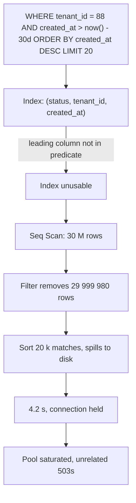
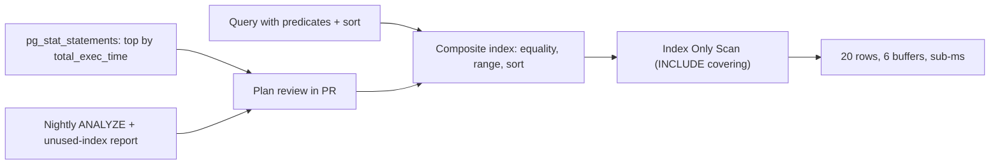

> **Scenario** — একটি order search endpoint ২ লাখ row-এ ঠিক ছিল, ৩ কোটি row-এ ৪.২ সেকেন্ড নেয়। `EXPLAIN ANALYZE` দেখায় ৩ কোটি row sequential scan করে filter করে ২০টি row ফেরত দিচ্ছে — কারণ একমাত্র index শুরু হয় `status` দিয়ে, যার distinct মান চারটি, অথচ query filter করে `tenant_id`-তে আর sort করে `created_at`-এ।

## কেন গুরুত্বপূর্ণ

- Index-এর গুণ ঠিক করে query ৪০ row ছোঁবে না ৪ কোটি; ১০০০× read amplification stack-এর আর কিছুই পুষিয়ে দিতে পারে না।
- Missing index connection বেশিক্ষণ ধরে রাখে, তাই এক slow query pattern pool খালি করে সম্পর্কহীন endpoint-ও নামিয়ে দেয়।
- Redundant index free নয়: প্রতিটি বাড়তি index `INSERT`/`UPDATE` ধীর করে, buffer pool ফোলায়, backup ও migration লম্বা করে।
- Plan পাল্টে যায়। বছরভর index ব্যবহার করা query statistics drift বা data growth cost threshold ছাড়ালে sequential scan-এ চলে যেতে পারে।
- এটি সবচেয়ে সস্তা সমাধান — সাধারণত একটি DDL, কোনো architecture পরিবর্তন নয়।

## লক্ষণ

| Signal | যা দেখবেন |
| --- | --- |
| `EXPLAIN ANALYZE` | `Seq Scan on orders (rows=30012480) ... Filter: ... Rows Removed by Filter: 30012460` |
| Postgres `pg_stat_user_tables` | বড় table-এ `seq_scan` বাড়ছে, `idx_scan` সমান |
| MySQL slow log | `Rows_examined: 30012480  Rows_sent: 20` |
| Plan detail | `Sort Method: external merge  Disk: 412 MB` |
| Estimate vs actual | Estimate `rows=1200`, `actual rows=980000` |
| Write latency | কেউ ১১তম index যোগ করার পর `INSERT` p99 বেড়ে যাওয়া |

## কীভাবে ভাঙে

B-tree index কেবল তার leading column থেকে ব্যবহারযোগ্য। `(status, tenant_id, created_at)`-এর index `WHERE tenant_id = ?`-কে দক্ষভাবে serve করতে পারে না, কারণ planner-কে প্রতিটি `status` মান scan করতে হবে। তাই কোন column আছে তার চেয়ে *column order* বেশি গুরুত্বপূর্ণ।

এরপর দুটি গৌণ ব্যর্থতা আসে। প্রথমত, কম selectivity-র leading column (`status`, `is_active`, `deleted_at`) মানে index scan-ও লক্ষ লক্ষ row ছোঁবে, তাই planner যুক্তিসঙ্গতভাবেই sequential scan বাছে। দ্বিতীয়ত, sort column যদি index-এর শেষ column না হয়, database পুরো result set materialise করে sort করতে বাধ্য — `work_mem` ছাড়ালে যা disk-এ spill করে।

Column-কে function-এ মুড়ে দিলে (`WHERE lower(email) = ?`, `WHERE DATE(created_at) = ?`) index সম্পূর্ণ অচল হয়, যদি মিলে যাওয়া expression index না থাকে।



## মূল কারণ

1. Leading index column query-র equality predicate দেখে নয়, intuition-এ বাছা।
2. কম selectivity-র leading column — boolean-এ index প্রায় কখনও সাহায্য করে না।
3. Sort column index-এ নেই, ফলে বড় intermediate result-এ explicit sort।
4. Indexed column-এ function বা implicit cast (`varchar` column-এর সাথে integer parameter তুলনা)।
5. Bulk load-এর পর stale statistics, তাই planner-এর row estimate কয়েক ক্রম ভুল।
6. Index sprawl: বিভিন্ন লোকের যোগ করা overlapping index, কোনোটাই drop হয়নি।
7. `OR` condition ও leading wildcard (`LIKE '%term'`) যা কোনো B-tree serve করতে পারে না।

## কীভাবে সমাধান করবেন

### ১. আসল parameter দিয়ে আসল plan পড়ুন

```sql
EXPLAIN (ANALYZE, BUFFERS, VERBOSE)
SELECT id, total_cents, created_at
FROM orders
WHERE tenant_id = 88
  AND created_at >= now() - interval '30 days'
ORDER BY created_at DESC
LIMIT 20;
```

আগে — যে আকার আপনি চান না:

```
Limit  (cost=1284410.42..1284410.47 rows=20 width=24) (actual time=4188.902..4188.911 rows=20 loops=1)
  ->  Sort  (cost=1284410.42..1284460.11 rows=19876 width=24) (actual time=4188.900..4188.905 rows=20 loops=1)
        Sort Key: created_at DESC
        Sort Method: top-N heapsort  Memory: 27kB
        ->  Seq Scan on orders  (cost=0.00..1283880.00 rows=19876 width=24)
              (actual time=0.031..4180.113 rows=19204 loops=1)
              Filter: ((tenant_id = 88) AND (created_at >= (now() - '30 days'::interval)))
              Rows Removed by Filter: 29993276
              Buffers: shared hit=1204 read=728341
Execution Time: 4188.964 ms
```

যে দুটি সংখ্যা গোনার: `Rows Removed by Filter` (অপচয়) এবং `read=728341` (disk থেকে আনা block)।

### ২. column order: equality, তারপর range, তারপর sort

যে নিয়ম বেশিরভাগ কেস মেটায়:

1. `=` দিয়ে তুলনা করা column আগে, সবচেয়ে selective আগে।
2. তারপর range/inequality column।
3. তারপর শুধু `ORDER BY`-র জন্য দরকারি column।
4. তারপর index covering করতে `INCLUDE` column।

```sql
CREATE INDEX CONCURRENTLY idx_orders_tenant_created
  ON orders (tenant_id, created_at DESC)
  INCLUDE (total_cents);
```

পরে:

```
Limit  (cost=0.56..8.71 rows=20 width=24) (actual time=0.038..0.061 rows=20 loops=1)
  ->  Index Only Scan using idx_orders_tenant_created on orders
        (cost=0.56..8100.12 rows=19876 width=24) (actual time=0.036..0.056 rows=20 loops=1)
        Index Cond: ((tenant_id = 88) AND (created_at >= (now() - '30 days'::interval)))
        Heap Fetches: 0
        Buffers: shared hit=6
Execution Time: 0.092 ms
```

`Heap Fetches: 0` সহ `Index Only Scan` মানে index-ই query-র উত্তর দিয়েছে, table ছোঁয়নি — এটাই `INCLUDE`-এর লাভ। MySQL-এ `INCLUDE` নেই; column-টি key-তে যোগ করুন: `(tenant_id, created_at, total_cents)`।

### ৩. skewed predicate-এ partial index

যদি ৯৮% row `state = 'archived'` হয় আর সব query বাকি ২% চায়:

```sql
CREATE INDEX CONCURRENTLY idx_orders_open_by_tenant
  ON orders (tenant_id, created_at DESC)
  WHERE state IN ('pending', 'processing');
```

Index আকারে ভগ্নাংশ, cache-এ থাকে, আর কেবল মিলে যাওয়া row-এর জন্য maintain হয়। MySQL-এ partial index নেই; সাধারণ workaround হলো generated column + তার উপর index।

### ৪. expression হুবহু মেলান, নাহলে expression index করুন

```sql
-- (email)-এর index এটা ব্যবহার করতে পারে না
SELECT * FROM users WHERE lower(email) = 'a@b.com';

-- হয় write-এ normalise করুন, নয় expression index:
CREATE INDEX CONCURRENTLY idx_users_email_lower ON users (lower(email));

-- Date truncation: range হিসেবে লিখলে সাধারণ index-ই চলে
-- খারাপ:  WHERE DATE(created_at) = '2026-08-01'
-- ভালো:   WHERE created_at >= '2026-08-01' AND created_at < '2026-08-02'
```

### ৫. আরও যোগ করার আগে unused ও redundant index খুঁজুন

```sql
-- PostgreSQL: কখনও scan না হওয়া index, বড় আগে
SELECT s.relname AS table_name, s.indexrelname AS index_name,
       pg_size_pretty(pg_relation_size(s.indexrelid)) AS size, s.idx_scan
FROM pg_stat_user_indexes s
JOIN pg_index i ON i.indexrelid = s.indexrelid
WHERE s.idx_scan = 0 AND NOT i.indisunique
ORDER BY pg_relation_size(s.indexrelid) DESC;
```

`(a, b)` থাকলে `(a)`-এর index redundant। Prefix drop করুন, composite রাখুন।

### ৬. statistics সৎ রাখুন

```sql
-- Bulk load-এর পর, কোনো plan বিশ্বাস করার আগে
ANALYZE orders;

-- Planner যে skewed column বারবার ভুল বোঝে তার sample বাড়ান
ALTER TABLE orders ALTER COLUMN tenant_id SET STATISTICS 1000;
ANALYZE orders;

-- Correlated predicate: planner-কে শেখান tenant ও region একসাথে বদলায়
CREATE STATISTICS orders_tenant_region (dependencies)
  ON tenant_id, region FROM orders;
```

MySQL-এ সমতুল্য: `ANALYZE TABLE orders;` এবং histogram — `ANALYZE TABLE orders UPDATE HISTOGRAM ON tenant_id WITH 32 BUCKETS;`।

## Target design



## Tradeoff

| Option | সুবিধা | খরচ | কখন বাছবেন |
| --- | --- | --- | --- |
| Composite index | এক structure-এ filter + sort | Order-নির্দিষ্ট; write cost | পরিচিত, স্থির query shape |
| Covering (`INCLUDE`) | Index-only scan, heap fetch নেই | বড় index, বেশি write amplification | Read-heavy hot endpoint |
| Partial index | ছোট, cache-এ থাকে | শুধু নিজের `WHERE`-এ মেলে; শুধু Postgres | তীব্র skewed status column |
| Expression index | `lower()`/JSON access ঠিক করে | Expression হুবহু মিলতে হবে | Legacy query যা বদলানো যায় না |
| Query rewrite | Write-path-এ কোনো খরচ নেই | App পরিবর্তন দরকার | Function-মোড়া বা `OR`-ভারী predicate |
| BRIN / block-range | Append-only data-তে খুব ছোট | শুধু correlated column, স্থূল | বিশাল, ordered time-series table |

## যাচাই checklist

- [ ] Production-সদৃশ data volume-এ আগে ও পরে `EXPLAIN (ANALYZE, BUFFERS)` নেওয়া।
- [ ] `Rows Removed by Filter` এখন ফেরত দেওয়া row-এর ছোট গুণিতক, হাজার গুণ নয়।
- [ ] Hot path-এর plan-এ `Sort Method: external merge` নেই।
- [ ] Index `CONCURRENTLY` (Postgres) বা `ALGORITHM=INPLACE, LOCK=NONE` (MySQL) দিয়ে তৈরি।
- [ ] Deploy-এর পর `pg_stat_statements`-এ ওই query-র `total_exec_time` কমেছে।
- [ ] Index যোগের পর শুধু read নয়, write latency (`INSERT` p99)-ও দেখা হয়েছে।
- [ ] Unused-index report পর্যালোচনা; নতুনটি যেসব prefix index অপ্রয়োজনীয় করে সেগুলো drop করা।
- [ ] পরের bulk import-এর পর `ANALYZE` চালিয়ে plan আবার যাচাই করা।

## Anti-pattern

- প্রতিটি `WHERE` column-এ একটি single-column index দিয়ে planner সেগুলো মিলিয়ে নেবে বলে আশা করা।
- Boolean বা চার-মানের `status`-কে leading column হিসেবে index করা।
- চওড়া table-এ `SELECT *`, যা index-only scan অসম্ভব করে।
- `ANALYZE` ছাড়া `EXPLAIN` চালিয়ে estimate বিশ্বাস করা।
- ১০ হাজার row-এর development database-এ পরীক্ষা করা।
- Slow query-র প্রথম প্রতিক্রিয়া হিসেবে `OPTIMIZE TABLE` / `REINDEX`।
- Statistics stale কিনা না দেখেই hint দিয়ে plan force করা।
- Write-heavy table-এ ১৪টি index রেখে দেওয়া, কারণ কেউ drop করার দায় নিতে চায় না।

## সম্পর্কিত

- [ORM-এ N+1 query দূর করা](/systems/data-storage/n-plus-one-query-elimination)
- [Zero-downtime schema migration](/systems/data-storage/zero-downtime-schema-migrations)
- [বিশাল table archive ও prune](/systems/data-storage/large-table-archival-strategy)
- [Connection pool শেষ হয়ে যাওয়া](/systems/data-storage/connection-pool-exhaustion)
