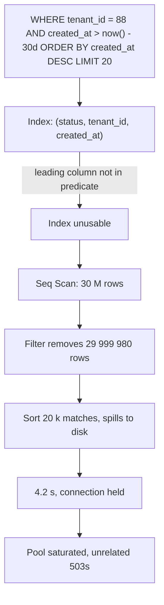
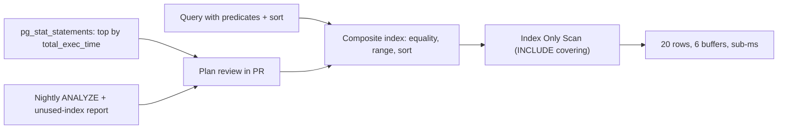

> **Scenario** - An order search endpoint was fine at 200 k rows and takes 4.2 s at 30 M. `EXPLAIN ANALYZE` shows a sequential scan filtering 30 M rows to return 20 - because the only index starts with `status`, which has four distinct values, and the query filters on `tenant_id` and sorts by `created_at`.

## Why it matters

- Index quality is the difference between a query touching 40 rows and 40 million; nothing else in the stack recovers a 1000× read amplification.
- Missing indexes hold connections longer, so one slow query pattern drains the pool and takes down unrelated endpoints.
- Redundant indexes are not free: every extra index slows `INSERT`/`UPDATE`, inflates the buffer pool, and lengthens backups and migrations.
- Plans flip. A query that used an index for a year can switch to a sequential scan after statistics drift or data growth crosses a cost threshold.
- It is the cheapest fix available - usually one DDL statement, no architecture change.

## Symptoms

| Signal | What you observe |
| --- | --- |
| `EXPLAIN ANALYZE` | `Seq Scan on orders (rows=30012480) ... Filter: ... Rows Removed by Filter: 30012460` |
| Postgres `pg_stat_user_tables` | `seq_scan` climbing on a large table, `idx_scan` flat |
| MySQL slow log | `Rows_examined: 30012480  Rows_sent: 20` |
| Plan detail | `Sort Method: external merge  Disk: 412 MB` |
| Estimate vs actual | `rows=1200` estimated, `actual rows=980000` |
| Write latency | `INSERT` p99 rising after someone added the 11th index |

## How it breaks

A B-tree index is only usable from its leading column onward. An index on `(status, tenant_id, created_at)` cannot efficiently serve `WHERE tenant_id = ?` because the planner would have to scan every `status` value. This is why *column order* matters more than which columns are present.

Two secondary failures follow. First, a low-selectivity leading column (`status`, `is_active`, `deleted_at`) means an index scan still visits millions of rows, so the planner reasonably chooses a sequential scan instead. Second, when the sort column is not the trailing index column, the database must materialise and sort the whole result set - which spills to disk once it exceeds `work_mem`.

Wrapping a column in a function (`WHERE lower(email) = ?`, `WHERE DATE(created_at) = ?`) disables the index entirely unless a matching expression index exists.



## Root causes

1. Leading index column chosen by intuition instead of by the query's equality predicates.
2. Low-selectivity leading columns - an index on a boolean rarely helps.
3. Sort column absent from the index, forcing an explicit sort of a large intermediate result.
4. Functions or implicit casts on the indexed column (`varchar` column compared to an integer parameter).
5. Stale statistics after a bulk load, so the planner's row estimates are orders of magnitude off.
6. Index sprawl: overlapping indexes added by different people, none dropped.
7. `OR` conditions and leading wildcards (`LIKE '%term'`) that no B-tree can serve.

## How to solve it

### 1. Read the real plan, with real parameters

```sql
EXPLAIN (ANALYZE, BUFFERS, VERBOSE)
SELECT id, total_cents, created_at
FROM orders
WHERE tenant_id = 88
  AND created_at >= now() - interval '30 days'
ORDER BY created_at DESC
LIMIT 20;
```

Before, the shape you do not want:

```
Limit  (cost=1284410.42..1284410.47 rows=20 width=24) (actual time=4188.902..4188.911 rows=20 loops=1)
  ->  Sort  (cost=1284410.42..1284460.11 rows=19876 width=24) (actual time=4188.900..4188.905 rows=20 loops=1)
        Sort Key: created_at DESC
        Sort Method: top-N heapsort  Memory: 27kB
        ->  Seq Scan on orders  (cost=0.00..1283880.00 rows=19876 width=24)
              (actual time=0.031..4180.113 rows=19204 loops=1)
              Filter: ((tenant_id = 88) AND (created_at >= (now() - '30 days'::interval)))
              Rows Removed by Filter: 29993276
              Buffers: shared hit=1204 read=728341
Execution Time: 4188.964 ms
```

The two numbers that matter: `Rows Removed by Filter` (wasted work) and `read=728341` (blocks pulled from disk).

### 2. Order columns: equality, then range, then sort

The rule of thumb that resolves most cases:

1. Columns compared with `=` first, most selective first.
2. Then the range/inequality column.
3. Then columns needed only for `ORDER BY`.
4. Then `INCLUDE`d columns to make the index covering.

```sql
CREATE INDEX CONCURRENTLY idx_orders_tenant_created
  ON orders (tenant_id, created_at DESC)
  INCLUDE (total_cents);
```

After:

```
Limit  (cost=0.56..8.71 rows=20 width=24) (actual time=0.038..0.061 rows=20 loops=1)
  ->  Index Only Scan using idx_orders_tenant_created on orders
        (cost=0.56..8100.12 rows=19876 width=24) (actual time=0.036..0.056 rows=20 loops=1)
        Index Cond: ((tenant_id = 88) AND (created_at >= (now() - '30 days'::interval)))
        Heap Fetches: 0
        Buffers: shared hit=6
Execution Time: 0.092 ms
```

`Index Only Scan` with `Heap Fetches: 0` means the index answered the query without touching the table - that is what `INCLUDE` bought. MySQL has no `INCLUDE`; append the column to the key instead: `(tenant_id, created_at, total_cents)`.

### 3. Use partial indexes for skewed predicates

If 98% of rows are `state = 'archived'` and every query wants the other 2%:

```sql
CREATE INDEX CONCURRENTLY idx_orders_open_by_tenant
  ON orders (tenant_id, created_at DESC)
  WHERE state IN ('pending', 'processing');
```

The index is a fraction of the size, fits in cache, and is only maintained for rows that match. MySQL lacks partial indexes; the usual workaround is a generated column plus an index on it.

### 4. Match expressions exactly, or index the expression

```sql
-- This cannot use an index on (email)
SELECT * FROM users WHERE lower(email) = 'a@b.com';

-- Either normalise on write, or index the expression:
CREATE INDEX CONCURRENTLY idx_users_email_lower ON users (lower(email));

-- Date truncation: rewrite as a range so a plain index works
-- BAD:  WHERE DATE(created_at) = '2026-08-01'
-- GOOD: WHERE created_at >= '2026-08-01' AND created_at < '2026-08-02'
```

### 5. Find unused and redundant indexes before adding more

```sql
-- PostgreSQL: never-scanned indexes, largest first
SELECT s.relname AS table_name, s.indexrelname AS index_name,
       pg_size_pretty(pg_relation_size(s.indexrelid)) AS size, s.idx_scan
FROM pg_stat_user_indexes s
JOIN pg_index i ON i.indexrelid = s.indexrelid
WHERE s.idx_scan = 0 AND NOT i.indisunique
ORDER BY pg_relation_size(s.indexrelid) DESC;
```

An index on `(a)` is redundant if `(a, b)` exists. Drop the prefix, keep the composite.

### 6. Keep statistics honest

```sql
-- After a bulk load, before you trust any plan
ANALYZE orders;

-- Raise the sample size on a skewed column the planner keeps misjudging
ALTER TABLE orders ALTER COLUMN tenant_id SET STATISTICS 1000;
ANALYZE orders;

-- Correlated predicates: teach the planner that tenant and region co-vary
CREATE STATISTICS orders_tenant_region (dependencies)
  ON tenant_id, region FROM orders;
```

MySQL equivalents are `ANALYZE TABLE orders;` and histograms via `ANALYZE TABLE orders UPDATE HISTOGRAM ON tenant_id WITH 32 BUCKETS;`.

## Target design



## Tradeoffs

| Option | Pros | Cons | Choose when |
| --- | --- | --- | --- |
| Composite index | Serves filter + sort in one structure | Order-specific; write cost | Known, stable query shapes |
| Covering (`INCLUDE`) | Index-only scans, no heap fetch | Larger index, more write amplification | Read-heavy hot endpoints |
| Partial index | Tiny, cache-resident | Only matches its `WHERE`; Postgres only | Strongly skewed status columns |
| Expression index | Fixes `lower()`/JSON access | Must match the expression exactly | Legacy queries you cannot rewrite |
| Rewrite the query | No write-path cost at all | Requires app change | Function-wrapped or `OR`-heavy predicates |
| BRIN / block-range | Very small on append-only data | Only correlated columns, coarse | Time-series tables, huge and ordered |

## Verification checklist

- [ ] `EXPLAIN (ANALYZE, BUFFERS)` captured before and after, with production-like data volume.
- [ ] `Rows Removed by Filter` is now a small multiple of rows returned, not thousands of times more.
- [ ] No `Sort Method: external merge` in the plan for the hot path.
- [ ] Index created with `CONCURRENTLY` (Postgres) or `ALGORITHM=INPLACE, LOCK=NONE` (MySQL).
- [ ] `pg_stat_statements` shows the query's `total_exec_time` dropping after deploy.
- [ ] Write latency (`INSERT` p99) checked after adding the index, not just read latency.
- [ ] Unused-index report reviewed; at least the prefix indexes the new one supersedes are dropped.
- [ ] `ANALYZE` run and plan re-checked after the next bulk import.

## Anti-patterns

- Adding one single-column index per `WHERE` column and hoping the planner combines them.
- Indexing a boolean or a four-value `status` as the leading column.
- `SELECT *` on a wide table, which defeats index-only scans.
- Running `EXPLAIN` without `ANALYZE` and trusting the estimates.
- Testing on a 10 k-row development database.
- `OPTIMIZE TABLE` / `REINDEX` as a first response to a slow query.
- Forcing plans with hints before checking whether statistics are stale.
- Leaving 14 indexes on a write-heavy table because nobody wants to be the one who drops one.

## Related

- [Eliminating N+1 queries in ORMs](/systems/data-storage/n-plus-one-query-elimination)
- [Zero-downtime schema migrations](/systems/data-storage/zero-downtime-schema-migrations)
- [Archiving and pruning very large tables](/systems/data-storage/large-table-archival-strategy)
- [Connection pool exhaustion](/systems/data-storage/connection-pool-exhaustion)
