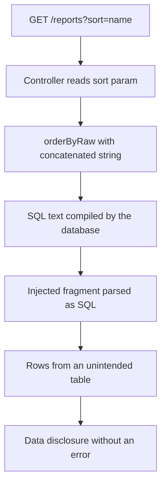
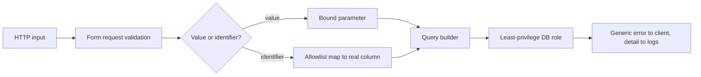

> **Scenario** — একটা reporting screen user-কে যেকোনো column-এ sort ও saved query দিয়ে filter করতে দেয়। সব জায়গায় ORM ব্যবহার হয়েছে, তাই team threat model-এ injection-কে "not applicable" লিখেছিল। Sort parameter `orderByRaw()`-এ concatenate হয়, আর scanner এগারো মিনিটে সেটা খুঁজে বের করে।

## Why it matters

- Injection OWASP Top 10-এ থাকে কারণ escape hatch framework upgrade-এও টিকে যায়। ORM value রক্ষা করে, identifier বা fragment নয়।
- একটাই injectable sort বা filter parameter যেকোনো table পড়তে পারে, যা multi-tenant database-এ মানে প্রতিটি customer-এর data।
- Blind variant timing বা boolean response দিয়ে ধীরে data বের করে, তাই alert দেওয়ার মতো স্পষ্ট error থাকে না।
- Fix সাধারণত পাঁচ লাইনের, তাই customer security review-তে finding-টা অবহেলা হিসেবেই পড়া হয়।

## Symptoms

| Signal | What you observe |
| --- | --- |
| Variable সহ raw helper | `whereRaw`, `orderByRaw`, `selectRaw`, `havingRaw`-এ `$request` data |
| String-এ বানানো SQL | `DB::select("... WHERE email = '$email'")` |
| Dynamic identifier | query parameter থেকে column বা table নাম |
| Log-এ অদ্ভুত query | slow query log-এ `ORDER BY (SELECT …)` বা লম্বা `CASE WHEN` |
| Error-এ SQL leak | 500 page-এ SQLSTATE text ও ব্যর্থ statement |
| Timing anomaly | একই request সেকেন্ড-ব্যবধানে ভিন্ন, `sleep()`-ধরনের probe বোঝায় |

## How it breaks

Prepared statement code ও data আলাদা করে — placeholder bind হয়, তাই driver user input-কে কখনো SQL হিসেবে parse করে না। প্রতিটি raw helper এটা উল্টে দেয়: string আগে SQL হিসেবে compile হয়, তারপর placeholder bind হয়। Identifier আরও খারাপ, কারণ `ORDER BY ?` বৈধ SQL নয়, তাই developer concatenate করে। একবার fragment concatenate হলে parser ওই জায়গায় subquery, union ও comment মেনে নেয়, যেখানে ORM কোনো রক্ষা দেয় না।



## Root causes

1. Builder method থাকলেও সুবিধার জন্য raw helper ব্যবহার।
2. Identifier (column, table, direction) allowlist-এ map না করে input থেকে নেওয়া।
3. `LIKE` pattern concatenation দিয়ে বানানো, `%` ও `_` unescaped।
4. JSON path expression ও full-text search string যাচাই ছাড়াই পাঠানো।
5. Database থেকে এসেছে বলে "saved filter" definition-কে trusted ধরা।
6. Production-এ verbose error চালু, ফলে blind injection দৃশ্যমান injection হয়ে যায়।

## How to solve it

### 1. সবসময় value bind করুন

```php
// Wrong: value concatenated into SQL text.
$rows = DB::select("SELECT id FROM users WHERE email = '{$request->email}'");

// Right: parameterised, driver binds the value.
$rows = DB::select('SELECT id FROM users WHERE email = ?', [$request->email]);

// Right: named bindings in a raw fragment.
Invoice::whereRaw('amount_cents > :floor', ['floor' => $request->integer('floor')])->get();
```

### 2. Identifier allowlist করুন — কখনো bind নয়

```php
final class ReportSort
{
    private const COLUMNS = [
        'name'    => 'customers.name',
        'total'   => 'invoices.amount_cents',
        'created' => 'invoices.created_at',
    ];

    public static function apply(Builder $query, ?string $sort, ?string $direction): Builder
    {
        $column = self::COLUMNS[$sort] ?? 'invoices.created_at';
        $dir = strtolower((string) $direction) === 'asc' ? 'asc' : 'desc';

        return $query->orderBy($column, $dir);
    }
}
```

User input শুধু একটা *key* বাছে; SQL identifier আসে আপনার code থেকে। Input থেকে SQL text-এ কোনো পথ নেই।

### 3. `LIKE`-এ wildcard escape করুন

```php
$term = addcslashes($request->string('q')->toString(), '%_\\');

Customer::where('name', 'like', "%{$term}%")->limit(50)->get();
```

Value তখনো bound; escaping user-কে `%%%` দিয়ে lookup-কে full scan বানাতে দেয় না।

### 4. Query builder দেখার আগেই validate করুন

```php
$data = $request->validate([
    'sort'      => ['nullable', Rule::in(['name', 'total', 'created'])],
    'direction' => ['nullable', Rule::in(['asc', 'desc'])],
    'per_page'  => ['nullable', 'integer', 'min:1', 'max:100'],
    'status'    => ['nullable', Rule::in(['draft', 'sent', 'paid'])],
]);
```

Validation parameterisation-এর বিকল্প নয়, কিন্তু raw helper-এ পৌঁছার আগেই পুরো শ্রেণির input সরিয়ে দেয়।

### 5. Stored definition-কে untrusted ধরুন

Saved filter, imported CSV mapping বা webhook payload হলো user input যা ঘুরপথে এসেছে। শুধু write-এ নয়, read-এও আবার validate করুন।

### 6. সফল injection কতদূর পৌঁছাতে পারে তা কমান

```sql
-- The application role cannot read auth material or run DDL.
REVOKE ALL ON auth_credentials FROM api_svc;
GRANT SELECT, INSERT, UPDATE ON invoices, invoice_lines, customers TO api_svc;
```

Least privilege "প্রতিটি table পড়া"-কে "তিনটা table পড়া" বানায়। Row-level security-র সাথে মিলে cross-tenant পৌঁছানোও কমে।

### 7. Database error লুকান, ভেতরে রাখুন

```php
// config/app.php
'debug' => (bool) env('APP_DEBUG', false),
```

SQLSTATE ও statement log pipeline-এ পাঠান, client-কে generic 500 দিন, আর exception type-এ alert দিন — SQL syntax error-এর spike মানে সক্রিয় probe।

## Target design



## Tradeoffs

| Option | Pros | Cons | Choose when |
| --- | --- | --- | --- |
| শুধু builder, raw SQL নেই | default-এ নিরাপদ | কিছু analytics query কষ্টকর | application CRUD path |
| Named binding সহ raw SQL | পূর্ণ SQL শক্তি; তবু parameterised | review-এ discipline লাগে | report, জটিল aggregate |
| Stored procedure | central contract; আঁটসাঁট grant | deployment ও versioning overhead | legacy বা DBA-নিয়ন্ত্রিত estate |
| Allowlisted dynamic identifier | নমনীয় sort ও filter | schema বদলালে maintain করতে হয় | user-configurable table |
| WAF signature | patch-এর আগে সময় কেনে | bypass হয়; false positive | কেবল emergency mitigation |

## Verification checklist

- [ ] `grep -rn "Raw(" app/` চালিয়ে দেখুন প্রতিটি hit শুধু binding বা constant ব্যবহার করে।
- [ ] কোনো query request value SQL text-এ concatenate করে না।
- [ ] `sort=id);--` ধরনের input পাঠিয়ে 422 আসে, database error নয়।
- [ ] Production generic 500 দেয়, SQLSTATE text ছাড়া।
- [ ] Application database role `DROP`, `CREATE` বা credential table পড়তে পারে না।
- [ ] অজানা sort key default column-এ ফিরে আসে — এমন test আছে।
- [ ] SQL-error rate alert আছে ও drill-এ অন্তত একবার fire করেছে।

## Anti-patterns

- Binding-এর বদলে `addslashes()` বা custom sanitiser দিয়ে হাতে escape করা।
- `UNION`, `SELECT` ধরনের keyword blocklist করে endpoint-কে নিরাপদ বলা।
- Raw report-এ `SELECT *`, যাতে schema বদলালে response চুপচাপ বড় হয়।
- "firewall-এর পেছনে" বলে internal service-এর SQL fragment trust করা।
- Incident debug করতে production-এ `APP_DEBUG` চালু করে তা চালু রেখে দেওয়া।

## Related

- [Multi-tenant authorization leaks](/systems/auth-security/multi-tenant-authorization-leaks)
- [SSRF and internal metadata exposure](/systems/auth-security/ssrf-and-internal-metadata)
- [File upload security boundaries](/systems/auth-security/file-upload-security)
