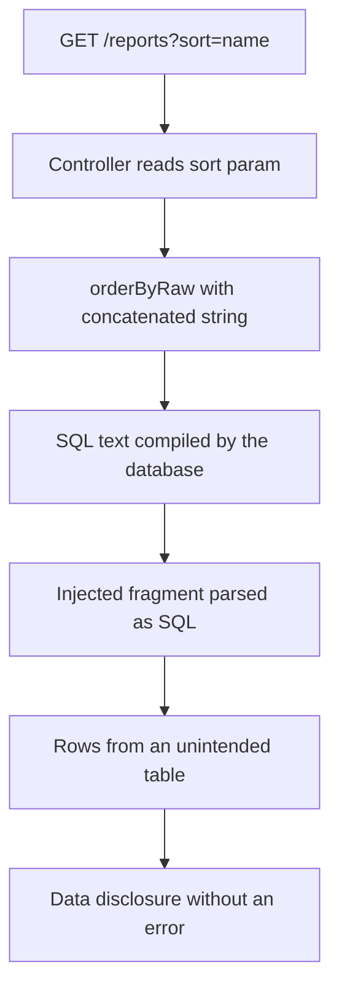
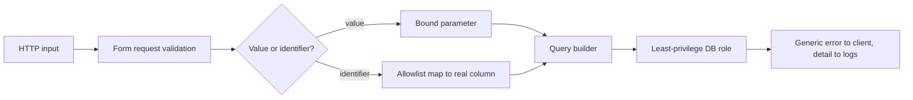

> **Scenario** - A reporting screen lets users sort by any column and filter with a saved query. It uses the ORM everywhere, so the team marked injection as "not applicable" in the threat model. The sort parameter is concatenated into `orderByRaw()`, and a scanner finds it in eleven minutes.

## Why it matters

- Injection remains in the OWASP Top 10 because the escape hatches survive framework upgrades. The ORM protects values, not identifiers or fragments.
- A single injectable sort or filter parameter can read arbitrary tables, which in a multi-tenant database means every customer's data.
- Blind variants exfiltrate slowly through timing or boolean responses, so there is no obvious error to alert on.
- Remediation is usually a five-line change, so the finding reads as negligence in a customer security review.

## Symptoms

| Signal | What you observe |
| --- | --- |
| Raw helpers with variables | `whereRaw`, `orderByRaw`, `selectRaw`, `havingRaw` containing `$request` data |
| String-built SQL | `DB::select("... WHERE email = '$email'")` |
| Dynamic identifiers | Column or table names taken from query parameters |
| Odd query shapes in logs | Slow query log shows `ORDER BY (SELECT …)` or long `CASE WHEN` chains |
| Errors leaking SQL | 500 pages containing SQLSTATE text and the failing statement |
| Timing anomalies | Identical requests differing by seconds, indicating `sleep()`-style probes |

## How it breaks

Prepared statements separate code from data - the placeholder is bound, so the driver never parses user input as SQL. Every raw helper reverses that: the string is compiled as SQL first, then placeholders bind. Identifiers make it worse, because `ORDER BY ?` is not valid SQL, so a developer concatenates. Once a fragment is concatenated, the parser accepts subqueries, unions, and comments in a position where the ORM offers no protection.



## Root causes

1. Raw helpers used for convenience when a builder method exists.
2. Identifiers (columns, tables, directions) taken from input instead of mapped through an allowlist.
3. `LIKE` patterns built by concatenation, leaving `%` and `_` unescaped.
4. JSON path expressions and full-text search strings passed through unvalidated.
5. Stored "saved filter" definitions treated as trusted because they came from the database.
6. Verbose error reporting enabled in production, turning blind injection into visible injection.

## How to solve it

### 1. Bind values, always

```php
// Wrong: value concatenated into SQL text.
$rows = DB::select("SELECT id FROM users WHERE email = '{$request->email}'");

// Right: parameterised, driver binds the value.
$rows = DB::select('SELECT id FROM users WHERE email = ?', [$request->email]);

// Right: named bindings in a raw fragment.
Invoice::whereRaw('amount_cents > :floor', ['floor' => $request->integer('floor')])->get();
```

### 2. Allowlist identifiers - never bind them

```php
final class ReportSort
{
    private const COLUMNS = [
        'name'    => 'customers.name',
        'total'   => 'invoices.amount_cents',
        'created' => 'invoices.created_at',
    ];

    public static function apply(Builder $query, ?string $sort, ?string $direction): Builder
    {
        $column = self::COLUMNS[$sort] ?? 'invoices.created_at';
        $dir = strtolower((string) $direction) === 'asc' ? 'asc' : 'desc';

        return $query->orderBy($column, $dir);
    }
}
```

The user input selects a *key*; the SQL identifier comes from your code. There is no path from input to SQL text.

### 3. Escape wildcards in `LIKE`

```php
$term = addcslashes($request->string('q')->toString(), '%_\\');

Customer::where('name', 'like', "%{$term}%")->limit(50)->get();
```

The value is still bound; escaping prevents a user turning a lookup into a full scan with `%%%`.

### 4. Validate before the query builder sees it

```php
$data = $request->validate([
    'sort'      => ['nullable', Rule::in(['name', 'total', 'created'])],
    'direction' => ['nullable', Rule::in(['asc', 'desc'])],
    'per_page'  => ['nullable', 'integer', 'min:1', 'max:100'],
    'status'    => ['nullable', Rule::in(['draft', 'sent', 'paid'])],
]);
```

Validation is not a substitute for parameterisation, but it removes whole classes of input before they reach a raw helper.

### 5. Treat stored definitions as untrusted

A saved filter, an imported CSV mapping, or a webhook payload is user input that took a detour. Re-validate on read, not just on write.

### 6. Reduce what a successful injection can reach

```sql
-- The application role cannot read auth material or run DDL.
REVOKE ALL ON auth_credentials FROM api_svc;
GRANT SELECT, INSERT, UPDATE ON invoices, invoice_lines, customers TO api_svc;
```

Least privilege turns "read every table" into "read three tables". Combined with row-level security, it also limits cross-tenant reach.

### 7. Hide database errors, keep them internally

```php
// config/app.php
'debug' => (bool) env('APP_DEBUG', false),
```

Log the SQLSTATE and statement to your log pipeline, return a generic 500 to the client, and alert on the exception type - a spike in SQL syntax errors is an active probe.

## Target design



## Tradeoffs

| Option | Pros | Cons | Choose when |
| --- | --- | --- | --- |
| Builder only, no raw SQL | Safe by default | Some analytics queries get awkward | Application CRUD paths |
| Raw SQL with named bindings | Full SQL power; still parameterised | Requires discipline in review | Reports, complex aggregates |
| Stored procedures | Central contract; tight grants | Deployment and versioning overhead | Legacy or DBA-owned estates |
| Allowlisted dynamic identifiers | Flexible sorting and filtering | Must be maintained as schema evolves | User-configurable tables |
| WAF signatures | Buys time before a patch | Bypassable; false positives | Emergency mitigation only |

## Verification checklist

- [ ] `grep -rn "Raw(" app/` and confirm every hit uses bindings or constants only.
- [ ] Confirm no query concatenates a request value into SQL text.
- [ ] Send `sort=id);--` style input and confirm a 422, not a database error.
- [ ] Confirm production returns a generic 500 with no SQLSTATE text.
- [ ] Verify the application database role cannot `DROP`, `CREATE`, or read credential tables.
- [ ] Add a test asserting an unknown sort key falls back to the default column.
- [ ] Confirm a SQL-error rate alert exists and has fired at least once in a drill.

## Anti-patterns

- Escaping input manually with `addslashes()` or a custom sanitiser instead of binding.
- Blocklisting keywords like `UNION` and `SELECT` and calling the endpoint safe.
- `SELECT *` in raw reports, so schema changes silently widen the response.
- Trusting an internal service's SQL fragment because "it is behind the firewall".
- Turning on `APP_DEBUG` in production to debug an incident and leaving it on.

## Related

- [Multi-tenant authorization leaks](/systems/auth-security/multi-tenant-authorization-leaks)
- [SSRF and internal metadata exposure](/systems/auth-security/ssrf-and-internal-metadata)
- [File upload security boundaries](/systems/auth-security/file-upload-security)
