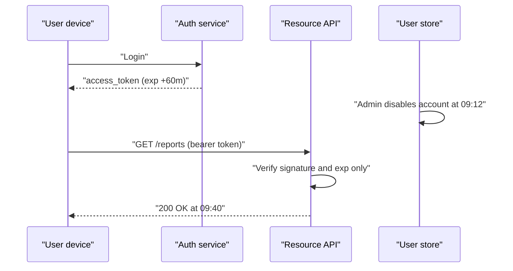
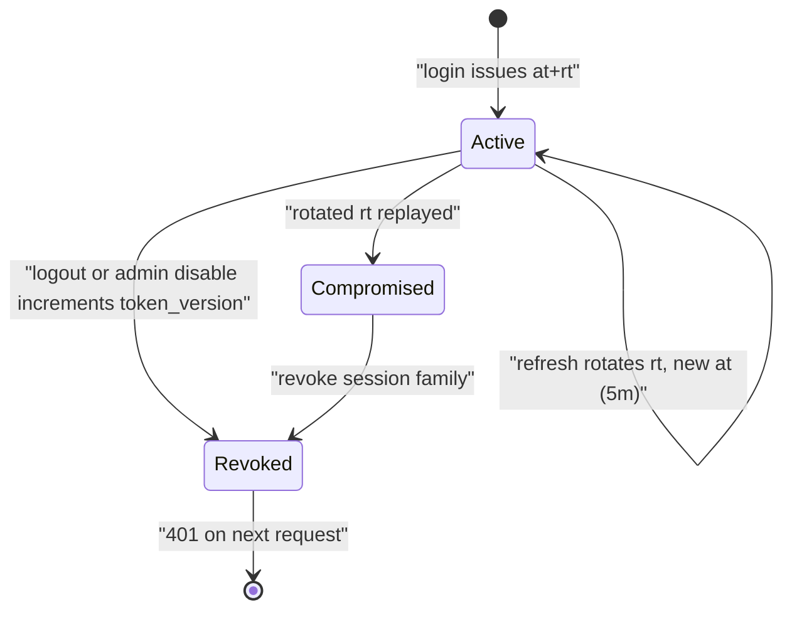

> **Scenario** - ০৯:১২-এ একজন employee offboard হলো। IT account disable করল, কিন্তু তার laptop ০৯:৫৭ পর্যন্ত সফলভাবে API call করতে থাকল, কারণ access token ৬০ মিনিট TTL দিয়ে sign করা আর কেউ user table check করে না।

## Why it matters

- "সব জায়গা থেকে logout" ও "access revoke" compliance requirement, শখ নয়। Account-এর চেয়ে বেশি বাঁচা stateless token একটা audit finding।
- Incident response-এ কয়েক সেকেন্ডে credential invalidate করা লাগে। একমাত্র lever যদি TTL ফুরানোর অপেক্ষা হয়, তবে containment time = TTL।
- Leak হওয়া token একটা bearer credential: যে ধরে রাখে সে-ই *user*, যেকোনো IP থেকে, expire হওয়া পর্যন্ত।
- Team over-correct করে প্রতি request-এ database check বসায়, ফলে JWT যে coupling এড়াতে নেওয়া হয়েছিল সেটাই ফিরে আসে - এবার denylist-এ cache stampede সহ।

## Symptoms

| Signal | What you observe |
| --- | --- |
| Offboarding-পরবর্তী traffic | disabled `user_id` থেকে এক TTL পর্যন্ত সফল request |
| Password change cosmetic | phishing-এর পর user password বদলায়, পুরনো session চলতেই থাকে |
| Permission change পিছিয়ে | admin UI-তে role সরানো, কিন্তু refresh পর্যন্ত API allow করে |
| Denylist hot key | Redis-এ একটা key (`jwt:denylist`) অসামঞ্জস্যপূর্ণ ops/sec দেখায় |
| Refresh token replay | একই `jti` কয়েক মিনিটের ব্যবধানে দুই geography-তে |

## How it breaks

JWT হলো claim-এর একটা signed snapshot। Verification local: parse, signature check, `exp` check। কেউ source of truth-এ যায় না - এটাই team-এর চাওয়া performance property, আর এটাই ভুলে যাওয়া correctness property। Server-এ যেকোনো state change (disable, demote, password reset, tenant removal) ইতিমধ্যে issue হওয়া token-এর কাছে অদৃশ্য।



## Root causes

1. Access token TTL containment (মিনিট) নয়, সুবিধা (ঘণ্টা) দেখে সেট করা।
2. Server-side "session generation" ধারণা নেই, তাই revocation-এর তুলনা করার কিছু নেই।
3. Refresh token দীর্ঘজীবী, rotate হয় না, আর XSS পড়তে পারে এমন জায়গায় রাখা।
4. Authorization claim (role, tenant, limit) প্রতি request-এ resolve না করে token-এ bake করা।
5. Denylist থাকলেও তা একটা unbounded key, প্রতি request-এ check হয়, negative caching নেই।

## How to solve it

### 1. Token lifetime সচেতনভাবে ভাগ করুন

ছোট access token, বড় refresh token, প্রতি refresh-এ rotation:

```json
{
  "iss": "https://auth.example.com",
  "sub": "usr_8213",
  "aud": "api.example.com",
  "iat": 1717500000,
  "exp": 1717500300,
  "jti": "at_01HZY8Q9V4",
  "sid": "sess_01HZY8Q0KP",
  "tv": 7,
  "tenant": "acme"
}
```

`exp - iat` = ৩০০ সেকেন্ড। `sid` session চিহ্নিত করে; `tv` হলো user row-তে রাখা **token version** counter।

### 2. সস্তা invalidation signal যোগ করুন

Credential বা permission বদলালেই user record-এর counter বাড়ান, আর verification-এ মিলিয়ে দেখুন। একটা integer read, cacheable, per-token bookkeeping নেই:

```php
// app/Http/Middleware/EnsureTokenIsCurrent.php
public function handle(Request $request, Closure $next)
{
    $claims = $request->attributes->get('jwt_claims');

    $currentVersion = Cache::remember(
        "user:{$claims['sub']}:tv",
        now()->addSeconds(30),
        fn () => User::whereKey($claims['sub'])->value('token_version')
    );

    if ($currentVersion === null || (int) $claims['tv'] !== (int) $currentVersion) {
        return response()->json(['error' => 'token_revoked'], 401);
    }

    return $next($request);
}
```

Revocation মানে `User::whereKey($id)->increment('token_version')`। ৩০ সেকেন্ড cache TTL database load ও revocation delay দুটোই bound করে।

### 3. Refresh token rotate করুন, reuse detect করুন

Refresh token hashed করে রাখুন, প্রতি issuance-এ এক row, `replaced_by` chain সহ। আগে exchange হয়ে যাওয়া token আবার এলে পুরো family compromised ধরুন:

```php
$record = RefreshToken::where('token_hash', hash('sha256', $presented))->first();

if (! $record || $record->revoked_at) {
    // Reuse of a rotated token: kill the entire session family.
    RefreshToken::where('session_id', $record?->session_id)->update(['revoked_at' => now()]);
    User::whereKey($record?->user_id)->increment('token_version');
    abort(401, 'refresh_reuse_detected');
}
```

### 4. Script পৌঁছাতে পারে না এমন জায়গায় token রাখুন

Browser client-এ refresh path-এর জন্য cookie ব্যবহার করুন:

```
Set-Cookie: refresh_token=…; HttpOnly; Secure; SameSite=Strict; Path=/auth/refresh; Max-Age=1209600
```

`HttpOnly` XSS read path সরায়, `SameSite=Strict` + সংকীর্ণ `Path` refresh endpoint-এর বড় অংশ CSRF surface সরায়, আর স্বল্পায়ু access token শুধু memory-তে থাকতে পারে।

### 5. পরিবর্তনশীল authorization token-এর বাইরে রাখুন

স্থির identity claim-এ রাখুন (`sub`, `tenant`, `sid`)। Role ও limit server-side cache থেকে resolve করুন। তখন demotion পরের request-এ কাজ করে, পরের ঘণ্টায় নয়।

### 6. Auth endpoint rate-limit ও monitor করুন

Refresh আর login - এই দুটোতেই attacker হামলা করবে। per-IP ও per-subject limit দিন, আর refresh-reuse detection-এ alert দিন; ওই signal high fidelity।

## Target design



## Tradeoffs

| Option | Pros | Cons | Choose when |
| --- | --- | --- | --- |
| দীর্ঘায়ু stateless JWT | auth lookup শূন্য; scaling সহজ | revocation delay = TTL | কম ঝুঁকির, read-only, public data |
| ছোট access + rotating refresh | মিনিটে containment; reuse detection | বেশি refresh traffic; rotation bug-এ user আটকে যায় | অধিকাংশ product API |
| Token version counter | একটা cached integer; user-এর সব token cover করে | cache TTL revocation latency bound করে | "সব জায়গা থেকে logout" দরকার |
| `jti` ভিত্তিক full denylist | per-token নির্দিষ্ট revocation | store বাড়ে; hot key; `exp` দিয়ে eviction লাগে | per-token proof দরকার এমন regulated flow |
| Opaque server session | তাৎক্ষণিক revocation; claim stale হয় না | প্রতি request-এ central lookup | single-region, latency budget আছে |

## Verification checklist

- [ ] Account disable করে দেখুন পরের API call token TTL নয়, cache TTL-এর ভেতরেই fail করে।
- [ ] Password বদলে দেখুন অন্য device logout হয়েছে।
- [ ] Staging-এ rotated refresh token replay করে দেখুন session family revoke হয় ও alert যায়।
- [ ] Refresh endpoint-এর `Set-Cookie`-তে `HttpOnly`, `Secure` ও scoped `Path` আছে।
- [ ] Production access token decode করে দেখুন কোনো role/permission list embed নেই।
- [ ] Token-version cache load-test করে দেখুন expiry-তে stampede হয় না।

## Anti-patterns

- "user যেন logout না হয়" বলে `exp` ২৪ ঘণ্টা করা।
- Refresh token `localStorage`-এ রেখে XSS-কে আলাদা সমস্যা ভাবা।
- Global logout করতে signing key মুছে দেওয়া, যাতে staff সহ সব session ভাঙে।
- Denylist check হয় কিন্তু কখনো prune হয় না, শেষে Redis memory-ই outage।
- প্রতি refresh-এ একই refresh token ফেরত দেওয়া, যাতে reuse detect করা অসম্ভব।

## Related

- [OAuth token lifecycle and tenant isolation](/systems/auth-security/oauth-token-lifecycle)
- [Session fixation and CSRF defence](/systems/auth-security/session-fixation-and-csrf)
- [MFA and account recovery tradeoffs](/systems/auth-security/mfa-and-account-recovery-tradeoffs)
