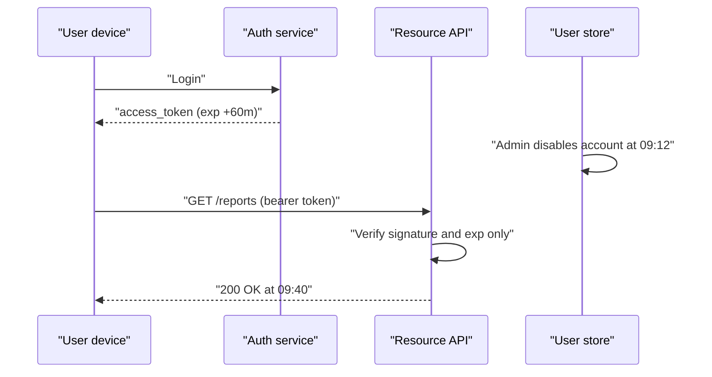
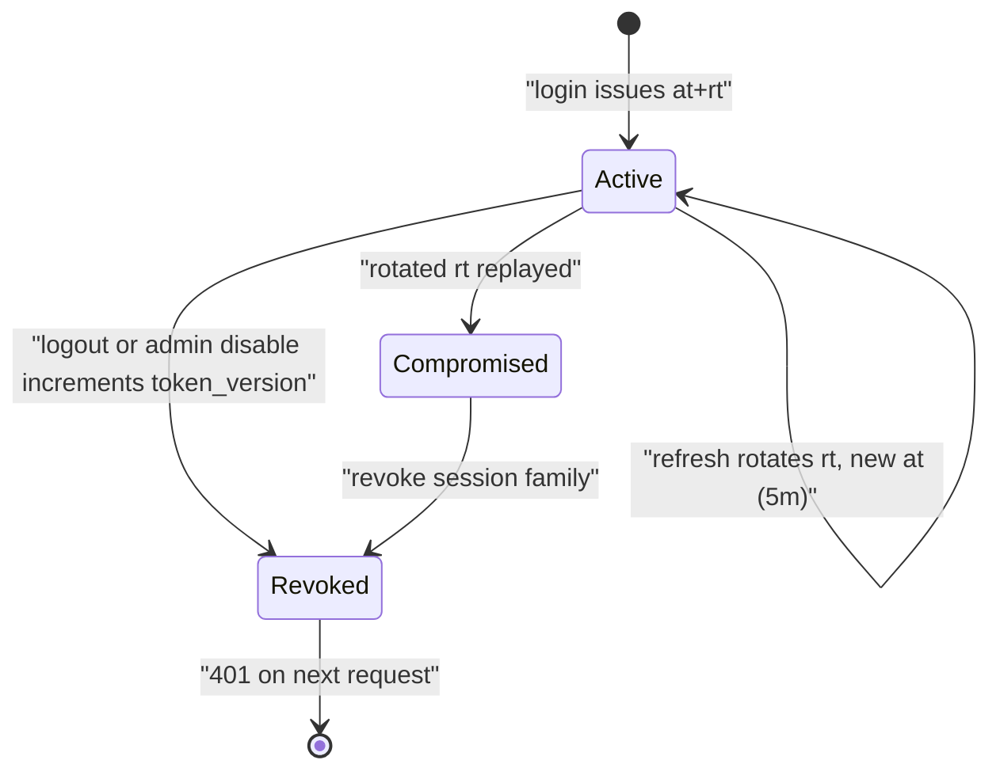

> **Scenario** — An employee is offboarded at 09:12. IT disables the account, but their laptop keeps calling the API successfully until 09:57 because the access token was signed with a 60-minute TTL and nothing checks the user table.

## Why it matters

- "Log out everywhere" and "revoke access" are compliance requirements, not nice-to-haves. A stateless token that outlives the account is an audit finding.
- Incident response depends on being able to invalidate credentials in seconds. If your only lever is waiting out the TTL, your containment time is your TTL.
- A leaked token is a bearer credential: whoever holds it *is* the user, from any IP, until it expires.
- Teams over-correct by checking the database on every request, which reintroduces the coupling JWTs were adopted to avoid — now with a cache stampede on the denylist.

## Symptoms

| Signal | What you observe |
| --- | --- |
| Post-offboarding traffic | Successful requests from a disabled `user_id` for up to one TTL |
| Password change is cosmetic | User changes password after a phishing incident; old sessions keep working |
| Permission changes lag | Role removed in admin UI, but the API still allows the action until refresh |
| Denylist hot key | Redis shows one key (`jwt:denylist`) with disproportionate ops/sec |
| Refresh token replay | The same `jti` appears in two geographies minutes apart |

## How it breaks

A JWT is a signed snapshot of claims. Verification is local: parse, check signature, check `exp`. Nothing consults the source of truth, which is exactly the performance property teams want — and exactly the correctness property they forget. Any state change on the server (disable, demote, password reset, tenant removal) is invisible to already-issued tokens.



## Root causes

1. Access token TTL is set for convenience (hours) rather than for containment (minutes).
2. There is no server-side notion of "session generation", so revocation has nothing to compare against.
3. Refresh tokens are long-lived, non-rotating, and stored where XSS can read them.
4. Authorization claims (roles, tenant, limits) are baked into the token instead of resolved per request.
5. The denylist, if any, is a single unbounded key checked on every request with no negative caching.

## How to solve it

### 1. Split the token lifetimes deliberately

Short access tokens, longer refresh tokens, rotation on every refresh:

```json
{
  "iss": "https://auth.example.com",
  "sub": "usr_8213",
  "aud": "api.example.com",
  "iat": 1717500000,
  "exp": 1717500300,
  "jti": "at_01HZY8Q9V4",
  "sid": "sess_01HZY8Q0KP",
  "tv": 7,
  "tenant": "acme"
}
```

`exp - iat` is 300 seconds. `sid` identifies the session; `tv` is a **token version** counter stored on the user row.

### 2. Add a cheap invalidation signal

Bump a counter on the user record whenever credentials or permissions change, and compare it during verification. One integer read, cacheable, no per-token bookkeeping:

```php
// app/Http/Middleware/EnsureTokenIsCurrent.php
public function handle(Request $request, Closure $next)
{
    $claims = $request->attributes->get('jwt_claims');

    $currentVersion = Cache::remember(
        "user:{$claims['sub']}:tv",
        now()->addSeconds(30),
        fn () => User::whereKey($claims['sub'])->value('token_version')
    );

    if ($currentVersion === null || (int) $claims['tv'] !== (int) $currentVersion) {
        return response()->json(['error' => 'token_revoked'], 401);
    }

    return $next($request);
}
```

Revocation becomes `User::whereKey($id)->increment('token_version')`. A 30-second cache TTL bounds both the database load and the revocation delay.

### 3. Rotate refresh tokens and detect reuse

Store refresh tokens hashed, one row per issuance, with a `replaced_by` chain. If a token that was already exchanged is presented again, treat the whole family as compromised:

```php
$record = RefreshToken::where('token_hash', hash('sha256', $presented))->first();

if (! $record || $record->revoked_at) {
    // Reuse of a rotated token: kill the entire session family.
    RefreshToken::where('session_id', $record?->session_id)->update(['revoked_at' => now()]);
    User::whereKey($record?->user_id)->increment('token_version');
    abort(401, 'refresh_reuse_detected');
}
```

### 4. Store tokens where scripts cannot reach them

For browser clients, prefer a cookie-borne session for the refresh path:

```
Set-Cookie: refresh_token=…; HttpOnly; Secure; SameSite=Strict; Path=/auth/refresh; Max-Age=1209600
```

`HttpOnly` removes the XSS read path, `SameSite=Strict` plus a narrow `Path` removes most CSRF surface on the refresh endpoint, and the short-lived access token can stay in memory only.

### 5. Keep volatile authorization out of the token

Put stable identity in claims (`sub`, `tenant`, `sid`). Resolve roles and limits server-side from cache. A demotion then takes effect at the next request, not the next hour.

### 6. Rate-limit and monitor the auth endpoints

Refresh and login are the two endpoints an attacker will hammer. Apply per-IP and per-subject limits, and alert on refresh-reuse detections — that signal is high fidelity.

## Target design



## Tradeoffs

| Option | Pros | Cons | Choose when |
| --- | --- | --- | --- |
| Long-lived stateless JWT | Zero auth lookups; trivial scaling | Revocation delay equals TTL | Low-risk, read-only, public data |
| Short access + rotating refresh | Containment in minutes; reuse detection | More refresh traffic; rotation bugs lock users out | Most product APIs |
| Token version counter | One cached integer; covers all tokens of a user | Cache TTL bounds revocation latency | You need "log out everywhere" |
| Full denylist by `jti` | Precise per-token revocation | Growing store; hot key; needs eviction by `exp` | Regulated flows needing per-token proof |
| Opaque server sessions | Instant revocation; no claim staleness | Central lookup on every request | Single-region, latency budget allows it |

## Verification checklist

- [ ] Disable an account, then confirm the next API call fails within the cache TTL, not the token TTL.
- [ ] Change a password and confirm other devices are logged out.
- [ ] Replay a rotated refresh token in a staging environment and confirm the session family is revoked and alerted.
- [ ] Confirm `Set-Cookie` on the refresh endpoint has `HttpOnly`, `Secure`, and a scoped `Path`.
- [ ] Decode a production access token and verify no role or permission list is embedded.
- [ ] Load-test the token-version cache to confirm no stampede when it expires.

## Anti-patterns

- Setting `exp` to 24 hours so users "do not get logged out".
- Storing refresh tokens in `localStorage` and treating XSS as a separate problem.
- Deleting the signing key to force a global logout, breaking every session including staff.
- A denylist that is checked but never pruned, until Redis memory becomes the outage.
- Reissuing the same refresh token on every refresh, which makes reuse undetectable.

## Related

- [OAuth token lifecycle and tenant isolation](/systems/auth-security/oauth-token-lifecycle)
- [Session fixation and CSRF defence](/systems/auth-security/session-fixation-and-csrf)
- [MFA and account recovery tradeoffs](/systems/auth-security/mfa-and-account-recovery-tradeoffs)
