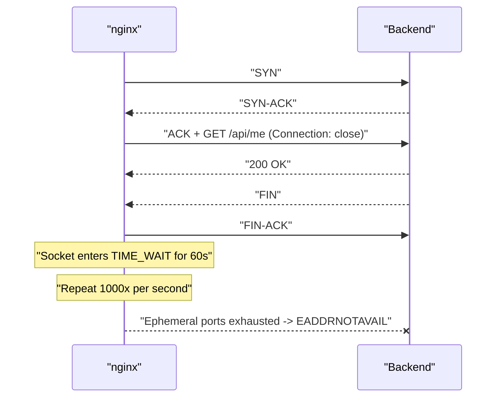
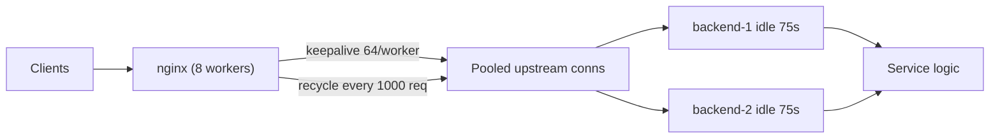

> **Scenario** — এক app server থেকে nginx tier + ছয়টি pod-এ যাওয়ার পর p50 latency ১৮ms থেকে ৩১ms-এ উঠল, আর proxy node-এ ২৮,০০০ socket `TIME_WAIT`-এ জমে গেল। মিনিটে ৬০ হাজার request-এ box `502` বার্স্ট দিতে শুরু করল, error log-এ `connect() failed (99: Cannot assign requested address)`।

## Why it matters

- প্রতিটি নতুন upstream connection-এ একটি TCP handshake (১ RTT), আর TLS upstream হলে পুরো TLS handshake (১–২ RTT ও বাস্তব CPU) লাগে। ১,০০০ rps-এ সেটি প্রতি সেকেন্ডে ১,০০০ অপ্রয়োজনীয় handshake।
- `TIME_WAIT` socket ephemeral port খায়। এক source IP-তে ব্যবহারযোগ্য port প্রায় ২৮,০০০; ছাড়ালে connection ধীরে নয়, সরাসরি fail করে।
- failure bimodal: ৪০k rpm-এ ঠিক, ৬৫k rpm-এ বিপর্যয় — কারণ port exhaustion একটি cliff।
- connection churn backend-এর আসল capacity লুকিয়ে দেয় — handshake overhead পোষাতে আপনি pod scale করেন।
- সমাধান তিন লাইনের config, আর সে কারণেই এই bug বছরের পর বছর বাঁচে: কেউ বিশ্বাস করে না এটাই কারণ।

## Symptoms

| Signal | What you observe |
| --- | --- |
| `ss -s` | proxy node-এ `TIME-WAIT 28431`, বাড়ছে |
| nginx `error.log` | `connect() failed (99: Cannot assign requested address) while connecting to upstream` |
| `$upstream_connect_time` | reuse-এ ~0 হওয়ার বদলে ধারাবাহিকভাবে ১–৩ms |
| Backend accept rate | accepts/second ≈ requests/second |
| CPU | backend-এর TLS/handshake CPU request rate-এর সমানুপাতিক |
| Latency | proxy বসানোর পর p50 ঠিক এক RTT বাড়ে |
| `netstat` distribution | গুটিকয় destination-এ হাজার হাজার আলাদা source port |

## How it breaks

nginx upstream-এর দিকে default-এ HTTP/1.0 বলে ও `Connection: close` পাঠায়। ফলে প্রতিটি proxied request নতুন TCP connection খোলে, একবার ব্যবহার করে, বন্ধ করে। যে দিক বন্ধ করে সেটি `2 × MSL` (Linux-এ ৬০s) সময় `TIME_WAIT`-এ থাকে বিপথগামী segment শোষণের জন্য। ১,০০০ rps-এ সেটি ৬০,০০০ socket, যারা `net.ipv4.ip_local_port_range`-এর সীমিত পরিসরের জন্য লড়ে — destination tuple-প্রতি সাধারণত ~২৮,০০০।

শুধু `upstream` block-এ `keepalive` directive যোগ করাই যথেষ্ট নয় — `proxy_http_version 1.1` ও `Connection` header খালি না করলে nginx তখনও backend-কে প্রতিটি response-এর পর বন্ধ করতে বলে, আর keepalive cache খালি থেকে যায়।



## Root causes

1. upstream-এর দিকে `proxy_http_version` default 1.0-এ পড়ে আছে।
2. `proxy_set_header Connection ""` নেই, তাই client-এর `Connection` header (বা nginx-এর `close`) forward হয়।
3. `upstream` block-এ `keepalive` directive নেই, অর্থাৎ idle connection cache-ই নেই।
4. worker সংখ্যা ও request rate-এর তুলনায় `keepalive` অনেক কম (যেমন ৮)।
5. backend-এর `keepalive_timeout` proxy-র idle সময়ের চেয়ে ছোট, তাই nginx যেটিকে জীবিত ভাবে backend তা বন্ধ করে — মাঝেমধ্যে 502।
6. `keepalive_requests` পুরনো default ১০০-তে, তাই প্রতি শততম request-এ reconnect।
7. application HTTP client (Guzzle, requests, axios) প্রতি call-এ নতুন client বানায় — এক স্তর উপরে একই সমস্যা।

## How to solve it

### 1. upstream keepalive ঠিকভাবে চালু করুন — তিনটি অংশই

```nginx
upstream app_upstream {
    least_conn;
    server 10.2.4.11:8080;
    server 10.2.4.12:8080;

    keepalive          64;     # idle connections cached PER WORKER
    keepalive_requests 1000;
    keepalive_timeout  60s;
}

server {
    location /api/ {
        proxy_pass         http://app_upstream;
        proxy_http_version 1.1;
        proxy_set_header   Connection "";
    }
}
```

`keepalive 64` প্রতি worker process-এর জন্য। ৮ worker মানে সর্বোচ্চ ৫১২ cached connection; backend-এর connection limit সেই অনুযায়ী দিন।

### 2. backend যেন proxy-র idle window-এর চেয়ে বেশি বাঁচে

backend ৫s-এ বন্ধ করলে আর nginx ৬০s cache করলে nginx মাঝেমধ্যে এমন socket-এ লিখবে যা backend সবে বন্ধ করেছে — ফল 502। backend-এর idle timeout *বড়* রাখুন:

```
nginx keepalive_timeout (upstream) : 60s
backend server idle timeout        : 75s
```

### 3. reuse wire-এ প্রমাণ করুন

```bash
ss -s
# TCP:   1211 (estab 402, closed 91, orphaned 0, timewait 88)

ss -tan state time-wait | wc -l
# 88        <- was 28431
```

```bash
watch -n1 "awk '{print \$NF}' /var/log/nginx/access.log | tail -n 2000 \
  | grep -c 'uct=0.000'"
```

`$upstream_connect_time` `0.000` মানে connection keepalive cache থেকে এসেছে। বেশিরভাগ request `0.001`–`0.003` দেখালে আপনি এখনো handshake করছেন।

### 4. port range বাড়ানো সাময়িক উপশম, সমাধান নয়

```bash
sysctl -w net.ipv4.ip_local_port_range="10240 65535"
sysctl -w net.ipv4.tcp_fin_timeout=15
```

`tcp_tw_recycle` চালু করবেন **না** (আধুনিক kernel-এ নেই, NAT ভাঙে)। `tcp_tw_reuse=1` outbound client socket-এ নিরাপদ কিন্তু ব্যান্ডেজ; keepalive socket-গুলোকেই মুছে দেয়।

### 5. application HTTP client-এ একই bug ঠিক করুন

```php
// Laravel / Guzzle: এক shared client, প্রতি request-এ নতুন নয়
$this->client = new \GuzzleHttp\Client([
    'base_uri' => 'https://payments.internal/',
    'timeout'  => 5.0,
    'headers'  => ['Connection' => 'keep-alive'],
]);
```

```python
session = requests.Session()
session.mount("https://", requests.adapters.HTTPAdapter(
    pool_connections=16, pool_maxsize=64))
```

প্রতি call-এ client বানানো মানে application স্তরে `Connection: close`।

### 6. keepalive ও load balancing-এর ভারসাম্য রাখুন

reused connection balancer-এর পরের সিদ্ধান্ত এড়িয়ে যায়। backend heterogeneous হলে বা ঘন ঘন scale out করলে `keepalive_requests` (যেমন ১০০০) ও `keepalive_time` cap দিন, যাতে connection recycle হয়ে traffic নতুন করে ছড়ায়।

## Target design



## Tradeoffs

| Option | Pros | Cons | Choose when |
| --- | --- | --- | --- |
| keepalive নেই | প্রতিটি request-এ নিখুঁত rebalance | request-প্রতি handshake, port exhaustion | কেবল খুব কম request rate |
| বড় cache সহ keepalive | সর্বনিম্ন latency ও CPU | stale-connection 502, ধীর rebalance | স্থির traffic, স্থির backend |
| `keepalive_requests` cap সহ | reuse + পর্যায়ক্রমিক rebalance | মাঝেমধ্যে handshake খরচ | autoscaled বা heterogeneous pool |
| `tcp_tw_reuse` | তাৎক্ষণিক উপশম, redeploy লাগে না | উপসর্গ সামলায়, কারণ নয় | জরুরি প্রশমন |
| upstream-এ TLS | internal hop encrypted | reuse ছাড়া handshake খরচ গুণ হয় | zero-trust internal network |

## Verification checklist

- [ ] `nginx -T | grep -B2 -A2 'proxy_http_version'` প্রতিটি proxying location-এ 1.1 ও `Connection ""` দেখায়।
- [ ] peak-এ `ss -tan state time-wait | wc -l` ১,০০০-এর নিচে।
- [ ] ৯৫%+ request-এ `$upstream_connect_time` `0.000`।
- [ ] backend accept rate request rate-এর চেয়ে অনেক কম।
- [ ] backend idle timeout proxy-রটির চেয়ে বড় বলে নথিভুক্ত।
- [ ] ২× peak load test-এ কোনো `Cannot assign requested address` নেই।
- [ ] application HTTP client singleton ও connection pool সহ।

## Anti-patterns

- upstream block-এ `keepalive 64` যোগ করে থেমে যাওয়া — `proxy_http_version 1.1` ছাড়া এটি কিছুই করে না।
- পুরনো blog-এর পরামর্শে `tcp_tw_recycle` চালু করা; এটি NAT-এর পিছনের client ভাঙে ও বর্তমান kernel-এ নেই।
- backend idle timeout proxy-রটির চেয়ে ছোট রেখে "random 502" খোঁজা।
- handshake সরানোর বদলে handshake-এর CPU শোষণ করতে backend pod scale করা।
- অসীম `keepalive_requests`, ফলে deploy-এর পর connection কখনো rebalance হয় না।
- client-এর `Connection` header সরাসরি upstream-এ forward করা।

## Related

- [TLS handshake cost and session resumption](/systems/networking-edge/tls-handshake-cost-and-resumption)
- [Choosing a load balancing algorithm](/systems/networking-edge/load-balancing-algorithm-choice)
- [HTTP/2 and HTTP/3 multiplexing side effects](/systems/networking-edge/http2-http3-multiplexing-effects)
