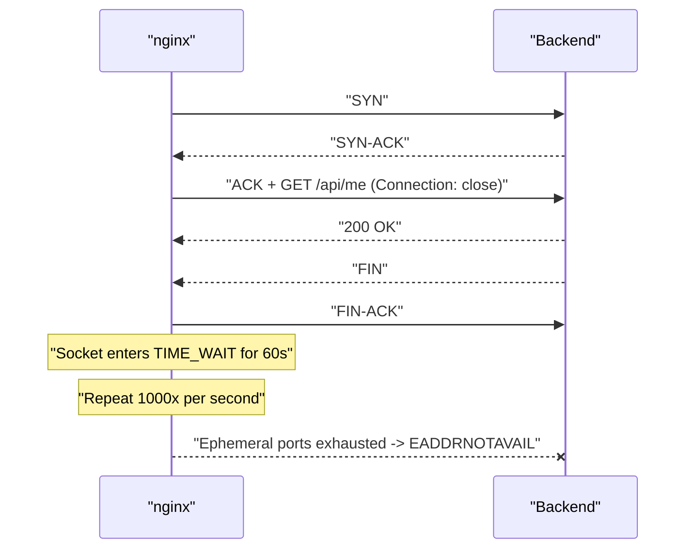
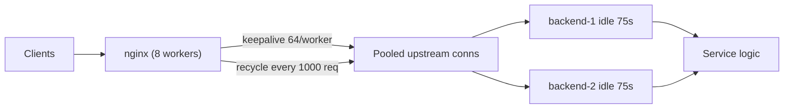

> **Scenario** - After moving from a single app server to an nginx tier plus six pods, p50 latency rises from 18ms to 31ms and the proxy node accumulates 28,000 sockets in `TIME_WAIT`. At 60k requests per minute the box starts returning `502` bursts with `connect() failed (99: Cannot assign requested address)` in the error log.

## Why it matters

- Every new upstream connection costs a TCP handshake (1 RTT) plus, for TLS upstreams, a full TLS handshake (1–2 RTT and real CPU). At 1,000 rps that is 1,000 handshakes per second you did not need.
- `TIME_WAIT` sockets consume ephemeral ports. A single source IP has roughly 28,000 usable ports; exceed that and connections fail outright, not slowly.
- The failure is bimodal: fine at 40k rpm, catastrophic at 65k rpm, because port exhaustion is a cliff.
- Connection churn hides the real capacity of your backends - you scale pods to compensate for handshake overhead.
- The fix is three lines of config, which is why this bug survives for years: nobody believes it is that.

## Symptoms

| Signal | What you observe |
| --- | --- |
| `ss -s` | `TIME-WAIT 28431` and climbing on the proxy node |
| nginx `error.log` | `connect() failed (99: Cannot assign requested address) while connecting to upstream` |
| `$upstream_connect_time` | Consistently 1–3ms instead of ~0 for reused connections |
| Backend accept rate | Accepts per second roughly equal to requests per second |
| CPU | Backend TLS/handshake CPU proportional to request rate |
| Latency | p50 rises by exactly one RTT after inserting the proxy |
| `netstat` distribution | Thousands of distinct source ports to a handful of destinations |

## How it breaks

nginx defaults to HTTP/1.0 toward upstreams and sends `Connection: close`. Every proxied request therefore opens a fresh TCP connection, uses it once, and closes it. The closing side enters `TIME_WAIT` for `2 × MSL` (60s on Linux) to absorb stray segments. At 1,000 rps that is 60,000 sockets sitting in `TIME_WAIT`, competing for a port range that `net.ipv4.ip_local_port_range` typically caps near 28,000 entries per destination tuple.

Adding an `upstream` block with a `keepalive` directive is not enough on its own - without `proxy_http_version 1.1` and clearing the `Connection` header, nginx still asks the backend to close after each response, and the keepalive cache stays empty.



## Root causes

1. `proxy_http_version` left at the 1.0 default toward upstreams.
2. `proxy_set_header Connection ""` missing, so the client's `Connection` header (or nginx's `close`) is forwarded.
3. No `keepalive` directive in the `upstream` block, so there is no idle connection cache at all.
4. `keepalive` set far too low (for example 8) for the worker count and request rate.
5. Backend `keepalive_timeout` shorter than the proxy's idle time, so the backend closes connections nginx believes are alive - producing sporadic 502s.
6. `keepalive_requests` at the old default of 100, forcing a reconnect every hundredth request.
7. Application HTTP clients (Guzzle, requests, axios) creating a new client per call, repeating the same problem one layer up.

## How to solve it

### 1. Enable upstream keepalive properly - all three parts

```nginx
upstream app_upstream {
    least_conn;
    server 10.2.4.11:8080;
    server 10.2.4.12:8080;

    keepalive          64;     # idle connections cached PER WORKER
    keepalive_requests 1000;
    keepalive_timeout  60s;
}

server {
    location /api/ {
        proxy_pass         http://app_upstream;
        proxy_http_version 1.1;
        proxy_set_header   Connection "";
    }
}
```

`keepalive 64` is per worker process. With 8 workers that is up to 512 cached connections; size the backend's connection limits accordingly.

### 2. Make the backend outlive the proxy's idle window

If the backend closes at 5s while nginx keeps a connection cached for 60s, nginx will occasionally write into a socket the backend just closed and return 502. Keep the backend's idle timeout *longer*:

```
nginx keepalive_timeout (upstream) : 60s
backend server idle timeout        : 75s
```

### 3. Prove reuse on the wire

```bash
ss -s
# TCP:   1211 (estab 402, closed 91, orphaned 0, timewait 88)

ss -tan state time-wait | wc -l
# 88        <- was 28431
```

```bash
watch -n1 "awk '{print \$NF}' /var/log/nginx/access.log | tail -n 2000 \
  | grep -c 'uct=0.000'"
```

`$upstream_connect_time` of `0.000` means the connection came from the keepalive cache. If most requests show `0.001`–`0.003`, you are still handshaking.

### 4. Widen the port range as a stopgap, not a fix

```bash
sysctl -w net.ipv4.ip_local_port_range="10240 65535"
sysctl -w net.ipv4.tcp_fin_timeout=15
```

Do **not** enable `tcp_tw_recycle` (removed in modern kernels, breaks NAT). `tcp_tw_reuse=1` is safe for outbound client sockets but is a band-aid; keepalive removes the sockets entirely.

### 5. Fix the same bug in application HTTP clients

```php
// Laravel / Guzzle: one shared client, not one per request
$this->client = new \GuzzleHttp\Client([
    'base_uri' => 'https://payments.internal/',
    'timeout'  => 5.0,
    'headers'  => ['Connection' => 'keep-alive'],
]);
```

```python
session = requests.Session()
session.mount("https://", requests.adapters.HTTPAdapter(
    pool_connections=16, pool_maxsize=64))
```

Creating a client per call is the application-tier version of `Connection: close`.

### 6. Balance keepalive against load balancing

Reused connections skip the balancer's next decision. If backends are heterogeneous or you scale out often, cap `keepalive_requests` (say 1000) and `keepalive_time` so connections recycle and traffic redistributes.

## Target design



## Tradeoffs

| Option | Pros | Cons | Choose when |
| --- | --- | --- | --- |
| No keepalive | Perfect rebalancing every request | Handshake per request, port exhaustion | Very low request rates only |
| Keepalive with large cache | Lowest latency and CPU | Stale-connection 502s, slow rebalancing | Steady traffic, stable backends |
| Keepalive with `keepalive_requests` cap | Reuse plus periodic rebalancing | Occasional handshake cost | Autoscaled or heterogeneous pools |
| `tcp_tw_reuse` | Immediate relief, no config redeploy | Treats the symptom, not the cause | Emergency mitigation |
| TLS to upstream | Encrypted internal hop | Handshake cost multiplies without reuse | Zero-trust internal networks |

## Verification checklist

- [ ] `nginx -T | grep -B2 -A2 'proxy_http_version'` shows 1.1 with `Connection ""` in every proxying location.
- [ ] `ss -tan state time-wait | wc -l` stays under 1,000 at peak.
- [ ] `$upstream_connect_time` is `0.000` for over 95% of requests.
- [ ] Backend accept rate is far lower than request rate.
- [ ] Backend idle timeout is documented as larger than the proxy's.
- [ ] A load test at 2× peak produces no `Cannot assign requested address`.
- [ ] Application HTTP clients are singletons with a connection pool.

## Anti-patterns

- Adding `keepalive 64` to the upstream block and stopping there - without `proxy_http_version 1.1` it does nothing.
- Enabling `tcp_tw_recycle` on advice from an old blog post; it breaks clients behind NAT and no longer exists in current kernels.
- Setting the backend idle timeout shorter than the proxy's and then chasing "random 502s".
- Scaling backend pods to absorb handshake CPU instead of removing the handshakes.
- Infinite `keepalive_requests`, so connections never rebalance after a deploy.
- Forwarding the client's `Connection` header straight through to the upstream.

## Related

- [TLS handshake cost and session resumption](/systems/networking-edge/tls-handshake-cost-and-resumption)
- [Choosing a load balancing algorithm](/systems/networking-edge/load-balancing-algorithm-choice)
- [HTTP/2 and HTTP/3 multiplexing side effects](/systems/networking-edge/http2-http3-multiplexing-effects)
