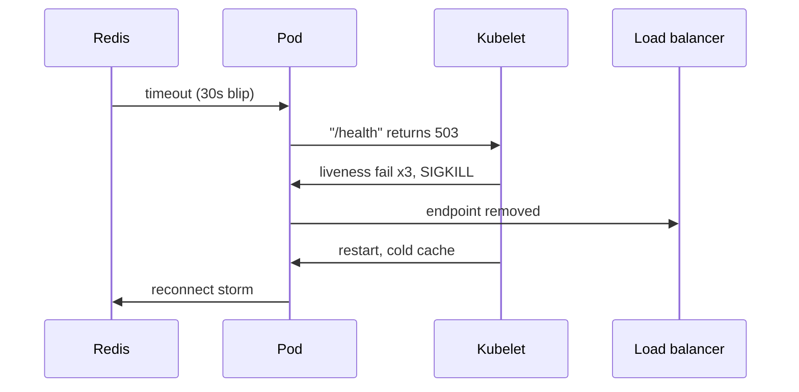
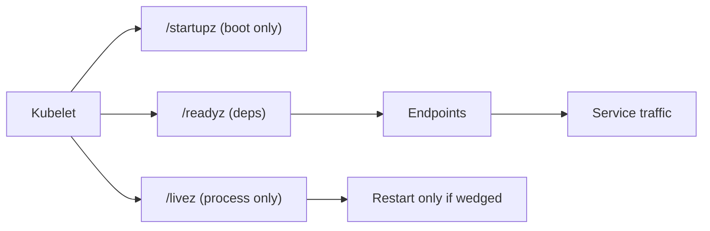

> **পরিস্থিতি** — Redis-এ ৩০ সেকেন্ডের hiccup হলো। প্রতিটি pod-এর `/health` Redis check করে, সব liveness probe fail করে, আর Kubernetes একসাথে পুরো fleet restart করে। ৩০ সেকেন্ডের dependency blip ৬ মিনিটের পূর্ণ outage হয়ে যায়।

## কেন গুরুত্বপূর্ণ

- Cluster-এ একমাত্র liveness probe-ই চলমান process মারার অনুমতি পায়। ভুল liveness মানে স্বয়ংক্রিয় outage generator।
- Readiness Endpoints-এর সদস্যপদ নিয়ন্ত্রণ করে, তাই মিথ্যা readiness এমন pod-এ traffic পাঠায় যে serve করতে পারে না — load balancer সেই 502 আপনার নামেই লিখবে।
- ধীরে start হওয়া app (JVM warmup, migration, cache priming) startup probe ছাড়া restart loop-এ মারা যায়, আর `CrashLoopBackOff` আসল কারণ লুকিয়ে ফেলে।
- Probe design-ই ঠিক করে rolling update অদৃশ্য থাকবে নাকি পাঁচ মিনিটের error spike হবে।

## লক্ষণ

| Signal | যা দেখবেন |
|---|---|
| `kubectl get pods` | একই timestamp-এ বহু pod-এ `RESTARTS` বাড়ছে |
| Pod events | `Liveness probe failed: HTTP probe failed with statuscode: 503` |
| Load balancer | প্রতিটি rollout-এর শুরুতে ১০-৩০ সেকেন্ড 502/504 spike |
| Rollout | log-এ pod সুস্থ দেখালেও `deployment ... exceeded its progress deadline` |
| Correlation | Restart-গুলো code deploy নয়, dependency incident-এর সাথে মেলে |

## কীভাবে ভাঙে

মূল ভুল হলো liveness আর readiness একই handler-এ পাঠানো, আর সেই handler-এ downstream dependency check করা। Liveness-এর উত্তর দেওয়া উচিত "এই process কি আটকে গেছে?" — শুধু process নিয়েই প্রশ্ন। Readiness উত্তর দেয় "এখন কি traffic নেব?" — সেটাতে dependency বিবেচনা করা যায়।

দুটোই Redis check করলে একটা blip প্রতিটি pod-কে unready করে (degraded mode অসম্ভব হলে যা ঠিক) *এবং* প্রতিটি pod মেরে ফেলে (যা কখনোই ঠিক নয়)। Restart Redis সারায় না; শুধু warm cache ও connection pool ফেলে দিয়ে reconnect-এর stampede তৈরি করে।



## মূল কারণ

1. Liveness ও readiness একই endpoint ব্যবহার করে যা external dependency check করে।
2. Startup probe নেই, তাই `initialDelaySeconds`-কে worst-case boot ঢাকতে হয় — হয় খুব ছোট নয়তো অকারণে বড়।
3. `failureThreshold: 1` আর ১ সেকেন্ড timeout, ফলে একটা GC pause-ই মৃত্যু হিসেবে গণ্য।
4. Probe endpoint user traffic-এর একই thread pool-এ চলে, তাই saturation-এর সময়েই probe fail করে — ঠিক যখন restart সবচেয়ে ক্ষতিকর।
5. `preStop` hook বা grace period নেই, তাই Endpoints থেকে সরানো আর SIGTERM-এর মধ্যে race হয়।

## কীভাবে সমাধান করবেন

### ১. তিনটি endpoint আলাদা করুন

```ts
// Express / Node example — no dependency calls in /livez
app.get('/livez', (_req, res) => res.status(200).send('ok'))

app.get('/readyz', async (_req, res) => {
  const [db, cache] = await Promise.all([pingDb(), pingCache()])
  if (!db) return res.status(503).json({ db, cache })   // hard dependency
  res.status(200).json({ db, cache })                    // cache is degradable
})

app.get('/startupz', (_req, res) =>
  res.status(migrationsDone && cacheWarmed ? 200 : 503).end(),
)
```

### ২. বাস্তবসম্মত threshold দিয়ে যুক্ত করুন

```yaml
startupProbe:
  httpGet: { path: /startupz, port: 8080 }
  periodSeconds: 5
  failureThreshold: 36          # allows 3 minutes of boot
livenessProbe:
  httpGet: { path: /livez, port: 8080 }
  periodSeconds: 10
  timeoutSeconds: 3
  failureThreshold: 3           # ~30s of genuine wedging
readinessProbe:
  httpGet: { path: /readyz, port: 8080 }
  periodSeconds: 5
  timeoutSeconds: 2
  failureThreshold: 2
  successThreshold: 1
```

Startup probe চলাকালীন liveness ও readiness স্থগিত থাকে — ধীর boot-এর জন্য ঠিক এটাই দরকার।

### ৩. মৃত্যুর আগে drain করুন

```yaml
lifecycle:
  preStop:
    exec:
      command: ["sh", "-c", "sleep 10"]
terminationGracePeriodSeconds: 45
```

এই sleep kube-proxy ও ingress controller-কে endpoint সরানোর সময় দেয়, তার আগেই process connection নেওয়া বন্ধ করে না।

### ৪. Cluster-এর ভেতর থেকে যাচাই করুন

```bash
kubectl describe pod api-7d9f -n prod | sed -n '/Events/,$p'
kubectl get endpoints api -n prod -o wide
kubectl run probe-test --rm -it --image=curlimages/curl -- \
  curl -sS -o /dev/null -w '%{http_code} %{time_total}\n' http://api.prod:8080/readyz
```

## কাঙ্ক্ষিত ডিজাইন



## Tradeoff

| Option | সুবিধা | খরচ | কখন বেছে নেবেন |
|---|---|---|---|
| সব probe-এ shared `/health` | একটাই endpoint রক্ষণাবেক্ষণ | dependency blip পুরো fleet restart করে | production-এ কখনোই নয় |
| শুধু process-এ liveness | কেবল আসল deadlock-এ restart | "alive কিন্তু অকেজো" অবস্থা ধরা পড়ে না | stateless service-এ default |
| Readiness-এ hard dependency | error দেওয়ার আগেই traffic বন্ধ | dependency পুরো গেলে service সম্পূর্ণ উধাও | dependency-র degraded mode নেই |
| Liveness একেবারেই না রাখা | restart-storm-এর ঝুঁকি শূন্য | wedged process page না আসা পর্যন্ত wedged থাকে | খুব স্বল্পায়ু বা বাইরে থেকে supervised workload |

## যাচাই checklist

- [ ] Database অগম্য থাকা অবস্থায় `/livez` 200 দেয় (network policy বা firewall drop দিয়ে যাচাই করুন)।
- [ ] Dependency মেরে দিলে pod `0/1 Ready` হয় কিন্তু `RESTARTS` আগের মানেই থাকে।
- [ ] সবচেয়ে ধীর node-এ cold start `startupProbe.failureThreshold × periodSeconds`-এর আগেই শেষ হয়।
- [ ] `kubectl rollout restart`-এর সময় synthetic traffic-এ শূন্য 502।
- [ ] Probe handler আপনার slow-query বা trace-latency dashboard-এ আসে না।
- [ ] Container exit-এর অন্তত ৫ সেকেন্ড আগে `kubectl get endpoints` pod বাদ দেয়।

## Anti-pattern

- `failureThreshold` ৩০ করে restart loop "ঠিক" করা — এটা ঘুরিয়ে liveness বন্ধ করারই নামান্তর।
- Readiness-এ প্রতিটি downstream service check করা, ফলে একটা flaky third-party API পুরো Endpoints তালিকা খালি করে দেয়।
- ২০০ pod-এ প্রতি ৫ সেকেন্ডে চলা probe-এ ব্যয়বহুল query (`SELECT count(*)`) চালানো।
- HTTP service-এ TCP probe ব্যবহার: app request route করার অনেক আগেই socket accept করে।
- Startup probe-এর বদলে `initialDelaySeconds: 120` দেওয়া, যা প্রতিটি বৈধ restart দুই মিনিট পিছিয়ে দেয়।

## সম্পর্কিত

- [Kubernetes rollout failure modes](/systems/devops-containers/k8s-rollout-failure-modes)
- [Node draining and disruption budgets](/systems/devops-containers/node-draining-and-disruption-budgets)
- [OOMKilled and resource limits](/systems/devops-containers/oom-and-resource-limits)
