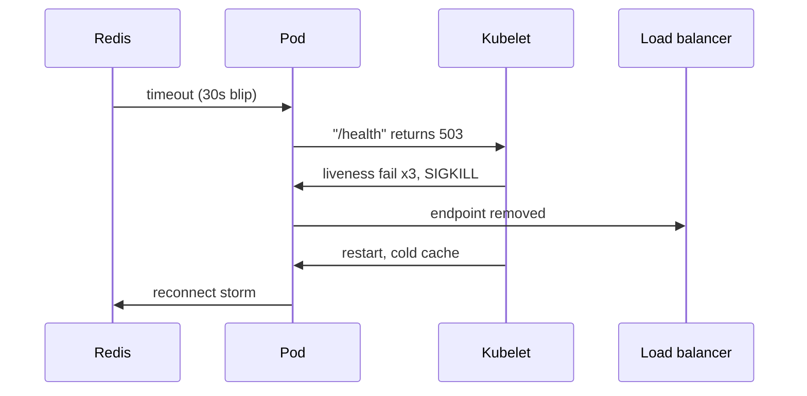
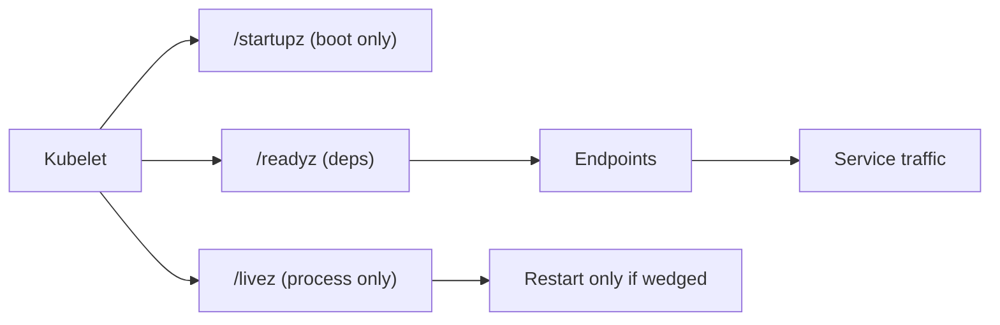

> **Scenario** — Redis has a 30-second hiccup. Every pod's `/health` endpoint checks Redis, every liveness probe fails, and Kubernetes restarts the entire fleet at once. A 30-second dependency blip becomes a 6-minute full outage.

## Why it matters

- Liveness probes are the only thing in your cluster authorised to kill a running process. A wrong one is an automated outage generator.
- Readiness controls Endpoints membership, so a lying readiness probe routes traffic to pods that cannot serve it — 502s the load balancer will happily report as your fault.
- Slow-starting apps (JVM warmup, migrations, cache priming) get killed in a restart loop without a startup probe, and `CrashLoopBackOff` hides the real cause.
- Probe design decides whether a rolling update is invisible or a five-minute error spike.

## Symptoms

| Signal | What you observe |
|---|---|
| `kubectl get pods` | `RESTARTS` climbing across many pods at the same timestamp |
| Pod events | `Liveness probe failed: HTTP probe failed with statuscode: 503` |
| Load balancer | 502/504 spikes for 10-30s at the start of every rollout |
| Rollout | `deployment ... exceeded its progress deadline` while pods look healthy in logs |
| Correlation | Restarts cluster around a dependency incident, not around a code deploy |

## How it breaks

The core mistake is pointing liveness and readiness at the same handler, and making that handler check downstream dependencies. Liveness should answer "is this process wedged?" — a question only about the process itself. Readiness answers "should I get traffic right now?" — that one may consider dependencies.

When both check Redis, a dependency blip flips every pod unready (correct, if degraded operation is impossible) *and* kills every pod (never correct). Restarting does not fix Redis; it just throws away warm caches and connection pools and forces a stampede of reconnects.



## Root causes

1. Liveness and readiness share one endpoint that checks external dependencies.
2. No startup probe, so `initialDelaySeconds` must cover worst-case boot and ends up either too short or uselessly long.
3. `failureThreshold: 1` with a 1-second timeout, so a single GC pause counts as death.
4. The probe endpoint runs on the same thread pool as user traffic, so saturation makes probes fail exactly when you can least afford restarts.
5. No `preStop` hook or grace period, so removal from Endpoints races with the SIGTERM.

## How to solve it

### 1. Separate the three endpoints

```ts
// Express / Node example — no dependency calls in /livez
app.get('/livez', (_req, res) => res.status(200).send('ok'))

app.get('/readyz', async (_req, res) => {
  const [db, cache] = await Promise.all([pingDb(), pingCache()])
  if (!db) return res.status(503).json({ db, cache })   // hard dependency
  res.status(200).json({ db, cache })                    // cache is degradable
})

app.get('/startupz', (_req, res) =>
  res.status(migrationsDone && cacheWarmed ? 200 : 503).end(),
)
```

### 2. Wire them with realistic thresholds

```yaml
startupProbe:
  httpGet: { path: /startupz, port: 8080 }
  periodSeconds: 5
  failureThreshold: 36          # allows 3 minutes of boot
livenessProbe:
  httpGet: { path: /livez, port: 8080 }
  periodSeconds: 10
  timeoutSeconds: 3
  failureThreshold: 3           # ~30s of genuine wedging
readinessProbe:
  httpGet: { path: /readyz, port: 8080 }
  periodSeconds: 5
  timeoutSeconds: 2
  failureThreshold: 2
  successThreshold: 1
```

While a startup probe is running, liveness and readiness are suspended — that is exactly what you want for slow boots.

### 3. Drain before you die

```yaml
lifecycle:
  preStop:
    exec:
      command: ["sh", "-c", "sleep 10"]
terminationGracePeriodSeconds: 45
```

The sleep gives kube-proxy and the ingress controller time to drop the endpoint before the process stops accepting connections.

### 4. Verify from inside the cluster

```bash
kubectl describe pod api-7d9f -n prod | sed -n '/Events/,$p'
kubectl get endpoints api -n prod -o wide
kubectl run probe-test --rm -it --image=curlimages/curl -- \
  curl -sS -o /dev/null -w '%{http_code} %{time_total}\n' http://api.prod:8080/readyz
```

## Target design



## Tradeoffs

| Option | Pros | Cons | Choose when |
|---|---|---|---|
| Shared `/health` for all probes | One endpoint to maintain | Dependency blips restart the fleet | Never in production |
| Liveness on process only | Restarts only real deadlocks | Misses "alive but useless" states | Default for stateless services |
| Readiness includes hard deps | Traffic stops before errors | Total dependency loss makes the service disappear entirely | Deps have no degraded mode |
| No liveness probe at all | Zero restart-storm risk | Wedged processes stay wedged until paged | Very short-lived or externally supervised workloads |

## Verification checklist

- [ ] `/livez` returns 200 while the database is unreachable (verify with a network policy or firewall drop).
- [ ] Killing the dependency flips pods to `0/1 Ready` but `RESTARTS` stays at its previous value.
- [ ] Cold start on the slowest node completes before `startupProbe.failureThreshold × periodSeconds`.
- [ ] During `kubectl rollout restart`, synthetic traffic shows zero 502s.
- [ ] Probe handlers do not appear in your slow-query or trace-latency dashboards.
- [ ] `kubectl get endpoints` drops the pod at least 5s before the container exits.

## Anti-patterns

- Fixing restart loops by raising `failureThreshold` to 30 — that just disables liveness with extra steps.
- Checking every downstream service in readiness, so one flaky third-party API can empty your Endpoints list.
- Running expensive queries (`SELECT count(*)`) in a probe that fires every 5 seconds across 200 pods.
- Using TCP probes for HTTP services: the socket accepts long before the app can route a request.
- Setting `initialDelaySeconds: 120` instead of a startup probe, delaying every legitimate restart by two minutes.

## Related

- [Kubernetes rollout failure modes](/systems/devops-containers/k8s-rollout-failure-modes)
- [Node draining and disruption budgets](/systems/devops-containers/node-draining-and-disruption-budgets)
- [OOMKilled and resource limits](/systems/devops-containers/oom-and-resource-limits)
