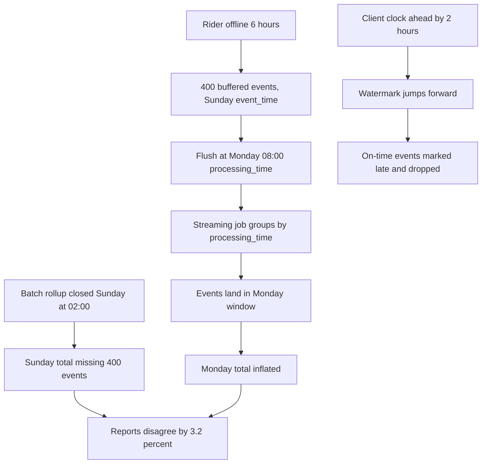
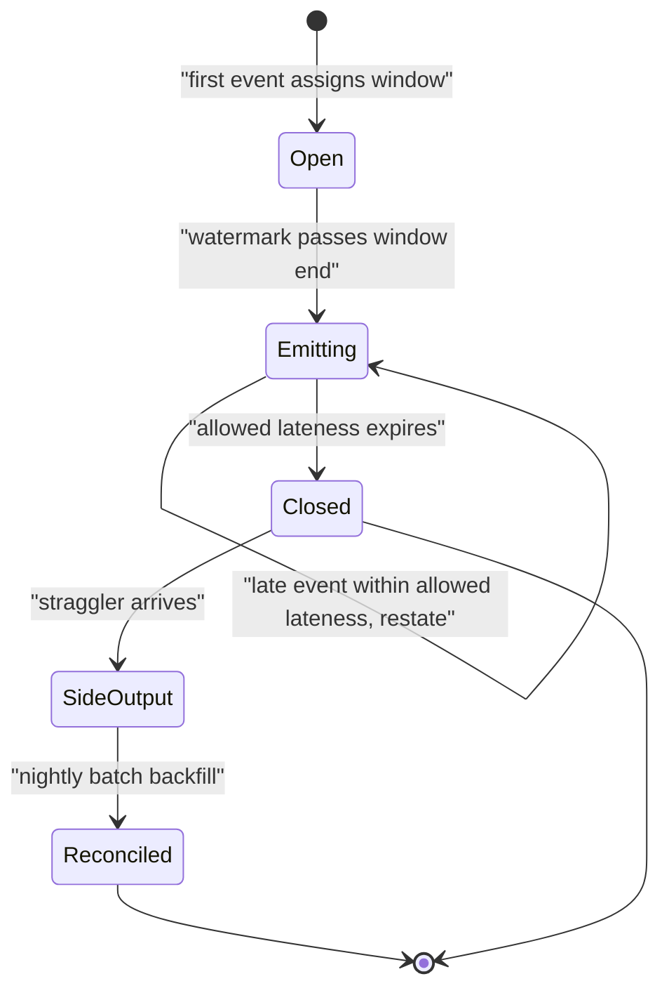

> **Scenario** - একটি delivery app rider offline থাকলে event buffer করে। সোমবার একজন rider basement car park-এ ছয় ঘণ্টা কাটিয়ে reconnect করে রবিবারের timestamp সহ ৪০০টি event flush করল। রবিবারের daily revenue rollup ইতিমধ্যেই ০২:০০-এ বন্ধ হয়েছে, streaming job সবকিছু সোমবারের window-এ দিয়েছে, আর দুটি report এখন ৩.২% আলাদা।

## Why it matters

- Event time ও processing time স্বাভাবিক দিনে মিনিটে, আর incident, offline client বা consumer lag-এ ঘণ্টায় আলাদা হয়। তাই প্রতিটি window boundary একটি correctness সিদ্ধান্ত।
- Window খুব আগে বন্ধ করলে data হারায়। খুব পরে বন্ধ করলে state ধরে রাখে ও প্রতিটি downstream consumer দেরি করে। দুটোই এড়ানোর কোনো setting নেই।
- দুই system ভিন্ন lateness policy-তে একই metric হিসাব করলে সবসময় অমিল হবে, আর হাতে মেলানো মাসিক নিয়মিত কাজ হয়ে যাবে।
- ML label সবচেয়ে বেশি exposed: ৪৮ ঘণ্টা দেরিতে আসা একটি conversion হলো positive label, যা training set negative হিসেবে লিখে রেখেছে।
- Retry করা client-এর duplicate delivery একই event time কিন্তু ভিন্ন processing time-এ আসে, তাই dedupe ও lateness একসঙ্গে সমাধান করতে হয়।

## Symptoms

| Signal | What you observe |
| --- | --- |
| Report অমিল | batch daily total ও streaming daily total ১–৫% আলাদা, সবসময় একই দিকে |
| বন্ধ দিনের tail বাড়ে | রবিবারের row count মঙ্গল ও বুধবারেও বাড়তে থাকে |
| Window misassignment | রবিবারের `occurred_at` সহ event সোমবারের aggregate-এ |
| Dropped-late counter বাড়ছে | streaming job-এর `late_dropped` metric শূন্য নয়, কারও কোনো threshold নেই |
| Negative time delta | client clock এগিয়ে থাকায় `processing_ts - event_ts` মাঝেমধ্যে ঋণাত্মক |
| Label flip | training-এ `converted = false` লেখা row একদিন পরে warehouse-এ `true` |

## How it breaks

বেশিরভাগ pipeline processing time দিয়ে শুরু করে, কারণ সেটা সবসময় পাওয়া যায় ও monotonic। Aggregate হয় `GROUP BY DATE_TRUNC('day', ingested_at)` - শান্ত দিনে ঠিক, প্রতিটি backlog-এ ভুল।

Event time-এ গেলে দ্বিতীয় সমস্যা সামনে আসে: window কখন final তা ঠিক করতে হবে। Watermark ছাড়া job হয় প্রতিটি window চিরকাল খোলা রাখে (unbounded state), নয় নির্দিষ্ট wall-clock সময়ে বন্ধ করে (late event নীরবে drop)। Client clock skew আরও খারাপ করে - event ভবিষ্যতের timestamp নিয়ে আসতে পারে, আর `max(event_time)` হিসেবে naive watermark সামনে লাফিয়ে বৈধ event-কে সাথে সাথে late চিহ্নিত করে।



## Root causes

1. সুবিধার জন্য processing time-এ aggregate করে সেটাকে event-time metric বলা।
2. Watermark নেই, তাই lateness-এর কোনো definition ও bound নেই।
3. Clamping ছাড়া অবিশ্বস্ত client timestamp থেকে watermark, তাই একটি খারাপ clock সবার জন্য সেটা এগিয়ে দেয়।
4. Allowed lateness আসল client offline distribution-এর চেয়ে ছোট (যেমন p99 ছয় ঘণ্টা হলেও ৫ মিনিট)।
5. Late event side output-এ না গিয়ে drop হয়, তাই কী হারিয়েছে তার record নেই।
6. Reconciliation job নেই, তাই batch ও streaming ফল কখনও তুলনা হয় না, drift অলক্ষ্যে থাকে।

## How to solve it

### 1. দুটো timestamp বহন করুন, কখনও মেলাবেন না

প্রতিটি event-এ `event_ts` (client-এ কখন ঘটেছে), `ingested_ts` (আপনার system কখন পেয়েছে) এবং সম্ভব হলে `emitted_ts` (client কখন পাঠিয়েছে) দরকার। এদের delta-ই আপনার lateness distribution।

```sql
SELECT
  WIDTH_BUCKET(
    EXTRACT(EPOCH FROM (ingested_ts - event_ts)) / 60.0, 0, 720, 24
  ) * 30                                            AS lateness_bucket_minutes,
  COUNT(*)                                          AS events,
  ROUND(100.0 * COUNT(*) / SUM(COUNT(*)) OVER (), 3) AS pct
FROM raw.rider_events
WHERE ingested_ts >= NOW() - INTERVAL '30 days'
  AND ingested_ts >= event_ts
GROUP BY 1
ORDER BY 1;
```

Allowed-lateness ঠিক করার আগে এটা চালান। "৫ মিনিটই যথেষ্ট" অনুমান করেই মানুষ production-এ ছয় ঘণ্টার tail আবিষ্কার করে।

### 2. যুক্তিসঙ্গত watermark হিসাব করুন

```python
from dataclasses import dataclass, field
from datetime import datetime, timedelta, timezone


@dataclass
class Watermark:
    """Bounded out-of-orderness watermark with clock-skew clamping."""

    max_out_of_orderness: timedelta
    max_future_skew: timedelta = timedelta(minutes=2)
    _max_seen: datetime = field(
        default_factory=lambda: datetime(1970, 1, 1, tzinfo=timezone.utc)
    )

    def observe(self, event_ts: datetime, ingested_ts: datetime) -> None:
        # A client clock ahead of ours must not drag the watermark forward.
        ceiling = ingested_ts + self.max_future_skew
        effective = min(event_ts, ceiling)
        if effective > self._max_seen:
            self._max_seen = effective

    @property
    def value(self) -> datetime:
        return self._max_seen - self.max_out_of_orderness

    def is_late(self, event_ts: datetime) -> bool:
        return event_ts < self.value
```

`ingested_ts + max_future_skew`-এর বিরুদ্ধে clamp করার অংশটাই মানুষ বাদ দেয়, আর ঠিক এটাই একটি ভুল clock-এর ফোনকে বাকি সবার এক ঘণ্টার event ফেলে দেওয়া থেকে আটকায়।

### 3. Event time-এ window করুন, allowed lateness স্পষ্ট রাখুন

```python
from collections import defaultdict
from datetime import datetime, timedelta


class EventTimeAggregator:
    def __init__(self, window: timedelta, allowed_lateness: timedelta,
                 watermark: Watermark):
        self.window = window
        self.allowed_lateness = allowed_lateness
        self.watermark = watermark
        self.state: dict[datetime, dict[str, float]] = defaultdict(
            lambda: {"amount": 0.0, "count": 0.0}
        )
        self.side_output: list[dict] = []
        self.closed: set[datetime] = set()

    def _window_start(self, ts: datetime) -> datetime:
        epoch = int(ts.timestamp())
        size = int(self.window.total_seconds())
        return datetime.fromtimestamp(epoch - (epoch % size), tz=ts.tzinfo)

    def add(self, event: dict) -> None:
        self.watermark.observe(event["event_ts"], event["ingested_ts"])
        start = self._window_start(event["event_ts"])
        if start in self.closed:
            # Too late to update the window: record it, do not silently drop.
            self.side_output.append({**event, "reason": "after_allowed_lateness"})
            return
        bucket = self.state[start]
        bucket["amount"] += event["amount"]
        bucket["count"] += 1

    def emit_ready(self) -> list[dict]:
        cutoff = self.watermark.value - self.allowed_lateness
        ready = []
        for start in sorted(self.state):
            if start + self.window <= cutoff:
                ready.append({"window_start": start, **self.state.pop(start)})
                self.closed.add(start)
        return ready
```

লক্ষ্য করুন window emit করা আর বন্ধ করা এক নয়। Watermark-এ emit করুন যাতে consumer সময়মতো সংখ্যা পায়; `allowed_lateness` শেষ হওয়া পর্যন্ত update নিতে থাকুন, তারপর বন্ধ করে straggler side output-এ পাঠান।

### 4. Downstream sink-কে restatement গ্রহণে সক্ষম করুন

Late update কাজে আসে শুধু যদি sink সংশোধন করা যায়। Window-keyed `MERGE` দিয়ে ফল লিখুন, প্রতিটি emission আগের value overwrite করবে।

```sql
MERGE INTO analytics.revenue_by_hour AS t
USING (SELECT :window_start AS window_start, :amount AS amount,
              :count AS event_count, :emitted_at AS emitted_at) AS s
   ON t.window_start = s.window_start
WHEN MATCHED THEN UPDATE SET amount = s.amount, event_count = s.event_count,
                             emitted_at = s.emitted_at, restatement_count = t.restatement_count + 1
WHEN NOT MATCHED THEN INSERT (window_start, amount, event_count, emitted_at, restatement_count)
                      VALUES (s.window_start, s.amount, s.event_count, s.emitted_at, 0);
```

`restatement_count` সস্তা এবং বলে দেয় কোন ঘণ্টাগুলো এখনও নড়ছে।

### 5. Batch job দিয়ে reconcile করুন

একই event-time window-এ রাতের batch aggregate চালান, lookback p99.9 lateness কভার করার মতো দীর্ঘ রাখুন, আর streaming table-এর সঙ্গে diff করুন। এই diff-ই আপনার correctness SLI।

### 6. ML label explicit maturity window দিয়ে freeze করুন

Conversion ৪৮ ঘণ্টা দেরিতে আসতে পারলে event-এর ৪৮ ঘণ্টা পরেই label final। শুধু matured label-এ train করুন, আর maturity window model metadata-তে লিখুন যাতে কেউ ২-ঘণ্টা-matured evaluation-কে ৪৮-ঘণ্টার সঙ্গে তুলনা না করে।

## Target design



## Tradeoffs

| Option | Pros | Cons | Choose when |
| --- | --- | --- | --- |
| Processing-time window | তুচ্ছ সরল, bounded state, কখনও late নয় | যেকোনো backlog-এ ভুল; reproducible নয় | pipeline নিজের সম্পর্কে operational metric |
| Event-time + ছোট lateness (মিনিট) | fresh, ছোট state | offline-client tail ফেলে দেয় | client server বা always-online |
| Event-time + দীর্ঘ lateness (ঘণ্টা) | আসল tail ধরে | বড় state; consumer restatement দেখে | offline buffering সহ mobile বা IoT client |
| Streaming + রাতের batch reconcile | fresh ও অবশেষে নিখুঁত | দুই implementation aligned রাখতে হয় | freshness requirement সহ finance-grade সংখ্যা |
| Append-only + as-of query | restatement নেই; পূর্ণ audit | consumer-কে time-aware query লিখতে হয় | auditability-ই প্রধান শর্ত |

## Verification checklist

- [ ] ৩০ দিনের `ingested_ts - event_ts` histogram আঁকুন; allowed-lateness p99.9 কভার করে কি না দেখুন।
- [ ] ছয় ঘণ্টা পুরনো timestamp সহ batch replay করুন; সঠিক event-time window-এ পড়ে কি না দেখুন।
- [ ] তিন দিন ভবিষ্যতের timestamp সহ event ঢোকান; watermark লাফায় না ও event clamp হয় তা নিশ্চিত করুন।
- [ ] Late side output কোথাও query করা যায় এমনভাবে লেখা হয়, count metric ও alert threshold সহ।
- [ ] শেষ ৭ দিনের streaming vs batch total diff করুন; delta documented tolerance-এর মধ্যে।
- [ ] Allowed lateness-এর চেয়ে পুরনো window-এর `restatement_count` স্থির।
- [ ] Model training শুধু matured label নেয় ও maturity window metadata-তে লেখা আছে।

## Anti-patterns

- Business metric-এ `ingested_at` আর engineering metric-এ event time - দুই dashboard কখনও মিলবে না।
- State ছোট রাখতে allowed lateness শূন্য করা, তারপর `late_dropped` counter-কে informational ধরা।
- Clamping ছাড়া client timestamp বিশ্বাস করা। একটি ভুল clock-এর device পুরো stream-এর watermark নষ্ট করতে পারে।
- Partition জুড়ে minimum না নিয়ে per-partition maximum থেকে watermark বানানো; তখন idle partition আটকায় বা active partition এগিয়ে যায়।
- Lateness p99 ছয় ঘণ্টা + incident time হলেও নির্দিষ্ট ১ দিনের lookback দিয়ে "গতকাল" পুনর্গণনা।
- শুধু `event_ts`-এ dedupe করা। দুটি বৈধ event একই timestamp ভাগ করতে পারে; event id-তে dedupe করুন।

## Related

- [Batch vs streaming: picking the cheaper correctness](/systems/data-pipelines-ml/batch-vs-streaming-pipelines)
- [Idempotent backfills that can be re-run safely](/systems/data-pipelines-ml/idempotent-backfills)
- [Feature store consistency: offline vs online](/systems/data-pipelines-ml/feature-store-consistency)
- [Pipeline orchestration retries that do not amplify](/systems/data-pipelines-ml/pipeline-orchestration-retries)
