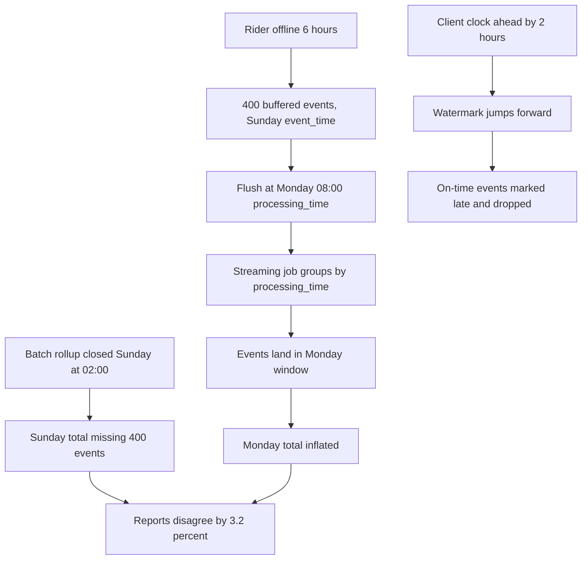
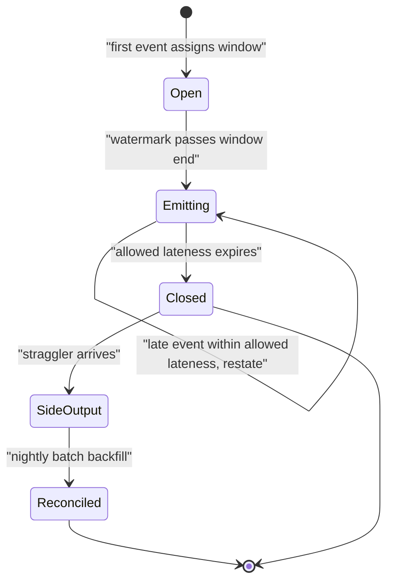

> **Scenario** — A delivery app buffers events while riders are offline. On Monday a rider reconnects after six hours in a basement car park and flushes 400 events with Sunday timestamps. The daily revenue rollup for Sunday already closed at 02:00, the streaming job assigned everything to Monday's window, and two reports now disagree by 3.2%.

## Why it matters

- Event time and processing time diverge by minutes normally and by hours during incidents, offline clients, or consumer lag. Every window boundary is therefore a correctness decision.
- Closing a window too early loses data. Closing it too late holds state and delays every downstream consumer. There is no setting that avoids both.
- Two systems computing the same metric with different lateness policies will always disagree, and reconciling them by hand becomes a recurring monthly task.
- ML labels are especially exposed: a conversion that arrives 48 hours late is a positive label that the training set recorded as negative.
- Duplicate deliveries from a retrying client arrive with the same event time but at different processing times, so dedupe and lateness must be solved together.

## Symptoms

| Signal | What you observe |
| --- | --- |
| Report disagreement | Batch daily total and streaming daily total differ by 1–5%, always in the same direction |
| Growing tail on closed days | Sunday's row count keeps increasing on Tuesday and Wednesday |
| Window misassignment | Events with `occurred_at` on Sunday appear in Monday's aggregate |
| Dropped-late counter climbing | The streaming job's `late_dropped` metric is non-zero and nobody has a threshold for it |
| Negative time deltas | `processing_ts - event_ts` is occasionally negative because a client clock is ahead |
| Label flips | A row labelled `converted = false` at training time becomes `true` in the warehouse a day later |

## How it breaks

Most pipelines start by using processing time, because it is always available and monotonic. The aggregate is `GROUP BY DATE_TRUNC('day', ingested_at)`, which is correct on a quiet day and wrong during every backlog.

Switching to event time exposes the second problem: you must decide when a window is final. Without a watermark, the job either keeps every window open forever (unbounded state) or closes on a fixed wall-clock schedule (drops late events silently). Client clock skew makes it worse — an event can arrive with a timestamp in the future, and a naive watermark computed as `max(event_time)` jumps forward and immediately marks legitimate events as late.



## Root causes

1. Aggregating on processing time because it is convenient, then calling the result an event-time metric.
2. No watermark, so lateness has no definition and no bound.
3. Watermark derived from untrusted client timestamps with no clamping, so one bad clock advances it for everyone.
4. Allowed lateness shorter than the real client offline distribution (for example 5 minutes when the p99 is 6 hours).
5. Late events dropped instead of routed to a side output, so there is no record of what was lost.
6. No reconciliation job, so batch and streaming results are never compared and drift goes unnoticed.

## How to solve it

### 1. Carry both timestamps and never conflate them

Every event needs `event_ts` (when it happened, from the client), `ingested_ts` (when your system received it), and ideally `emitted_ts` (when the client sent it). The delta between them is your lateness distribution.

```sql
SELECT
  WIDTH_BUCKET(
    EXTRACT(EPOCH FROM (ingested_ts - event_ts)) / 60.0, 0, 720, 24
  ) * 30                                            AS lateness_bucket_minutes,
  COUNT(*)                                          AS events,
  ROUND(100.0 * COUNT(*) / SUM(COUNT(*)) OVER (), 3) AS pct
FROM raw.rider_events
WHERE ingested_ts >= NOW() - INTERVAL '30 days'
  AND ingested_ts >= event_ts
GROUP BY 1
ORDER BY 1;
```

Run this before choosing an allowed-lateness value. Guessing "5 minutes should be enough" is how you discover the 6-hour tail in production.

### 2. Compute a defensible watermark

```python
from dataclasses import dataclass, field
from datetime import datetime, timedelta, timezone


@dataclass
class Watermark:
    """Bounded out-of-orderness watermark with clock-skew clamping."""

    max_out_of_orderness: timedelta
    max_future_skew: timedelta = timedelta(minutes=2)
    _max_seen: datetime = field(
        default_factory=lambda: datetime(1970, 1, 1, tzinfo=timezone.utc)
    )

    def observe(self, event_ts: datetime, ingested_ts: datetime) -> None:
        # A client clock ahead of ours must not drag the watermark forward.
        ceiling = ingested_ts + self.max_future_skew
        effective = min(event_ts, ceiling)
        if effective > self._max_seen:
            self._max_seen = effective

    @property
    def value(self) -> datetime:
        return self._max_seen - self.max_out_of_orderness

    def is_late(self, event_ts: datetime) -> bool:
        return event_ts < self.value
```

The clamp against `ingested_ts + max_future_skew` is the part people skip, and it is exactly what stops one phone with a wrong clock from dropping an hour of everyone else's events.

### 3. Window on event time with explicit allowed lateness

```python
from collections import defaultdict
from datetime import datetime, timedelta


class EventTimeAggregator:
    def __init__(self, window: timedelta, allowed_lateness: timedelta,
                 watermark: Watermark):
        self.window = window
        self.allowed_lateness = allowed_lateness
        self.watermark = watermark
        self.state: dict[datetime, dict[str, float]] = defaultdict(
            lambda: {"amount": 0.0, "count": 0.0}
        )
        self.side_output: list[dict] = []
        self.closed: set[datetime] = set()

    def _window_start(self, ts: datetime) -> datetime:
        epoch = int(ts.timestamp())
        size = int(self.window.total_seconds())
        return datetime.fromtimestamp(epoch - (epoch % size), tz=ts.tzinfo)

    def add(self, event: dict) -> None:
        self.watermark.observe(event["event_ts"], event["ingested_ts"])
        start = self._window_start(event["event_ts"])
        if start in self.closed:
            # Too late to update the window: record it, do not silently drop.
            self.side_output.append({**event, "reason": "after_allowed_lateness"})
            return
        bucket = self.state[start]
        bucket["amount"] += event["amount"]
        bucket["count"] += 1

    def emit_ready(self) -> list[dict]:
        cutoff = self.watermark.value - self.allowed_lateness
        ready = []
        for start in sorted(self.state):
            if start + self.window <= cutoff:
                ready.append({"window_start": start, **self.state.pop(start)})
                self.closed.add(start)
        return ready
```

Note that emitting a window is not the same as closing it. Emit at the watermark so consumers get timely numbers; keep accepting updates until `allowed_lateness` expires, then close and route stragglers to the side output.

### 4. Make downstream sinks accept restatements

Late updates only help if the sink can be corrected. Write windowed results with `MERGE` keyed on the window, and let each emission overwrite the previous value.

```sql
MERGE INTO analytics.revenue_by_hour AS t
USING (SELECT :window_start AS window_start, :amount AS amount,
              :count AS event_count, :emitted_at AS emitted_at) AS s
   ON t.window_start = s.window_start
WHEN MATCHED THEN UPDATE SET amount = s.amount, event_count = s.event_count,
                             emitted_at = s.emitted_at, restatement_count = t.restatement_count + 1
WHEN NOT MATCHED THEN INSERT (window_start, amount, event_count, emitted_at, restatement_count)
                      VALUES (s.window_start, s.amount, s.event_count, s.emitted_at, 0);
```

`restatement_count` is cheap and tells you which hours are still moving.

### 5. Reconcile with a batch job

Run a nightly batch aggregate over the same event-time windows, with a lookback long enough to cover the p99.9 lateness, and diff it against the streaming table. The diff is your correctness SLI.

### 6. Freeze ML labels with an explicit maturity window

If conversions can arrive 48 hours late, a label is not final until 48 hours after the event. Train on matured labels only, and record the maturity window in the model metadata so nobody compares a 2-hour-matured evaluation against a 48-hour one.

## Target design



## Tradeoffs

| Option | Pros | Cons | Choose when |
| --- | --- | --- | --- |
| Processing-time windows | Trivial, bounded state, never late | Wrong during any backlog; not reproducible | Operational metrics about the pipeline itself |
| Event-time + short lateness (minutes) | Fresh, small state | Drops the offline-client tail | Clients are servers or always-online |
| Event-time + long lateness (hours) | Captures the real tail | Large state; consumers see restatements | Mobile or IoT clients with offline buffering |
| Streaming + nightly batch reconcile | Fresh and eventually exact | Two implementations to keep aligned | Finance-grade numbers with a freshness requirement |
| Append-only with as-of queries | No restatements; full audit | Consumers must write time-aware queries | Auditability is the primary requirement |

## Verification checklist

- [ ] Plot the `ingested_ts - event_ts` histogram over 30 days; confirm the allowed-lateness setting covers p99.9.
- [ ] Replay a batch with timestamps 6 hours old; confirm they land in the correct event-time window.
- [ ] Inject an event with a timestamp 3 days in the future; confirm the watermark does not jump and the event is clamped.
- [ ] Confirm the late side output is written somewhere queryable, with a count metric and an alert threshold.
- [ ] Diff streaming vs batch totals for the last 7 days; the delta is within the documented tolerance.
- [ ] Confirm `restatement_count` for windows older than the allowed lateness is stable.
- [ ] Confirm model training filters to matured labels and the maturity window is recorded in metadata.

## Anti-patterns

- Using `ingested_at` for business metrics and event time for engineering metrics — the two dashboards will never agree.
- Setting allowed lateness to zero to keep state small, then treating the `late_dropped` counter as informational.
- Trusting client timestamps without clamping. One device with a wrong clock can poison the watermark for the whole stream.
- Deriving the watermark from a per-partition maximum without taking the minimum across partitions; an idle partition then stalls or an active one races ahead.
- Recomputing "yesterday" with a fixed 1-day lookback when the lateness p99 is 6 hours plus incident time.
- Deduping on `event_ts` alone. Two legitimate events can share a timestamp; dedupe on an event id.

## Related

- [Batch vs streaming: picking the cheaper correctness](/systems/data-pipelines-ml/batch-vs-streaming-pipelines)
- [Idempotent backfills that can be re-run safely](/systems/data-pipelines-ml/idempotent-backfills)
- [Feature store consistency: offline vs online](/systems/data-pipelines-ml/feature-store-consistency)
- [Pipeline orchestration retries that do not amplify](/systems/data-pipelines-ml/pipeline-orchestration-retries)
