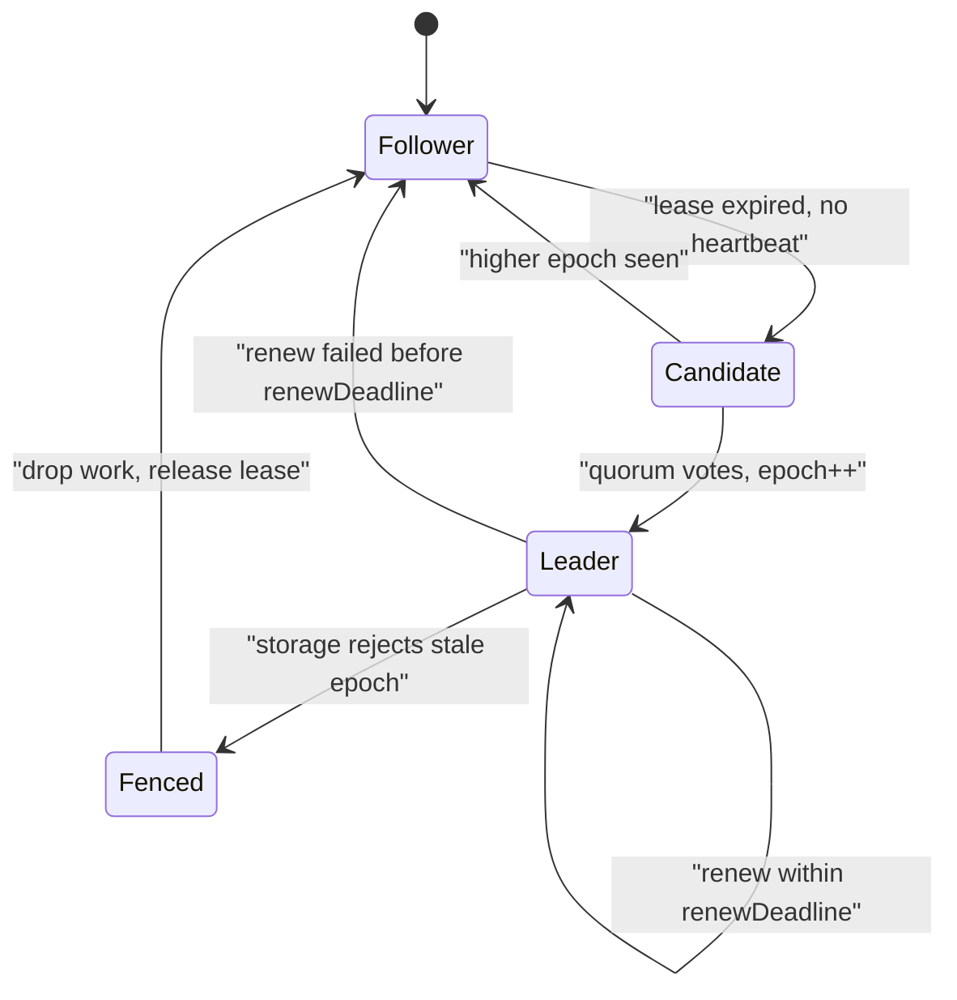

> **Scenario** - "রাতের billing job একটাই instance চালাবে" নিশ্চিত করতে batch scheduler Redis lock ব্যবহার করে। রাত ০২:১৪-তে ৬.৮ সেকেন্ডের GC pause বর্তমান leader-কে জমিয়ে দেয়; lock expire হয়, দ্বিতীয় instance দায়িত্ব নেয়, আর প্রথমটি জেগে উঠে invoice লেখা চালিয়ে যায়। Customer দুইবার bill পায়।

## Why it matters

- Leader election singleton cron job, database primary, Kafka partition leader, shard owner আর stream processor-এর পেছনের যন্ত্র। ভুল leader মানে ধীরগতি নয় - duplicate বা corrupt data।
- প্রতিটি re-election আসল unavailability খরচ করে: এক election timeout + leader warm-up। ৩ সেকেন্ড timeout-এ প্রতি ৩০ সেকেন্ডে flap মানে ১০% availability loss, যা কোনো health check দেখায় না।
- বিপজ্জনক অবস্থা "leader নেই" (জোরে, স্পষ্ট, নিজে সারে) নয়, বরং "দুই leader দুজনেই নিজেকে বৈধ ভাবছে" (নীরব, আর পূর্ণ throughput-এ data নষ্ট করে)।
- Timeout tuning-এই বেশিরভাগ দল ভুল করে: LAN-এ দ্রুত detection ধরে tune করে, তারপর co-tenanted CPU নিয়ে availability zone জুড়ে চালায়।

## Symptoms

| Signal | What you observe |
|---|---|
| Leadership metric | `leader_changes_total` নিয়মিত বাড়ছে; term/epoch হাজারে উঠছে |
| Duplicate work | দুই instance একই job id log করছে; downstream insert-এ unique constraint violation |
| Lock TTL logs | `lock lost`-এর ঠিক পরেই অন্য host-এ `lock acquired` |
| GC / STW pause | `jvm_gc_pause_seconds` বা Go `gc_pause` p99 lease TTL-এর কাছে বা উপরে |
| Election converge করে না | term বাড়তে থাকা বারবার `RequestVote`, কোনো winner নেই - সাধারণত partial partition |
| Zombie writes | বর্তমানের চেয়ে কম epoch-এর node থেকে write, store সেটা মেনে নিচ্ছে |
| Failover latency | configured timeout-এর অনেক বেশি recovery time, কারণ DNS/connection pool পুরনো leader cache করেছে |

## How it breaks

এক নামের নিচে দুইটি আলাদা failure লুকানো।

**Flapping.** Election timeout সুস্থ leader-এর সর্বোচ্চ stall নিয়ে বাজি। timeout-এর চেয়ে বেশি সময় process থামায় এমন যেকোনো কিছু মৃত্যুর মতোই দেখায়: stop-the-world GC pause, আটকে যাওয়া `fsync`, Kubernetes CPU limit থেকে throttling (`limits.cpu: 500m` container-এর ৬০০m দরকার হলে প্রতি ১০০ms period-এর ৪০ms সে থেমে আছে), বা VM live-migration freeze। leader বেঁচে আছে, leadership হারায়, আবার নেয় - আর cluster কাজের বদলে election-এ সময় দেয়।

**Expired lease-এর split brain.** TTL সহ lock আসলে lease, আর lease শুধু তখনই mutual exclusion দেয় যখন holder *resource*-এর কাছে liveness প্রমাণ করতে পারে, শুধু lock service-এর কাছে নয়। ক্লাসিক ধারা: leader A ১০s lease নেয়, ১২s pause করে, lease expire হয়, B নেয়, A ফিরে এসে এমন write পাঠায় যেটাকে সে protected ভাবে। A-ও জানে না, database-ও জানে না A-র lease মৃত।

```mermaid
sequenceDiagram
    participant A as "Instance A (leader)"
    participant L as "Lock service"
    participant DB as "Storage"
    participant B as "Instance B"
    A->>L: "acquire lease, TTL 10s"
    L-->>A: "granted, epoch 41"
    Note over A: "GC pause 12s"
    L->>L: "lease expires at 10s"
    B->>L: "acquire lease"
    L-->>B: "granted, epoch 42"
    B->>DB: "write invoice (epoch 42)"
    Note over A: "resumes, still believes it holds the lease"
    A->>DB: "write invoice (epoch 41)"
    DB-->>A: "accepted - no epoch check"
```



সমাধান বড় TTL নয়। যেকোনো দীর্ঘ pause বাঁধতে পারে এমন TTL নেই; সমাধান হলো *resource*-এর stale epoch reject করা।

## Root causes

1. lease holder resource-এর কাছে liveness প্রমাণ করে না, তাই expired holder-ও লিখতে পারে।
2. fencing token নেই: storage layer monotonically increasing epoch যাচাই না করেই write নেয়।
3. Election timeout process-এর p99 stop-the-world pause বা CPU-throttle stall-এর চেয়ে ছোট।
4. Kubernetes CPU limit থেকে নিয়মিত throttling, যা heartbeat path-এ node মৃত্যুর মতো দেখায়।
5. non-monotonic clock-এ clock-based lease expiry, তাই `now()` লাফ দেয়।
6. Partial (asymmetric) partition, যেখানে A B-কে পায় কিন্তু B A-কে পায় না, তাই vote জমে না।
7. Client connection pool বা DNS entry-তে পুরনো leader-এর address cache করে, ফলে failover প্রকৃতপক্ষের চেয়ে অনেক ধীর দেখায়।

## How to solve it

### 1. প্রতিটি write monotonic token দিয়ে fence করুন

Lock service বাড়তে থাকা epoch দেয়। Resource সর্বোচ্চ দেখা epoch রাখে আর ছোট সব কিছু reject করে। এতে pause কত লম্বা তা নিয়ে কোনো ধারণা ছাড়াই stale leader নিরীহ হয়ে যায়।

```sql
-- The resource enforces the fence, not the client.
CREATE TABLE billing_run_fence (
  resource   text PRIMARY KEY,
  max_epoch  bigint NOT NULL
);

-- Called at the start of every protected write, in the same transaction.
CREATE OR REPLACE FUNCTION claim(p_resource text, p_epoch bigint)
RETURNS void LANGUAGE plpgsql AS $$
BEGIN
  INSERT INTO billing_run_fence(resource, max_epoch)
  VALUES (p_resource, p_epoch)
  ON CONFLICT (resource) DO UPDATE
    SET max_epoch = p_epoch
    WHERE billing_run_fence.max_epoch < p_epoch;

  IF NOT FOUND THEN
    RAISE EXCEPTION 'stale epoch % for %', p_epoch, p_resource
      USING ERRCODE = 'serialization_failure';
  END IF;
END $$;
```

```ts
async function runProtected(epoch: bigint, work: (tx: Tx) => Promise<void>) {
  await db.transaction(async (tx) => {
    await tx.query('SELECT claim($1, $2)', ['billing-nightly', epoch])
    await work(tx)
  })
}
```

etcd-তে এর সমতুল্য lease revision; ZooKeeper-এ `czxid`; Kafka-তে প্রতিটি produce request-এর leader epoch। তিনটিই ঠিক এই কারণেই আছে।

### 2. Monotonic clock ব্যবহার করুন, কাজ শুরুর আগে বাকি lease দেখুন

```ts
class Lease {
  private acquiredAtMs = 0
  private ttlMs = 0
  epoch = 0n

  onGranted(epoch: bigint, ttlMs: number) {
    this.epoch = epoch
    this.ttlMs = ttlMs
    // performance.now() is monotonic; Date.now() can step backwards on NTP correction.
    this.acquiredAtMs = performance.now()
  }

  /** Refuse to start work that cannot finish inside the remaining lease. */
  canRun(estimatedWorkMs: number, safetyMarginMs = 2_000): boolean {
    const remaining = this.ttlMs - (performance.now() - this.acquiredAtMs)
    return remaining > estimatedWorkMs + safetyMarginMs
  }
}
```

### 3. Timeout p99 process stall-এর উপরে রাখুন

```bash
# Measure what actually stalls the leader before choosing a timeout.
# Go: p99 STW pause
curl -s localhost:6060/debug/vars | jq '.memstats.PauseNs | max / 1e6'
# Kubernetes CPU throttling - the most common invisible stall.
kubectl exec -it "$POD" -- cat /sys/fs/cgroup/cpu.stat | grep throttled
# nr_throttled / nr_periods above 0.01 means you are stalled ~1% of periods.
```

`throttled_usec / nr_periods` যদি ২০০ms stall বোঝায়, তবে ১s election timeout একটি flap generator। হয় timeout p99 stall-এর ৫-১০x করুন, নয়তো CPU limit সরান (request রাখুন) যাতে kernel throttle বন্ধ করে।

### 4. Hysteresis ও priority দিয়ে leadership sticky করুন

```yaml
# Kubernetes lease-based leader election (controller-runtime style)
leaderElection:
  leaseDuration: 15s     # >= 10x p99 stall
  renewDeadline: 10s     # leader gives up before others take over
  retryPeriod: 2s        # renewal attempt interval
# Invariant: leaseDuration > renewDeadline > retryPeriod.
# Violating it lets a leader believe it holds a lease that peers already reclaimed.
```

`renewDeadline < leaseDuration` ফাঁকটাই safety margin: peer-রা প্রতিস্থাপন নির্বাচনের অনুমতি পাওয়ার আগেই বর্তমান leader স্বেচ্ছায় সরে যায়।

### 5. Failover client-এর কাছে দৃশ্যমান করুন

```nginx
upstream primary {
    zone primary 64k;
    server db-a:5432 max_fails=2 fail_timeout=5s;
    server db-b:5432 max_fails=2 fail_timeout=5s backup;
    keepalive 32;
}
# Without a short fail_timeout, pooled connections keep talking to the old leader
# long after the election finished.
```

TCP timeout-এর অপেক্ষা না করে leadership change event-এ pooled connection ফেলে দিন - "৩০ সেকেন্ড failover" সাধারণত এখানেই লুকিয়ে থাকে।

## Target design



## Tradeoffs

| Option | Pros | Cons | Choose when |
|---|---|---|---|
| Lease + fencing token | যেকোনো pause-এ safe; clock assumption নেই | resource-কে epoch check করতে বদলাতে হয় | যেকোনো correctness-critical singleton |
| শুধু বড় TTL-এর lease | বানানো সহজ | কখনোই সত্যিই safe নয়; শুধু কম বার ভুল | idempotent কাজ, duplicate নিরীহ |
| Consensus-backed election (Raft/ZAB) | শক্ত guarantee, epoch ভেতরেই আছে | বাড়তি cluster চালাতে হয়; latency যোগ করে | আপনি ইতিমধ্যে etcd/ZooKeeper/Consul চালান |
| Static primary, manual failover | flapping নেই, পুরো predictable | মানুষ লাগে; কয়েক মিনিট downtime | বিরল failover, কঠোর change control |
| Leaderless / partitioned ownership | single point নেই, election নেই | partitioning scheme ও rebalance logic লাগে | কাজ স্বাভাবিকভাবে key দিয়ে shard হয় |

## Verification checklist

- [ ] lease duration-এর ৩x সময় leader-কে `SIGSTOP` করে `SIGCONT` করুন: তার পরের write fence-এ reject হতে হবে, accept নয়।
- [ ] p99 GC/STW pause আর cgroup throttle duration দুটোই মাপা এবং `leaseDuration / 10`-এর নিচে।
- [ ] deployed config-এ `leaseDuration > renewDeadline > retryPeriod` সত্য, শুধু sample-এ নয়।
- [ ] স্বাভাবিক ৭ দিনে `leader_changes_total` সমান, আর ঘণ্টায় ৩-এর উপরে alert আছে।
- [ ] সব lease হিসাব monotonic clock-এ; `grep` করে নিশ্চিত expiry path-এ `Date.now()` নেই।
- [ ] leader মারলে connection pool recovery সহ এক lease duration-এর মধ্যে end-to-end service ফেরে।
- [ ] storage-এর fence table-এ epoch monotonically বাড়ছে, accepted stale write বোঝানো কোনো gap নেই।

## Anti-patterns

- "split brain থামাতে" lease TTL ৬০s করা - শুধু যে সময়ে কিছুই চলে না সেই জানালা বড় করেছেন।
- NTP correction-এর অধীন host-এ lease expiry-র জন্য `Date.now()` ব্যবহার।
- job শুরুতে একবার `isLeader()` দেখে ২০ মিনিটের run-এ আর না দেখা।
- leader-electing process-এ Kubernetes CPU limit দিয়ে ঠিক p95 load-এ flap দেখে অবাক হওয়া।
- এমন health check-এ election করা যা শুধু HTTP server up প্রমাণ করে, work loop এগোচ্ছে কিনা নয়।
- টাকার সাথে জড়িত কিছুতে "দুজনেই লিখুক, পরে reconcile করব" মেনে নেওয়া।

## Related

- [Raft in practice: what the paper leaves out](/systems/distributed-systems/consensus-raft-in-practice)
- [Split brain detection and recovery](/systems/distributed-systems/split-brain-recovery)
- [Gossip and membership protocols](/systems/distributed-systems/gossip-and-membership-protocols)
