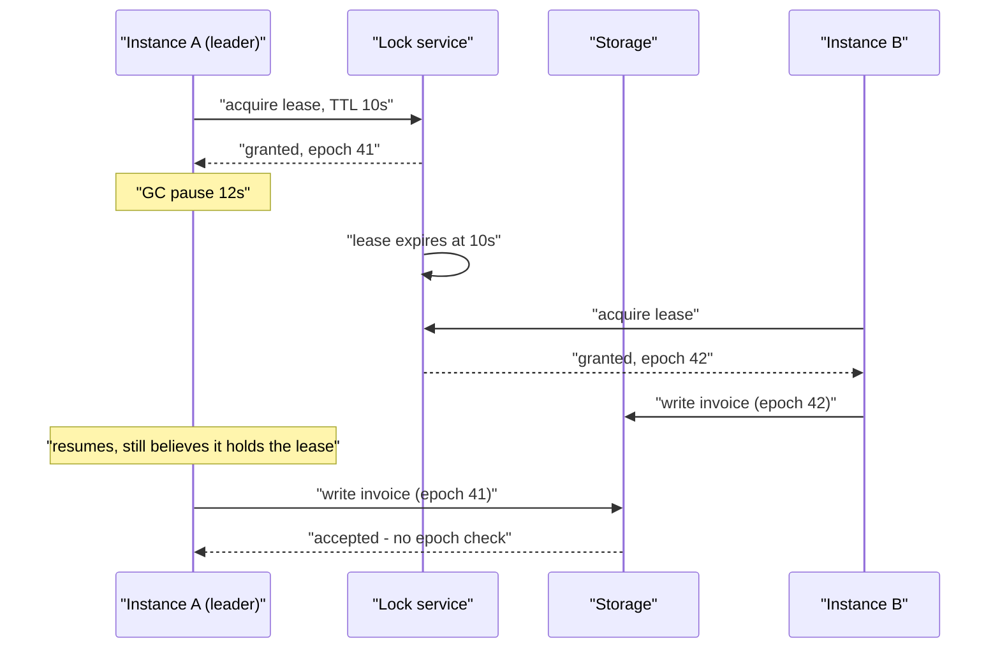
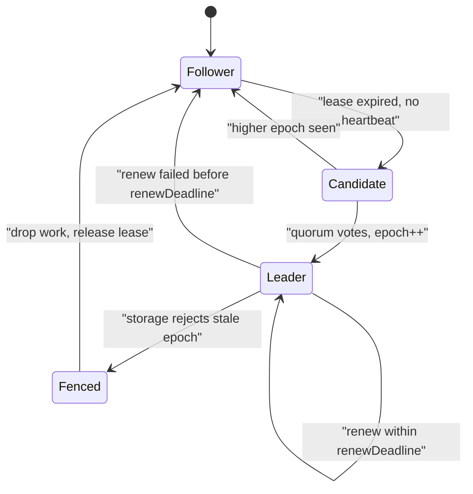

> **Scenario** — A batch scheduler uses a Redis lock for "only one instance runs the nightly billing job". At 02:14 a GC pause of 6.8 seconds freezes the current leader; the lock expires, a second instance takes over, and the first wakes up and keeps writing invoices. Customers get billed twice.

## Why it matters

- Leader election is the mechanism behind singleton cron jobs, database primaries, Kafka partition leaders, shard owners, and stream processors. A wrong leader is not a slowdown — it is duplicated or corrupted data.
- Each re-election costs real unavailability: one election timeout plus leader warm-up. Flapping every 30 seconds on a 3-second timeout is a 10% availability loss that no health check reports.
- The dangerous case is not "no leader" (loud, obvious, self-healing) but "two leaders that both believe they are valid" (silent, and it corrupts data at full throughput).
- Timeout tuning is where most teams go wrong: they tune for fast detection on a LAN and then run across availability zones with a co-tenanted CPU.

## Symptoms

| Signal | What you observe |
|---|---|
| Leadership metric | `leader_changes_total` incrementing steadily; term or epoch climbing into the thousands |
| Duplicate work | Two instances logging the same job id; unique constraint violations on downstream inserts |
| Lock TTL logs | `lock lost` immediately followed by `lock acquired` on a different host |
| GC / STW pause | `jvm_gc_pause_seconds` or Go `gc_pause` p99 near or above the lease TTL |
| Election never converges | Repeated `RequestVote` with rising terms and no winner — usually a partial partition |
| Zombie writes | Writes from a node whose epoch is lower than the current one, accepted by the store |
| Failover latency | Recovery time far above the configured timeout because DNS/connection pools cache the old leader |

## How it breaks

Two distinct failures hide under one name.

**Flapping.** The election timeout is a bet on the maximum stall of a healthy leader. Anything that stalls a process longer than the timeout looks identical to death: a stop-the-world GC pause, a blocked `fsync`, CPU throttling from a Kubernetes CPU limit (a container with `limits.cpu: 500m` that needs 600m is stalled for 40ms of every 100ms period), or a VM live-migration freeze. The leader is alive, loses leadership, then re-acquires it — and the cluster spends its time on elections instead of work.

**Split brain via expired lease.** A lock with a TTL is a lease, and a lease only guarantees mutual exclusion if the holder can prove liveness *to the resource*, not just to the lock service. The classic sequence: leader A acquires a 10s lease, pauses for 12s, the lease expires, B acquires it, A resumes and issues a write that it believes is protected. Neither A nor the database knows A's lease is dead.



The fix is not a longer TTL. There is no TTL long enough to bound an arbitrary pause; the fix is for the *resource* to reject stale epochs.

## Root causes

1. The lease holder never proves liveness to the resource, so an expired holder can still write.
2. No fencing token: the storage layer accepts writes without checking a monotonically increasing epoch.
3. Election timeout shorter than the p99 stop-the-world pause or CPU-throttle stall of the process.
4. Kubernetes CPU limits causing periodic throttling that looks like node death to the heartbeat path.
5. Clock-based lease expiry on hosts whose clocks are not monotonic, so `now()` jumps.
6. Partial (asymmetric) partitions where A can reach B but B cannot reach A, so votes never accumulate.
7. Clients cache the old leader's address in a connection pool or DNS entry, so failover appears far slower than it is.

## How to solve it

### 1. Fence every write with a monotonic token

The lock service hands out an increasing epoch. The resource records the highest epoch it has seen and rejects anything lower. This makes a stale leader harmless without needing any assumption about pause length.

```sql
-- The resource enforces the fence, not the client.
CREATE TABLE billing_run_fence (
  resource   text PRIMARY KEY,
  max_epoch  bigint NOT NULL
);

-- Called at the start of every protected write, in the same transaction.
CREATE OR REPLACE FUNCTION claim(p_resource text, p_epoch bigint)
RETURNS void LANGUAGE plpgsql AS $$
BEGIN
  INSERT INTO billing_run_fence(resource, max_epoch)
  VALUES (p_resource, p_epoch)
  ON CONFLICT (resource) DO UPDATE
    SET max_epoch = p_epoch
    WHERE billing_run_fence.max_epoch < p_epoch;

  IF NOT FOUND THEN
    RAISE EXCEPTION 'stale epoch % for %', p_epoch, p_resource
      USING ERRCODE = 'serialization_failure';
  END IF;
END $$;
```

```ts
async function runProtected(epoch: bigint, work: (tx: Tx) => Promise<void>) {
  await db.transaction(async (tx) => {
    await tx.query('SELECT claim($1, $2)', ['billing-nightly', epoch])
    await work(tx)
  })
}
```

In etcd the equivalent is the lease revision; in ZooKeeper the `czxid`; in Kafka the leader epoch in every produce request. All three exist for exactly this reason.

### 2. Use monotonic clocks and check remaining lease before acting

```ts
class Lease {
  private acquiredAtMs = 0
  private ttlMs = 0
  epoch = 0n

  onGranted(epoch: bigint, ttlMs: number) {
    this.epoch = epoch
    this.ttlMs = ttlMs
    // performance.now() is monotonic; Date.now() can step backwards on NTP correction.
    this.acquiredAtMs = performance.now()
  }

  /** Refuse to start work that cannot finish inside the remaining lease. */
  canRun(estimatedWorkMs: number, safetyMarginMs = 2_000): boolean {
    const remaining = this.ttlMs - (performance.now() - this.acquiredAtMs)
    return remaining > estimatedWorkMs + safetyMarginMs
  }
}
```

### 3. Size the timeout above the p99 process stall

```bash
# Measure what actually stalls the leader before choosing a timeout.
# Go: p99 STW pause
curl -s localhost:6060/debug/vars | jq '.memstats.PauseNs | max / 1e6'
# Kubernetes CPU throttling — the most common invisible stall.
kubectl exec -it "$POD" -- cat /sys/fs/cgroup/cpu.stat | grep throttled
# nr_throttled / nr_periods above 0.01 means you are stalled ~1% of periods.
```

If `throttled_usec / nr_periods` implies stalls of 200ms, an election timeout of 1s is a flap generator. Either raise the timeout to 5-10x the p99 stall or remove the CPU limit (keep the request) so the kernel stops throttling.

### 4. Add hysteresis and priority so leadership is sticky

```yaml
# Kubernetes lease-based leader election (controller-runtime style)
leaderElection:
  leaseDuration: 15s     # >= 10x p99 stall
  renewDeadline: 10s     # leader gives up before others take over
  retryPeriod: 2s        # renewal attempt interval
# Invariant: leaseDuration > renewDeadline > retryPeriod.
# Violating it lets a leader believe it holds a lease that peers already reclaimed.
```

The `renewDeadline < leaseDuration` gap is the safety margin: the incumbent voluntarily steps down before its peers are allowed to elect a replacement.

### 5. Make failover visible to clients

```nginx
upstream primary {
    zone primary 64k;
    server db-a:5432 max_fails=2 fail_timeout=5s;
    server db-b:5432 max_fails=2 fail_timeout=5s backup;
    keepalive 32;
}
# Without a short fail_timeout, pooled connections keep talking to the old leader
# long after the election finished.
```

Also drop pooled connections on a leadership change event rather than waiting for TCP timeouts — this is usually where "30 second failover" hides.

## Target design



## Tradeoffs

| Option | Pros | Cons | Choose when |
|---|---|---|---|
| Lease + fencing token | Safe under arbitrary pauses; no clock assumptions | Resource must be modified to check epochs | Any correctness-critical singleton |
| Lease with long TTL only | Trivial to implement | Never actually safe; just less frequently wrong | Idempotent work where duplicates are harmless |
| Consensus-backed election (Raft/ZAB) | Strong guarantees, epoch built in | Extra cluster to operate; adds latency | You already run etcd/ZooKeeper/Consul |
| Static primary, manual failover | No flapping, fully predictable | Human in the loop; minutes of downtime | Rare failover, strict change control |
| Leaderless / partitioned ownership | No single point, no election | Requires a partitioning scheme and rebalance logic | Work naturally shards by key |

## Verification checklist

- [ ] `SIGSTOP` the leader for 3x the lease duration, then `SIGCONT`: its next write must be rejected by the fence, not accepted.
- [ ] p99 GC/STW pause and cgroup throttle duration are both measured and below `leaseDuration / 10`.
- [ ] `leaseDuration > renewDeadline > retryPeriod` holds in the deployed config, not just in the sample.
- [ ] `leader_changes_total` is flat over 7 days of normal operation, and alerted above 3 per hour.
- [ ] All lease arithmetic uses a monotonic clock source; `grep` confirms no `Date.now()` in expiry paths.
- [ ] A killed leader restores service within one lease duration end-to-end, including connection pool recovery.
- [ ] The storage layer's fence table shows a monotonically increasing epoch with no gaps that indicate accepted stale writes.

## Anti-patterns

- Raising the lease TTL to 60s to "stop the split brain" — you have only widened the window in which nothing runs.
- Using `Date.now()` for lease expiry on hosts under NTP correction.
- Trusting `isLeader()` checked once at job start and never re-checked across a 20-minute run.
- Setting Kubernetes CPU limits on a leader-electing process and then wondering why it flaps at exactly p95 load.
- Electing on a health check that only proves the HTTP server is up, not that the work loop is progressing.
- Letting two instances "both write, we will reconcile later" for anything involving money.

## Related

- [Raft in practice: what the paper leaves out](/systems/distributed-systems/consensus-raft-in-practice)
- [Split brain detection and recovery](/systems/distributed-systems/split-brain-recovery)
- [Gossip and membership protocols](/systems/distributed-systems/gossip-and-membership-protocols)
