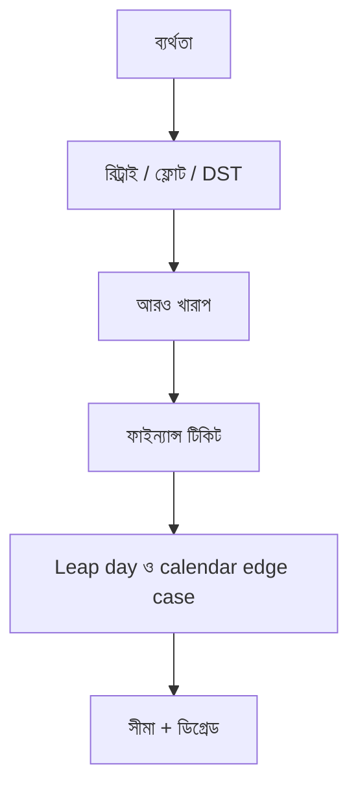

> **পাঠ 78 · মাঝারি ধাপ** - ৩১ জানুয়ারিতে শুরু monthly subscription, 2024-02-29-এ annual renewal, আর ৩১ তারিখে "গত মাস" চাওয়া report। Calendar arithmetic নয়।

## কেন এটা জরুরি

- রিট্রাই স্টর্ম, লিপ ডে, টাকার রাউন্ডিং, থার্ড-পার্টি আউটেজ-ট্রাফিক এলে এগুলো আর “এজ” থাকে না।
- ফরোয়ার্ড ফিক্স না রোলব্যাক, পেজারের আগে সিদ্ধান্ত, মাঝখানে নয়।
- ডুপ্লিকেট সাবমিশন আর ক্যালেন্ডার বাগ ফাইন্যান্স মনে রাখে।
- এই পাঠটা ঠিক **Leap day ও calendar edge case** নিয়ে। ট্যাগ: calendars, leap-year, dates, billing, recurrence।

## কী দেখে বুঝবেন সমস্যা আছে

| সংকেত | যা দেখা যায় |
| --- | --- |
| স্টর্ম | এরর বাড়ে → রিট্রাই বাড়ে → এরর আরও বাড়ে |
| টাকা | ইনভয়েস মোট লাইন সংখ্যা × ০.০১ কম/বেশি |
| ক্যালেন্ডার | DST জব স্কিপ করে বা দুবার চালায় |
| ভেন্ডর | SMS ৫০০, UI তবু “পাঠানো” |

## কীভাবে ভাঙে



ভাঙে প্রযুক্তির নামে নয়, চুক্তির অভাবে। Vue/Quasar স্ক্রিন আর Laravel রাইট যদি উল্টো উত্তর ধরে, প্রোডাকশন সেই রেসটা খুঁজে বের করে। এই টপিকের চুক্তিটা হলো: ৩১ জানুয়ারিতে শুরু monthly subscription, 2024-02-29-এ annual renewal, আর ৩১ তারিখে "গত মাস" চাওয়া report। Calendar arithmetic নয়।

## মূল কারণ

1. Axios আর কিউ ওয়ার্কার দুদিকেই সীমাহীন রিট্রাই।
2. মুদ্রায় ফ্লোট, ইন্টিজার মাইনর ইউনিট নয়।
3. ক্রন লোকাল টাইমে, সারিতে জোন নেই।
4. ডিপেন্ডেন্সি ফেল করলে ডিগ্রেডেড মোড নেই।

## কীভাবে সমাধান করবেন

### ১. ইনভেরিয়েন্ট এক বাক্যে লিখুন

৩১ জানুয়ারিতে শুরু monthly subscription, 2024-02-29-এ annual renewal, আর ৩১ তারিখে "গত মাস" চাওয়া report। Calendar arithmetic নয়। এই বাক্য পিআর, Pinia অ্যাকশন, আর Laravel ক্লাসে রাখুন।

### ২. কোডে কিনারা আটকে দিন

```ts
function money(cents: number) {
  return (cents / 100).toFixed(2) // display only; store integer cents
}
```

```php
$cents = (int) bcmul($request->amount, '100', 0);
$ticket->update(['price_cents' => $cents]);
```

### ৩. যে চার্ট সত্যি দেখবেন, সেটাই রাখুন

রিট্রাই অ্যামপ্লিফিকেশন, টাকা মিলের ফারাক, আর ডিপেন্ডেন্সি এরর বাজেট। **Leap day ও calendar edge case**-এর রিগ্রেশন এই চার্টে না ধরা পড়লে পাঠ শেষ হয়নি।

## কাজের উদাহরণ

“ইনভয়েস পরিশোধ” টাইমআউটে রিট্রাই করে, Laravel তখনই চার্জ ক্যাপচার করে ফেলেছে। পেন্ডিং স্টেট দেখিয়ে ওয়েবহুকে মিলিয়ে (দ্বিতীয় POST নয়) ডাবল ক্যাপচার বন্ধ হয়।

এই টপিকে নিজের শেষ ইনসিডেন্টের লক্ষণ টেবিলে মিলিয়ে নিন, তারপর ডায়াগ্রাম ধরে এগোন যতক্ষণ না উপরের গার্ড আগুন ধরত।

## শিপ করার আগে

- [ ] **Leap day ও calendar edge case**-এর ইনভেরিয়েন্ট এক বাক্যে লেখা।
- [ ] খালি, ডুপ্লিকেট, টাইমআউট বা পারমিশন পাথের টেস্ট বা রিহার্সাল আছে।
- [ ] এক ডিপ্লয়ের মধ্যে রিগ্রেশন ধরার লগ বা চার্ট আছে।
- [ ] আত্মীয় পাঠ এখনও মিলছে: timezone-and-dst-bugs, money-and-rounding-correctness।

## যা করবেন না

- অনন্ত রিট্রাই বা এররকে সাকসেস হিসেবে ক্যাশ করা ব্লগ স্নিপেট কপি করবেন না।
- Laravel সারির সত্য Pinia-কে বলে দেবেন না।
- ঘন মনে হলে আগের নম্বরের পাঠ আগে শেষ করুন। পথটা ইচ্ছা করেই শুরু → মাঝারি → উন্নত।
