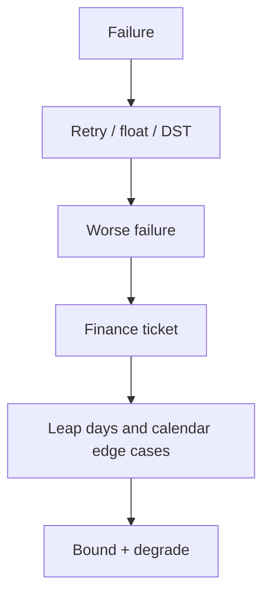

> **Lesson 78 · intermediate** - A monthly subscription started on 31 January, an annual renewal on 2024-02-29, and a report that asks for "last month" on the 31st. Calendars are not arithmetic.

## Why it matters

- Retry storms, leap days, money rounding, and third-party outages are not “edge” once you have traffic.
- A forward fix vs rollback is a product call you should make before the pager, not during it.
- Duplicate submissions and calendar bugs are the tickets finance will remember.
- This lesson is specifically about **Leap days and calendar edge cases**. Tags: calendars, leap-year, dates, billing, recurrence.

## Symptoms

| Signal | What you observe |
| --- | --- |
| Storm | Error rate up → retries up → error rate worse |
| Money | Invoice total off by 0.01 × line count |
| Calendar | DST skips a scheduled job or runs it twice |
| Vendor | SMS provider 500s, UI still says “sent” |

## How it breaks



The named technology is rarely the villain. Two code paths (often a Vue/Quasar screen and a Laravel write) assume opposite contracts. Production finds the race. For this topic that contract is: A monthly subscription started on 31 January, an annual renewal on 2024-02-29, and a report that asks for "last month" on the 31st. Calendars are not arithmetic.

## Root causes

1. Unbounded retries in Axios and in the queue worker.
2. Floats for currency instead of integer minor units.
3. Cron in local time without zone stored on the row.
4. No degraded mode when a dependency fails.

## How to solve it

### 1. Write the invariant in one sentence

A monthly subscription started on 31 January, an annual renewal on 2024-02-29, and a report that asks for "last month" on the 31st. Calendars are not arithmetic. Put that sentence in the PR, the Pinia action, and the Laravel class.

### 2. Guard the edge in code

```ts
function money(cents: number) {
  return (cents / 100).toFixed(2) // display only; store integer cents
}
```

```php
$cents = (int) bcmul($request->amount, '100', 0);
$ticket->update(['price_cents' => $cents]);
```

### 3. Keep a chart you will actually look at

Retry amplification, money-reconciliation diffs, and dependency error budget. If the chart cannot catch a regression in **Leap days and calendar edge cases**, the lesson is not done.

## Worked example

A “pay invoice” button retried on timeout after Laravel had already captured the charge. Showing a pending state and reconciling on webhook (not on a second POST) stopped double capture.

On this topic, start from the symptom in the table that matches your last incident, then walk the diagram until the guard above would have fired.

## Check before you ship

- [ ] The invariant for **Leap days and calendar edge cases** is written in one sentence.
- [ ] Empty, duplicate, timeout, or permission paths have a test or a staged rehearsal.
- [ ] A dashboard or log query would catch a regression within one deploy.
- [ ] Related reading still makes sense: timezone-and-dst-bugs, money-and-rounding-correctness.

## What not to do

- Copy a blog snippet that retries forever or caches the error as success.
- Treat Pinia as the source of truth for a Laravel row.
- Skip the previous numbered lesson if this one feels dense — the path is beginner → intermediate → advanced on purpose.
