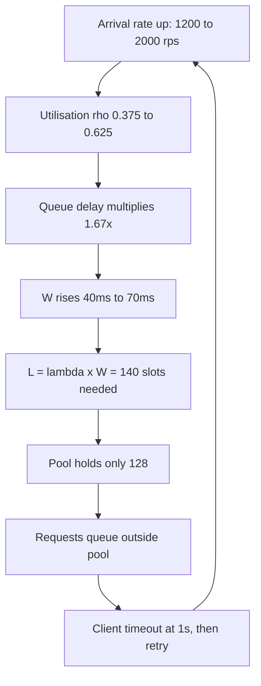
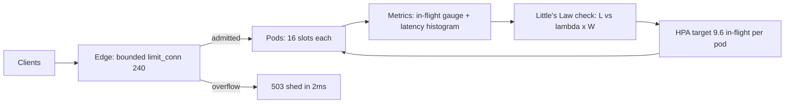

> **Scenario** — একটি checkout API স্থিরভাবে 1,200 req/s চালাচ্ছে, mean latency 40 ms। Marketing একটি push notification পাঠাল, arrival rate লাফিয়ে 2,000 req/s হল, আর নয় সেকেন্ডের মধ্যে service 504 ফেরত দিতে শুরু করল — অথচ CPU 55%-ও ছাড়ায়নি। কিছুই "slow" নয়; service একসাথে এত request ধরে রাখতেই পারে না।

## Why it matters

- Capacity incident প্রায় কখনোই CPU incident নয়। এগুলো **concurrency** incident, আর concurrency-ই সেই সংখ্যা যেটা কেউ graph করে না।
- Little's Law-ই একমাত্র হিসাব যা তিনটি সংখ্যা জোড়া লাগায়: throughput (product চায়), latency (user টের পায়), instance count (finance দেখে)।
- এটা ছাড়া autoscaling rule নিছক অনুমান। দল CPU-তে scale করে, তারপর CPU অর্ধেক থাকা অবস্থায় page খায়।
- Stack-এর প্রতিটি pool — thread, DB connection, HTTP client, worker slot — একটা concurrency limit। required concurrency হিসাব না করতে পারলে কোনোটাই size করা যায় না।
- "আমরা কত traffic নিতে পারব?" — এই প্রশ্নের উত্তর incident-এর আগে পাওয়া যায়, retro-তে নয়।

## Symptoms

| Signal | What you observe |
|---|---|
| CPU utilisation | আরামদায়ক (40-60%), তবু request timeout |
| Active request gauge | ঠিক pool maximum-এ সমান হয়ে আটকে আছে |
| Queue wait time | load-এর সাথে নয়, সময়ের সাথে linear বাড়ে |
| Latency histogram | mean স্থির, p99 সেকেন্ড ধরে উঠছে |
| Error mix | client-side timeout ও 504, 500 নয় |
| Thread dump | বেশিরভাগ thread pool `borrow()`-এ `WAITING` |

## How it breaks

Little's Law বলে, stable system-এ system-এ থাকা average item সংখ্যা = arrival rate × system-এ থাকা average সময়:

**L = λ × W**

Checkout API-কে এর মধ্য দিয়ে চালান। সুস্থ baseline-এ λ = 1,200 req/s, W = 0.040 s, তাই:

L = 1,200 × 0.040 = **48 concurrent request**

Service চলে 8 pod-এ, প্রতিটিতে 16-slot worker pool: মোট 128 slot। 128-এর মধ্যে 48 ব্যবহৃত — 37% occupancy। সব ঠিক, আর 55% CPU-ও তাই বলছে।

এখন λ হল 2,000 req/s। latency অপরিবর্তিত থাকলে required concurrency হবে:

L = 2,000 × 0.040 = **80 concurrent request**

এখনও 128-এর নিচে। তাহলে 504 কেন? কারণ W অপরিবর্তিত থাকে না। Utilisation ρ = λ / capacity। প্রতি pod-এর capacity = slot / service time = 16 / 0.040 = 400 req/s, তাই 8 pod *তাত্ত্বিক* saturation-এ 3,200 req/s। 2,000 req/s-এ ρ = 2,000 / 3,200 = 0.625। M/M/c-জাতীয় system-এ queueing delay মোটামুটি 1/(1 − ρ) হিসেবে বাড়ে। ρ = 0.375 থেকে 0.625-এ গেলে queueing component গুণ হয় (1 − 0.375)/(1 − 0.625) = 0.625/0.375 = **1.67×**।

শুধু এটুকু সহনীয়। মারে feedback loop: W বাড়ে, তাই L = λW বাড়ে, তাই বেশি slot আটকে থাকে, তাই ρ আরও বাড়ে। একটি downstream dependency 30 ms যোগ করলেই W = 0.070 s এবং L = 2,000 × 0.070 = **140 concurrent request** — 128 slot-এর উপরে। Pool শেষ, নতুন arrival pool-এর বাইরে queue করে, client-এর 1 s timeout fire করে, client retry করে, আর λ আবার বাড়ে।



## Root causes

1. Autoscaling CPU-তে বাঁধা, যেটা IO-bound service-এর saturating resource নয়।
2. Concurrency (in-flight request) কখনো instrument করা হয় না, তাই আসল constraint অদৃশ্য।
3. Pool size copy-paste default থেকে আসে, λ ও W থেকে হিসাব করে নয়।
4. Capacity *mean* latency ধরে planned, অথচ load-এ W আর baseline-এর W এক নয়।
5. Admission control নেই, তাই queueing bounded জায়গার বদলে unbounded socket backlog-এ হয়।
6. Client retry λ-কে বাড়ায় ঠিক যখন λ-ই সমস্যা।
7. Headroom "% CPU" হিসেবে বলা হয়, "কত concurrency request" হিসেবে নয়।

## How to solve it

### 1. Concurrency সরাসরি instrument করুন

যা measure করেন না তার plan করা যায় না। latency histogram-এর পাশে একটি in-flight gauge export করুন।

```ts
// src/server/metrics.ts
import { Gauge, Histogram } from 'prom-client'

export const inFlight = new Gauge({
  name: 'http_requests_in_flight',
  help: 'Requests currently being served (Little\'s Law L)',
  labelNames: ['route'],
})

export const latency = new Histogram({
  name: 'http_request_seconds',
  help: 'Request duration (Little\'s Law W)',
  labelNames: ['route'],
  buckets: [0.005, 0.01, 0.025, 0.05, 0.1, 0.25, 0.5, 1, 2.5, 5],
})

export function withMetrics(route: string, handler: Handler): Handler {
  return async (req, res) => {
    inFlight.inc({ route })
    const stop = latency.startTimer({ route })
    try {
      return await handler(req, res)
    } finally {
      stop()
      inFlight.dec({ route })
    }
  }
}
```

তারপর metrics backend-এ identity যাচাই করুন। এই দুটি একসাথে চলা উচিত:

```promql
# Measured L
avg_over_time(http_requests_in_flight[5m])

# Predicted L = lambda * W
  rate(http_request_seconds_count[5m])
* rate(http_request_seconds_sum[5m]) / rate(http_request_seconds_count[5m])
```

~10%-এর বেশি ফারাক মানে instrumented span-এর বাইরে কাজ হচ্ছে — সাধারণত accept backlog-এ queueing।

### 2. আসলে যত slot দরকার তা হিসাব করুন

হিসাবটা স্পষ্টভাবে করুন, target utilisation ধরে — 100%-এ নয়।

```python
# capacity.py — pool size বাছার আগে এটা চালান
def required_slots(rps: float, latency_s: float, target_rho: float = 0.6) -> float:
    """L = lambda * W, যে utilisation-এ চালাতে রাজি তা দিয়ে ভাগ।"""
    return (rps * latency_s) / target_rho

peak_rps      = 2000
p95_latency_s = 0.070          # mean নয়, উঁচু percentile ব্যবহার করুন
slots = required_slots(peak_rps, p95_latency_s, target_rho=0.6)

print(f"L at p95      = {peak_rps * p95_latency_s:.0f} concurrent")   # 140
print(f"slots needed  = {slots:.0f}")                                  # 233
print(f"pods at 16    = {slots / 16:.1f}")                             # 14.6 -> 15
```

পনেরোটা pod, আটটা নয়। push notification যাওয়ার আগেই সংখ্যাটা জানা সম্ভব ছিল।

### 3. Queue bounded করুন, overflow shed করুন

Unbounded queueing throughput সমস্যাকে পুরো outage বানায়। Limit স্পষ্ট করুন।

```nginx
# nginx.conf — app-এর সামনে bounded admission
limit_conn_zone $server_name zone=appconn:10m;

upstream checkout {
  server 10.0.1.11:8080 max_conns=16;
  server 10.0.1.12:8080 max_conns=16;
  keepalive 32;
}

server {
  location /api/checkout {
    limit_conn appconn 240;        # 15 pod x 16 slot
    limit_conn_status 503;
    proxy_read_timeout 800ms;      # client-এর 1s-এর চেয়ে ছোট
    proxy_pass http://checkout;
  }
}
```

241তম request-কে 2 ms-এ reject করা তাকে গ্রহণ করে 1,000 ms-এ timeout করার চেয়ে স্পষ্টতই ভালো — client দ্রুত জানে এবং কোনো slot ধরে রাখে না।

### 4. CPU নয়, concurrency-তে scale করুন

```yaml
# hpa.yaml
apiVersion: autoscaling/v2
kind: HorizontalPodAutoscaler
metadata:
  name: checkout
spec:
  scaleTargetRef:
    apiVersion: apps/v1
    kind: Deployment
    name: checkout
  minReplicas: 15
  maxReplicas: 60
  metrics:
    - type: Pods
      pods:
        metric:
          name: http_requests_in_flight
        target:
          type: AverageValue
          averageValue: "9600m"   # pod-প্রতি 9.6 in-flight = 16 slot-এর 60%
```

### 5. প্রতি quarter-এ সংখ্যা আবার বের করুন

Feature যোগ হলে W সরে যায়। হিসাবটা dashboard annotation বা scheduled job-এ রাখুন, যাতে pool size ও replica floor গত বছরের নয়, বর্তমান p95-এর সাথে review হয়।

## Target design



## Tradeoffs

| Option | Pros | Cons | Choose when |
|---|---|---|---|
| CPU-তে scale | built-in, instrumentation লাগে না | IO-bound saturation দেখে না | workload সত্যিই CPU-heavy |
| in-flight concurrency-তে scale | আসল constraint অনুসরণ করে | custom metrics pipeline দরকার | service DB/cache/HTTP-এ অপেক্ষা করে |
| বড় pool, shedding নেই | মাঝারি load-এ 503 নেই | overload-এ ভেঙে পড়ে | scale-এ কখনো নয় |
| ছোট pool + load shedding | দ্রুত, সৎ failure | dashboard-এ rejection দেখা যায় | SLO ও retry budget আছে |
| Static over-provisioning | সরল, predictable | সারা মাস peak-এর দাম | traffic সমান, খরচ কম |

## Verification checklist

- [ ] `http_requests_in_flight` আছে এবং p95 latency-র পাশে graph করা।
- [ ] 24 ঘণ্টার window-এ measured L ও computed λ×W 10%-এর মধ্যে মেলে।
- [ ] Pool size, replica floor ও `limit_conn` একই লিখিত হিসাব থেকে এসেছে।
- [ ] 1.5× peak λ-এ load test edge থেকে 503 দেয়, client timeout নয়।
- [ ] Autoscaler-এর target একটি concurrency মান, আর তা slot capacity-র 55-65%।
- [ ] `proxy_read_timeout` client timeout-এর চেয়ে কঠোরভাবে ছোট।
- [ ] কেউ মুখস্থ বলতে পারে service-এর max sustainable λ কত।

## Anti-patterns

- Timeout "সারাতে" worker pool বাড়ানো, যা W বাড়ায় আর tail আরও খারাপ করে।
- p95 mean-এর 2-3× হলেও mean latency দিয়ে capacity plan করা।
- Socket backlog-কে free buffering ভাবা — ওটা visibility-হীন unbounded queue delay।
- Retry budget ছাড়া retry যোগ করা, ফলে λ ঠিক তখনই দ্রুত বাড়ে যখন তা কমা দরকার।
- যে service কখনো CPU-bound ছিল না, তার headroom "CPU তো মাত্র 55%" বলে জানানো।
- Autoscaler-কে 90% concurrency target-এ চালানো, ফলে scale-up delay-র জন্য জায়গা থাকে না।

## Related

- [Thread and connection pool sizing formulas](/systems/performance-capacity/thread-and-connection-pool-sizing)
- [Load testing that reflects reality](/systems/performance-capacity/load-testing-that-reflects-reality)
- [Autoscaling lag, warmup, and the gap you must pre-provision](/systems/performance-capacity/autoscaling-lag-and-warmup)
- [p99 tail latency and capacity planning](/systems/performance-capacity/p99-tail-latency-planning)
