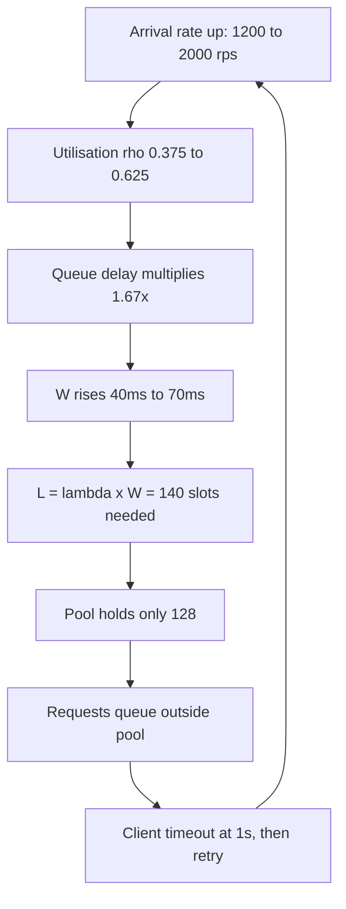
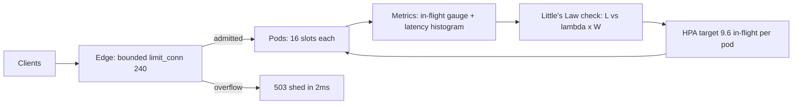

> **Scenario** — A checkout API holds steady at 1,200 req/s with a 40 ms mean latency. Marketing runs a push notification, arrival rate jumps to 2,000 req/s, and within nine seconds the service is returning 504s even though CPU never crosses 55%. Nothing is "slow" — the service simply cannot hold that many requests at once.

## Why it matters

- Capacity incidents are almost never CPU incidents. They are **concurrency** incidents, and concurrency is the quantity nobody graphs.
- Little's Law is the only arithmetic that connects the three numbers your stakeholders each care about: throughput (product), latency (users), and instance count (finance).
- Without it, autoscaling rules are guesses. Teams scale on CPU and get paged while CPU sits at half.
- Every pool in the stack — threads, DB connections, HTTP clients, worker slots — is a concurrency limit. If you cannot compute required concurrency, you cannot size any of them.
- It gives you a pre-incident answer to "how much traffic can we take?" instead of a post-incident retro.

## Symptoms

| Signal | What you observe |
|---|---|
| CPU utilisation | Comfortable (40-60%) while requests time out |
| Active request gauge | Pinned flat at exactly the pool maximum |
| Queue wait time | Grows linearly with time, not with load |
| Latency histogram | Mean stable, p99 climbing by seconds |
| Error mix | Client-side timeouts and 504s, not 500s |
| Thread dumps | Most threads `WAITING` on a pool `borrow()` |

## How it breaks

Little's Law states that for a stable system, the average number of items in the system equals arrival rate times average time in system:

**L = λ × W**

Work the checkout API through it. At the healthy baseline, λ = 1,200 req/s and W = 0.040 s, so:

L = 1,200 × 0.040 = **48 concurrent requests**

The service runs 8 pods with a 16-slot worker pool each: 128 slots. Forty-eight of 128 used — 37% occupancy. Everything is fine, and CPU at 55% agrees.

Now λ becomes 2,000 req/s. If latency held, required concurrency would be:

L = 2,000 × 0.040 = **80 concurrent requests**

Still under 128. So why the 504s? Because W does not hold. Utilisation ρ = λ / (capacity). Capacity per pod is slots / service time = 16 / 0.040 = 400 req/s, so 8 pods serve 3,200 req/s at *theoretical* saturation. At 2,000 req/s, ρ = 2,000 / 3,200 = 0.625. For an M/M/c-ish system, queueing delay scales roughly with 1/(1 − ρ). Going from ρ = 0.375 to ρ = 0.625 multiplies the queueing component by (1 − 0.375)/(1 − 0.625) = 0.625/0.375 = **1.67×**.

That alone is survivable. The killer is the feedback loop: W rises, so L = λW rises, so more slots are held, so ρ rises further. Once one downstream dependency adds 30 ms, W = 0.070 s and L = 2,000 × 0.070 = **140 concurrent requests** — above the 128 slots. The pool is exhausted, new arrivals queue outside it, the client's 1 s timeout fires, and the client retries, which raises λ again.



## Root causes

1. Autoscaling keyed to CPU, which is not the saturating resource for IO-bound services.
2. Concurrency (in-flight requests) is never instrumented, so the binding constraint is invisible.
3. Pool sizes chosen by copy-paste defaults rather than computed from λ and W.
4. Capacity planned against *mean* latency, ignoring that W under load is not W at baseline.
5. No admission control, so queueing happens in an unbounded place (socket backlog) instead of a bounded one.
6. Client retries add to λ exactly when λ is the problem.
7. Headroom expressed as "% CPU" rather than "requests of concurrency".

## How to solve it

### 1. Instrument concurrency directly

You cannot plan what you do not measure. Export an in-flight gauge next to your latency histogram.

```ts
// src/server/metrics.ts
import { Gauge, Histogram } from 'prom-client'

export const inFlight = new Gauge({
  name: 'http_requests_in_flight',
  help: 'Requests currently being served (Little\'s Law L)',
  labelNames: ['route'],
})

export const latency = new Histogram({
  name: 'http_request_seconds',
  help: 'Request duration (Little\'s Law W)',
  labelNames: ['route'],
  buckets: [0.005, 0.01, 0.025, 0.05, 0.1, 0.25, 0.5, 1, 2.5, 5],
})

export function withMetrics(route: string, handler: Handler): Handler {
  return async (req, res) => {
    inFlight.inc({ route })
    const stop = latency.startTimer({ route })
    try {
      return await handler(req, res)
    } finally {
      stop()
      inFlight.dec({ route })
    }
  }
}
```

Then verify the identity in your metrics backend. These two should track each other:

```promql
# Measured L
avg_over_time(http_requests_in_flight[5m])

# Predicted L = lambda * W
  rate(http_request_seconds_count[5m])
* rate(http_request_seconds_sum[5m]) / rate(http_request_seconds_count[5m])
```

If they diverge by more than ~10%, you have work happening outside the instrumented span — usually queueing in the accept backlog.

### 2. Compute the pool size you actually need

Do the arithmetic explicitly, with a target utilisation, not at 100%.

```python
# capacity.py — run this before you pick a pool size
def required_slots(rps: float, latency_s: float, target_rho: float = 0.6) -> float:
    """L = lambda * W, divided by the utilisation you are willing to run at."""
    return (rps * latency_s) / target_rho

peak_rps      = 2000
p95_latency_s = 0.070          # use a high percentile, not the mean
slots = required_slots(peak_rps, p95_latency_s, target_rho=0.6)

print(f"L at p95      = {peak_rps * p95_latency_s:.0f} concurrent")   # 140
print(f"slots needed  = {slots:.0f}")                                  # 233
print(f"pods at 16    = {slots / 16:.1f}")                             # 14.6 -> 15
```

Fifteen pods, not eight. The number was knowable before the push notification went out.

### 3. Bound the queue and shed the overflow

Unbounded queueing converts a throughput problem into a total outage. Make the limit explicit.

```nginx
# nginx.conf — bounded admission in front of the app
limit_conn_zone $server_name zone=appconn:10m;

upstream checkout {
  server 10.0.1.11:8080 max_conns=16;
  server 10.0.1.12:8080 max_conns=16;
  keepalive 32;
}

server {
  location /api/checkout {
    limit_conn appconn 240;        # 15 pods x 16 slots
    limit_conn_status 503;
    proxy_read_timeout 800ms;      # shorter than the client's 1s
    proxy_pass http://checkout;
  }
}
```

Rejecting the 241st request in 2 ms is strictly better than accepting it and timing out at 1,000 ms — the client learns faster and holds no slot.

### 4. Scale on concurrency, not CPU

```yaml
# hpa.yaml
apiVersion: autoscaling/v2
kind: HorizontalPodAutoscaler
metadata:
  name: checkout
spec:
  scaleTargetRef:
    apiVersion: apps/v1
    kind: Deployment
    name: checkout
  minReplicas: 15
  maxReplicas: 60
  metrics:
    - type: Pods
      pods:
        metric:
          name: http_requests_in_flight
        target:
          type: AverageValue
          averageValue: "9600m"   # 9.6 in-flight per pod = 60% of 16 slots
```

### 5. Re-derive the numbers every quarter

W drifts as features are added. Put the calculation in a dashboard annotation or a scheduled job so the pool size and replica floor are reviewed against current p95, not last year's.

## Target design



## Tradeoffs

| Option | Pros | Cons | Choose when |
|---|---|---|---|
| Scale on CPU | Built-in, zero instrumentation | Blind to IO-bound saturation | Workload is genuinely CPU-heavy |
| Scale on in-flight concurrency | Tracks the real constraint | Needs custom metrics pipeline | Service waits on DB, cache, or HTTP |
| Large pools, no shedding | No 503s at moderate load | Collapses under overload | Never, at scale |
| Small pools plus load shedding | Fast, honest failure | Visible rejections in dashboards | You have an SLO and a retry budget |
| Static over-provisioning | Simple, predictable | Pays for peak all month | Traffic is flat and cost is small |

## Verification checklist

- [ ] `http_requests_in_flight` exists and is graphed beside p95 latency.
- [ ] Measured L and computed λ×W agree within 10% over a 24 h window.
- [ ] Pool size, replica floor, and `limit_conn` all derive from the same written calculation.
- [ ] A load test at 1.5× peak λ produces 503s from the edge, not client timeouts.
- [ ] The autoscaler's target is a concurrency value, and the value is 55-65% of slot capacity.
- [ ] `proxy_read_timeout` is strictly shorter than the client timeout.
- [ ] Someone can state, from memory, the service's max sustainable λ.

## Anti-patterns

- Raising the worker pool to "fix" timeouts, which raises W and makes the tail worse.
- Planning capacity with mean latency when p95 is 2-3× the mean.
- Treating a socket backlog as free buffering — it is unbounded queue delay with no visibility.
- Adding retries without a retry budget, so λ grows fastest exactly when you need it to shrink.
- Reporting headroom as "CPU is only 55%" for a service that never was CPU-bound.
- Running the autoscaler at a 90% concurrency target, leaving no room for the scale-up delay.

## Related

- [Thread and connection pool sizing formulas](/systems/performance-capacity/thread-and-connection-pool-sizing)
- [Load testing that reflects reality](/systems/performance-capacity/load-testing-that-reflects-reality)
- [Autoscaling lag, warmup, and the gap you must pre-provision](/systems/performance-capacity/autoscaling-lag-and-warmup)
- [p99 tail latency and capacity planning](/systems/performance-capacity/p99-tail-latency-planning)
