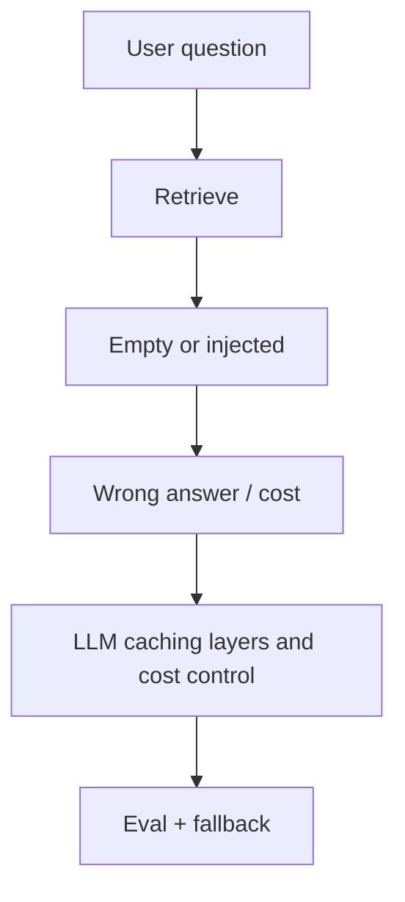

> **Lesson 101 · intermediate** - Exact-match, prefix, and semantic caches each fail differently - pick the layer that matches your invalidation story.

## Why it matters

- RAG without evals is a demo. Empty retrieval still needs a fallback the user can trust.
- Prompt injection and cost both live in production even when the model is “just an assistant”.
- Caching LLM calls without tenant keys is a privacy bug with a latency win attached.
- This lesson is specifically about **LLM caching layers and cost control**. Tags: caching, cost, prefix-cache, semantic-cache, tokens.

## Symptoms

| Signal | What you observe |
| --- | --- |
| Hallucination | Answer cites a ticket that does not exist |
| Cost spike | Retry loop on timeouts multiplies tokens |
| Injection | Uploaded PDF contains “ignore previous instructions” |
| Skew | Index built on v2 embeddings, query uses v1 |

## How it breaks



The named technology is rarely the villain. Two code paths (often a Vue/Quasar screen and a Laravel write) assume opposite contracts. Production finds the race. For this topic that contract is: Exact-match, prefix, and semantic caches each fail differently - pick the layer that matches your invalidation story.

## Root causes

1. No golden set; shipping prompt tweaks on vibes.
2. Unbounded agent loops without a token budget.
3. User content concatenated into the system prompt.
4. Embedding model swapped without reindexing.

## How to solve it

### 1. Write the invariant in one sentence

Exact-match, prefix, and semantic caches each fail differently - pick the layer that matches your invalidation story. Put that sentence in the PR, the Pinia action, and the Laravel class.

### 2. Guard the edge in code

```ts
export async function askDocs(q: string) {
  return api.post('/api/ask', { q, timeoutMs: 12_000 })
}
```

```php
if ($hits->isEmpty()) {
    return response()->json(['answer' => null, 'fallback' => 'human_queue']);
}
```

### 3. Keep a chart you will actually look at

Eval score, cost per successful answer, and empty-retrieval rate. If the chart cannot catch a regression in **LLM caching layers and cost control**, the lesson is not done.

## Worked example

A “search tickets with AI” feature answered from an empty Pinecone result with a confident paragraph. Returning `fallback: human_queue` and showing the Quasar empty state was the production fix, not a bigger model.

On this topic, start from the symptom in the table that matches your last incident, then walk the diagram until the guard above would have fired.

## Check before you ship

- [ ] The invariant for **LLM caching layers and cost control** is written in one sentence.
- [ ] Empty, duplicate, timeout, or permission paths have a test or a staged rehearsal.
- [ ] A dashboard or log query would catch a regression within one deploy.
- [ ] Related reading still makes sense: context-window-budgeting, multi-step-agent-loops-and-cost, fallback-model-routing.

## What not to do

- Copy a blog snippet that retries forever or caches the error as success.
- Treat Pinia as the source of truth for a Laravel row.
- Skip the previous numbered lesson if this one feels dense — the path is beginner → intermediate → advanced on purpose.
