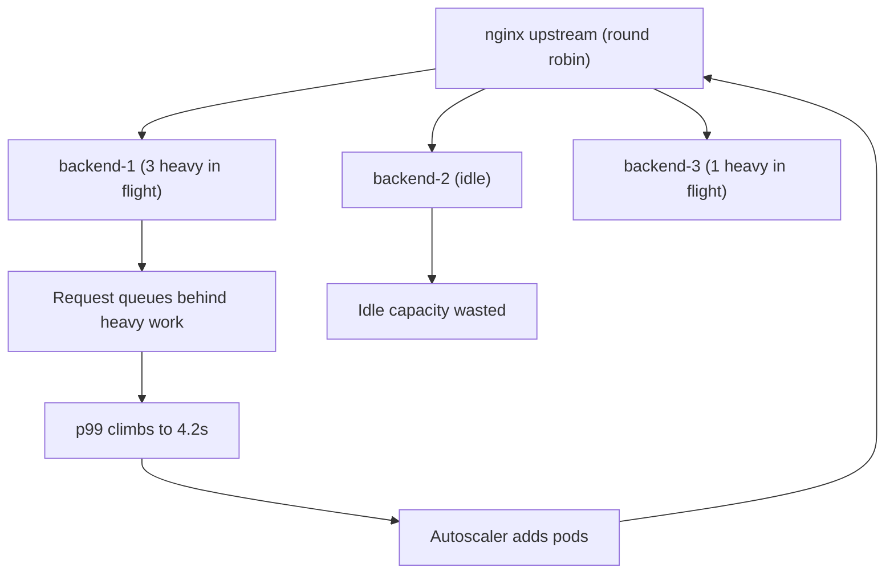
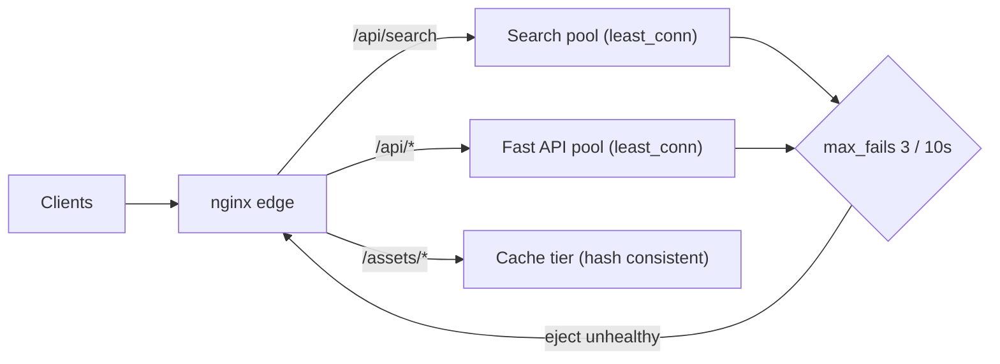

> **Scenario** - default round robin সহ nginx-এর পিছনে ১২টি একই রকম API pod। peak-এ তিনটি pod ৯৫% CPU-তে চলছে, ৪০টি request queue-এ; চারটি pod ২০%-এর কাছে বসে আছে। p99 = 4.2s, p50 = 90ms। গড়ে কেউ overload নয়, আর autoscaler এমন pod যোগ করছে যেগুলো কাজে আসছে না।

## Why it matters

- load balancing tail latency ঠিক করে। request cost skewed হলে round robin পরের দামি request-টিও এমন backend-এ পাঠায় যে ইতিমধ্যে তিনটি চিবাচ্ছে।
- খারাপ distribution দেখতে হুবহু capacity ঘাটতির মতো, তাই team scale out করে idle pod-এর বিল দেয় আর p99 ভাঙাই থাকে।
- hash-based balancing স্থায়ী hot spot বানায়: এক বড় tenant এক backend-এ hash হয়, যত scale করুন তা সরে না।
- algorithm বদলালে একসাথে cache locality, connection reuse আর session behaviour বদলায় - এটি কখনোই নিছক যান্ত্রিক switch নয়।
- partial failure-এ algorithm ঠিক করে slow backend *কম* traffic পাবে, নাকি দ্রুত fail করা backend naive least-connections-এ *বেশি* পাবে।

## Symptoms

| Signal | What you observe |
| --- | --- |
| Per-pod CPU | একই মিনিটে একই replica-দের মধ্যে ২০–৯৫% ছড়ানো |
| Latency | p50 সমান ও সুস্থ, p99 p50-এর ৫–৫০ গুণ |
| `$upstream_addr` histogram | per-backend request count সমান, per-backend time ভয়ানক অসমান |
| Queue depth | কিছু pod-এ PHP-FPM `listen queue` বা Go handler gauge শূন্য নয় |
| Autoscaling | aggregate CPU ৫০%-এর নিচে থাকলেও replica বাড়ছে |
| Hash mode | এক `$upstream_addr` ৩০% bytes পরিবেশন করছে |
| Failure mode | তাৎক্ষণিক 500 ফেরত দেওয়া pod ক্রমশ বেশি traffic টানছে |

## How it breaks

round robin তখনই optimal যখন প্রতিটি request-এর খরচ প্রায় সমান। বাস্তব API bimodal: `GET /health` ২ms আর `POST /search` ৯০০ms একই upstream block দিয়ে যায়। round robin backend কতটা ব্যস্ত তা না দেখে slot বিলি করে, ফলে request একটি হতভাগ্য backend-এর in-flight কাজের পিছনে queue হয় আর পাশের backend বসে থাকে। এটি classic queueing behaviour - একই মোট utilisation-এ unbalanced system-এর waiting time balanced system-এর চেয়ে নাটকীয়ভাবে খারাপ।

`least_conn` এর বেশিরভাগ ঠিক করে: সবচেয়ে কম active connection থাকা backend-এ পাঠায়, যা busyness-এর live proxy। কিন্তু এর নিজস্ব failure mode আছে - যে backend *দ্রুত* fail করে তার active connection কম, তাই সে সবচেয়ে আকর্ষণীয় target হয়ে ওঠে। health check ছাড়া `least_conn` আনন্দে ভাঙা pod-এর দিকে firehose তাক করে।



## Root causes

1. request cost ১০০ গুণ পর্যন্ত ভিন্ন, অথচ round robin-এ uniform-cost ধারণা বসানো।
2. heterogeneous backend (ভিন্ন node type, noisy neighbour) `weight=` ছাড়া একরকম ধরা।
3. session stickiness-এর জন্য `ip_hash` বা `hash $arg_tenant`, ফলে বড় tenant-এর জন্য স্থায়ী hot backend।
4. passive health check নেই (`max_fails` / `fail_timeout` default), তাই fail করা backend rotation-এ থেকে যায়।
5. `least_conn`-এ দ্রুত-fail করা backend traffic টানছে।
6. keepalive pool algorithm-এর সাথে মিশে যাচ্ছে - reused connection পরের request-এ balancer-এর সিদ্ধান্ত পাশ কাটায়।
7. দীর্ঘজীবী connection (WebSocket, HTTP/2) শুধু connect time-এ balance হয়, তাই distribution ঘণ্টার পর ঘণ্টা জমে থাকে।

## How to solve it

### 1. per-backend count নয়, per-backend time মাপুন

```nginx
log_format lb '$status rt=$request_time urt=$upstream_response_time '
              'addr=$upstream_addr uri=$uri';
```

```bash
awk -F'addr=' '{split($2,a," "); print a[1]}' /var/log/nginx/access.log \
  | sort | uniq -c | sort -rn
#  41233 10.2.4.11:8080
#  41198 10.2.4.12:8080
#  41205 10.2.4.13:8080   <- counts are even
```

count সমান অথচ CPU অসমান - এটি cost skew-এর স্বাক্ষর, ভাঙা balancer-এর নয়।

### 2. আসল health check সহ `least_conn`-এ যান

```nginx
upstream app_upstream {
    least_conn;
    server 10.2.4.11:8080 max_fails=3 fail_timeout=10s;
    server 10.2.4.12:8080 max_fails=3 fail_timeout=10s;
    server 10.2.4.13:8080 max_fails=3 fail_timeout=10s;
    server 10.2.4.14:8080 backup;
    keepalive 64;
}
```

`max_fails=3 fail_timeout=10s` মানে ১০s-এর মধ্যে তিনটি failure হলে backend ১০s-এর জন্য বাদ। এটি না থাকলে `least_conn` দ্রুত-fail করা pod-কে amplify করে।

### 3. দামি route-কে আলাদা pool দিন

সবচেয়ে পরিষ্কার সমাধান সাধারণত algorithm নয় - isolation:

```nginx
upstream app_fast   { least_conn; server 10.2.4.11:8080; server 10.2.4.12:8080; keepalive 64; }
upstream app_search { least_conn; server 10.2.5.21:8080; server 10.2.5.22:8080; keepalive 32; }

location /api/search { proxy_pass http://app_search; }
location /api/       { proxy_pass http://app_fast; }
```

এখন search spike-এর পিছনে dashboard render করা request queue হতে পারবে না।

### 4. heterogeneous backend-এ স্পষ্ট weight দিন

```nginx
upstream mixed {
    server 10.2.4.11:8080 weight=3;   # 8 vCPU node
    server 10.2.4.12:8080 weight=1;   # 2 vCPU node
}
```

### 5. affinity সত্যিই দরকার হলে consistent hashing নিন

```nginx
upstream cache_tier {
    hash $request_uri consistent;
    server 10.3.1.10:6081;
    server 10.3.1.11:6081;
    server 10.3.1.12:6081;
}
```

`consistent` থাকলে একটি node গেলে প্রায় `1/N` key remap হয়, পুরোটা reshuffle হয়ে প্রতিটি cache cold-start হয় না।

### 6. শুধু CPU নয়, queue দেখুন

```bash
ss -ltn 'sport = :8080'
# State  Recv-Q Send-Q Local Address:Port
# LISTEN 87     511          0.0.0.0:8080
```

listening socket-এ শূন্য নয় এমন `Recv-Q` মানে ঠিক ওই pod-এ accept queue জমছে - imbalance-এর সরাসরি প্রমাণ।

## Target design



## Tradeoffs

| Option | Pros | Cons | Choose when |
| --- | --- | --- | --- |
| Round robin | সরল, predictable, stateless | busyness দেখে না, cost skew-এ খারাপ | সমান খরচের request, একরকম pod |
| `least_conn` | আসল load ধরে, p99 কমায় | দ্রুত-fail করা backend-এ traffic টানে | মিশ্র cost + health check আছে |
| `hash ... consistent` | cache ও session affinity | hot tenant এক backend-এ আটকায় | cache tier, sharded state |
| `ip_hash` | shared state ছাড়া stickiness | NAT বহু user-কে এক backend-এ চাপায় | local session সহ legacy app |
| route-প্রতি আলাদা pool | blast radius isolation | বেশি infra ও config surface | এক route সব কিছু starve করতে পারে |

## Verification checklist

- [ ] replica-দের মধ্যে per-backend `$upstream_response_time` p99 ২০%-এর মধ্যে।
- [ ] peak-এ প্রতিটি pod-এ `ss -ltn` `Recv-Q` শূন্য দেখায়।
- [ ] `kill -STOP` করা pod `fail_timeout`-এর মধ্যে বাদ পড়ে ও নতুন request পায় না।
- [ ] তাৎক্ষণিক 500 দেওয়া pod-এর share *কমে*, বাড়ে না।
- [ ] ১০০ গুণ cost-skewed mix দিয়ে load test-এ পরিবর্তনের পর p99 উন্নত।
- [ ] hash-based pool-এ কোনো backend গড় bytes-এর ১.৫ গুণের বেশি নয়।
- [ ] autoscaler target শুধু CPU নয়, queue depth বা latency দেখে।

## Anti-patterns

- balancer bottleneck হলে p99 ঠিক করতে replica scale করা।
- `max_fails` ছাড়া `least_conn` নেওয়া - সবচেয়ে দ্রুত failure সব traffic জেতে।
- mobile-ভারী product-এ stickiness-এর জন্য `ip_hash`, যেখানে carrier NAT হাজার user এক IP-তে জড়ো করে।
- WebSocket শুধু connect time-এ balance করা এবং deploy-এর পর কখনো rebalance না করা।
- cache affinity-তে `$request_uri` স্বাভাবিক key হওয়া সত্ত্বেও `$remote_addr`-এ hash করা।
- শুধু request count দেখে balance বিচার করা; time অসমান হওয়ার অনেক পরেও count সমান থাকে।

## Related

- [Keepalive and upstream connection reuse](/systems/networking-edge/keepalive-and-connection-reuse)
- [Reverse proxy buffering and timeout budgets](/systems/networking-edge/reverse-proxy-buffering-and-timeouts)
- [p99 tail latency and capacity planning](/systems/performance-capacity/p99-tail-latency-planning)
