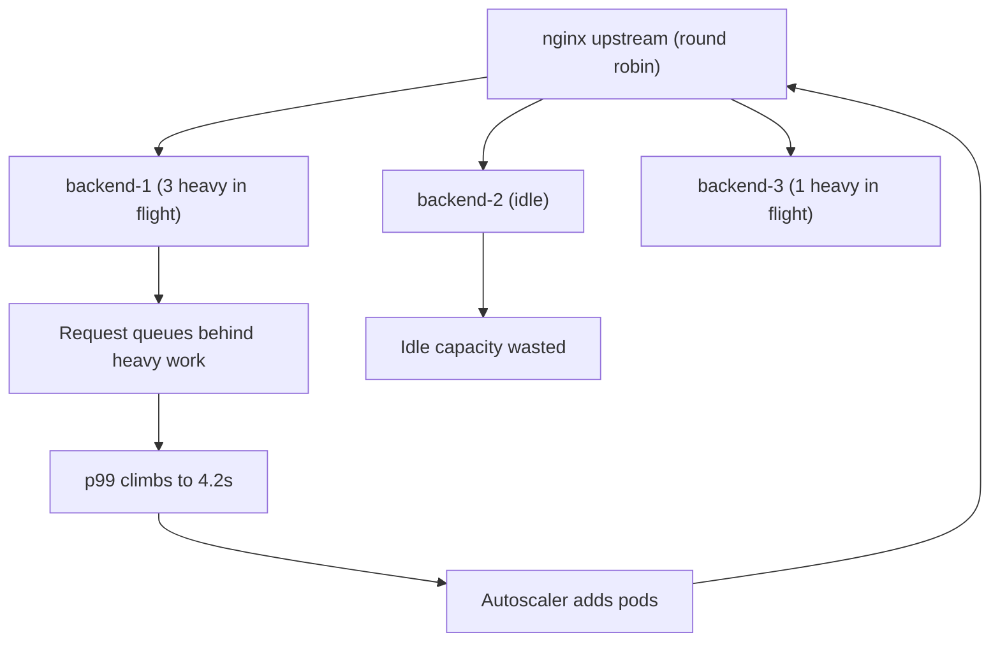
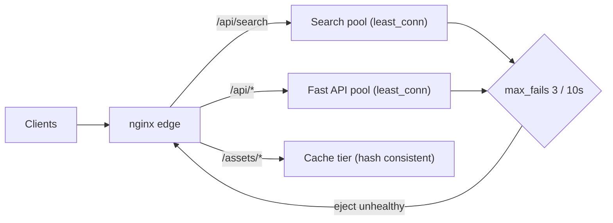

> **Scenario** - Twelve identical API pods sit behind nginx with default round robin. During peak, three pods run at 95% CPU with 40 queued requests while four sit near 20%. p99 is 4.2s; p50 is 90ms. Nobody is overloaded on average, and autoscaling keeps adding pods that do not help.

## Why it matters

- Load balancing decides tail latency. With skewed request cost, round robin routes the next expensive request to a backend already chewing on three of them.
- Bad distribution looks exactly like insufficient capacity, so teams scale out and pay for idle pods while p99 stays broken.
- Hash-based balancing creates sticky hot spots: one large tenant hashes to one backend and no amount of scaling moves it.
- Changing the algorithm changes cache locality, connection reuse, and session behaviour at once - it is never a purely mechanical switch.
- During a partial failure the algorithm decides whether a slow backend gets *less* traffic or, with naive least-connections on failing fast responses, *more*.

## Symptoms

| Signal | What you observe |
| --- | --- |
| Per-pod CPU | 20–95% spread across identical replicas at the same minute |
| Latency | p50 flat and healthy, p99 5–50× p50 |
| `$upstream_addr` histogram | Even request counts per backend, wildly uneven time per backend |
| Queue depth | PHP-FPM `listen queue` or Go handler gauge non-zero on a subset of pods |
| Autoscaling | Replica count rising while aggregate CPU stays under 50% |
| Hash mode | One `$upstream_addr` owns 30% of bytes served |
| Failure mode | A pod returning instant 500s absorbs a growing share of traffic |

## How it breaks

Round robin is optimal only when every request costs roughly the same. Real APIs are bimodal: `GET /health` at 2ms and `POST /search` at 900ms travel through the same upstream block. Round robin hands out slots blind to how busy a backend is, so requests queue behind an unlucky backend's in-flight work while its neighbour idles. This is classic queueing behaviour - with the same total utilisation, an unbalanced system has dramatically worse waiting time than a balanced one.

`least_conn` fixes most of that by routing to the backend with the fewest active connections, which is a live proxy for busyness. But it has a failure mode of its own: a backend that fails *fast* has few active connections, so it becomes the most attractive target. Without health checks, `least_conn` will happily aim a firehose at your broken pod.



## Root causes

1. Uniform-cost assumption baked into round robin while request cost varies by 100×.
2. Heterogeneous backends (different node types, noisy neighbours) treated as identical with no `weight=`.
3. `ip_hash` or `hash $arg_tenant` chosen for session stickiness, creating a permanent hot backend for the largest tenant.
4. No passive health checks (`max_fails` / `fail_timeout` at defaults) so failing backends stay in rotation.
5. Fast-failing backends attracting traffic under `least_conn`.
6. Keepalive pools interacting with the algorithm - a reused connection sidesteps the balancer's choice for the next request.
7. Long-lived connections (WebSocket, HTTP/2) balanced at connect time only, so the distribution freezes for hours.

## How to solve it

### 1. Measure per-backend time, not per-backend count

```nginx
log_format lb '$status rt=$request_time urt=$upstream_response_time '
              'addr=$upstream_addr uri=$uri';
```

```bash
awk -F'addr=' '{split($2,a," "); print a[1]}' /var/log/nginx/access.log \
  | sort | uniq -c | sort -rn
#  41233 10.2.4.11:8080
#  41198 10.2.4.12:8080
#  41205 10.2.4.13:8080   <- counts are even
```

Even counts with uneven CPU is the signature of cost skew, not of a broken balancer.

### 2. Switch to `least_conn` with real health checks

```nginx
upstream app_upstream {
    least_conn;
    server 10.2.4.11:8080 max_fails=3 fail_timeout=10s;
    server 10.2.4.12:8080 max_fails=3 fail_timeout=10s;
    server 10.2.4.13:8080 max_fails=3 fail_timeout=10s;
    server 10.2.4.14:8080 backup;
    keepalive 64;
}
```

`max_fails=3 fail_timeout=10s` means three failures inside 10s eject the backend for 10s. Without this, `least_conn` amplifies a fast-failing pod.

### 3. Separate the expensive route into its own pool

The cleanest fix is usually not an algorithm - it is isolation:

```nginx
upstream app_fast   { least_conn; server 10.2.4.11:8080; server 10.2.4.12:8080; keepalive 64; }
upstream app_search { least_conn; server 10.2.5.21:8080; server 10.2.5.22:8080; keepalive 32; }

location /api/search { proxy_pass http://app_search; }
location /api/       { proxy_pass http://app_fast; }
```

Now a search spike cannot queue behind it the requests that render the dashboard.

### 4. Weight heterogeneous backends explicitly

```nginx
upstream mixed {
    server 10.2.4.11:8080 weight=3;   # 8 vCPU node
    server 10.2.4.12:8080 weight=1;   # 2 vCPU node
}
```

### 5. Prefer consistent hashing when you truly need affinity

```nginx
upstream cache_tier {
    hash $request_uri consistent;
    server 10.3.1.10:6081;
    server 10.3.1.11:6081;
    server 10.3.1.12:6081;
}
```

`consistent` limits remapping to roughly `1/N` of keys when a node leaves, instead of reshuffling everything and cold-starting every cache.

### 6. Watch the queue, not just CPU

```bash
ss -ltn 'sport = :8080'
# State  Recv-Q Send-Q Local Address:Port
# LISTEN 87     511          0.0.0.0:8080
```

A non-zero `Recv-Q` on a listening socket means the accept queue is backing up on that pod specifically - direct evidence of imbalance.

## Target design



## Tradeoffs

| Option | Pros | Cons | Choose when |
| --- | --- | --- | --- |
| Round robin | Simple, predictable, stateless | Ignores backend busyness, bad under cost skew | Uniform request cost, homogeneous pods |
| `least_conn` | Tracks real load, cuts p99 | Attracts traffic to fast-failing backends | Mixed request cost with health checks |
| `hash ... consistent` | Cache and session affinity | Hot tenants pin to one backend | Cache tiers, sharded state |
| `ip_hash` | Stickiness with no shared state | NAT collapses many users to one backend | Legacy apps with local sessions |
| Separate pools per route | Blast radius isolation | More infra, more config surface | One route can starve everything else |

## Verification checklist

- [ ] Per-backend `$upstream_response_time` p99 is within 20% across replicas.
- [ ] `ss -ltn` shows `Recv-Q` at 0 on every pod during peak.
- [ ] A pod killed with `kill -STOP` is ejected within `fail_timeout` and receives no new requests.
- [ ] A pod returning instant 500s sees its share *fall*, not rise.
- [ ] Load test with a 100× cost-skewed mix shows p99 improvement after the change.
- [ ] Hash-based pools report no backend above 1.5× mean bytes served.
- [ ] Autoscaler target reflects queue depth or latency, not just CPU.

## Anti-patterns

- Scaling replicas to fix p99 when the balancer is the bottleneck.
- Adopting `least_conn` without `max_fails` - the fastest failure wins all the traffic.
- Using `ip_hash` for stickiness in a mobile-heavy product where carrier NAT concentrates thousands of users on one IP.
- Balancing WebSocket connections at connect time and never rebalancing after a deploy.
- Hashing on `$remote_addr` for cache affinity when `$request_uri` is the natural key.
- Judging balance by request counts alone; count is even long after time is not.

## Related

- [Keepalive and upstream connection reuse](/systems/networking-edge/keepalive-and-connection-reuse)
- [Reverse proxy buffering and timeout budgets](/systems/networking-edge/reverse-proxy-buffering-and-timeouts)
- [p99 tail latency and capacity planning](/systems/performance-capacity/p99-tail-latency-planning)
