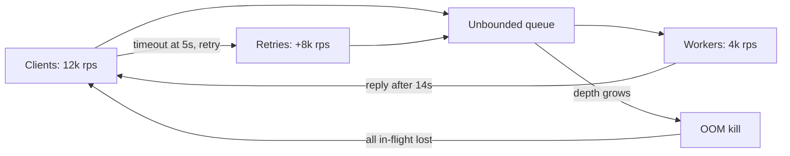
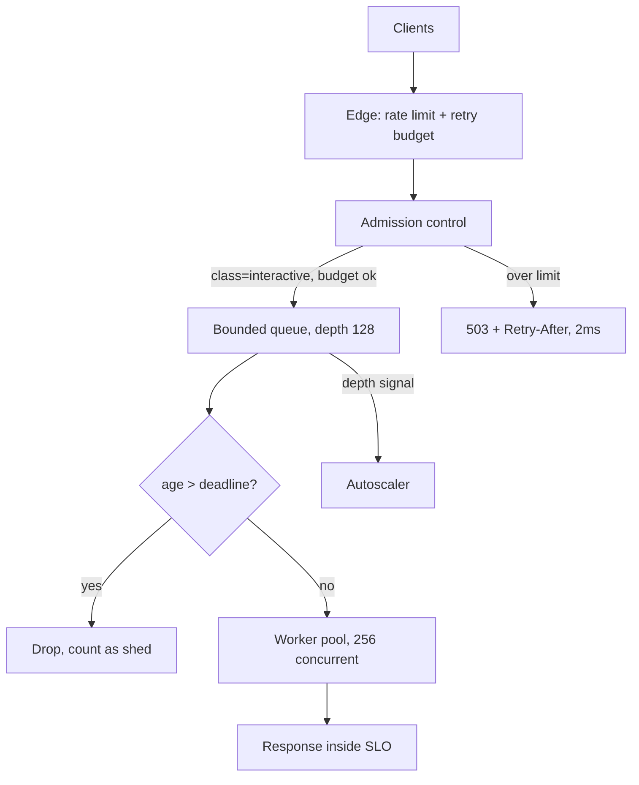

> **Scenario** — ২০:০০-এ একটা marketing push এমন API-তে সেকেন্ডে ১২,০০০ request পাঠায় যেটা আরামে ৪,০০০ serve করে। কিছুই crash করে না। প্রতিটি request accept হয়, queue-এ বসে, ১৪ সেকেন্ড পরে উত্তর পায় — ততক্ষণে client ৫s-এ timeout করে retry করে ফেলেছে। কার্যকর goodput: প্রায় শূন্য।

## Why it matters

- Overload-এ সব accept করা সিস্টেমের throughput বাড়তি reject করা সিস্টেমের চেয়ে *কম*। যে কাজের জন্য কেউ অপেক্ষা করছে না, সেটা queue-এ রাখা নিছক অপচয়।
- Little's Law ছাড় দেয় না: ৪,০০০ req/s capacity-তে ১২,০০০ এলে queue depth সেকেন্ডে ৮,০০০ বাড়ে। ১০ সেকেন্ড পরে নতুন request ২০ সেকেন্ড পিছিয়ে।
- Timeout-এ client retry arrival rate বাড়ায়, তাই overload নিজেই নিজেকে খাওয়ায়।
- Queue depth-এর সাথে memory বাড়ে। শেষটা সাধারণত OOM kill, যা *সব* in-flight কাজ ফেলে দেয় — যেগুলো সফল হতো সেগুলোসহ।
- দ্রুত 429 দিয়ে ৮,০০০ req/s reject করলে ৪,০০০ req/s SLO-র ভেতর থাকে। শূন্যের তুলনায় সেটা ভালো দিন।

## Symptoms

| Signal | What you observe |
|---|---|
| Latency vs load | p50 load-এর সাথে linear, তারপর vertical; p99 client timeout-এ আটকে |
| Queue depth | `queue_depth` একদিকে বাড়ে, burst-এর মাঝে কখনো drain হয় না |
| Goodput | *Client timeout-এর আগে সম্পন্ন* req/s ধসে যায়, অথচ accepted req/s উঁচু থাকে |
| Retries | Inbound RPS আসল user rate-এর ২-৩ গুণ; একই idempotency key বারবার |
| Memory | Queue depth-এর সমানুপাতে RSS বাড়ে, তারপর `dmesg`-এ `Killed process` |
| CPU | Saturated নয় — bottleneck pool বা lock, CPU ৫৫%-এ "ঠিকই" দেখায় |

## How it breaks

Serve করার চেয়ে দ্রুত আসা কাজ কোথাও যেতে হয়। Unbounded queue overload সমস্যাকে latency সমস্যা, তারপর memory সমস্যা বানায়। মূল ব্যাপার হলো queued request বুড়ো হতে থাকে: worker যখন #৪০,০০০ request তোলে, তখন যে client পাঠিয়েছিল সে ৯ সেকেন্ড আগেই হাল ছেড়ে দুটো নতুন পাঠিয়েছে। Server এখন ১০০% capacity খরচ করছে এমন response বানাতে যা ফেলে দেওয়া হবে, আর তার তৈরি retry arrival rate আরও বাড়াচ্ছে। এটাই metastable failure — marketing traffic থামার পরেও retry backlog overload ধরে রাখায় সিস্টেম down থাকে।



## Root causes

1. Unbounded (বা খুব গভীর) accept queue, listen backlog ও thread-pool queue।
2. Request deadline নেই, তাই worker এমন request process করে যার client চলে গেছে।
3. Budget ছাড়া client retry, ফলে failure load কমায় না, বাড়ায়।
4. Admission সিদ্ধান্ত দামি কাজের (auth, DB lookup) পরে, আগে নয়।
5. সব traffic সমান ধরা: health check, batch backfill ও checkout একই queue-তে।
6. একমাত্র প্রতিরক্ষা autoscaling — ১০ সেকেন্ডের spike-এর বিরুদ্ধে ৩ মিনিটের scale-out।

## How to solve it

### 1. Queue bound করুন, দরজাতেই shed করুন

সবচেয়ে সস্তা rejection-ই সবচেয়ে ভালো। Body parse বা database ছোঁয়ার আগেই reject করুন।

```ts
const MAX_CONCURRENT = 256
const MAX_QUEUE = 128
let inFlight = 0
const queue: Array<() => void> = []

export function admit(res: Response): boolean {
  if (inFlight < MAX_CONCURRENT) { inFlight++; return true }
  if (queue.length < MAX_QUEUE) return false // caller enqueue করবে
  res.status(503).set('Retry-After', '2').send('overloaded')
  metrics.increment('shed', { reason: 'queue_full' })
  return false
}
```

`MAX_CONCURRENT` অনুমান থেকে নয়, measurement থেকে আসবে: যে concurrency-তে p99 super-linearly বাড়তে শুরু করে, তার একটু নিচে সেট করুন।

### 2. অতি পুরনো request ফেলে দিন (LIFO + deadline)

Overload-এ FIFO সবচেয়ে *পুরনো* — অর্থাৎ সবচেয়ে বেশি সম্ভাবনায় পরিত্যক্ত — request আগে serve করে। Deadline check-সহ LIFO সেগুলো serve করে যেগুলো এখনো কাজে আসবে।

```python
import time

DEADLINE_MS = 1000

def worker_loop(stack):
    while True:
        req = stack.pop()  # LIFO: সবচেয়ে নতুনটা আগে
        age_ms = (time.monotonic() - req.enqueued_at) * 1000
        if age_ms > DEADLINE_MS:
            metrics.increment("shed", tags={"reason": "expired"})
            continue  # client নেই; capacity খরচ করবেন না
        handle(req)
```

Deadline header হিসেবে downstream-এ পাঠান (যেমন `X-Request-Deadline: 1718000000123`) যাতে প্রতিটি hop একই সিদ্ধান্ত নিতে পারে।

### 3. Arrival order নয়, criticality অনুযায়ী priority

প্রতিটি request class-কে concurrency-র নিজের ভাগ দিন, যাতে batch traffic checkout-কে starve করতে না পারে।

```sql
-- উদাহরণ: edge-এ per-tenant, per-class token accounting
SELECT tenant_id, class, tokens
FROM admission_buckets
WHERE tenant_id = $1 AND class = $2
  AND tokens > 0
FOR UPDATE SKIP LOCKED;
```

বাস্তবে এটা Redis বা in-process-এ থাকবে, Postgres-এ নয়; মূল কথা admission একটা *per-class* সিদ্ধান্ত। সাধারণ class: `interactive-paid`, `interactive-free`, `background`, `health`।

### 4. Client-কে retry budget দিন

Client সহযোগিতা না করলে shedding কাজ করে না। Per-request নয়, মোট request-এর ভগ্নাংশ (যেমন ১০%) হিসেবে retry cap করুন, আর `Retry-After` jitter-সহ মানুন।

```ts
class RetryBudget {
  private tokens = 0
  constructor(private ratio = 0.1, private max = 100) {}
  onRequest() { this.tokens = Math.min(this.max, this.tokens + this.ratio) }
  tryRetry(): boolean {
    if (this.tokens < 1) return false
    this.tokens -= 1
    return true
  }
}
```

### 5. দ্রুত, সৎ 503 দিন `Retry-After`-সহ

২ms-এ 503 বানাতে প্রায় কিছুই লাগে না, আর client-কে কাজের তথ্য দেয়। ১৪ সেকেন্ডে 200 এক worker-second খরচ করে কাউকে সাহায্য করে না।

### 6. Autoscaling রাখুন, তবে ধীর স্তর হিসেবে

Shedding প্রথম ৬০ সেকেন্ড সামলায়; autoscaling পরের ১০ মিনিট। CPU নয়, queue depth বা concurrency-তে scale করুন — bottleneck খুব কমই CPU।

## Target design



## Tradeoffs

| Option | Pros | Cons | Choose when |
|---|---|---|---|
| Unbounded queue | দৃশ্যমান rejection নেই | Metastable collapse, OOM, শূন্য goodput | Interactive traffic-এ কখনোই নয় |
| Bounded queue + 503 | Predictable latency, goodput রক্ষা | User error দেখে; client সহযোগিতা লাগে | যেকোনো user-facing API |
| LIFO + deadline | Overload-এ কাজের কাজ সর্বাধিক | Unfair; কিছু request কখনো serve হয় না | ছোট আয়ুর interactive request |
| Per-class quota | Revenue traffic রক্ষা | Classification ও config খরচ | Multi-tenant বা mixed workload |
| শুধু autoscale | কোড বদল লাগে না | Spike-এ ধীর; খরচ; dependency overload করে | ধীর, predictable growth |
| Per-client hard rate limit | সহজ, অনেকটা fair | ভোঁতা; বৈধ burst-ও শাস্তি পায় | Abuse ঝুঁকিসহ public API |

## Verification checklist

- [ ] Capacity-র ৩ গুণ load test: goodput শূন্যে না নেমে ~capacity-তে সমান থাকে।
- [ ] Shed response p99-এ ১০ms-এর নিচে (সফল response থেকে আলাদা করে measure করুন)।
- [ ] `queue_depth`, `shed_total{reason}` ও `goodput` এক dashboard-এ।
- [ ] Path-এর প্রতিটি queue-র documented maximum আছে: listen backlog, app queue, DB pool, HTTP client pool।
- [ ] Client `Retry-After` মানে — shedding শুরুর পর inbound RPS *কমতে* দেখে যাচাই করুন।
- [ ] ৩ গুণ load-এ ১৫ মিনিট soak test শেষে service চালু এবং RSS সমান।
- [ ] Health-check endpoint কখনো shed হয় না, এবং user quota-তে গোনা হয় না।

## Anti-patterns

- "Spike সামলাতে" queue size বা thread count বাড়ানো — এতে latency ও memory বাড়ে, capacity নয়।
- Authentication ও database lookup-এর *পরে* shed করা, ফলে প্রতিটি rejected request-ও ৪০ms খায়।
- 503-এর বদলে 500 দেওয়া, যা client-কে আগ্রাসী retry করায় ও error SLO নষ্ট করে।
- Shed হওয়া request jitter ছাড়া সাথে সাথে retry করা, আবার herd তৈরি।
- সফলতা "accepted request" দিয়ে মাপা, "deadline-এর ভেতর সম্পন্ন" দিয়ে নয়।
- App-এ shed কিন্তু edge-এ নয়, ফলে edge-এর connection pool-ই নতুন bottleneck।

## Related

- [Graceful degradation by design](/systems/reliability-edge-cases/graceful-degradation-design)
- [Partial failure in fan-out requests](/systems/reliability-edge-cases/partial-failure-handling)
- [Retry storm prevention](/systems/reliability-edge-cases/retry-storm-prevention)
- [p99 tail latency and capacity planning](/systems/performance-capacity/p99-tail-latency-planning)
