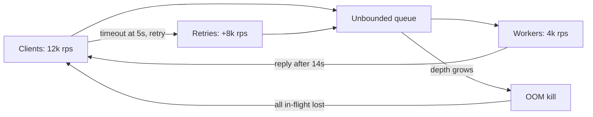
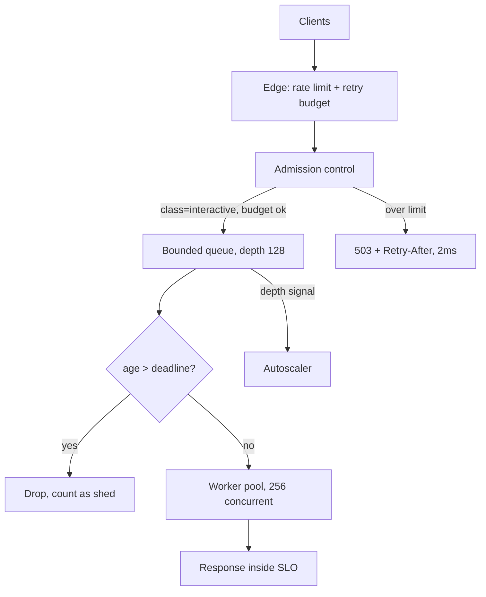

> **Scenario** - A marketing push at 20:00 sends 12,000 requests/second at an API that comfortably serves 4,000. Nothing crashes. Every request is accepted, queued, and answered after 14 seconds - by which time the client has already timed out at 5s and retried. Effective goodput: near zero.

## Why it matters

- An overloaded system that accepts everything achieves *lower* throughput than one that rejects excess. Queued work that nobody is waiting for is pure waste.
- Little's Law is unforgiving: with 4,000 req/s capacity and 12,000 arriving, queue depth grows 8,000/second. After 10 seconds the newest request is 20 seconds behind.
- Client retries on timeout multiply the arrival rate, so the overload feeds itself.
- Memory grows with queue depth. The usual ending is an OOM kill, which drops *all* in-flight work including the requests that would have succeeded.
- Rejecting 8,000 req/s with a fast 429 keeps 4,000 req/s inside SLO. That is a good day compared to zero.

## Symptoms

| Signal | What you observe |
|---|---|
| Latency vs load | p50 tracks load linearly then goes vertical; p99 pinned at the client timeout |
| Queue depth | `queue_depth` climbing monotonically, never draining between bursts |
| Goodput | Requests/second *completed before client timeout* collapses while requests/second accepted stays high |
| Retries | Inbound RPS 2-3x the real user rate; same idempotency keys seen repeatedly |
| Memory | RSS growth proportional to queue depth, then a `Killed process` in `dmesg` |
| CPU | Not saturated - the bottleneck is a pool or a lock, and CPU looks "fine" at 55% |

## How it breaks

Work arriving faster than it can be served has to go somewhere. Unbounded queues turn an overload problem into a latency problem and then into a memory problem. The critical detail is that queued requests keep aging: by the time a worker picks up request #40,000, the client that sent it gave up 9 seconds ago and has sent two replacements. The server is now spending 100% of its capacity computing responses that will be discarded, while the retries it caused push arrival rate higher. This is metastable failure - even after the marketing traffic stops, the system stays down because the retry backlog sustains the overload.



## Root causes

1. Unbounded (or very deep) accept queues, listen backlogs, and thread-pool queues.
2. No request deadline, so workers process requests whose client has already left.
3. Client retries without a budget, so failure amplifies load instead of reducing it.
4. Admission decisions made after expensive work (auth, DB lookup) rather than before.
5. All traffic treated as equal: health checks, batch backfills, and checkout share one queue.
6. Autoscaling used as the only defence, with a 3-minute scale-out time against a 10-second spike.

## How to solve it

### 1. Bound the queue and shed at the door

The cheapest rejection is the best one. Reject before parsing a body or touching the database.

```ts
const MAX_CONCURRENT = 256
const MAX_QUEUE = 128
let inFlight = 0
const queue: Array<() => void> = []

export function admit(res: Response): boolean {
  if (inFlight < MAX_CONCURRENT) { inFlight++; return true }
  if (queue.length < MAX_QUEUE) return false // caller enqueues
  res.status(503).set('Retry-After', '2').send('overloaded')
  metrics.increment('shed', { reason: 'queue_full' })
  return false
}
```

`MAX_CONCURRENT` should come from measurement, not intuition: find the concurrency at which p99 latency starts rising super-linearly and set the limit just below it.

### 2. Drop requests that are already too old (LIFO + deadline)

FIFO under overload serves the *oldest* - that is, the most likely to be abandoned - requests first. LIFO with a deadline check serves the ones that can still be useful.

```python
import time

DEADLINE_MS = 1000

def worker_loop(stack):
    while True:
        req = stack.pop()  # LIFO: freshest first
        age_ms = (time.monotonic() - req.enqueued_at) * 1000
        if age_ms > DEADLINE_MS:
            metrics.increment("shed", tags={"reason": "expired"})
            continue  # client is gone; do not spend capacity
        handle(req)
```

Propagate the deadline downstream as a header (for example `X-Request-Deadline: 1718000000123`) so every hop can make the same decision.

### 3. Prioritize by criticality, not arrival order

Give each request class its own share of concurrency so batch traffic cannot starve checkout.

```sql
-- Example: per-tenant, per-class token accounting checked at the edge
SELECT tenant_id, class, tokens
FROM admission_buckets
WHERE tenant_id = $1 AND class = $2
  AND tokens > 0
FOR UPDATE SKIP LOCKED;
```

In practice this belongs in Redis or in-process, not Postgres; the point is that admission is a *per-class* decision. Typical classes: `interactive-paid`, `interactive-free`, `background`, `health`.

### 4. Give clients a retry budget

Shedding only works if clients cooperate. Cap retries as a fraction of total requests (for example 10%) rather than per-request, and always honour `Retry-After` with jitter.

```ts
class RetryBudget {
  private tokens = 0
  constructor(private ratio = 0.1, private max = 100) {}
  onRequest() { this.tokens = Math.min(this.max, this.tokens + this.ratio) }
  tryRetry(): boolean {
    if (this.tokens < 1) return false
    this.tokens -= 1
    return true
  }
}
```

### 5. Return a fast, honest 503 with `Retry-After`

A 503 in 2ms costs almost nothing to produce and tells the client something actionable. A 200 in 14 seconds costs a worker-second and helps nobody.

### 6. Keep autoscaling, but as the slow layer

Shedding handles the first 60 seconds; autoscaling handles the next 10 minutes. Scale on queue depth or concurrency, not CPU, since the bottleneck is rarely CPU.

## Target design



## Tradeoffs

| Option | Pros | Cons | Choose when |
|---|---|---|---|
| Unbounded queue | No visible rejections | Metastable collapse, OOM, zero goodput | Never for interactive traffic |
| Bounded queue + 503 | Predictable latency, protects goodput | Users see errors; needs client cooperation | Any user-facing API |
| LIFO with deadlines | Maximizes useful work under overload | Unfair; some requests never served | Short-lived interactive requests |
| Per-class quotas | Protects revenue traffic | Classification and config overhead | Multi-tenant or mixed workloads |
| Autoscale only | No code changes | Too slow for spikes; costs money; can overload dependencies | Slow, predictable growth |
| Hard rate limit per client | Simple, fair-ish | Blunt; punishes legitimate bursts | Public APIs with abuse risk |

## Verification checklist

- [ ] Load test at 3x capacity: goodput stays flat at ~capacity instead of collapsing to zero.
- [ ] Shed responses are served in under 10ms at p99 (measure separately from successful responses).
- [ ] `queue_depth`, `shed_total{reason}`, and `goodput` are on one dashboard.
- [ ] Every queue in the path has a documented maximum: listen backlog, app queue, DB pool, HTTP client pool.
- [ ] Clients honour `Retry-After` - verified by watching inbound RPS *fall* after shedding starts.
- [ ] A soak test at 3x capacity for 15 minutes ends with the service still up and RSS flat.
- [ ] Health-check endpoints are never shed, and are not counted against user quotas.

## Anti-patterns

- Raising the queue size or thread count "to handle the spike" - this increases latency and memory, not capacity.
- Shedding *after* authentication and a database lookup, so rejected requests still cost 40ms each.
- Returning 500 instead of 503, which makes clients retry aggressively and pollutes error SLOs.
- Retrying shed requests immediately without jitter, recreating the herd.
- Measuring success as "requests accepted" rather than "requests completed within deadline".
- Load shedding at the app but not at the edge, so the edge's own connection pool becomes the new bottleneck.

## Related

- [Graceful degradation by design](/systems/reliability-edge-cases/graceful-degradation-design)
- [Partial failure in fan-out requests](/systems/reliability-edge-cases/partial-failure-handling)
- [Retry storm prevention](/systems/reliability-edge-cases/retry-storm-prevention)
- [p99 tail latency and capacity planning](/systems/performance-capacity/p99-tail-latency-planning)
