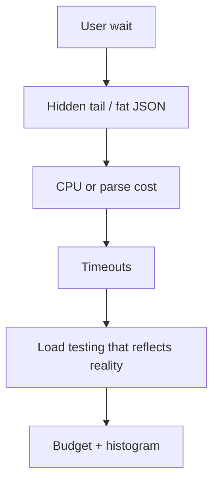

> **Lesson 65 · intermediate** - Closed-model tests hide coordinated omission - open-model arrival rates, warm caches, and honest percentiles.

## Why it matters

- Averages hide the p99 that users actually feel on a Quasar spinner.
- Payload size, serialization, and N+1 add up before you “need Kubernetes”.
- Load tests that hammer login and skip the ticket list lie about capacity.
- This lesson is specifically about **Load testing that reflects reality**. Tags: load-testing, k6, jmeter, benchmarking, percentiles.

## Symptoms

| Signal | What you observe |
| --- | --- |
| Tail | p50 40ms, p99 2.1s on the same endpoint |
| Payload | Ticket JSON is 1.4 MB because comments are nested |
| GC / CPU | Workers busy encoding, not querying |
| Lab vs prod | k6 on staging has no production cache stampede |

## How it breaks



The named technology is rarely the villain. Two code paths (often a Vue/Quasar screen and a Laravel write) assume opposite contracts. Production finds the race. For this topic that contract is: Closed-model tests hide coordinated omission - open-model arrival rates, warm caches, and honest percentiles.

## Root causes

1. Dashboards showed mean latency only.
2. API returned graphs the UI did not render.
3. No budget for bytes per route in the Vue build.
4. Load test used a warm cache and a single tenant.

## How to solve it

### 1. Write the invariant in one sentence

Closed-model tests hide coordinated omission - open-model arrival rates, warm caches, and honest percentiles. Put that sentence in the PR, the Pinia action, and the Laravel class.

### 2. Guard the edge in code

```ts
// Keep the list payload boring
const columns = ['id', 'title', 'status', 'updated_at'] as const
```

```php
return TicketResource::collection(
    $tickets->map(fn (Ticket $t) => $t->only(['id', 'title', 'status', 'updated_at']))
);
```

### 3. Keep a chart you will actually look at

Histogram of latency (not just average), response bytes, and CPU per request. If the chart cannot catch a regression in **Load testing that reflects reality**, the lesson is not done.

## Worked example

The ticket detail resource embedded the whole comment thread. Mobile Vue spent 800ms JSON.parse. A summary endpoint plus a paged comments call cut p99 in half.

On this topic, start from the symptom in the table that matches your last incident, then walk the diagram until the guard above would have fired.

## Check before you ship

- [ ] The invariant for **Load testing that reflects reality** is written in one sentence.
- [ ] Empty, duplicate, timeout, or permission paths have a test or a staged rehearsal.
- [ ] A dashboard or log query would catch a regression within one deploy.
- [ ] Related reading still makes sense: littles-law-capacity-planning, p99-tail-latency-planning, autoscaling-lag-and-warmup.

## What not to do

- Copy a blog snippet that retries forever or caches the error as success.
- Treat Pinia as the source of truth for a Laravel row.
- Skip the previous numbered lesson if this one feels dense — the path is beginner → intermediate → advanced on purpose.
