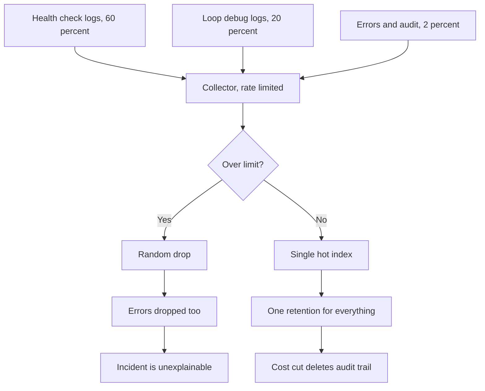
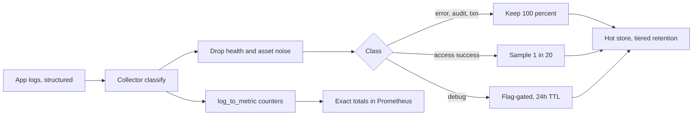

> **Scenario** — Observability invoice মাসে $41,000, অথচ compute bill $14,000। Finance পরের quarter-এ 60% কমানোর কথা বলছে। দলের প্রথম পদক্ষেপ: globally retention 3 দিন। দুই সপ্তাহ পর এক customer 11 দিন আগের transaction নিয়ে dispute করে — যাচাই করার কোনো log নেই।

## Why it matters

- Telemetry-র খরচ যে system পর্যবেক্ষণ করছে তার চেয়ে বেশি হলে কেউ কাটবেই — খারাপভাবে, আর সাধারণত design review-তে নয়, budget cycle-এ।
- Blanket retention কাটা audit ও billing evidence মুছে দেয়, high-volume debug noise অটুট থাকে।
- Uniform sampling বিরল event মোছে — যে population-এর জন্যই log রাখা হয়।
- Incident-এ ingest spike স্বাভাবিক: যেদিন log সবচেয়ে দরকার, সেদিনই rate limit-এ pipeline সেগুলো ফেলে দেয়।
- গুরুত্বপূর্ণ metric per-gigabyte cost নয়, প্রতি কাজের উত্তরের cost — এবং সেটি এক order of magnitude উন্নত করা যায়।

## Symptoms

| Signal | What you observe |
| --- | --- |
| Cost | Traffic বা headcount-এর চেয়ে দ্রুত log ingest bill বাড়ছে |
| Volume mix | 80% লাইন আসে তিনটি বাচাল service থেকে, বেশিরভাগ `INFO` |
| Drops | Incident-এর সময় collector record drop রিপোর্ট করে |
| Retention | Audit, debug ও access log-এর জন্য একটিই global retention |
| Sampling | Fixed 10% sample, তাই 40-event failure-এ 4 event দেখা যায় |
| Queries | 90 দিনে ingested field-এর 60% কেউ query করেনি |

## How it breaks

Log volume-এ প্রাধান্য পায় অল্প কিছু high-frequency, low-value event: health check, per-item loop log, সফল cache hit, আর enabled হয়ে ship হওয়া framework debug লাইন। Pipeline প্রতিটি লাইনকে সমান ধরে, তাই সস্তা event দামি event-কে চাপা দেয়। Incident-এর সময় error volume দশগুণ হয়, collector rate limit-এ পৌঁছে record drop করে — প্রায়ই randomly, অর্থাৎ error-ও পড়ে যায়। এরপর cost চাপ আসে, আর সবার জানা একমাত্র lever global retention; ফলে সব একসাথে ছোট হয়, যে compliance-সংশ্লিষ্ট অংশটি কখনো সমস্যা ছিল না সেটিসহ।



## Root causes

1. Per-signal classification নেই: audit, error, access ও debug log একই pipeline ও একই retention শেয়ার করে।
2. Sampling outcome ধরে নয়, uniformly প্রয়োগ করা।
3. Health check, readiness probe ও static asset request পূর্ণ volume-এ log করা।
4. Per-tenant নয়, পুরো service-এর জন্য production-এ debug-level logging চালু রাখা।
5. Cost attribution নেই, তাই কোনো team নিজের bill দেখে না।
6. Priority ছাড়া rate limit, তাই drop হয় random — lowest-value-first নয়।

## How to solve it

### 1. Stream classify করুন, তারপর class-প্রতি retention দিন

| Class | Examples | Retention | Sampling |
| --- | --- | --- | --- |
| Audit | auth event, permission change, money movement | 400 দিন | কখনো sample নয় |
| Error | `level >= error`, 5xx, exception | 90 দিন | কখনো sample নয় |
| Transaction | order state change, job outcome | 30 দিন | কখনো sample নয় |
| Access | HTTP access log | 14 দিন hot, 90 দিন cold | সফলগুলো head sample |
| Debug | verbose internals | 24 ঘণ্টা | আগ্রাসী, flag-gated |

### 2. অন্য কিছুতে হাত দেওয়ার আগে collector-এ সহজ লাভগুলো নিন

```yaml
# Vector: kill the noise floor, keep every error.
transforms:
  classify:
    type: remap
    inputs: [k8s_logs]
    source: |
      .class = "access"
      if .level == "error" || .level == "fatal" { .class = "error" }
      if exists(.audit_event) { .class = "audit" }
      if .level == "debug" { .class = "debug" }

  drop_noise:
    type: filter
    inputs: [classify]
    condition: |
      !(
        .http.path == "/healthz" ||
        .http.path == "/readyz" ||
        .http.path == "/metrics" ||
        (.class == "access" && .http.status < 400 && starts_with(string!(.http.path), "/assets/"))
      )

  sample_success:
    type: sample
    inputs: [drop_noise]
    rate: 20                              # keep 1 in 20
    exclude: |
      .class != "access" || .http.status >= 400 || .duration_ms > 1000
```

আসল কৌশল `exclude` clause-এ: শুধু নিরস success sample করুন। Error, slow request, audit event ও transaction অটুট থাকে।

### 3. Detail ফেললেও aggregate সত্য ধরে রাখুন

Sampling count নষ্ট করে — যদি sample rate record না করেন বা counting metric-এ না সরান।

```yaml
# Emit a metric from logs so totals survive sampling.
transforms:
  to_metrics:
    type: log_to_metric
    inputs: [classify]
    metrics:
      - type: counter
        field: class
        name: log_events_total
        namespace: telemetry
        tags:
          service: "{{ service }}"
          class: "{{ class }}"
          level: "{{ level }}"
```

তখন মাত্র 5% লাইন সংরক্ষিত হলেও সঠিক count সবসময় Prometheus-এ থাকে।

```promql
# Ingest volume by service — the cost attribution query
topk(10, sum by (service) (rate(telemetry_log_events_total[1h])))

# Bytes per service per day, if your collector exports size
sum by (service) (increase(telemetry_log_bytes_total[24h])) / 1e9
```

### 4. Debug logging deployment নয়, tenant ধরে gate করুন

```php
// Laravel: raise the level only for the tenant you are debugging.
$level = Feature::for($request->user()?->tenant)->active('verbose-logs')
    ? 'debug'
    : config('logging.level');

Log::withContext(['sampled' => false]);
Log::channel('stack')->log($level, 'cart.recalculated', [
    'cart_id' => $cart->id,
    'items'   => $cart->items->count(),   // count, not the whole collection
]);
```

### 5. Trace sampling-এর সাথে log sampling মেলান

Trace রাখা হলে তার log রাখুন। Drop হলে তার log sample করুন।

```yaml
transforms:
  keep_sampled_traces:
    type: filter
    inputs: [classify]
    condition: |
      .class != "access" ||
      .trace_sampled == true ||
      .http.status >= 400
```

এতে "trace খুলুন, তারপর তার log পড়ুন" workflow নির্ভরযোগ্য হয় — যেটাই আসলে incident সমাধান করে।

### 6. Drop-কে সরব ও priority-যুক্ত করুন

```yaml
sinks:
  primary:
    type: loki
    inputs: [sample_success]
    buffer:
      type: disk
      max_size: 5368709120         # 5 GiB, survives a 20-minute backend outage
      when_full: drop_newest
```

```yaml
- alert: TelemetryDropping
  expr: sum(rate(vector_component_discarded_events_total[5m])) > 0
  for: 10m
  labels: { severity: ticket }
  annotations:
    summary: "Log pipeline discarding events"
```

## Target design



## Tradeoffs

| Option | Pros | Cons | Choose when |
| --- | --- | --- | --- |
| Outcome-based sampling | প্রতিটি failure থাকে, বড় সঞ্চয় | pipeline config কিছুটা কঠিন | access log-এর default |
| Uniform sampling | ভাবা সহজ | বিরল event হারায় | error path-এ কখনো নয় |
| ছোট global retention | এক setting, তৎক্ষণাৎ সঞ্চয় | audit ও billing evidence মোছে | শুধু debug-class stream-এ |
| Cold storage tiering | সস্তা দীর্ঘ retention | ধীর query, restore ধাপ | compliance ও dispute |
| Log-এর বদলে metric | ক্ষুদ্র footprint, সঠিক count | per-event context নেই | যা গোনা যায় তা গুনতে |
| প্রতি লাইনে sample rate | total পুনর্গঠনযোগ্য | প্রতিটি consumer-কে গুণ করতে হয় | sampled data-র analytics |

## Verification checklist

- [ ] `topk(10, sum by (service) (rate(telemetry_log_events_total[1h])))` প্রত্যাশার সাথে মেলে, শীর্ষ তিনটি ন্যায্য।
- [ ] Hot index-এ health-check ও static-asset লাইন নেই।
- [ ] 50টি error ট্রিগার করে দেখুন 50টিই unsampled সংরক্ষিত।
- [ ] 200 দিন আগের একটি audit event এখনো পাওয়া যায়।
- [ ] পরিকল্পিত পরীক্ষা বাদে শেষ 30 দিনে `vector_component_discarded_events_total` শূন্য।
- [ ] Service-প্রতি cost মাসিকভাবে মালিক team-কে জানানো হয়।

## Anti-patterns

- প্রথম cost lever হিসেবে globally retention কাটা।
- Incident-এর সময় "এত বেশি আছে" বলে error sample করা।
- Batch-প্রতি একটি summary লাইনের বদলে per-item loop-এর ভেতরে log করা।
- যা counter সঠিক ও সস্তায় গুনতে পারে তা log দিয়ে গোনা।
- জায়গা বাঁচাতে collector-এর disk buffer বন্ধ করা, যা backend blip-কে স্থায়ী data loss বানায়।

## Related

- [Structured logging standards](/systems/observability-sli/structured-logging-standards)
- [Metric cardinality explosion](/systems/observability-sli/metric-cardinality-explosion)
- [Distributed tracing adoption](/systems/observability-sli/distributed-tracing-adoption)
- [Incident timeline reconstruction](/systems/observability-sli/incident-timeline-reconstruction)
