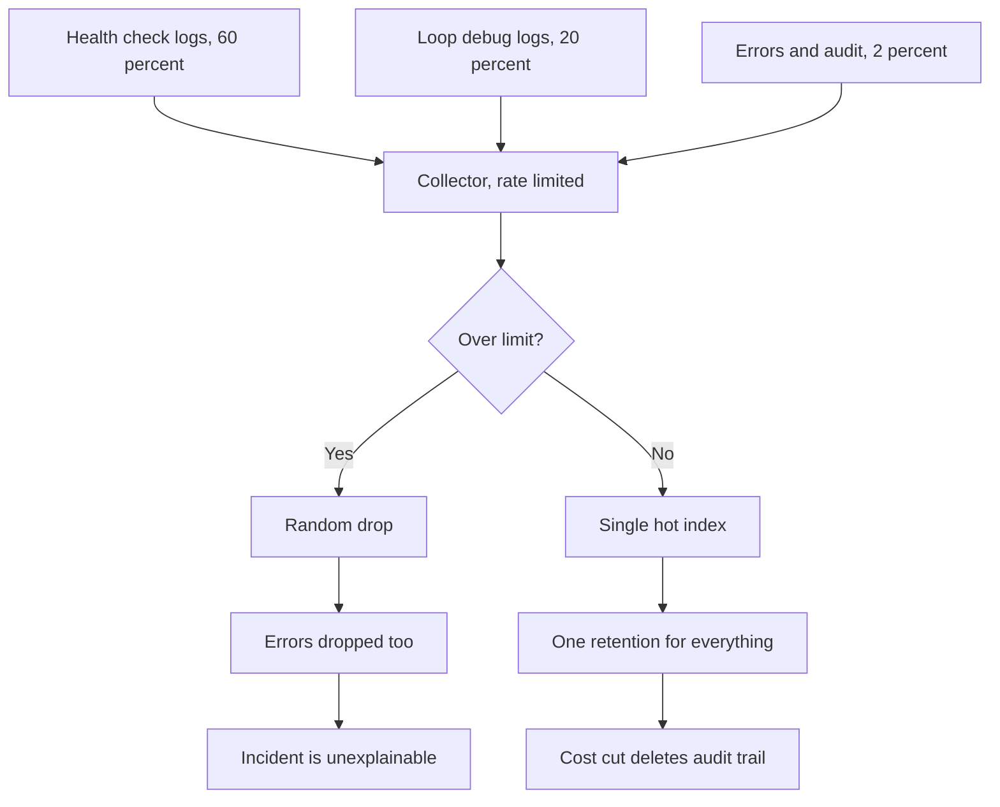
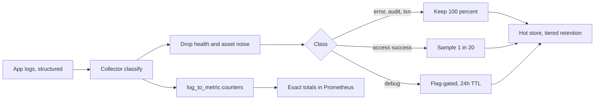

> **Scenario** - The observability invoice is $41,000 a month against a $14,000 compute bill. Finance asks for a 60% cut by next quarter. The team's first move is to set retention to 3 days globally, and two weeks later a customer disputes a transaction from 11 days ago with no logs to check.

## Why it matters

- When telemetry costs more than the system it observes, someone will cut it - badly, and usually during a budget cycle rather than a design review.
- Blanket retention cuts delete audit and billing evidence while leaving high-volume debug noise untouched.
- Uniform sampling deletes rare events, which is exactly the population you keep logs for.
- Ingest spikes on incidents are the norm: the day you need logs most is the day the pipeline drops them under rate limits.
- Cost per useful answer, not cost per gigabyte, is the metric that matters - and it is improvable by an order of magnitude.

## Symptoms

| Signal | What you observe |
| --- | --- |
| Cost | Log ingest bill growing faster than traffic or headcount |
| Volume mix | 80% of lines come from three chatty services, mostly `INFO` |
| Drops | Collector reporting dropped records during incidents |
| Retention | One global retention setting for audit, debug, and access logs |
| Sampling | Fixed 10% sample, so a 40-event failure shows 4 events |
| Queries | Nobody has queried 60% of the ingested fields in 90 days |

## How it breaks

Log volume is dominated by a small number of high-frequency, low-value events: health checks, per-item loop logs, successful cache hits, and framework debug lines that shipped enabled. Because the pipeline treats every line equally, the cheap events crowd out the expensive ones. During an incident, error volume rises tenfold and the collector hits its rate limit, so it drops records - often randomly, which means it drops errors too. Then cost pressure arrives and the only lever anybody knows is global retention, so everything gets shortened together, including the compliance-relevant subset that was never the problem.



## Root causes

1. No per-signal classification: audit, error, access, and debug logs share one pipeline and one retention.
2. Sampling applied uniformly instead of by outcome.
3. Health checks, readiness probes, and static asset requests logged at full volume.
4. Debug-level logging left enabled in production for entire services rather than per-tenant.
5. No cost attribution, so no team sees its own bill.
6. Rate limits configured without priority, so drops are random rather than lowest-value-first.

## How to solve it

### 1. Classify streams, then set retention per class

| Class | Examples | Retention | Sampling |
| --- | --- | --- | --- |
| Audit | Auth events, permission changes, money movement | 400 days | Never sample |
| Error | `level >= error`, 5xx, exceptions | 90 days | Never sample |
| Transaction | Order state changes, job outcomes | 30 days | Never sample |
| Access | HTTP access logs | 14 days hot, 90 days cold | Head sample successes |
| Debug | Verbose internals | 24 hours | Aggressive, flag-gated |

### 2. Drop the free wins at the collector before you touch anything else

```yaml
# Vector: kill the noise floor, keep every error.
transforms:
  classify:
    type: remap
    inputs: [k8s_logs]
    source: |
      .class = "access"
      if .level == "error" || .level == "fatal" { .class = "error" }
      if exists(.audit_event) { .class = "audit" }
      if .level == "debug" { .class = "debug" }

  drop_noise:
    type: filter
    inputs: [classify]
    condition: |
      !(
        .http.path == "/healthz" ||
        .http.path == "/readyz" ||
        .http.path == "/metrics" ||
        (.class == "access" && .http.status < 400 && starts_with(string!(.http.path), "/assets/"))
      )

  sample_success:
    type: sample
    inputs: [drop_noise]
    rate: 20                              # keep 1 in 20
    exclude: |
      .class != "access" || .http.status >= 400 || .duration_ms > 1000
```

The `exclude` clause is the whole trick: sample only boring successes. Errors, slow requests, audit events, and transactions pass through untouched.

### 3. Keep aggregate truth even when you drop detail

Sampling loses counts unless you either record the sample rate or move counting into metrics.

```yaml
# Emit a metric from logs so totals survive sampling.
transforms:
  to_metrics:
    type: log_to_metric
    inputs: [classify]
    metrics:
      - type: counter
        field: class
        name: log_events_total
        namespace: telemetry
        tags:
          service: "{{ service }}"
          class: "{{ class }}"
          level: "{{ level }}"
```

Then the exact count is always available in Prometheus even when only 5% of lines are stored.

```promql
# Ingest volume by service - the cost attribution query
topk(10, sum by (service) (rate(telemetry_log_events_total[1h])))

# Bytes per service per day, if your collector exports size
sum by (service) (increase(telemetry_log_bytes_total[24h])) / 1e9
```

### 4. Gate debug logging per tenant, not per deployment

```php
// Laravel: raise the level only for the tenant you are debugging.
$level = Feature::for($request->user()?->tenant)->active('verbose-logs')
    ? 'debug'
    : config('logging.level');

Log::withContext(['sampled' => false]);
Log::channel('stack')->log($level, 'cart.recalculated', [
    'cart_id' => $cart->id,
    'items'   => $cart->items->count(),   // count, not the whole collection
]);
```

### 5. Align trace sampling with log sampling

If the trace was kept, keep its logs. If it was dropped, sample its logs.

```yaml
transforms:
  keep_sampled_traces:
    type: filter
    inputs: [classify]
    condition: |
      .class != "access" ||
      .trace_sampled == true ||
      .http.status >= 400
```

This makes "open the trace, then read its logs" reliable, which is the workflow that actually resolves incidents.

### 6. Make drops loud and prioritised

```yaml
sinks:
  primary:
    type: loki
    inputs: [sample_success]
    buffer:
      type: disk
      max_size: 5368709120         # 5 GiB, survives a 20-minute backend outage
      when_full: drop_newest
```

```yaml
- alert: TelemetryDropping
  expr: sum(rate(vector_component_discarded_events_total[5m])) > 0
  for: 10m
  labels: { severity: ticket }
  annotations:
    summary: "Log pipeline discarding events"
```

## Target design



## Tradeoffs

| Option | Pros | Cons | Choose when |
| --- | --- | --- | --- |
| Outcome-based sampling | Keeps every failure, big savings | Slightly harder pipeline config | Default for access logs |
| Uniform sampling | Trivial to reason about | Loses rare events | Never on error paths |
| Shorter global retention | One setting, immediate savings | Deletes audit and billing evidence | Only for debug-class streams |
| Cold storage tiering | Cheap long retention | Slow queries, restore step | Compliance and disputes |
| Metrics instead of logs | Tiny footprint, exact counts | No per-event context | Counting anything countable |
| Sample rate recorded per line | Reconstructable totals | Every consumer must multiply | Analytics on sampled data |

## Verification checklist

- [ ] `topk(10, sum by (service) (rate(telemetry_log_events_total[1h])))` matches expectations, and the top three are justified.
- [ ] Health-check and static-asset lines are absent from the hot index.
- [ ] Trigger 50 errors and confirm all 50 are stored, unsampled.
- [ ] Confirm an audit event from 200 days ago is still retrievable.
- [ ] `vector_component_discarded_events_total` is zero over the last 30 days outside planned tests.
- [ ] Cost per service is reported monthly to the owning team.

## Anti-patterns

- Cutting retention globally as the first cost lever.
- Sampling errors "because there are so many of them" during an incident.
- Logging inside a per-item loop instead of one summary line per batch.
- Using logs to count things a counter would count exactly and cheaply.
- Turning off the collector's disk buffer to save space, converting a backend blip into permanent data loss.

## Related

- [Structured logging standards](/systems/observability-sli/structured-logging-standards)
- [Metric cardinality explosion](/systems/observability-sli/metric-cardinality-explosion)
- [Distributed tracing adoption](/systems/observability-sli/distributed-tracing-adoption)
- [Incident timeline reconstruction](/systems/observability-sli/incident-timeline-reconstruction)
