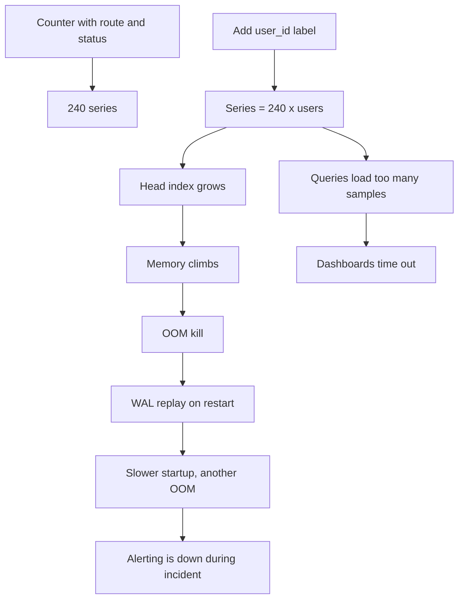
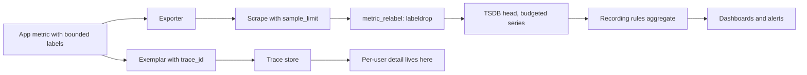

> **Scenario** — শুক্রবারের release-এ request counter-এ `customer_email` label যোগ হলো, "যাতে support নিজেই দেখতে পারে"। সোমবার নাগাদ Prometheus pod প্রতি নয় মিনিটে OOM-kill হচ্ছে, `head_series` 1.2 M থেকে 34 M, আর প্রতিটি dashboard timeout করছে — যেগুলো দিয়ে diagnose করবেন সেগুলোসহ।

## Why it matters

- Prometheus-এর memory প্রায় active series-এর সাথে linear। Label combination গুণ হলে RAM গুণ হয়, শেষে process মরে।
- Metrics backend পড়ে গেলে ঠিক incident-এর মুহূর্তেই alerting হারান।
- Query latency touched series-এর সাথে বাড়ে, তাই 300 ms-এ load হওয়া p99 panel 40 s নেয়।
- Managed backend series বা datapoint ধরে bill করে; একটি unbounded label মাসে পাঁচ অঙ্ক যোগ করতে পারে।
- Remote-write queue জমে যায়, ফলে historical data-তে gap — postmortem অপ্রমাণযোগ্য।

## Symptoms

| Signal | What you observe |
| --- | --- |
| Memory | `process_resident_memory_bytes` ক্রমাগত উঠছে, WAL replay-তে OOM kill |
| Series | `prometheus_tsdb_head_series` বৃদ্ধি deploy-এর সাথে মেলানো step function |
| Ingest | `prometheus_target_scrapes_exceeded_sample_limit_total` বাড়ছে |
| Query | Dashboard বলছে "query processing would load too many samples" |
| Compaction | `prometheus_tsdb_compactions_failed_total` বাড়ছে; disk ভরছে |
| Churn | request volume flat, তবু `prometheus_tsdb_head_series_created_total` উঁচু |

## How it breaks

প্রতিটি unique label-value combination আলাদা time series — প্রত্যেকের নিজের in-memory index entry ও chunk buffer। `route` (40 মান) ও `status` (6 মান)-যুক্ত counter মানে 240 series — সমস্যা নেই। `user_id` (500,000 মান) যোগ করলে সম্ভাব্য series 12 কোটি। Raw count-এর চেয়ে churn খারাপ: যে label-এর মান নিরন্তর বদলায় — HorizontalPodAutoscaler-এর pod name, `session_id`, প্রতি commit-এ version string — তারা অবিরাম নতুন series বানায়। Head block সেগুলো বয়স হওয়া পর্যন্ত রাখে, তাই memory চালায় *ঘণ্টায় তৈরি হওয়া series*, concurrent traffic নয়।



## Root causes

1. Unbounded identifier label হিসেবে: user, session, request, order, email, ID-সহ URL path।
2. Error message বা exception text label value হিসেবে ব্যবহার।
3. উচ্চ churn-এর ephemeral workload-এ pod/container/instance label ধরে রাখা।
4. অনেক bucket-এর histogram কয়েকটি label দিয়ে গুণ — bucket-ও series।
5. Per-target `sample_limit` নেই, তাই একটি খারাপ exporter পুরো server নামিয়ে দেয়।
6. Series budget-এর মালিক নেই, তাই বৃদ্ধি ধরা পড়ে শুধু OOM reaper-এর হাতে।

## How to solve it

### 1. কিছু বদলানোর আগে অপরাধী খুঁজুন

```promql
# Top metric names by series count
topk(20, count by (__name__)({__name__=~".+"}))

# Which label is doing the damage on a suspect metric
count(count by (user_id) (http_server_requests_total))

# Series created per hour — churn, not volume
sum(rate(prometheus_tsdb_head_series_created_total[1h])) * 3600
```

একটি metric-এ distinct value দিয়ে label rank করার দ্রুততম উপায় `count by (label)` idiom।

### 2. Scrape time-এ কঠিন সীমা enforce করুন

```yaml
scrape_configs:
  - job_name: app
    sample_limit: 5000
    label_limit: 32
    label_value_length_limit: 128
    target_limit: 400
    kubernetes_sd_configs:
      - role: pod
    metric_relabel_configs:
      # Drop known-bad labels rather than trusting every service to behave.
      - action: labeldrop
        regex: '(user_id|session_id|request_id|email|order_id)'
      # Drop entire metrics that were never meant to leave debug builds.
      - action: drop
        source_labels: [__name__]
        regex: 'debug_.*'
```

`sample_limit` "monitoring system মরে যায়"-কে "একটি target stale হয়ে alert করে"-তে বদলায়, যেটাই কাঙ্ক্ষিত failure mode।

### 3. Code-এই label value bound করুন

```ts
const ALLOWED_ROUTES = new Set(['/checkout', '/orders', '/search', '/auth/login'])
const ALLOWED_ERRORS = new Set(['timeout', 'validation', 'upstream_5xx', 'auth'])

function boundedRoute(path: string): string {
  return ALLOWED_ROUTES.has(path) ? path : 'other'
}

function boundedError(err: unknown): string {
  const kind = classify(err)                       // your own mapping
  return ALLOWED_ERRORS.has(kind) ? kind : 'other'
}

httpRequests.inc({ route: boundedRoute(req.route?.path ?? ''), error: boundedError(err) })
```

`other` bucket total ঠিক রেখে cardinality আটকায়। একটি metric-এর cardinality এমন সংখ্যা হওয়া উচিত যা মুখস্থ বলতে পারেন।

### 4. High-cardinality detail সরান exemplar, log ও trace-এ

Exemplar histogram bucket sample-এ trace ID জুড়ে দেয়: প্রতি bucket-এ একটি pointer, নতুন series নয়।

```ts
httpDuration.observe(
  { route: '/checkout', outcome: 'ok' },
  seconds,
  { traceID: span.spanContext().traceId },   // exemplar, not a label
)
```

```yaml
# Prometheus needs exemplar storage on, and Grafana links them to the trace UI.
storage:
  exemplars:
    max_exemplars: 200000
```

### 5. দীর্ঘমেয়াদে যা দরকার নেই সেই detail aggregate করে ফেলুন

```yaml
groups:
  - name: aggregation
    interval: 30s
    rules:
      # Keep per-pod for 6h raw, but alert and dashboard off the aggregate.
      - record: svc:http_requests:rate5m
        expr: sum without (pod, instance, container) (rate(http_server_requests_total[5m]))
      - record: svc:http_latency_bucket:rate5m
        expr: sum without (pod, instance, container) (rate(http_server_request_duration_seconds_bucket[5m]))
```

Backend-ই cost centre হলে remote-write-এর সময় raw series drop করুন।

### 6. Budget-কে alert বানান

```yaml
- alert: SeriesBudgetExceeded
  expr: prometheus_tsdb_head_series > 3.5e6
  for: 15m
  labels: { severity: ticket }
  annotations:
    summary: "Head series above budget"
    description: "Series {{ $value | humanize }} over 3.5M budget. Run the top-metrics query in the runbook."

- alert: CardinalityStepChange
  expr: |
    prometheus_tsdb_head_series
      > 1.25 * (prometheus_tsdb_head_series offset 1h)
  for: 20m
  labels: { severity: ticket }
```

25% step change-এ ticket-severity alert শুক্রবারের deploy শুক্রবারেই ধরে।

## Target design



## Tradeoffs

| Option | Pros | Cons | Choose when |
| --- | --- | --- | --- |
| Bounded label + `other` | পূর্বানুমেয় cost, total ঠিক থাকে | বিরল মানের detail হারায় | সব app metric-এর default |
| Scrape-এ `labeldrop` | কেন্দ্রীয় নিয়ন্ত্রণ, app change নেই | ভুল বিচারে চুপচাপ data loss | emergency containment |
| Detail-এ exemplar | সস্তা; metric থেকে trace-এ জোড়া | sampled, সম্পূর্ণ নয় | latency ও error debugging |
| High-cardinality fact log-এ | সম্পূর্ণ detail, per-field সস্তা | aggregate করা ধীর | per-tenant বা per-user প্রশ্ন |
| Downsampling-সহ remote-write | কম খরচে দীর্ঘ retention | raw resolution হারায় | capacity planning ও trend |

## Verification checklist

- [ ] `topk(20, count by (__name__)({__name__=~".+"}))` output reviewed, প্রতিটি top entry ব্যাখ্যাযোগ্য।
- [ ] কোনো metric-এর label-এর distinct-value count নথিভুক্ত cap ছাড়ায় না।
- [ ] প্রতিটি scrape job-এ `sample_limit` সেট; staging-এ noisy target দিয়ে পরীক্ষা করুন।
- [ ] `prometheus_tsdb_head_series` graph-এ budget threshold line আছে।
- [ ] Prometheus pod restart করে WAL replay-এর সময় মাপুন; liveness probe-এর মধ্যে থাকতে হবে।
- [ ] Grafana-তে exemplar দেখা যায় এবং live trace-এ jump করে।

## Anti-patterns

- Production debug-এর জন্য "অস্থায়ীভাবে" label যোগ করে release-এ রেখে দেওয়া।
- Route template-এর বদলে raw HTTP path label হিসেবে ব্যবহার।
- সমাধান হিসেবে Prometheus memory limit বাড়ানো, যা failure এক সপ্তাহ পেছায়।
- `status_code` raw integer label ও `status_class` দুটোই রাখা — কোনো লাভ ছাড়াই series দ্বিগুণ।
- প্রতিটি application metric-এ git SHA বসানো, যা প্রতি deploy-এ পূর্ণ churn নিশ্চিত করে।

## Related

- [Instrumenting the four golden signals](/systems/observability-sli/golden-signals-instrumentation)
- [Log sampling and observability cost control](/systems/observability-sli/log-sampling-and-cost-control)
- [Dashboards that answer questions](/systems/observability-sli/dashboards-that-answer-questions)
- [RED for services, USE for resources](/systems/observability-sli/red-and-use-methods)
