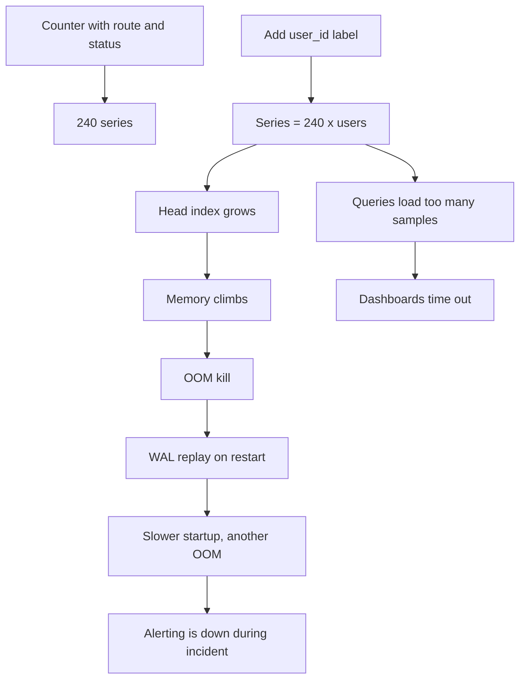
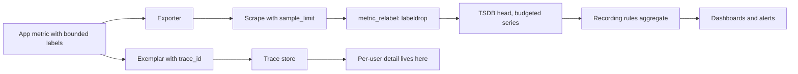

> **Scenario** — A Friday release adds a `customer_email` label to a request counter "so support can self-serve". By Monday the Prometheus pod is being OOM-killed every nine minutes, `head_series` has gone from 1.2 M to 34 M, and every dashboard times out — including the ones you need to diagnose it.

## Why it matters

- Prometheus memory is roughly linear in active series. Multiplying label combinations multiplies RAM until the process dies.
- When the metrics backend falls over, you lose alerting at the exact moment you have an incident.
- Query latency grows with series touched, so the p99 panel that used to load in 300 ms takes 40 s.
- Managed backends bill per series or per datapoint; a single unbounded label can add five figures a month.
- Remote-write queues back up, so historical data has gaps that make the postmortem unprovable.

## Symptoms

| Signal | What you observe |
| --- | --- |
| Memory | `process_resident_memory_bytes` climbing steadily, OOM kill on WAL replay |
| Series | `prometheus_tsdb_head_series` growth is a step function aligned to a deploy |
| Ingest | `prometheus_target_scrapes_exceeded_sample_limit_total` incrementing |
| Query | Dashboards return "query processing would load too many samples" |
| Compaction | `prometheus_tsdb_compactions_failed_total` rising; disk fills |
| Churn | High `prometheus_tsdb_head_series_created_total` with flat request volume |

## How it breaks

Every unique combination of label values is a separate time series, each with its own in-memory index entry and chunk buffer. A counter with `route` (40 values) and `status` (6 values) is 240 series — fine. Add `user_id` (500,000 values) and it is 120 million potential series. Churn is worse than raw count: labels whose values change constantly, such as pod names on a HorizontalPodAutoscaler, `session_id`, or a version string on every commit, create new series continuously. The head block keeps them until they age out, so memory is driven by *series created per hour*, not by concurrent traffic.



## Root causes

1. Unbounded identifiers used as labels: user, session, request, order, email, URL path with IDs.
2. Error messages or exception text used as a label value.
3. Pod, container, or instance labels retained for ephemeral workloads with high churn.
4. Histograms with many buckets multiplied by several labels — buckets are series too.
5. No per-target `sample_limit`, so one bad exporter can take down the whole server.
6. Nobody owns a series budget, so growth is discovered only by the OOM reaper.

## How to solve it

### 1. Find the offender before you change anything

```promql
# Top metric names by series count
topk(20, count by (__name__)({__name__=~".+"}))

# Which label is doing the damage on a suspect metric
count(count by (user_id) (http_server_requests_total))

# Series created per hour — churn, not volume
sum(rate(prometheus_tsdb_head_series_created_total[1h])) * 3600
```

The `count by (label)` idiom is the fastest way to rank labels by distinct values on a single metric.

### 2. Enforce a hard limit at scrape time

```yaml
scrape_configs:
  - job_name: app
    sample_limit: 5000
    label_limit: 32
    label_value_length_limit: 128
    target_limit: 400
    kubernetes_sd_configs:
      - role: pod
    metric_relabel_configs:
      # Drop known-bad labels rather than trusting every service to behave.
      - action: labeldrop
        regex: '(user_id|session_id|request_id|email|order_id)'
      # Drop entire metrics that were never meant to leave debug builds.
      - action: drop
        source_labels: [__name__]
        regex: 'debug_.*'
```

`sample_limit` converts "the monitoring system dies" into "one target goes stale and alerts", which is the failure mode you want.

### 3. Bound the label values in code

```ts
const ALLOWED_ROUTES = new Set(['/checkout', '/orders', '/search', '/auth/login'])
const ALLOWED_ERRORS = new Set(['timeout', 'validation', 'upstream_5xx', 'auth'])

function boundedRoute(path: string): string {
  return ALLOWED_ROUTES.has(path) ? path : 'other'
}

function boundedError(err: unknown): string {
  const kind = classify(err)                       // your own mapping
  return ALLOWED_ERRORS.has(kind) ? kind : 'other'
}

httpRequests.inc({ route: boundedRoute(req.route?.path ?? ''), error: boundedError(err) })
```

An `other` bucket keeps totals correct while capping cardinality. Cardinality of a metric should be a number you can state from memory.

### 4. Move high-cardinality detail to exemplars, logs, and traces

Exemplars attach a trace ID to a histogram bucket sample: one pointer per bucket, not a new series.

```ts
httpDuration.observe(
  { route: '/checkout', outcome: 'ok' },
  seconds,
  { traceID: span.spanContext().traceId },   // exemplar, not a label
)
```

```yaml
# Prometheus needs exemplar storage on, and Grafana links them to the trace UI.
storage:
  exemplars:
    max_exemplars: 200000
```

### 5. Aggregate away detail you only need in the long term

```yaml
groups:
  - name: aggregation
    interval: 30s
    rules:
      # Keep per-pod for 6h raw, but alert and dashboard off the aggregate.
      - record: svc:http_requests:rate5m
        expr: sum without (pod, instance, container) (rate(http_server_requests_total[5m]))
      - record: svc:http_latency_bucket:rate5m
        expr: sum without (pod, instance, container) (rate(http_server_request_duration_seconds_bucket[5m]))
```

Then drop the raw series at remote-write time if the backend is the cost centre.

### 6. Make the budget an alert

```yaml
- alert: SeriesBudgetExceeded
  expr: prometheus_tsdb_head_series > 3.5e6
  for: 15m
  labels: { severity: ticket }
  annotations:
    summary: "Head series above budget"
    description: "Series {{ $value | humanize }} over 3.5M budget. Run the top-metrics query in the runbook."

- alert: CardinalityStepChange
  expr: |
    prometheus_tsdb_head_series
      > 1.25 * (prometheus_tsdb_head_series offset 1h)
  for: 20m
  labels: { severity: ticket }
```

A ticket-severity alert on a 25% step change catches the Friday deploy on Friday.

## Target design



## Tradeoffs

| Option | Pros | Cons | Choose when |
| --- | --- | --- | --- |
| Bounded labels plus `other` | Predictable cost, totals stay right | Detail lost for rare values | Default for all app metrics |
| `labeldrop` at scrape | Central control, no app change | Silent data loss if misjudged | Emergency containment |
| Exemplars for detail | Cheap; links metric to trace | Sampled, not exhaustive | Latency and error debugging |
| Logs for high-cardinality facts | Full detail, cheap per field | Slower to aggregate | Per-tenant or per-user questions |
| Remote-write with downsampling | Long retention at low cost | Loses raw resolution | Capacity planning and trends |

## Verification checklist

- [ ] `topk(20, count by (__name__)({__name__=~".+"}))` output is reviewed and every top entry is explainable.
- [ ] No metric has a label whose distinct-value count exceeds a documented cap.
- [ ] `sample_limit` is set on every scrape job; test it by adding a noisy target in staging.
- [ ] `prometheus_tsdb_head_series` is graphed with the budget as a threshold line.
- [ ] Restart the Prometheus pod and time WAL replay; confirm it fits inside your liveness probe.
- [ ] Confirm exemplars appear in Grafana and jump to a live trace.

## Anti-patterns

- Adding a label "temporarily" to debug production, then leaving it in the release.
- Using the raw HTTP path as a label instead of the route template.
- Increasing Prometheus memory limits as the fix, which delays the failure by a week.
- Using `status_code` as a raw integer label plus `status_class`, doubling series for no gain.
- Putting the git SHA on every application metric, guaranteeing full churn on each deploy.

## Related

- [Instrumenting the four golden signals](/systems/observability-sli/golden-signals-instrumentation)
- [Log sampling and observability cost control](/systems/observability-sli/log-sampling-and-cost-control)
- [Dashboards that answer questions](/systems/observability-sli/dashboards-that-answer-questions)
- [RED for services, USE for resources](/systems/observability-sli/red-and-use-methods)
