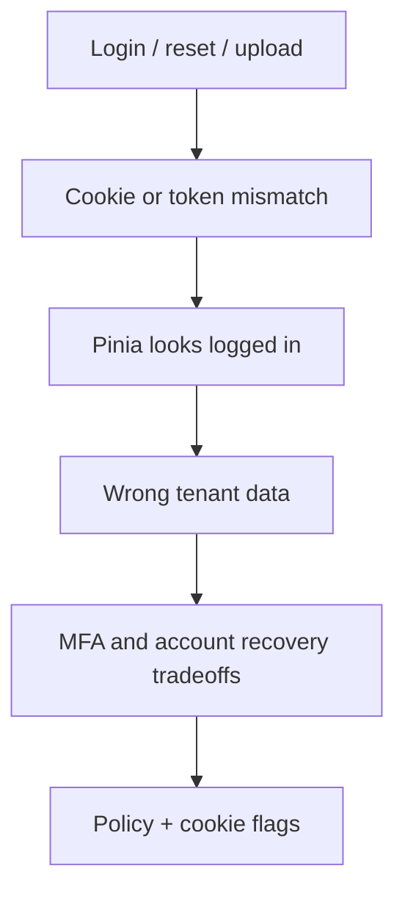

> **Lesson 45 · intermediate** - Your recovery path is your real security level - TOTP, WebAuthn, and the support-desk bypass.

## Why it matters

- A session cookie, a JWT, and a Pinia “user” object that disagree is how account takeovers start looking like support tickets.
- Password reset, MFA recovery, and file upload are the doors attackers actually use, not the login form you polished.
- Tenant isolation bugs do not show up in unit tests that use a single factory user.
- This lesson is specifically about **MFA and account recovery tradeoffs**. Tags: mfa, totp, webauthn, recovery.

## Symptoms

| Signal | What you observe |
| --- | --- |
| Session weirdness | User A sees User B tickets after a tab restore |
| Reset abuse | Reset tokens live for days in the email HTML |
| Upload | SVG/HTML stored as “image” and later served to staff |
| JWT forever | Logout only clears Pinia; the token still works |

## How it breaks



The named technology is rarely the villain. Two code paths (often a Vue/Quasar screen and a Laravel write) assume opposite contracts. Production finds the race. For this topic that contract is: Your recovery path is your real security level - TOTP, WebAuthn, and the support-desk bypass.

## Root causes

1. Session fixation or missing SameSite on the Laravel session cookie.
2. JWT treated as a session without a denylist or short TTL plus refresh.
3. CSRF token not sent on Axios because withCredentials was “fixed later”.
4. Policies checked the role string, not the tenant id on the row.

## How to solve it

### 1. Write the invariant in one sentence

Your recovery path is your real security level - TOTP, WebAuthn, and the support-desk bypass. Put that sentence in the PR, the Pinia action, and the Laravel class.

### 2. Guard the edge in code

```ts
// boot/axios.ts — Quasar
api.defaults.withCredentials = true
api.interceptors.request.use((config) => {
  const xsrf = document.cookie.split('; ').find((row) => row.startsWith('XSRF-TOKEN='))
  if (xsrf) config.headers['X-XSRF-TOKEN'] = decodeURIComponent(xsrf.slice(11))
  return config
})
```

```php
// app/Policies/TicketPolicy.php
public function view(User $user, Ticket $ticket): bool
{
    return $user->tenant_id === $ticket->tenant_id
        && $user->can('tickets.view');
}
```

### 3. Keep a chart you will actually look at

Failed logins by reason, reset-token reuse, and cross-tenant 403 rate. If the chart cannot catch a regression in **MFA and account recovery tradeoffs**, the lesson is not done.

## Worked example

A Quasar admin “switched user” by writing Pinia only. The Laravel session still belonged to the previous staff member. Binding tenant_id in every policy and rotating the session on privilege change stopped the leak.

On this topic, start from the symptom in the table that matches your last incident, then walk the diagram until the guard above would have fired.

## Check before you ship

- [ ] The invariant for **MFA and account recovery tradeoffs** is written in one sentence.
- [ ] Empty, duplicate, timeout, or permission paths have a test or a staged rehearsal.
- [ ] A dashboard or log query would catch a regression within one deploy.
- [ ] Related reading still makes sense: password-reset-flow-attacks, session-fixation-and-csrf.

## What not to do

- Copy a blog snippet that retries forever or caches the error as success.
- Treat Pinia as the source of truth for a Laravel row.
- Skip the previous numbered lesson if this one feels dense — the path is beginner → intermediate → advanced on purpose.
