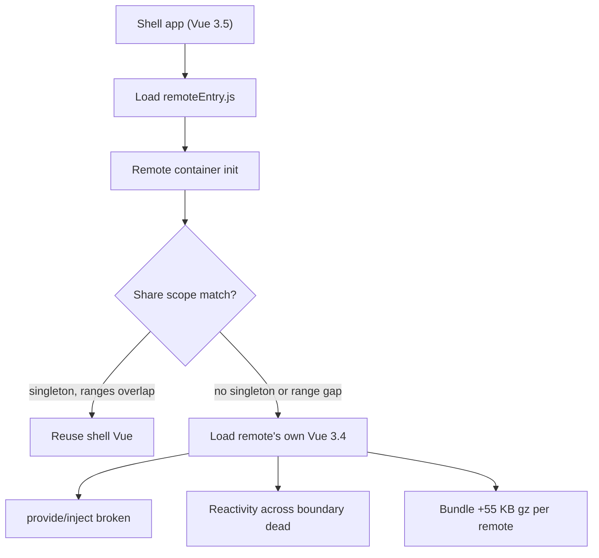
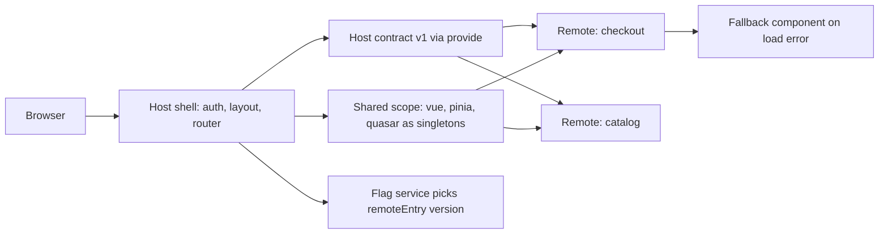

> **Scenario** — চারটি টিম একটাই Quasar admin shell-এ ship করে। Checkout টিম Vue 3.5 ও Pinia 2.2-তে upgrade করার পর shell-এর global toast কাজ করা বন্ধ করে দেয়, আর প্রতিটি remote-এ `inject()` `undefined` ফেরত দেয়। Shell-এ কিছুই বদলায়নি — page-এ এখন Vue-এর দুইটা copy আছে।

## Why it matters

- Framework-এর duplicate copy `provide/inject`, `app.config.globalProperties` এবং module-level singleton-নির্ভর প্রতিটি plugin ভেঙে দেয় — উপসর্গ দেখতে random component bug-এর মতো, integration fault-এর মতো নয়।
- প্রতিটি duplicate runtime প্রায় ৪০–৬০ KB gzipped যোগ করে। তিনটা remote নিজের Vue + Pinia + Quasar বহন করলে 4G median device-এ LCP ২.৫ সেকেন্ড ছাড়িয়ে যেতে পারে।
- Independent deploy-ই micro-frontend-এর মূল উদ্দেশ্য। Remote upgrade-এর জন্য coordinated shell release লাগলে আপনি complexity tax দিলেন, autonomy পেলেন না।
- Runtime integration failure নীরব: remote-এর `remoteEntry.js` 404 দেয়, shell একটা খালি `<div>` render করে, আর কোনো exception boundary পার না হওয়ায় error tracking কিছুই দেখে না।

## Symptoms

| Signal | What you observe |
| --- | --- |
| `inject()` undefined | key ঠিক থাকা সত্ত্বেও remote component shell context পড়তে পারে না |
| দুইটা `__VUE__` app | Vue Devtools এক page-এ একাধিক app instance দেখায় |
| Bundle report duplicate | `rollup-plugin-visualizer` তিনটা chunk-এ `node_modules/vue/dist` দেখায় |
| ফাঁকা অংশ, error নেই | shell chrome render হয়, remote অংশ খালি, console পরিষ্কার |
| Deploy-এর পর CSS bleed | remote-এর utility class রাতারাতি shell button-এর style বদলে দেয় |
| Version drift | `pnpm why vue` পাশাপাশি 3.4.x ও 3.5.x দেখায় |

## How it breaks

Shell `remoteEntry.js` load করে এবং remote-এর container নিজের share scope initialise করে। Remote যদি `vue` shared ঘোষণা করে কিন্তু `singleton: true` না দেয়, বা দুই semver range না মেলে, module federation জোরে fail না করে *দুইটা* copy resolve করে। Vue-এর `currentInstance` module scope-এ থাকে, তাই remote-Vue-র তৈরি component shell-Vue-তে register হওয়া provider দেখতে পায় না। Reactivity আরও খারাপ: এক copy-তে তৈরি `ref` অন্য copy-তে `isRef` নয়, ফলে watcher কখনও fire করে না।



## Root causes

1. `shared` config-এ `vue`, `vue-router`, `pinia`, `quasar`-এর জন্য `singleton: true` নেই।
2. Minor upgrade-এর পর repo-গুলোর semver range আর intersect করে না, তাই federation বৈধভাবেই দুই version load করে।
3. Shell ও remote-এর contract implicit — props ও event untyped object হিসেবে যায়, কোনো versioned interface নেই।
4. Remote scoped বা layer-isolated style-এর বদলে global CSS ship করে।
5. `remoteEntry.js` fail করলে কোনো fallback path নেই, তাই CDN blip মানেই blank page।
6. Injected contract-এর বদলে remote সরাসরি shell-এর Pinia store import করে shared state নেয়।

## How to solve it

### 1. Integration model সচেতনভাবে বাছুন

Build-time package (npm workspace) এক runtime ও এক bundle দেয় — টিমগুলো এক cadence-এ deploy করলে এটাই নিন। Runtime federation independent deploy দেয়, বিনিময়ে share-scope discipline চায়। Iframe শক্ত isolation দেয়, শুধু untrusted বা legacy code-এর জন্যই সঠিক উত্তর।

### 2. Vite federation config-এ singleton lock করুন

```ts
// vite.config.ts — remote
import { defineConfig } from 'vite'
import vue from '@vitejs/plugin-vue'
import federation from '@originjs/vite-plugin-federation'
import pkg from './package.json'

export default defineConfig({
  plugins: [
    vue(),
    federation({
      name: 'checkout',
      filename: 'remoteEntry.js',
      exposes: { './CheckoutPanel': './src/exposed/CheckoutPanel.vue' },
      shared: {
        vue: { singleton: true, requiredVersion: pkg.dependencies.vue },
        'vue-router': { singleton: true },
        pinia: { singleton: true },
        quasar: { singleton: true },
      },
    }),
  ],
  build: { target: 'esnext', cssCodeSplit: false },
})
```

Drift যেন production নয়, build fail করে — CI guard যোগ করুন:

```bash
# fail if more than one Vue is resolved in the workspace
test "$(pnpm ls vue --depth 10 --json | jq '[.. | .vue? // empty] | unique | length')" -eq 1
```

### 3. Versioned host contract লিখুন

```ts
// packages/host-contract/src/index.ts
export const HOST_CONTEXT = Symbol.for('app.host.context') as InjectionKey<HostContext>

export type HostContext = {
  /** Bump on breaking change; remotes assert what they need. */
  readonly contractVersion: 1
  readonly tenantId: string
  notify(level: 'info' | 'error', message: string): void
  navigate(path: string): void
}
```

Remote ধরে নেওয়ার বদলে assert করে:

```ts
const host = inject(HOST_CONTEXT)
if (!host || host.contractVersion !== 1) {
  throw new Error(`checkout: incompatible host contract`)
}
```

### 4. Load failure দৃশ্যমান ও recoverable করুন

```ts
// shell/src/router/remotes.ts
export const checkoutRoute = {
  path: '/checkout',
  component: defineAsyncComponent({
    loader: () => import('checkout/CheckoutPanel'),
    timeout: 8000,
    loadingComponent: RemoteSkeleton,
    errorComponent: RemoteFallback,
    onError(err, retry, fail, attempts) {
      if (attempts <= 2) return setTimeout(retry, 500 * attempts)
      reportRemoteFailure('checkout', err)
      fail()
    },
  }),
}
```

### 5. Style isolate করুন

Remote scoped style-সহ ship করুন এবং CSS cascade layer ব্যবহার করুন যাতে tie-তে shell rule জেতে: shell-এ `@layer host, remote;`, আর remote stylesheet `@layer remote`-এ মোড়ানো।

### 6. Remote rollout flag-এর পিছনে রাখুন

কিছু শতাংশ tenant-কে নতুন remote version-এ পাঠান, আগের `remoteEntry` URL গরম রাখুন, error rate বাড়লে কয়েক সেকেন্ডে ফিরে যান।

## Target design



## Tradeoffs

| Option | Pros | Cons | Choose when |
| --- | --- | --- | --- |
| Build-time package | এক runtime, সেরা bundle size, সহজ debugging | প্রতি পরিবর্তনে shell release লাগে | টিমগুলো এক release train-এ |
| Module federation | Independent deploy, shared singleton | share-scope drift, কঠিন local dev | টিম আলাদা cadence-এ deploy করে |
| Web component wrapper | Framework-agnostic, DOM-level isolation | prop serialisation, styling friction | React ও Vue মেশানো estate |
| Iframe | শক্ত security ও CSS isolation | duplicate memory, routing ও focus কষ্টকর | untrusted বা legacy third-party UI |

## Verification checklist

- [ ] `pnpm ls vue --depth 10` shell ও remote জুড়ে ঠিক একটা version resolve করে।
- [ ] দুইটা remote render করা page-এ Vue Devtools একটাই app instance দেখায়।
- [ ] প্রতিটি remote-এর root component-এ `inject(HOST_CONTEXT)` defined value দেয়।
- [ ] DevTools-এ `remoteEntry.js` block করলে blank region নয়, fallback component render হয়।
- [ ] Bundle visualizer-এ duplicate `vue`, `pinia` বা `quasar` chunk শূন্য।
- [ ] Remote version flag toggle করলে shell deploy ছাড়াই লোড হওয়া `remoteEntry` বদলায়।
- [ ] Visual regression snapshot-এ remote CSS shell button-এর style বদলাতে পারে না।

## Anti-patterns

- `vue` shared করে `singleton` না দেওয়া, কারণ "dev-এ তো কাজ করছিল"।
- Injected contract-এর বদলে remote থেকে সরাসরি shell-এর Pinia store import করা।
- Integration API হিসেবে `window` global ব্যবহার — untyped, untestable, version করা অসম্ভব।
- প্রতিটি remote-কে shell-এর exact version-এ pin করা, যা আবার lockstep deploy ফিরিয়ে আনে।
- Exception না উঠায় failed `remoteEntry` fetch-কে non-event ধরে নেওয়া।

## Related

- [Micro-packaging decoupled frontend modules](/systems/frontend-architecture/micro-packaging-modules)
- [Design system versioning without lockstep](/systems/frontend-architecture/design-system-versioning)
- [Code splitting and lazy route boundaries](/systems/frontend-architecture/code-splitting-and-lazy-routes)
