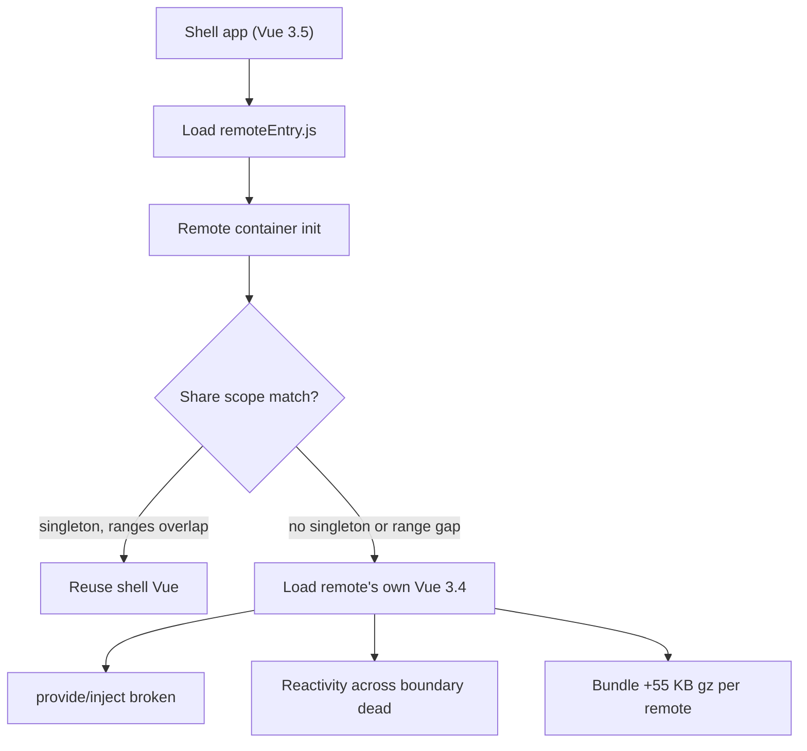
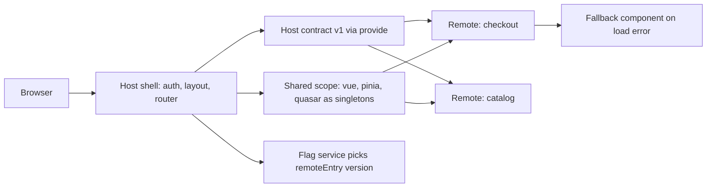

> **Scenario** - Four teams ship into one Quasar admin shell. After the checkout team upgrades to Vue 3.5 and Pinia 2.2, the shell's global toast stops firing and `inject()` returns `undefined` in every remote. Nothing in the shell changed; two copies of Vue are now on the page.

## Why it matters

- Duplicate framework copies break `provide/inject`, `app.config.globalProperties`, and every plugin that relies on module-level singletons - symptoms look like random component bugs, not an integration fault.
- Each duplicated runtime adds roughly 40–60 KB gzipped. Three remotes carrying their own Vue + Pinia + Quasar can push LCP past 2.5 s on a 4G median device.
- Independent deploys are the whole point of micro-frontends. If a remote upgrade requires a coordinated shell release, you paid the complexity tax and got none of the autonomy.
- Runtime integration failures are silent: the remote's `remoteEntry.js` 404s, the shell renders an empty `<div>`, and error tracking sees nothing because no exception crossed a boundary.

## Symptoms

| Signal | What you observe |
| --- | --- |
| `inject()` returns undefined | Remote components can't read shell-provided context although the key is correct |
| Two `__VUE__` devtools apps | Vue Devtools lists more than one app instance for a single page |
| Bundle report duplicates | `rollup-plugin-visualizer` shows `node_modules/vue/dist` in three chunks |
| Blank region, no error | Route renders shell chrome; remote area is empty and console is clean |
| CSS bleed after deploy | A remote's utility classes restyle shell buttons overnight |
| Version drift alert | `pnpm why vue` reports 3.4.x and 3.5.x resolved side by side |

## How it breaks

The shell loads `remoteEntry.js` and the remote's container initialises its own share scope. If the remote declared `vue` as shared but not `singleton: true`, or the two semver ranges don't intersect, module federation resolves *both* copies rather than failing loudly. Vue's `currentInstance` lives in module scope, so a component created by remote-Vue cannot see a provider registered on shell-Vue. Reactivity is worse: a `ref` created in one copy is not `isRef` in the other, so watchers never fire.



## Root causes

1. `shared` config omits `singleton: true` for `vue`, `vue-router`, `pinia`, and `quasar`.
2. Semver ranges across repos stop intersecting after a minor upgrade, so federation legitimately loads two versions.
3. The contract between shell and remote is implicit - props and events are passed as untyped objects with no versioned interface.
4. Remotes ship global CSS instead of scoped or layer-isolated styles.
5. No fallback path when `remoteEntry.js` fails, so a CDN blip becomes a blank page.
6. Shared state is passed by importing the shell's Pinia store directly instead of through an injected contract.

## How to solve it

### 1. Pick the integration model deliberately

Build-time packages (npm workspaces) give one runtime and one bundle - pick them when teams deploy on a shared cadence. Runtime federation buys independent deploys at the cost of share-scope discipline. Iframes give hard isolation and are the right answer only for untrusted or legacy code.

### 2. Lock singletons in the Vite federation config

```ts
// vite.config.ts - remote
import { defineConfig } from 'vite'
import vue from '@vitejs/plugin-vue'
import federation from '@originjs/vite-plugin-federation'
import pkg from './package.json'

export default defineConfig({
  plugins: [
    vue(),
    federation({
      name: 'checkout',
      filename: 'remoteEntry.js',
      exposes: { './CheckoutPanel': './src/exposed/CheckoutPanel.vue' },
      shared: {
        vue: { singleton: true, requiredVersion: pkg.dependencies.vue },
        'vue-router': { singleton: true },
        pinia: { singleton: true },
        quasar: { singleton: true },
      },
    }),
  ],
  build: { target: 'esnext', cssCodeSplit: false },
})
```

Add a CI guard so drift fails the build rather than production:

```bash
# fail if more than one Vue is resolved in the workspace
test "$(pnpm ls vue --depth 10 --json | jq '[.. | .vue? // empty] | unique | length')" -eq 1
```

### 3. Define a versioned host contract

```ts
// packages/host-contract/src/index.ts
export const HOST_CONTEXT = Symbol.for('app.host.context') as InjectionKey<HostContext>

export type HostContext = {
  /** Bump on breaking change; remotes assert what they need. */
  readonly contractVersion: 1
  readonly tenantId: string
  notify(level: 'info' | 'error', message: string): void
  navigate(path: string): void
}
```

The remote asserts instead of assuming:

```ts
const host = inject(HOST_CONTEXT)
if (!host || host.contractVersion !== 1) {
  throw new Error(`checkout: incompatible host contract`)
}
```

### 4. Make loading failures visible and recoverable

```ts
// shell/src/router/remotes.ts
export const checkoutRoute = {
  path: '/checkout',
  component: defineAsyncComponent({
    loader: () => import('checkout/CheckoutPanel'),
    timeout: 8000,
    loadingComponent: RemoteSkeleton,
    errorComponent: RemoteFallback,
    onError(err, retry, fail, attempts) {
      if (attempts <= 2) return setTimeout(retry, 500 * attempts)
      reportRemoteFailure('checkout', err)
      fail()
    },
  }),
}
```

### 5. Isolate styles

Ship remotes with scoped styles plus a CSS cascade layer so shell rules always win ties: `@layer host, remote;` in the shell, and wrap remote stylesheets in `@layer remote`.

### 6. Gate remote rollout behind a flag

Route a percentage of tenants to the new remote version, keep the previous `remoteEntry` URL warm, and flip back in seconds when error rate rises.

## Target design



## Tradeoffs

| Option | Pros | Cons | Choose when |
| --- | --- | --- | --- |
| Build-time packages | One runtime, best bundle size, simple debugging | Every change needs a shell release | Teams share a release train |
| Module federation | Independent deploys, shared singletons | Share-scope drift, harder local dev | Teams deploy on separate cadences |
| Web components wrapper | Framework-agnostic, DOM-level isolation | Prop serialisation, styling friction | Mixed React and Vue estates |
| Iframes | Hard security and CSS isolation | Duplicate memory, painful routing and focus | Untrusted or legacy third-party UI |

## Verification checklist

- [ ] `pnpm ls vue --depth 10` resolves exactly one version across shell and remotes.
- [ ] Vue Devtools shows a single app instance on a page rendering two remotes.
- [ ] `inject(HOST_CONTEXT)` returns a defined value inside every remote's root component.
- [ ] Blocking `remoteEntry.js` in DevTools renders the fallback component, not a blank region.
- [ ] Bundle visualizer shows zero duplicated `vue`, `pinia`, or `quasar` chunks.
- [ ] Toggling the remote version flag changes the loaded `remoteEntry` without a shell deploy.
- [ ] Remote CSS cannot restyle a shell button in a visual regression snapshot.

## Anti-patterns

- Marking `vue` shared but leaving `singleton` unset because "it worked in dev".
- Importing the shell's Pinia store directly from a remote instead of using an injected contract.
- Using `window` globals as the integration API - untyped, untestable, and impossible to version.
- Pinning every remote to the exact shell version, which reintroduces lockstep deploys.
- Treating a failed `remoteEntry` fetch as a non-event because no exception was thrown.

## Related

- [Micro-packaging decoupled frontend modules](/systems/frontend-architecture/micro-packaging-modules)
- [Design system versioning without lockstep](/systems/frontend-architecture/design-system-versioning)
- [Code splitting and lazy route boundaries](/systems/frontend-architecture/code-splitting-and-lazy-routes)
