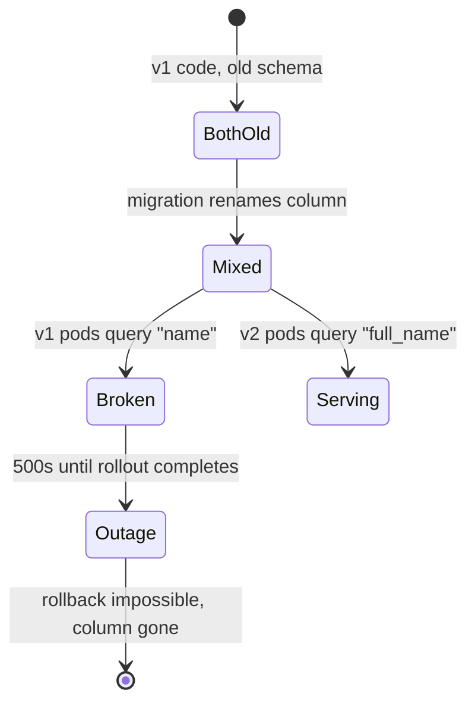
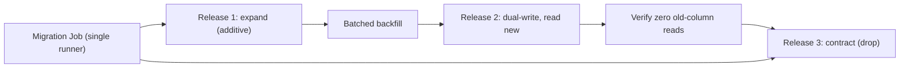

> **পরিস্থিতি** - একটা release এক migration-এ `users.name`-কে `users.full_name` করল। Rolling update চলাকালীন পুরনো pod এখনো `SELECT name` করে এবং 500 দিতে শুরু করে। Deployment rollback করেও লাভ হয় না, কারণ column ইতিমধ্যেই নেই।

## কেন গুরুত্বপূর্ণ

- Rolling update নিশ্চিত করে এমন একটা সময় থাকবে যখন পুরনো ও নতুন কোড একই schema-তে চলে। backwards compatible নয় এমন যেকোনো migration সেই সময়টাকে outage বানায়।
- Destructive DDL আপনার rollback-এর সুযোগ কেড়ে নেয়। Column drop হয়ে গেলে `kubectl rollout undo` এমন কোড ফেরায় যা চলতে পারে না।
- Table-level lock নেওয়া migration পুরো সময় write আটকায় - লোডে থাকা বড় table-এ এটা সম্পূর্ণ থেমে যাওয়া।
- প্রতিটি replica থেকে একসাথে migration চালালে duplicate execution, lock contention বা নষ্ট migration ledger হয়।

## লক্ষণ

| Signal | যা দেখবেন |
|---|---|
| Error log | কয়েক মিনিটের জন্য কেবল কিছু pod-এ `column "name" does not exist` |
| Rollback | `rollout undo` সফল হয় কিন্তু error চলতেই থাকে |
| Database | দীর্ঘ `ALTER TABLE` blocking, `pg_stat_activity`-তে অজস্র `waiting` session |
| Pipeline | Migration job তিনটি replica-তে একসাথে চলে, দুটো lock-এ fail করে |
| Deploy duration | Migration চলার সময় rollout "waiting for pods to be ready"-তে আটকে থাকে |

## কীভাবে ভাঙে

"কোড আর schema একসাথে deploy করি" - এই মানসিক মডেল তখনই খাটে যখন একসময়ে ঠিক একটি version চলে। Rolling update-এ Kubernetes তা কখনো দেয় না, canary-ও দেয় না।

Column rename আসলে দুটি অসঙ্গত schema, এক ধাপ হিসেবে উপস্থাপিত। Migration commit হওয়ামাত্র প্রতিটি পুরনো pod ভাঙা; আর rollout শেষ না হওয়া পর্যন্ত un-migrated replica-তে চলা প্রতিটি নতুন pod-ও ভাঙা।



## মূল কারণ

1. Migration ও code change এক atomic ধাপে যায়, mixed-version window উপেক্ষা করে।
2. Destructive DDL (`DROP COLUMN`, `RENAME`, default ছাড়া `NOT NULL`) সেই release-এই যেখানে তা ব্যবহারকারী কোড আছে।
3. Migration application container-এর startup-এ চলে, তাই প্রতিটি replica race করে।
4. Advisory lock বা single-runner নিশ্চয়তা নেই।
5. DDL-এ timeout নেই, তাই একটা `ALTER` ২০ মিনিট write আটকাতে পারে।

## কীভাবে সমাধান করবেন

### ১. প্রতিটি breaking change expand ও contract-এ ভাগ করুন

তিনটি release, কখনো একটি নয়:

```sql
-- Release 1 (expand): additive only, safe for old code
ALTER TABLE users ADD COLUMN full_name text;
CREATE INDEX CONCURRENTLY idx_users_full_name ON users (full_name);
-- backfill in batches, outside the migration transaction
UPDATE users SET full_name = name WHERE full_name IS NULL AND id BETWEEN $1 AND $2;

-- Release 2 (migrate): new code writes both, reads full_name
-- Release 3 (contract): only after zero readers of the old column
ALTER TABLE users DROP COLUMN name;
```

### ২. Migration একবারই চালান, gated Job হিসেবে

```yaml
apiVersion: batch/v1
kind: Job
metadata:
  name: migrate-2026-08-24
spec:
  backoffLimit: 2
  activeDeadlineSeconds: 900
  template:
    spec:
      restartPolicy: Never
      containers:
        - name: migrate
          image: ghcr.io/acme/api@sha256:9f2c...
          command: ["php", "artisan", "migrate", "--force", "--isolated"]
          env:
            - name: DB_STATEMENT_TIMEOUT
              value: "30s"
```

`--isolated` একটি atomic lock নেয় যাতে কেবল একজন runner migration প্রয়োগ করে। Deployment আপডেটের আগে pipeline step হিসেবে যুক্ত করুন:

```bash
kubectl apply -f deploy/migrate-job.yaml
kubectl wait --for=condition=complete job/migrate-2026-08-24 -n prod --timeout=15m \
  || { kubectl logs job/migrate-2026-08-24 -n prod; exit 1; }
kubectl set image deploy/api api=ghcr.io/acme/api@sha256:9f2c... -n prod
```

### ৩. Lock-এর সীমা বেঁধে দিন

```sql
SET lock_timeout = '3s';
SET statement_timeout = '30s';
ALTER TABLE orders ADD COLUMN channel text;  -- fails fast instead of blocking writes
```

দ্রুত fail করে শান্ত সময়ে retry করা, blocked writer-এর সারি ধরে রাখার চেয়ে ভালো।

### ৪. Contract ধাপ আসল প্রমাণে আটকান

```sql
-- confirm nothing reads the old column before dropping it
SELECT query, calls FROM pg_stat_statements
WHERE query ILIKE '%users.name%' AND calls > 0;
```

## কাঙ্ক্ষিত ডিজাইন



## Tradeoff

| Option | সুবিধা | খরচ | কখন বেছে নেবেন |
|---|---|---|---|
| Init container-এ migrate | app-এর আগে চলা নিশ্চিত | প্রতি replica-তে চলে, race ও duplicate lock | single-replica internal tool |
| আলাদা migration Job | একজন runner, পরিষ্কার log, gated | বাড়তি pipeline step রক্ষণাবেক্ষণ | যেকোনো multi-replica deployment |
| Release জুড়ে expand/contract | zero-downtime, rollback সম্ভব থাকে | তিনটি release ও সাময়িক dual-write কোড | প্রতিটি breaking schema পরিবর্তন |
| Maintenance window | সহজ, compatibility কাজ লাগে না | downtime, আর তা কখনো নির্ধারিত ঘণ্টায় শেষ হয় না | storage-engine বা major-version upgrade |

## যাচাই checklist

- [ ] Migration-পরবর্তী schema-তে পুরনো ও নতুন দুই version-ই নিজেদের test suite পাস করে।
- [ ] বর্তমান schema-তে আগের image-এ `rollout undo` কাজ করে (staging-এ যাচাই)।
- [ ] Release-এর প্রতিটি migration additive; destructive DDL পরের আলাদা release-এ।
- [ ] DDL session-এ `lock_timeout` ও `statement_timeout` সেট করা।
- [ ] Migration Job idempotent: দুইবার চালালে কিছুই বদলায় না।
- [ ] Backfill সীমিত batch-এ চলে, replication lag-এ প্রভাব মাপা হয়েছে।

## Anti-pattern

- "deploy তো দুই মিনিটের" বলে এক ধাপে column rename করা।
- প্রতিটি replica-র container `command`-এ `php artisan migrate` চালানো।
- Migration transaction-এর ভেতরে এক `UPDATE`-এ এক কোটি row backfill করা।
- কেউ কখনো চালায়নি এমন "down" migration লিখে সেটাকে rollback plan বলা।
- বড় table-এ default ছাড়া `NOT NULL` যোগ করা, যা traffic অপেক্ষমাণ রেখে table rewrite করে।

## সম্পর্কিত

- [Rollback versus forward fix](/systems/devops-containers/rollback-vs-forward-fix)
- [Blue-green vs canary releases](/systems/devops-containers/blue-green-vs-canary-releases)
- [Database deadlocks under concurrent load](/systems/data-storage/database-deadlocks-under-load)
