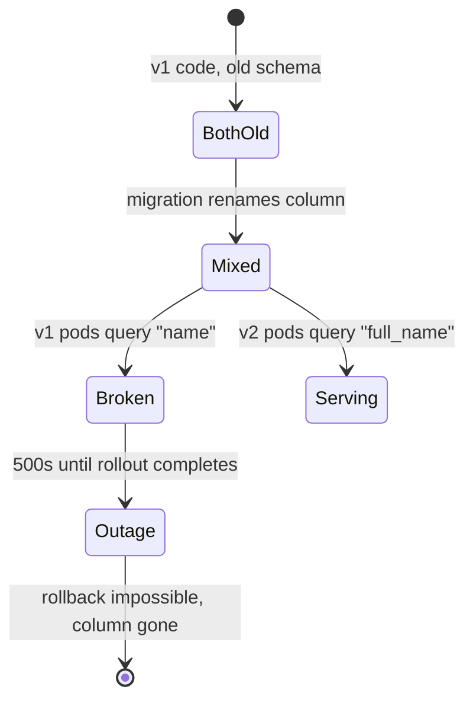
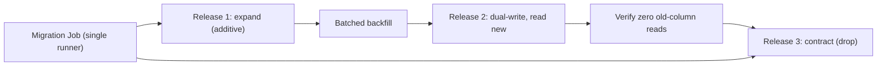

> **Scenario** — A release renames `users.name` to `users.full_name` in one migration. During the rolling update, old pods still `SELECT name` and start throwing 500s. Rolling back the deployment does not help, because the column is already gone.

## Why it matters

- A rolling update guarantees a window where old and new application code run against one shared schema. Any migration that is not backwards compatible turns that window into an outage.
- Destructive DDL removes your rollback option. Once the column is dropped, `kubectl rollout undo` restores code that cannot run.
- Migrations that take a table-level lock block writes for their entire duration — on a large table under load, that is a full stop.
- Running migrations from every replica simultaneously causes duplicate execution, lock contention, or a corrupted migration ledger.

## Symptoms

| Signal | What you observe |
|---|---|
| Error logs | `column "name" does not exist` on some pods only, for a few minutes |
| Rollback | `rollout undo` completes successfully but errors continue |
| Database | Long `ALTER TABLE` blocking, `pg_stat_activity` full of `waiting` sessions |
| Pipeline | Migration job runs concurrently in three replicas, two fail on the lock |
| Deploy duration | Rollout stalls at "waiting for pods to be ready" while migrations run |

## How it breaks

The mental model "deploy code and schema together" only works when there is exactly one version running at a time. Kubernetes never gives you that during a rolling update, and neither does a canary.

Renaming a column is really two incompatible schemas presented as one step. The moment the migration commits, every old pod is broken; until the rollout finishes, every new pod running against an un-migrated replica is broken too.



## Root causes

1. Migration and code change ship as one atomic step, ignoring the mixed-version window.
2. Destructive DDL (`DROP COLUMN`, `RENAME`, `NOT NULL` without default) in the same release as the code that needs it.
3. Migrations run from the application container at startup, so every replica races.
4. No advisory lock or single-runner guarantee.
5. No timeout on the DDL, so one `ALTER` can block writes for 20 minutes.

## How to solve it

### 1. Split every breaking change into expand and contract

Three releases, never one:

```sql
-- Release 1 (expand): additive only, safe for old code
ALTER TABLE users ADD COLUMN full_name text;
CREATE INDEX CONCURRENTLY idx_users_full_name ON users (full_name);
-- backfill in batches, outside the migration transaction
UPDATE users SET full_name = name WHERE full_name IS NULL AND id BETWEEN $1 AND $2;

-- Release 2 (migrate): new code writes both, reads full_name
-- Release 3 (contract): only after zero readers of the old column
ALTER TABLE users DROP COLUMN name;
```

### 2. Run migrations once, as a gated Job

```yaml
apiVersion: batch/v1
kind: Job
metadata:
  name: migrate-2026-08-24
spec:
  backoffLimit: 2
  activeDeadlineSeconds: 900
  template:
    spec:
      restartPolicy: Never
      containers:
        - name: migrate
          image: ghcr.io/acme/api@sha256:9f2c...
          command: ["php", "artisan", "migrate", "--force", "--isolated"]
          env:
            - name: DB_STATEMENT_TIMEOUT
              value: "30s"
```

`--isolated` takes an atomic lock so only one runner applies the migration. Wire it as a pipeline step before the Deployment update:

```bash
kubectl apply -f deploy/migrate-job.yaml
kubectl wait --for=condition=complete job/migrate-2026-08-24 -n prod --timeout=15m \
  || { kubectl logs job/migrate-2026-08-24 -n prod; exit 1; }
kubectl set image deploy/api api=ghcr.io/acme/api@sha256:9f2c... -n prod
```

### 3. Bound the lock

```sql
SET lock_timeout = '3s';
SET statement_timeout = '30s';
ALTER TABLE orders ADD COLUMN channel text;  -- fails fast instead of blocking writes
```

Failing fast and retrying during a quiet minute beats holding a queue of blocked writers.

### 4. Gate the contract step on real evidence

```sql
-- confirm nothing reads the old column before dropping it
SELECT query, calls FROM pg_stat_statements
WHERE query ILIKE '%users.name%' AND calls > 0;
```

## Target design



## Tradeoffs

| Option | Pros | Cons | Choose when |
|---|---|---|---|
| Migrate in an init container | Guaranteed to run before the app | Runs per replica, races and duplicate locks | Single-replica internal tools |
| Separate migration Job | One runner, clear logs, gated | Extra pipeline step to maintain | Any multi-replica deployment |
| Expand/contract across releases | Zero-downtime, rollback stays possible | Three releases and temporary dual-write code | Every breaking schema change |
| Maintenance window | Simple, no compatibility work | Downtime, and it never fits the hour | Storage-engine or major-version upgrades |

## Verification checklist

- [ ] Old and new application versions both pass their test suites against the post-migration schema.
- [ ] `rollout undo` to the previous image works with the current schema (verify in staging).
- [ ] Every migration in the release is additive; destructive DDL sits in a later, separate release.
- [ ] `lock_timeout` and `statement_timeout` are set for DDL sessions.
- [ ] The migration Job is idempotent: running it twice is a no-op.
- [ ] Backfills run in bounded batches with a measured effect on replication lag.

## Anti-patterns

- Renaming a column in one step because "the deploy only takes two minutes".
- Running `php artisan migrate` in the container `command` on every replica.
- Backfilling ten million rows in a single `UPDATE` inside the migration transaction.
- Writing "down" migrations nobody has ever run, and calling that a rollback plan.
- Adding `NOT NULL` without a default on a large table, rewriting it while traffic waits.

## Related

- [Rollback versus forward fix](/systems/devops-containers/rollback-vs-forward-fix)
- [Blue-green vs canary releases](/systems/devops-containers/blue-green-vs-canary-releases)
- [Database deadlocks under concurrent load](/systems/data-storage/database-deadlocks-under-load)
